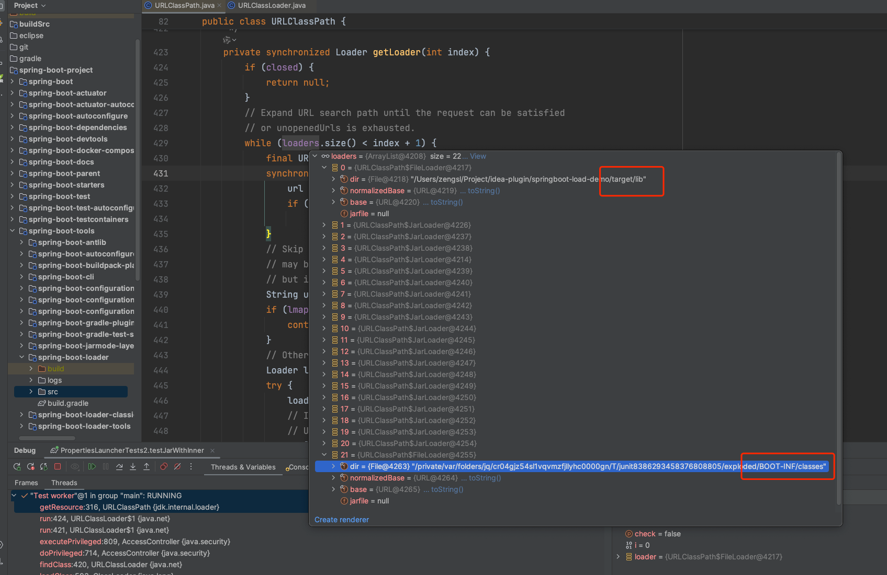
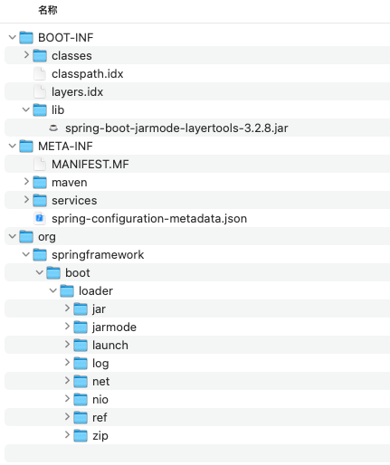
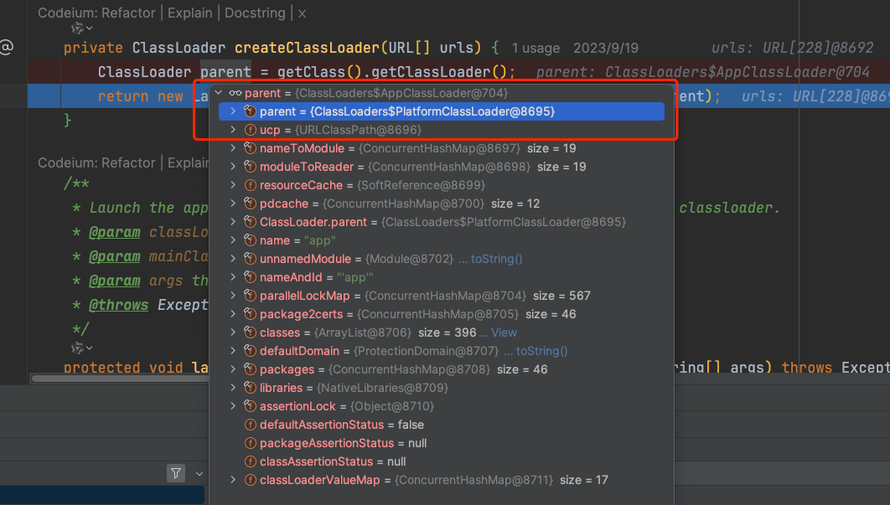
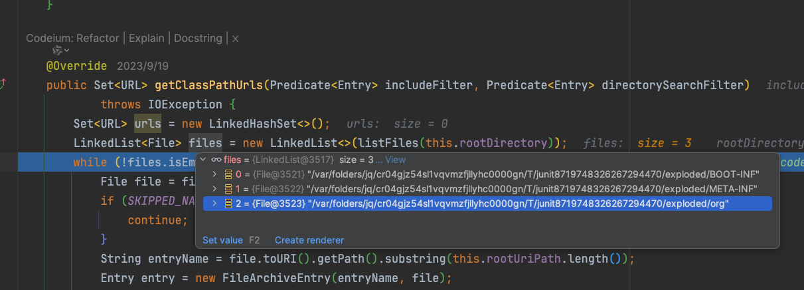
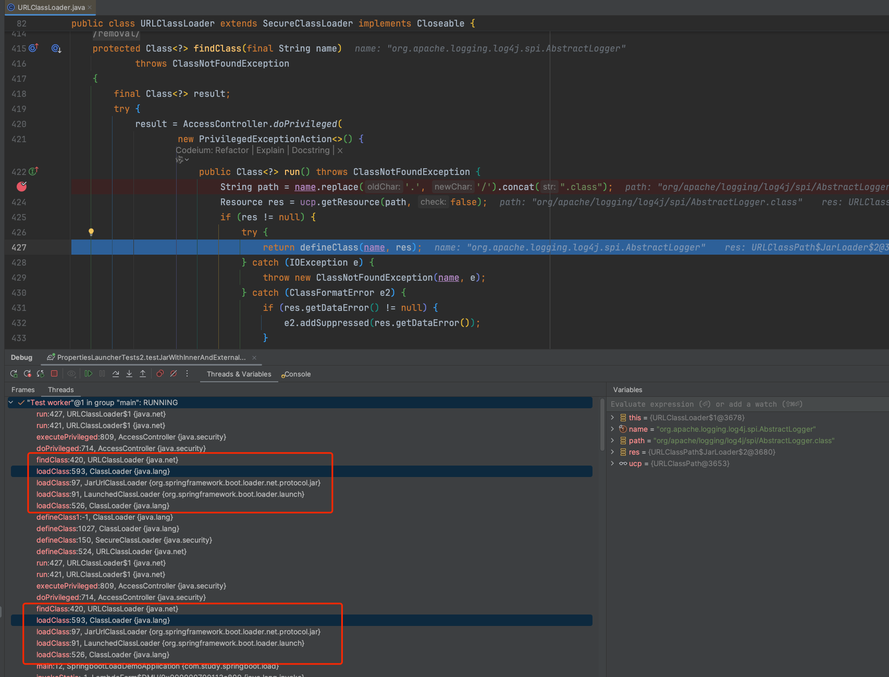

# Spring Boot Loader

> 当前版本为 3.2.x

[SpringBoot文档-可执行的Jar文件](https://docs.spring.io/spring-boot/docs/3.2.12/reference/html/executable-jar.html#appendix.executable-jar)

[SpringBoot源码地址](https://github.com/spring-projects/spring-boot)

## 目的

起因：之前一直使用Docker部署SpringBoot Jar，但是实际运行过着中每次发版本上传镜像时间过久，因此考虑将lib分离出来单独部署，以此减小Jar的体积。但是分离之后发现项目中覆盖spring和sentinel的代码没有正确加载，导致覆盖失败。所以打算分析下SpringBoot Loader到底是如何加载类的。

通过[Loader源码](https://github.com/spring-projects/spring-boot/blob/main/spring-boot-project/spring-boot-tools/spring-boot-loader/)运行一个由[SpringBoot插件](https://docs.spring.io/spring-boot/docs/3.2.12/maven-plugin/reference/htmlsingle/)生成标准的[可执行的Jar文件](https://docs.spring.io/spring-boot/docs/3.2.12/reference/html/executable-jar.html#appendix.executable-jar): 包含BOOT-INF/classes、BOOT-INF/lib等内容。

观察类加载情况，了解BOOT-INF/classes、BOOT-INF/lib、load.path指定路径的加载顺序，用于分析class加载。

## 结论

按照`load.path -> BOOT-INF/classes/` -> `BOOT-INF/lib/`形成列表，前后属于两个阶段。类加载寻找jar时会站在文件路径顺序(url收集顺序，参见下图)优先的原则进行类加载。

Jar匹配逻辑参考：
```java {11}
// URLClassLoader
protected Class<?> findClass(final String name)
        throws ClassNotFoundException
    {
        final Class<?> result;
        try {
            result = AccessController.doPrivileged(
                new PrivilegedExceptionAction<>() {
                    public Class<?> run() throws ClassNotFoundException {
                        String path = name.replace('.', '/').concat(".class");
                        Resource res = ucp.getResource(path, false);
                        if (res != null) {
                            try {
                                return defineClass(name, res);
                            } catch (IOException e) {
                                throw new ClassNotFoundException(name, e);
                            } catch (ClassFormatError e2) {
                                if (res.getDataError() != null) {
                                    e2.addSuppressed(res.getDataError());
                                }
                                throw e2;
                            }
                        } else {
                            return null;
                        }
                    }
                }, acc);
        } catch (java.security.PrivilegedActionException pae) {
            throw (ClassNotFoundException) pae.getException();
        }
        if (result == null) {
            throw new ClassNotFoundException(name);
        }
        return result;
    }

```


```java 
// URLClassPath 
public Resource getResource(String name, boolean check) {
    if (DEBUG) {
        System.err.println("URLClassPath.getResource(\"" + name + "\")");
    }

    Loader loader;
    // 每一个url对应一个loader
    for (int i = 0; (loader = getLoader(i)) != null; i++) {
        Resource res = loader.getResource(name, check);
        if (res != null) {
            return res;
        }
    }
    return null;
}
```


## 源码分析

### 环境准备

#### 可执行Jar

创建一个SpringBoot项目，通过SpringBoot插件进行package。生成的jar将使用`PropertiesLauncher`加载

```xml 
<build>
        <finalName>${project.artifactId}</finalName>
        <plugins>
            <plugin>
                <groupId>org.apache.maven.plugins</groupId>
                <artifactId>maven-dependency-plugin</artifactId>
                <executions>
                    <execution>
                        <id>copy-dependencies</id>
                        <phase>package</phase>
                        <goals>
                            <goal>copy-dependencies</goal>
                        </goals>
                        <configuration>
                            <outputDirectory>${project.build.directory}/lib</outputDirectory>
                            <overWriteReleases>false</overWriteReleases>
                            <overWriteSnapshots>false</overWriteSnapshots>
                            <overWriteIfNewer>true</overWriteIfNewer>
                            <!-- 排除测试范围的依赖 -->
                            <!--<excludeScope>test</excludeScope>-->
                        </configuration>
                    </execution>
                </executions>
            </plugin>
            <plugin>
                <groupId>org.springframework.boot</groupId>
                <artifactId>spring-boot-maven-plugin</artifactId>
                <configuration>
                    <!--将使用PropertiesLauncher，以便使用load.path等参数-->
                    <layout>ZIP</layout>
                    <!--<includeSystemScope>true</includeSystemScope>-->
                    <!--排除第三方jar文件 注释includes的内容可以使得第三方依赖打包至Jar内存放至Boot-INF/lib下 -->
                    <includes>
                        <include>
                            <groupId>nothing</groupId>
                            <artifactId>nothing</artifactId>
                        </include>
                    </includes>
                </configuration>
                <executions>
                    <execution>
                        <goals>
                            <goal>repackage</goal>
                        </goals>
                    </execution>
                </executions>
            </plugin>
        </plugins>
    </build>
```

Jar内部结构：

```text
example.jar
 |
 +-META-INF
 |  +-MANIFEST.MF
 +-org
 |  +-springframework
 |     +-boot
 |        +-loader
 |           +-<spring boot loader classes>
 +-BOOT-INF
    +-classes
    |  +-mycompany
    |     +-project
    |        +-YourClasses.class
    +-lib
       +-dependency1.jar
       +-dependency2.jar
```




```META-INF/MANIFEST.MF
Manifest-Version: 1.0
Created-By: Maven JAR Plugin 3.4.1
Build-Jdk-Spec: 21
Main-Class: org.springframework.boot.loader.launch.PropertiesLauncher
Start-Class: com.ruoyi.gateway.RuoYiGatewayApplication
Spring-Boot-Version: 3.2.8
Spring-Boot-Classes: BOOT-INF/classes/
Spring-Boot-Lib: BOOT-INF/lib/
Spring-Boot-Classpath-Index: BOOT-INF/classpath.idx
Spring-Boot-Layers-Index: BOOT-INF/layers.idx
```

#### 源码启动

复制PropertiesLauncherTests为PropertiesLauncherTests2，执行测试方法

大致流程如下：

Loader将寻找并解析`META-INF/MANIFEST.MF`内的Main-Class属性，执行`main`方法。准备好classLoader和类路径等信息，最终启动`Start-Class`对应的实际项目类。


> 如果使用的测试项目比较复杂的话，通过Loader引导后在启动项目代码的过程中最终可能无法正常启动，会出现`NoClassDefFoundError`.分析**可能**的原因：当前源码启动是在SpringBoot项目路径下，和内部Spring项目的相关Jar包产生影响导致类加载顺序问题。
> 即使内部项目最终无法正常启动也不影响此次试验的目的：了解BOOT-INF/classes、BOOT-INF/lib、load.path指定路径的加载顺序

```java 

@ExtendWith(OutputCaptureExtension.class)
@AssertFileChannelDataBlocksClosed
class PropertiesLauncherTests2 extends AbstractLauncherTests {

	private PropertiesLauncher launcher;

	private ClassLoader contextClassLoader;

	private CapturedOutput output;

	@BeforeEach
	void setup(CapturedOutput capturedOutput) {
		this.contextClassLoader = Thread.currentThread().getContextClassLoader();
		System.setProperty("loader.home", new File("/xxxx/target").getAbsolutePath());
		this.output = capturedOutput;
	}

	@AfterEach
	void close() throws Exception {
		Thread.currentThread().setContextClassLoader(this.contextClassLoader);
		System.clearProperty("loader.home");
		System.clearProperty("loader.path");
		System.clearProperty("loader.main");
		System.clearProperty("loader.config.name");
		System.clearProperty("loader.config.location");
		System.clearProperty("loader.system");
		System.clearProperty("loader.classLoader");
		if (this.launcher != null) {
			this.launcher.close();
		}
	}
	
	@Test
	void testJarWithExternalLib() throws Exception {
		System.setProperty("loader.path", "lib/");
//		System.setProperty("loader.debug", "true");
		// 准备好的标准的标准可执行jar
		File explodedRoot = explode(new File("xxx.jar"));
		this.launcher = new PropertiesLauncher(new ExplodedArchive(explodedRoot));
		this.launcher.launch(new String[0]);
		waitFor("Hello World");
	}


	@Test
	void testJarWithInnerLib() throws Exception {
//		System.setProperty("loader.debug", "true");
		// 准备好的标准的标准可执行jar
		File explodedRoot = explode(new File("xxx.jar"));
		this.launcher = new PropertiesLauncher(new ExplodedArchive(explodedRoot));
		this.launcher.launch(new String[0]);
		waitFor("Hello World");
	}
	
	@Test
	void testJarWithInnerAndExternalLib() throws Exception {
		System.setProperty("loader.path", "lib/");
		File explodedRoot = explode(new File("xx.jar"));
		this.launcher = new PropertiesLauncher(new ExplodedArchive(explodedRoot));
		this.launcher.launch(new String[0]);
	}
}
```

补充：常规命令行启动

```shell 
java -Dloader.path=lib/ -jar ruoyi-file-web.jar
#nohup java -verbose:class -Dloader.path=lib/  -jar ruoyi-gateway.jar >  run.log 2>&1 &
```


### 阅读源码

开启Debug日志，辅助观察设置-Dloader.debug=true或者临时修改下面代码。

```java  {4,5}
// DebugLogger
private static final DebugLogger disabled;
	static {
//		disabled = Boolean.getBoolean(ENABLED_PROPERTY) ? null : new DisabledDebugLogger();
		disabled = null;
	}
```

通过打印的日志可知： 

> 通过注释运行项目pom.xml中includes内容可以控制lib打包方式，重新package

可执行Jar优先加载load.path指定的lib，然后是BOOT-INF/classes/，并未打印BOOT-INF/lib/相关信息，通过后续的观察可以发现BOOT-INF/lib内容是在创建类加载器时根据classpath.idx中的内容生成对应的url地址。

所以结论为上述资源路径加载顺序为：load.path -> BOOT-INF/classes/ -> BOOT-INF/lib/，详细过程如下：


- 源码启动入口

```java {6,7}
protected void launch(String[] args) throws Exception {
		if (!isExploded()) {
			Handlers.register();
		}
		try {
		    // 获取类加载器 并设置寻找classpath和resource的url
		    // 一般来说getClassPathUrls()将先获取到load.path的内容，最后增加BOOT-INF/classes
			ClassLoader classLoader = createClassLoader(getClassPathUrls());
			String jarMode = System.getProperty("jarmode");
			String mainClassName = hasLength(jarMode) ? JAR_MODE_RUNNER_CLASS_NAME : getMainClass();
			launch(classLoader, mainClassName, args);
		}
		catch (UncheckedIOException ex) {
			throw ex.getCause();
		}
	}
	
	protected void launch(ClassLoader classLoader, String mainClassName, String[] args) throws Exception {
		Thread.currentThread().setContextClassLoader(classLoader);
		Class<?> mainClass = Class.forName(mainClassName, false, classLoader);
		Method mainMethod = mainClass.getDeclaredMethod("main", String[].class);
		mainMethod.setAccessible(true);
		// 执行Start-Class对应的启动类，启动真正的项目启动器，引导工作结束。
		mainMethod.invoke(null, new Object[] { args });
	}
```


- 创建类加载器核心代码

```java 

@Override
protected ClassLoader createClassLoader(Collection<URL> urls) throws Exception {
    String loaderClassName = getProperty("loader.classLoader");
    // 根据classpath.idx补充classpath
    if (this.classPathIndex != null) {
        urls = new ArrayList<>(urls);
        urls.addAll(this.classPathIndex.getUrls());
    }
    if (loaderClassName == null) {
        return super.createClassLoader(urls);
    }
    ClassLoader parent = getClass().getClassLoader();
    ClassLoader classLoader = new LaunchedClassLoader(false, urls.toArray(new URL[0]), parent);
    debug.log("Classpath for custom loader: %s", urls);
    classLoader = wrapWithCustomClassLoader(classLoader, loaderClassName);
    debug.log("Using custom class loader: %s", loaderClassName);
    return classLoader;
}

private ClassLoader createClassLoader(URL[] urls) {
    // ClassLoaders#AppClassLoader
    ClassLoader parent = getClass().getClassLoader();
    return new LaunchedClassLoader(isExploded(), getArchive(), urls, parent);
}
// LaunchedClassLoader 继承关系，urls参数最终将交给JarUrlClassLoader和URLClassLoader
// LaunchedClassLoader -> JarUrlClassLoader -> URLClassLoader	
```




- 收集所有资源路径URL


getClassPathUrls() 将先后收集load.path 、BOOT-INF/classes最终返回一个URL集合。

BOOT-INF/lib是在类加载时处理

如果`load.path`所配置路径是相对路径则需要结合Home目录来计算最终路径。 Home目录默认值根据`${user.dir}`指定，可以用过`load.home`来修改。

```java PropertiesLauncher#getClassPathUrls() 
// load.path设置为lib/
@Override
protected Set<URL> getClassPathUrls() throws Exception {
    Set<URL> urls = new LinkedHashSet<>();
    for (String path : getPaths()) {
        path = cleanupPath(handleUrl(path));
        urls.addAll(getClassPathUrlsForPath(path));
    }
    // 从根路径下获取classpath URL 当demo根路径为Jar的根路径，也就是exploded下的BOOT-INF/lib、BOOT-INF/classes、org 获取BOOT-INF/lib、BOOT-INF/classes中且不在于classpath.idx的内容
    // 当前demo最终加入BOOT-INF/classes
    urls.addAll(getClassPathUrlsForRoot());
    debug.log("Using class path URLs %s", urls);
    return urls;
}

private Set<URL> getClassPathUrlsForPath(String path) throws Exception {
    File file = (!isAbsolutePath(path)) ? new File(this.homeDirectory, path) : new File(path);
    Set<URL> urls = new LinkedHashSet<>();
    // 非绝对路径
    if (!"/".equals(path)) {
        // 是文件夹 lib/
        if (file.isDirectory()) {
            try (ExplodedArchive explodedArchive = new ExplodedArchive(file)) {
                debug.log("Adding classpath entries from directory %s", file);
                // 加入当前路径 lib/对应的URI对象
                urls.add(file.toURI().toURL());
                // explodedArchive.getClassPathUrls(this::isArchive) 递归处理lib/下的jar包 和zip包 将调用ExplodedArchive#getClassPathUrls
                urls.addAll(explodedArchive.getClassPathUrls(this::isArchive));
            }
        }
    }
    if (!file.getPath().contains(NESTED_ARCHIVE_SEPARATOR) && isArchive(file.getName())) {
        debug.log("Adding classpath entries from jar/zip archive %s", path);
        urls.add(file.toURI().toURL());
    }
    // 处理内嵌路径，会处理BOOT-INF等可执行Jar内部文件夹。如下图所示
    // 当前demo的返回值为0
    Set<URL> nested = getClassPathUrlsForNested(path);
    if (!nested.isEmpty()) {
        debug.log("Adding classpath entries from nested %s", path);
        urls.addAll(nested);
    }
    return urls;
}


@Override
public Set<URL> getClassPathUrls(Predicate<Entry> includeFilter, Predicate<Entry> directorySearchFilter)
        throws IOException {
    Set<URL> urls = new LinkedHashSet<>();
    LinkedList<File> files = new LinkedList<>(listFiles(this.rootDirectory));
    // 这里会处理所有的file对象，如果file是目录则会将其内部内容加入队列顶部继续重复处理。
    // 判断所有的file对象，匹配所有与load.path名字相同的目录 或者 load.path下面的所有archive(jar或者zip)
    while (!files.isEmpty()) {
        File file = files.poll();
        if (SKIPPED_NAMES.contains(file.getName())) {
            continue;
        }
        String entryName = file.toURI().getPath().substring(this.rootUriPath.length());
        Entry entry = new FileArchiveEntry(entryName, file);
        if (entry.isDirectory() && directorySearchFilter.test(entry)) {
            files.addAll(0, listFiles(file));
        }
        if (includeFilter.test(entry)) {
            urls.add(file.toURI().toURL());
        }
    }
    return urls;
}


private boolean isArchive(Entry entry) {
    return isArchive(entry.name());
}

private boolean isArchive(String name) {
    name = name.toLowerCase(Locale.ENGLISH);
    return name.endsWith(".jar") || name.endsWith(".zip");
}

private Set<URL> getClassPathUrlsForRoot() throws Exception {
    debug.log("Adding classpath entries from root archive %s", this.archive);
    // isIncludedOnClassPathAndNotIndexed 包含在classpath中且没有索引 ： 是否在BOOT-INF/classes/或者BOOT-INF/lib/下 且classpath.idx不包含该内容
    // Archive.ALL_ENTRIES 所有archive都满足条件 
    return this.archive.getClassPathUrls(this::isIncludedOnClassPathAndNotIndexed, Archive.ALL_ENTRIES);
}

protected boolean isIncludedOnClassPathAndNotIndexed(Entry entry) {
    if (!isIncludedOnClassPath(entry)) {
        return false;
    }
    return (this.classPathIndex == null) || !this.classPathIndex.containsEntry(entry.name());
}
```




- 类加载器LaunchedClassLoader 打条件断点`name.contains("SLF4JLogger")`观察加载过程。

通过下图的观察可以发现，最终是由`JarUrlClassLoader`加载，`JarUrlClassLoader`中会调用父类`URLClassLoader` ，加载的archive由`JarUrlClassLoader`和`URLClassLoader`构造方法中设置。

```java 

// LaunchedClassLoader#loadClass
@Override
protected Class<?> loadClass(String name, boolean resolve) throws ClassNotFoundException {
    if (name.startsWith(JAR_MODE_PACKAGE_PREFIX) || name.equals(JAR_MODE_RUNNER_CLASS_NAME)) {
        try {
            Class<?> result = loadClassInLaunchedClassLoader(name);
            if (resolve) {
                resolveClass(result);
            }
            return result;
        }
        catch (ClassNotFoundException ex) {
            // Ignore
        }
    }
    // 打条件断点进行观察 name.contains("SLF4JLogger")
    return super.loadClass(name, resolve);
}

```



