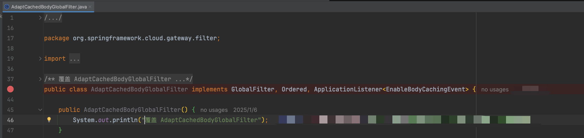

# Class 覆盖

## 项目结构

一般的SpringBoot项目结构

```text title="可执行Jar"
example.jar
|
+-META-INF
|  +-MANIFEST.MF
+-org
|  +-springframework
|     +-boot
|        +-loader
|           +-<spring boot loader classes>
+-BOOT-INF
+-classes
|  +-mycompany
|     +-project
|        +-YourClasses.class
+-lib
+-dependency1.jar
+-dependency2.jar
```

## 覆盖操作

项目采用Maven多模块结构，应用模块会依赖一些common、util、base公用模块。当第三方包存在问题，无法通过升级版方式来修复时，我们通常会用最“简单有效”的方式进行处理——同名覆盖。

同名覆盖也就是在项目中创建与需要重写的第三方包内的class文件相同限定名（包名+类名），我们可能会在“应用模块”或者“公用模块”进行重写操作。
重写类在构造方法或者初始化方法中进行内容打印，方便服务部署时观察覆盖是否成功，打印内容：“覆盖xxxx”

例如：



## 注意事项
要保障正确覆盖class，就要保障类加载的过程中我们重写的覆盖类要优先于第三方提供的class

“应用模块”或者“公用模块”两种常见重写情况：

- “应用模块”一般来说重写之后的内容都属性classpath内，拥有最高优先级。但是如果启动jar时指定了-Dloader.path那么有可能被loader.path的内容覆盖
- “公用模块”一般来说会和第三方包一样都放置在WEB-INF/lib或者BOOT-INF/lib内，也就是说和第三方包同级了。类加载的顺序取决于文件名顺序，所以需要保障“公用模块”排在前面
