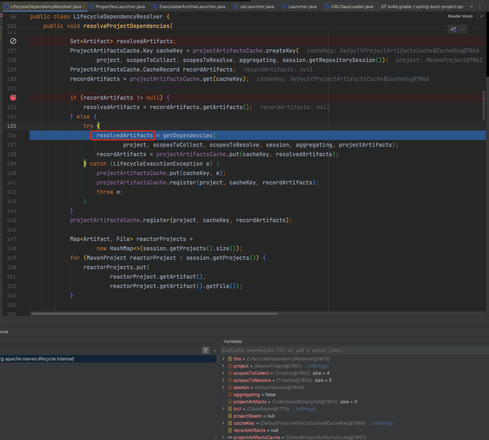
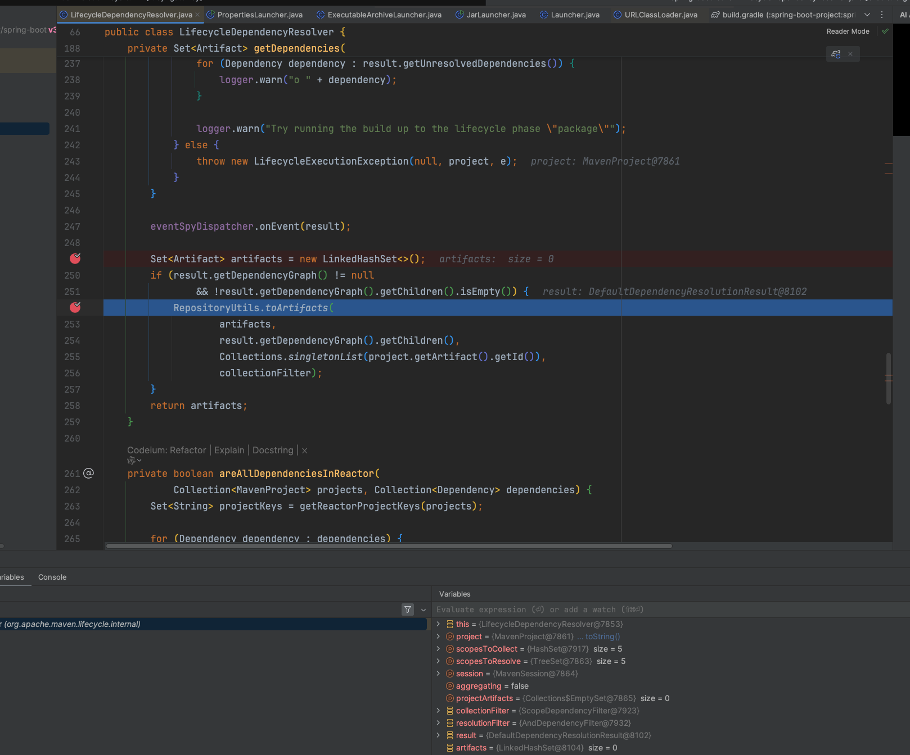
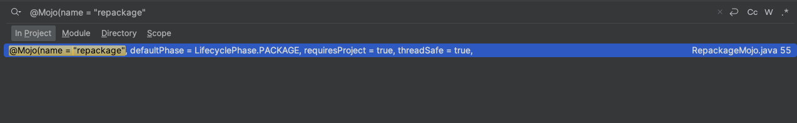
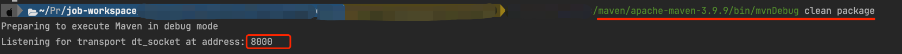
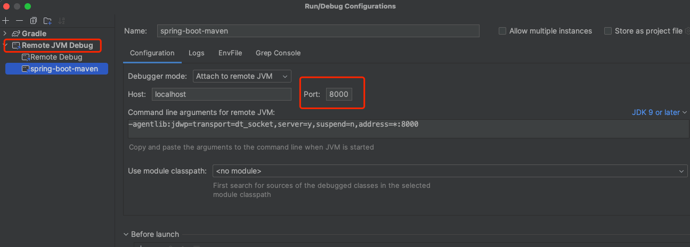

# Spring Boot Maven Plugin

[SpringBoot executable-jar](https://docs.spring.io/spring-boot/docs/3.2.12/reference/html/executable-jar.html#appendix.executable-jar.nested-jars.index-files)


## 索引文件

::: tip 官网文档
Spring Boot Loader-compatible jar and war archives can include additional index files under the BOOT-INF/ directory. A classpath.idx file can be provided for both jars and wars, and it provides the ordering that jars should be added to the classpath. The layers.idx file can be used only for jars, and it allows a jar to be split into logical layers for Docker/OCI image creation.

Index files follow a YAML compatible syntax so that they can be easily parsed by third-party tools. These files, however, are not parsed internally as YAML and they must be written in exactly the formats described below in order to be used.
:::

Spring Boot Loader 兼容的 jar 和 war 归档文件可以在 BOOT-INF/ 目录下包含额外的索引文件。 

classpath.idx 文件可同时用于 jar 和 war，它提供了将 jar 添加到 classpath 的顺序。 

**layers.idx 文件只能用于 jar，它允许将 jar 分割成逻辑层，以便创建 Docker/OCI 镜像。**

索引文件采用与 YAML 兼容的语法，因此第三方工具可以很容易地对其进行解析。不过，这些文件在内部不会被解析为 YAML，必须完全按照下面描述的格式编写才能使用。

## 定制layers

::: tip 官方文档描述
The layers order is important as it determines how likely previous layers can be cached when part of the application changes. The default order is dependencies, spring-boot-loader, snapshot-dependencies, application. Content that is least likely to change should be added first, followed by layers that are more likely to change.

层的顺序很重要，因为它决定了当部分应用程序发生变化时，前面的层能被缓存的可能性有多大。默认顺序是依赖项、spring-boot-loader、快照依赖项、应用程序。应首先添加最不可能更改的内容，然后再添加较可能更改的层。
:::

从上文中索引文件描述中可知：层的作用对于提高服务部署效率很重要：

- 生成layers.idx方便创建Docker/OCI 镜像：通过`spring-boot:build-image`生成镜像

- 分层Jar Docker镜像构建：通过[SpringBoot layertool](./layertool.md)按层解压jar文件，编写多阶段构建的[Dockerfile](https://docs.spring.io/spring-boot/docs/3.2.12/reference/html/container-images.html#container-images.dockerfiles)充分利用docker cache 。因为这种方式是直接解压出来进行部署，所以和layers.idx没有直接关系了。

[packaging.layers.configuration](https://docs.spring.io/spring-boot/docs/3.2.12/maven-plugin/reference/htmlsingle/#packaging.layers.configuration)

通过构建定制layers.xml文件，可以控制打包后的jar文件中的内容，从而实现更细粒度的控制。结合spring-boot-maven-plugin，可以实现在打包时将不同类型的文件放置在不同的层中，配合[SpringBoot Container Images](https://docs.spring.io/spring-boot/docs/3.2.12/reference/html/container-images.html)从而实现更高效的部署和管理。


### layers.xml使用

```xml
<!-- POM.xml -->
<build>
        <finalName>${project.artifactId}</finalName>
        <plugins>
            <plugin>
                <groupId>org.springframework.boot</groupId>
                <artifactId>spring-boot-maven-plugin</artifactId>
                <version>${spring-boot.version}</version>
                <executions>
                    <execution>
                        <goals>
                            <goal>repackage</goal>
                        </goals>
                    </execution>
                </executions>
                <configuration>
                    <layers>
                        <enabled>true</enabled>
                        <configuration>${basedir}/src/main/resources/layers.xml</configuration>
                    </layers>
                </configuration>
            </plugin>
        </plugins>
    </build>

```


```xml
<layers xmlns="http://www.springframework.org/schema/boot/layers"
        xmlns:xsi="http://www.w3.org/2001/XMLSchema-instance"
        xsi:schemaLocation="http://www.springframework.org/schema/boot/layers
                          https://www.springframework.org/schema/boot/layers/layers-3.2.xsd">
    <!--application表示class和resource-->
    <application>
        <into layer="spring-boot-loader">
            <include>org/springframework/boot/loader/**</include>
        </into>
        <into layer="application"/>
    </application>

    <!--dependencies所有依赖-->
    <dependencies>
        <!--<into layer="application">
            <includeModuleDependencies/>
        </into>-->
        <into layer="snapshot-dependencies">
            <include>*:*:*SNAPSHOT</include>
        </into>
        <!--受打包方式影响，必须整体项目执行打包才能保持每次都能将本地项目模块包含至module-dependencies-->
        <!--<into layer="module-dependencies">
            <includeModuleDependencies/>
        </into>-->
        <into layer="module-dependencies">
             <include>com.ruoyi:ruoyi-*:*</include>
         </into>
        <into layer="third-dependencies"/>
    </dependencies>

    <!--定义层顺序，会影响BOOT-INF/layers.idx-->
    <layerOrder>
        <!--这里到顺序会影响直接通过java -jar xxx.jar方式启动时的类加载顺序，而docker分层优化部署时的顺序不受影响。-->
        <layer>application</layer>
        <!--模块依赖-->
        <layer>module-dependencies</layer>
        <layer>third-dependencies</layer>
        <layer>spring-boot-loader</layer>
        <layer>snapshot-dependencies</layer>
    </layerOrder>
</layers>

```


## layers.idx

> layers.xml与上文一致

### 使用经验

- 当layers.xml中配置`includeModuleDependencies`标签时，需要整体项目一起打包，也就是直接对parent项目执行`clean + install`

- 当layers.xml中不配置`includeModuleDependencies`标签时，通过`<include>`标签包含本地项目模块，可以单独对当前模块执行`clean + package`

具体原因可以阅读下文

### 打包方式差异问题

clean + install全部项目(parent)后jar内部layer.idx文件内容如下：

```text
- "application":
  - "BOOT-INF/classes/"
  - "BOOT-INF/classpath.idx"
  - "BOOT-INF/layers.idx"
  - "META-INF/"
- "module-dependencies":
  - "BOOT-INF/lib/module1.jar"
  - "BOOT-INF/lib/module2.jar"
  -  省略其他包

- "third-dependencies":
  - "BOOT-INF/lib/HdrHistogram-2.1.12.jar"
  - "BOOT-INF/lib/LatencyUtils-2.0.3.jar"
  - "BOOT-INF/lib/SparseBitSet-1.2.jar"
   - 省略其他包
- "spring-boot-loader":
  - "org/"
- "snapshot-dependencies":

```

clean + package当前模块后jar内部layer.idx文件内容如下：

```text
- "application":
  - "BOOT-INF/classes/"
  - "BOOT-INF/classpath.idx"
  - "BOOT-INF/layers.idx"
  - "META-INF/"
- "module-dependencies":
- "third-dependencies":
  - "BOOT-INF/lib/"
- "spring-boot-loader":
  - "org/"
- "snapshot-dependencies":
```

产生差异代码：

```java
// ArtifactsLibraries
private boolean isLocal(Artifact artifact) {
    // 此处this.localProjects为核心，可以解释“打包方式差异问题”。当整体项目一起打包时，this.localProjects包含所有模块，所以能正确判断出本地模块；如果只单独打包当前模块无法判断
    for (MavenProject localProject : this.localProjects) {
        // 判断是否是本地项目
        if (localProject.getArtifact().equals(artifact)) {
            return true;
        }
        // 判断是否是附加artifact
        for (Artifact attachedArtifact : localProject.getAttachedArtifacts()) {
            if (attachedArtifact.equals(artifact)) {
                return true;
            }
        }
    }
    return false;
}
```


### 过程分析

- 核心类：

CustomLayers#getLayer(Library library)

CustomLayersProvider

IncludeExcludeContentSelector#contains 用于处理include和exclude逻辑


- 核心逻辑：

判断包是否包含在当前层

```java
// IncludeExcludeContentSelector 打个条件断点  getLayer().name.equals("module-dependencies") && ((Library) item).name.startsWith("本地模块前缀")
public boolean contains(T item) {
    return isIncluded(item) && !isExcluded(item);
}
// this.includes为其内部判断逻辑
private boolean isIncluded(T item) {
    if (this.includes.isEmpty()) {
        return true;
    }
    for (ContentFilter<T> include : this.includes) {
        if (include.matches(item)) {
            return true;
        }
    }
    return false;
}

```

当layers.xml中包含`includeModuleDependencies`时，设置一个`Library::isLocal`的判断逻辑，初始化代码为：

```java
// CustomLayersProvider
private ContentSelector<Library> getLibrarySelector(Element element,
			Function<String, ContentFilter<Library>> filterFactory) {
    Layer layer = new Layer(element.getAttribute("layer"));
    List<String> includes = getChildNodeTextContent(element, "include");
    List<String> excludes = getChildNodeTextContent(element, "exclude");
    Element includeModuleDependencies = getChildElement(element, "includeModuleDependencies");
    Element excludeModuleDependencies = getChildElement(element, "excludeModuleDependencies");
    List<ContentFilter<Library>> includeFilters = includes.stream()
        .map(filterFactory)
        .collect(Collectors.toCollection(ArrayList::new));
    if (includeModuleDependencies != null) {
        // 初始化是否为“本地库的判断逻辑”
        includeFilters.add(Library::isLocal);
    }
    List<ContentFilter<Library>> excludeFilters = excludes.stream()
        .map(filterFactory)
        .collect(Collectors.toCollection(ArrayList::new));
    if (excludeModuleDependencies != null) {
        excludeFilters.add(Library::isLocal);
    }
    return new IncludeExcludeContentSelector<>(layer, includeFilters, excludeFilters);
}


// Library
public boolean isLocal() {
    return this.local;
}
```

因此判断是否为内部模块的逻辑就在`Library#local`中，那么观察其初始化逻辑：

```java 
// Packager
PackagedLibraries(Libraries libraries, boolean ensureReproducibleBuild) throws IOException {
    this.libraries = (ensureReproducibleBuild) ? new TreeMap<>() : new LinkedHashMap<>();
    // 转处理库文件
    libraries.doWithLibraries((library) -> {
        if (isZip(library::openStream)) {
            // 添加库
            addLibrary(library);
        }
    });
    if (isLayered() && Packager.this.includeRelevantJarModeJars) {
        addLibrary(JarModeLibrary.LAYER_TOOLS);
    }
    this.unpackHandler = new PackagedLibrariesUnpackHandler();
    this.libraryLookup = this::lookup;
}

private void addLibrary(Library library) {
    String location = getLayout().getLibraryLocation(library.getName(), library.getScope());
    if (location != null) {
        String path = location + library.getName();
        Library existing = this.libraries.putIfAbsent(path, library);
        Assert.state(existing == null, () -> "Duplicate library " + library.getName());
    }
}
```


```java 
// ArtifactsLibraries
@Override
public void doWithLibraries(LibraryCallback callback) throws IOException {
    Set<String> duplicates = getDuplicates(this.artifacts);
    for (Artifact artifact : this.artifacts) {
        String name = getFileName(artifact);
        File file = artifact.getFile();
        LibraryScope scope = SCOPES.get(artifact.getScope());
        if (scope == null || file == null) {
            continue;
        }
        if (duplicates.contains(name)) {
            this.log.debug("Duplicate found: " + name);
            name = artifact.getGroupId() + "-" + name;
            this.log.debug("Renamed to: " + name);
        }
        LibraryCoordinates coordinates = new ArtifactLibraryCoordinates(artifact);
        boolean unpackRequired = isUnpackRequired(artifact);
        // 是否为本地文件
        boolean local = isLocal(artifact);
        boolean included = this.includedArtifacts.contains(artifact);
        callback.library(new Library(name, file, scope, coordinates, unpackRequired, local, included));
    }
}


private boolean isLocal(Artifact artifact) {
    // 此处this.localProjects为核心，可以解释“打包方式差异问题”。当整体项目一起打包时，this.localProjects包含所有模块，所以能正确判断出本地模块；如果只单独打包当前模块无法判断
    for (MavenProject localProject : this.localProjects) {
        // 判断是否是本地项目
        if (localProject.getArtifact().equals(artifact)) {
            return true;
        }
        // 判断是否是附加artifact
        for (Artifact attachedArtifact : localProject.getAttachedArtifacts()) {
            if (attachedArtifact.equals(artifact)) {
                return true;
            }
        }
    }
    return false;
}

// maven-core-3.9.4.jar
/**
 * Returns a mutable list of the attached artifacts to this project. It is highly advised <em>not</em>
 * to modify this list, but rather use the {@link MavenProjectHelper}.
 * <p>
 * <strong>Note</strong>: This list will be made read-only in Maven 4.</p>
 *
 * @return the attached artifacts of this project
 */
public List<Artifact> getAttachedArtifacts() {
    if (attachedArtifacts == null) {
        attachedArtifacts = new ArrayList<>();
    }
    return attachedArtifacts;
}

```

根据上述代码可知，本地库即为当前项目对象的attachedArtifacts属性内容，此属性与maven核心逻辑有关系，下面观察maven核心逻辑


## classpath.idx

这是一个类路径索引文件，它包含了在构建过程中使用的所有类和资源的列表。这个文件通常由Maven插件生成，并包含在构建的JAR文件中。

官方解释：类路径索引文件可在 BOOT-INF/classpath.idx 中提供。通常，该文件由 Spring Boot 的 Maven 和 Gradle 构建插件自动生成。它提供了一个 jar 名称（包括目录）列表，<b>并按照顺序将它们添加到 classpath 中</b>。由构建插件生成时，该 classpath 排序与构建系统在运行和测试应用程序时使用的顺序一致。每行必须以破折号空格（"--"）开始，名称必须使用双引号。

该文件控制了类加载器的行为，它决定了类加载器在加载类和资源时的顺序。这个文件对于Spring Boot应用程序来说非常重要，因为它可以确保应用程序在运行时能够正确地加载类和资源。

### 过程分析

通过调试插件运行过程，可以发现：
1. 在执行repackage方法时，会调用getLibraries方法，该方法会获取所有的库文件，并生成classpath.idx文件。相关代码如下：

    ```java {10}
    // Packager
    private void write(JarFile sourceJar, AbstractJarWriter writer, PackagedLibraries libraries) throws IOException {
            if (isLayered()) {
                writer.useLayers(this.layers, this.layersIndex);
            }
            writer.writeManifest(buildManifest(sourceJar));
            writeLoaderClasses(writer);
            writer.writeEntries(sourceJar, getEntityTransformer(), libraries.getUnpackHandler(),
                    libraries.getLibraryLookup());
            Map<String, Library> writtenLibraries = libraries.write(writer);
            writeNativeImageArgFile(writer, sourceJar, writtenLibraries);
            if (isLayered()) {
                writeLayerIndex(writer);
            }
            writeSignatureFileIfNecessary(writtenLibraries, writer);
        }
    
    
    Map<String, Library> write(AbstractJarWriter writer) throws IOException {
                Map<String, Library> writtenLibraries = new LinkedHashMap<>();
                for (Entry<String, Library> entry : this.libraries.entrySet()) {
                    String path = entry.getKey();
                    Library library = entry.getValue();
                    if (library.isIncluded()) {
                        String location = path.substring(0, path.lastIndexOf('/') + 1);
                        writer.writeNestedLibrary(location, library);
                        writtenLibraries.put(path, library);
                    }
                }
          // 写入classpath.idx
                writeClasspathIndexIfNecessary(writtenLibraries.keySet(), getLayout(), writer);
                return writtenLibraries;
            }
    ```


2. classpath.idx内容最初来自于maven生成的project对象中，相关代码如下：

    ``` java {8,20}
    // RepackageMojo
    private void repackage() throws MojoExecutionException {
            Artifact source = getSourceArtifact(this.classifier);
            File target = getTargetFile(this.finalName, this.classifier, this.outputDirectory);
            // 处理layers.xml中includeModuleDependencies逻辑
            Repackager repackager = getRepackager(source.getFile());
        // 获取所有的库文件
            Libraries libraries = getLibraries(this.requiresUnpack);
            try {
                LaunchScript launchScript = getLaunchScript();
                repackager.repackage(target, libraries, launchScript, parseOutputTimestamp());
            }
            catch (IOException ex) {
                throw new MojoExecutionException(ex.getMessage(), ex);
            }
            updateArtifact(source, target, repackager.getBackupFile());
        }
    
      protected final Libraries getLibraries(Collection<Dependency> unpacks) throws MojoExecutionException {
            Set<Artifact> artifacts = this.project.getArtifacts();
            Set<Artifact> includedArtifacts = filterDependencies(artifacts, getAdditionalFilters());
            return new ArtifactsLibraries(artifacts, includedArtifacts, this.session.getProjects(), unpacks, getLog());
        }
    ```
    
    ``` java
    // MavenProject
    public Set<Artifact> getArtifacts() {
        if (artifacts == null) {
            if (artifactFilter == null || resolvedArtifacts == null) {
                artifacts = new LinkedHashSet<>();
            } else {
                artifacts = new LinkedHashSet<>(resolvedArtifacts.size() * 2);
                for (Artifact artifact : resolvedArtifacts) {
                    if (artifactFilter.include(artifact)) {
                        artifacts.add(artifact);
                    }
                }
            }
        }
        return artifacts;
    }
    ```

3. maven又是如何获取到这些库文件的，相关代码如下：


    
    
    
    从`toArtifacts`代码分析，maven在解析依赖时，会遍历所有的直接依赖，然后把它们的依赖分别进行递归调用`toArtifacts`方法：
    
    > jar的顺序和pom中依赖的顺序一致
    
    ```java
    // RepositoryUtils
    public static void toArtifacts(
            Collection<org.apache.maven.artifact.Artifact> artifacts,
            Collection<? extends DependencyNode> nodes,
            List<String> trail,
            DependencyFilter filter) {
        for (DependencyNode node : nodes) {
            org.apache.maven.artifact.Artifact artifact = toArtifact(node.getDependency());
    
            List<String> nodeTrail = new ArrayList<>(trail.size() + 1);
            nodeTrail.addAll(trail);
            nodeTrail.add(artifact.getId());
    
            if (filter == null || filter.accept(node, Collections.<DependencyNode>emptyList())) {
                artifact.setDependencyTrail(nodeTrail);
                artifacts.add(artifact);
            }
    
            toArtifacts(artifacts, node.getChildren(), nodeTrail, filter);
        }
    }
    
    ```


## 调试


### 准备

- 下载插件源码，IDEA导入

``` shell
git clone https://github.com/spring-projects/spring-boot
# 切换需要调试的版本
git checkout v3.2.8
```
- 准备好测试项目，配置需要测试的插件 ，如spring-boot-maven-plugin，配置参考上方内容

- 两个项目JDK和Maven版本保持一致

### 执行

- 打断点

在源码项目中通过搜索`@Mojo(name = "repackage"`找到对应的核心类，在`execute()`方法打上断点



- 在测试项目控制台中执行`${maven_home}/mvnDebug clean package -Dmaven.test.skip=true`开启调试模式，等待IDEA连接，复制控制台输出的端口号

```shell
mvnDebug clean package
```



- 配置远程调试

在源码项目新建远程调试并且启动，端口为上一步复制的端口号，等待将进入断点



## 构建OCI镜像

[SpringBoot build-image](https://docs.spring.io/spring-boot/docs/3.2.12/maven-plugin/reference/htmlsingle/#build-image)

[SpringBoot build-image.example](https://docs.spring.io/spring-boot/docs/3.2.12/maven-plugin/reference/htmlsingle/#build-image.examples)

### 使用方式

- 手动执行命令 `mvn springboot:build-image`
- `package` 阶段时自动创建映像

```xml
<!--`package` 阶段时自动创建映像-->
<build>
    <plugins>
        <plugin>
            <groupId>org.springframework.boot</groupId>
            <artifactId>spring-boot-maven-plugin</artifactId>
            <executions>
                <execution>
                    <goals>
                        <goal>build-image-no-fork</goal>
                    </goals>
                </execution>
            </executions>
           <configuration>
              <image>
                 <env>
                    <!--<HTTP_PROXY></HTTP_PROXY>-->
                    <HTTPS_PROXY> https://dockerpull.org/</HTTPS_PROXY>
                 </env>
                 <name>example.com/library/${project.artifactId}</name>
              </image>
              <docker>
                 <!--<builderRegistry>
                    <url>私有hub</url>
                    <username>username</username>
                    <password>password</password>
                    <email>email</email>
                 </builderRegistry>-->
                 <builderRegistry>
                    <url>https://registry-1.docker.io</url>
                    <username>username</username>
                    <password>password</password>
                    <email>email</email>
                 </builderRegistry>
              </docker>
           </configuration>
        </plugin>
    </plugins>
</build>

```

相较于`build-image-no-fork`，`build-image`会保证一定是完成package操作状态（也就是会执行package的相关操作）

如果利用SpringBoot插件构建镜像，那么`docker-compose.yml`可以直接使用镜像而不是`Dockerfile`


### 注意事项

构建镜像需要依赖一些镜像，比如`paketobuildpacks/builder-jammy-base:latest`

这些镜像如果没有指定域名的话，默认的下载地址是`ImageName#DEFAULT_DOMAIN`中固定且无法修改——国内可能出现无法下载的情况(提前下载也无效)，可尝试配置buildpack信息。

```java
public class ImageName {
	private static final String DEFAULT_DOMAIN = "docker.io";
	//省略
 }
 
 
public class BuildRequest {

	static final String DEFAULT_BUILDER_IMAGE_NAME = "paketobuildpacks/builder-jammy-base:latest";

	private static final ImageReference DEFAULT_BUILDER = ImageReference.of(DEFAULT_BUILDER_IMAGE_NAME);
	
	//省略
 } 
```