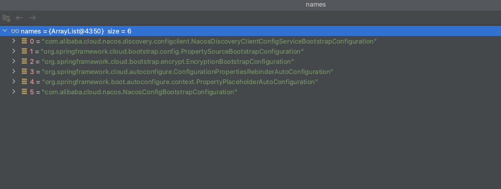

# 选择器

BootstrapImportSelector

~~~ java
@Override
public String[] selectImports(AnnotationMetadata annotationMetadata) {
	ClassLoader classLoader = Thread.currentThread().getContextClassLoader();
	// Use names and ensure unique to protect against duplicates
	List<String> names = new ArrayList<>(SpringFactoriesLoader
			.loadFactoryNames(BootstrapConfiguration.class, classLoader));

~~~