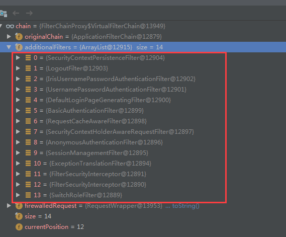
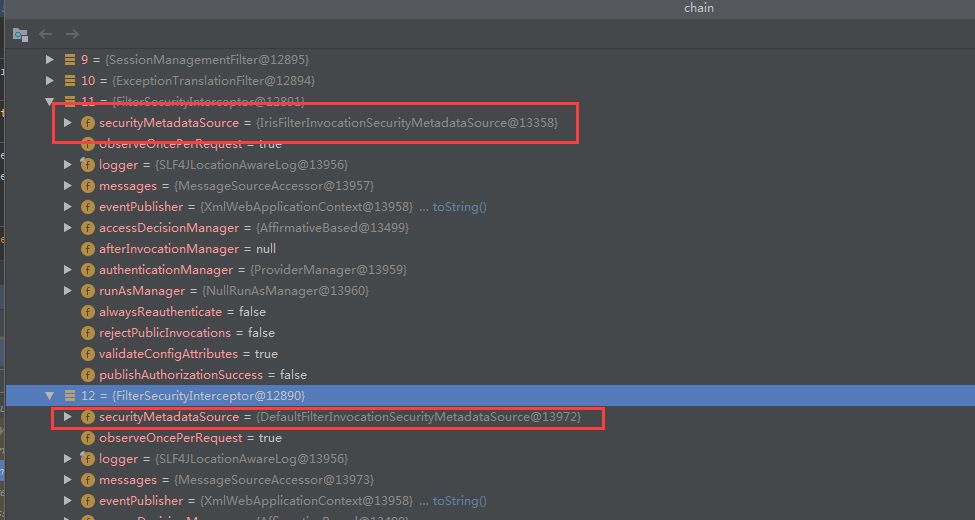

# 资源访问权限

## 配置

当用户访问了受保护的资源，spring会抛出一个AuthenticationException,会触发AuthenticationEntryPoint的commence方法

1. 配置在web.xml中的org.springframework.web.filter.DelegatingFilterProxy是一个过滤器的代理链FilterChainProxy，里面包含多个过滤器。

~~~ xml
<filter>
   <filter-name>springSecurityFilterChain</filter-name>
   <filter-class>org.springframework.web.filter.DelegatingFilterProxy</filter-class>
</filter>
<filter-mapping>
   <filter-name>springSecurityFilterChain</filter-name>
   <url-pattern>/*</url-pattern>
</filter-mapping>
~~~

2. FilterChainProxy中会调用资源访问过滤器（实现该接口FilterInvocationSecurityMetadataSource）来校验当前用户是否有访问当前资源的权限。 

3. springsecurity的配置文件中进行配置

~~~ xml
<!-- http安全配置 -->
<!--access-decision-manager-ref="accessDecisionManager"设置资源访问的权限判断管理器-->
<sec:http access-decision-manager-ref="accessDecisionManager" auto-config="true" entry-point-ref="authenticationEntryPoint">
   <sec:logout />
   <sec:anonymous granted-authority="A_ANONYMOUS" />
   <sec:custom-filter ref="authenticationFilter" before="FORM_LOGIN_FILTER" />
   <sec:custom-filter ref="filterSecurityInterceptor" before="FILTER_SECURITY_INTERCEPTOR" />
   <sec:custom-filter ref="switchRoleProcessingFilter" before="SWITCH_USER_FILTER" />
</sec:http>

<!-- 自定义过滤器,在数据库存储URL-授权 -->
<bean id="filterSecurityInterceptor" class="org.springframework.security.web.access.intercept.FilterSecurityInterceptor">
   <property name="accessDecisionManager" ref="accessDecisionManager" />
   <property name="authenticationManager" ref="authenticationManager" />
   <property name="securityMetadataSource" ref="filterInvocationSecurityMetadataSource" />
</bean>

<!-- DefinitionSource工厂,使用resourceDetailService提供的URL-授权关系. -->
<bean id="filterInvocationSecurityMetadataSource" class="com.iris.egrant.security.springsecurity.IrisFilterInvocationSecurityMetadataSource">
    <!-- 资源访问权限查询服务. -->
   <property name="resourceDetailService" ref="webResourceDetailService"></property>
</bean>

<!-- 授权判断配置, 将授权名称的默认前缀由ROLE_改为A_. -->
<bean id="accessDecisionManager" class="org.springframework.security.access.vote.AffirmativeBased">
   <property name="decisionVoters">
      <list>
         <bean class="org.springframework.security.access.vote.RoleVoter">
            <property name="rolePrefix" value="A_" />
         </bean>
         <bean class="org.springframework.security.access.vote.AuthenticatedVoter" />
      </list>
   </property>
</bean>
~~~ 

## 拦截过程

FilterChainProxy中包含以下过滤器

，其中有两个FilterSecurityInterceptor过滤器，两者securityMetadataSource的内容不同，其中一个是我们自己实现的类(在上文springsecurity配置中有说明)

当在执行FilterSecurityInterceptor的时候会执行一个父类（AbstractSecurityInterceptor）的前置方法，前置方法的主要授权拦截逻辑如下

1. 该前置方法其实就是调用当前`FilterSecurityInterceptor的securityMetadataSource中的Collection<ConfigAttribute> getAttributes(Object object)`方法，该方法会获取所有菜单的资源权限中是否包含当前请求，如果包含那么就返回当前请求对应的授权名称(比如授权表sys_authorite表中的值)

2. 获取当前用户的授权 UserDetailServiceImpl调用authorityManager.obtainGrantedAuthorities(userId, role, null);（AuthorityManagerImpl）

3. 使用accessDecisionManager进行授权裁决
	
	- accessDecisionManager(AffirmativeBased)的decide方法会对该请求资源所需的所有权限进行轮询使用RoleVoter角色投票器进行投票判断权限。
	
	- 诺该当前用户的授权中没有包含请求资源所需的权限，RoleVoter会返回ACCESS_DENIED(-1)
	
	- accessDecisionManager判断完所有授权之后，如果当前请求资源所需权限包含了 当前用户授权中没有的授权则抛出异常**AccessDeniedException**

4. AbstractSecurityInterceptor捕获异常,**发布AuthorizationFailureEvent事件**，并且**将异常向上抛出**。

5. 因为过滤器ExceptionTranslationFilter在FilterSecurityInterceptor之前（可以从上图看出），所以抛出异常之后ExceptionTranslationFilter将进行捕获，捕获到了一个访问拒绝的异常。
    
	- 在catch方法中进行逻辑判断，最终调用handleSpringSecurityException方法，该方法会针对异常类型和对应的执行操作进行判断。
    
	- 某种情况（其他情况在下方代码描述有说明）会调用**sendStartAuthentication处理授权问题**，**该方法中会调用所有的authenticationEntryPoint的实现类**(下面对该类进行解释)。

~~~ java
public void doFilter(ServletRequest request, ServletResponse response, FilterChain chain)
        throws IOException, ServletException {
    FilterInvocation fi = new FilterInvocation(request, response, chain);
    invoke(fi);
}

public void invoke(FilterInvocation fi) throws IOException, ServletException {
    if ((fi.getRequest() != null) && (fi.getRequest().getAttribute(FILTER_APPLIED) != null)
            && observeOncePerRequest) {
        // filter already applied to this request and user wants us to observe
        // once-per-request handling, so don't re-do security checking
        fi.getChain().doFilter(fi.getRequest(), fi.getResponse());
    } else {
        // first time this request being called, so perform security checking
        if (fi.getRequest() != null) {
            fi.getRequest().setAttribute(FILTER_APPLIED, Boolean.TRUE);
        }
        // 调用父类的前置方法
        InterceptorStatusToken token = super.beforeInvocation(fi);

        fi.getChain().doFilter(fi.getRequest(), fi.getResponse());

        super.afterInvocation(token, null);
    }
}

// AbstractSecurityInterceptor中的前置方法(缩略代码)
protected InterceptorStatusToken beforeInvocation(Object object) {

// 父类前置方法中有以下逻辑，这里的obtainSecurityMetadataSource()的内容其实是 FilterSecurityInterceptor中的securityMetadataSource
    Collection<ConfigAttribute> attributes = this.obtainSecurityMetadataSource().getAttributes(object);
    Authentication authenticated = authenticateIfRequired();
    // Attempt authorization
    try {
        this.accessDecisionManager.decide(authenticated, object, attributes);
    }
    catch (AccessDeniedException accessDeniedException) {
        publishEvent(new AuthorizationFailureEvent(object, attributes, authenticated, accessDeniedException))
        throw accessDeniedException;
    }

     ......
}
~~~

ExceptionTranslationFilter

~~~ java
try {
    chain.doFilter(request, response);
    logger.debug("Chain processed normally");
}
catch (IOException ex) {
    throw ex;
}
catch (Exception ex) {
    // Try to extract a SpringSecurityException from the stacktrace
    Throwable[] causeChain = throwableAnalyzer.determineCauseChain(ex);
    RuntimeException ase = (AuthenticationException)
            throwableAnalyzer.getFirstThrowableOfType(AuthenticationException.class, causeChain);

    if (ase == null) {
        ase = (AccessDeniedException)throwableAnalyzer.getFirstThrowableOfType(AccessDeniedException.class, causeChain);
    }
    if (ase != null) {
        handleSpringSecurityException(request, response, chain, ase);
    } else {
        // Rethrow ServletExceptions and RuntimeExceptions as-is
        if (ex instanceof ServletException) {
            throw (ServletException) ex;
        }
        else if (ex instanceof RuntimeException) {
            throw (RuntimeException) ex;
        }

        // Wrap other Exceptions. This shouldn't actually happen
        // as we've already covered all the possibilities for doFilter
        throw new RuntimeException(ex);
    }
}

// 异常判断处理方法
private void handleSpringSecurityException(HttpServletRequest request, HttpServletResponse response, FilterChain chain,
        RuntimeException exception) throws IOException, ServletException {
    if (exception instanceof AuthenticationException) {
        logger.debug("Authentication exception occurred; redirecting to authentication entry point", exception);
                // 其他异常处理
        sendStartAuthentication(request, response, chain, (AuthenticationException) exception);
    }
    else if (exception instanceof AccessDeniedException) {

        if (authenticationTrustResolver.isAnonymous(SecurityContextHolder.getContext().getAuthentication())) {
            logger.debug("Access is denied (user is anonymous); redirecting to authentication entry point",
                        exception);
            // 拥有匿名权限的处理逻辑（当前我们调试的情况）
            sendStartAuthentication(request, response, chain, new InsufficientAuthenticationException(
                    "Full authentication is required to access this resource"));
        }
        else {
            logger.debug("Access is denied (user is not anonymous); delegating to AccessDeniedHandler", exception);
            // 未拥有匿名权限的处理逻辑，调用访问拒绝处理器
            accessDeniedHandler.handle(request, response, (AccessDeniedException) exception);
        }
    }
}

protected void sendStartAuthentication(HttpServletRequest request, HttpServletResponse response, FilterChain chain,
        AuthenticationException reason) throws ServletException, IOException {
    // SEC-112: Clear the SecurityContextHolder's Authentication, as the
    // existing Authentication is no longer considered valid
    SecurityContextHolder.getContext().setAuthentication(null);
    requestCache.saveRequest(request, response);
    logger.debug("Calling Authentication entry point.");
    authenticationEntryPoint.commence(request, response, reason);
}
~~~

**AuthenticationEntryPoint接口**

当授权判断失败，被认定当前访问者无法访问当前资源的时候会触发AuthenticationEntryPoint的所有实现类。

作用： 
	控制ajax授权访问，超时限制调用。

实现AuthenticationEntryPoint在commence判断是否是ajax请求，同时将该请求访问去掉匿名权限。

