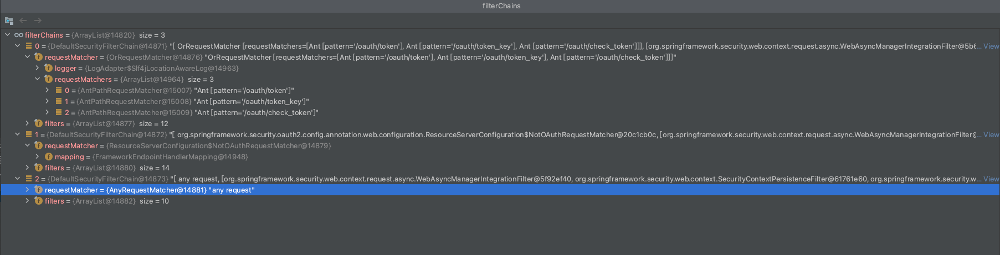

# Servlet应用
> [spring-security文档](https://docs.spring.io/spring-security/site/docs/5.4.2/reference/html5/)
> 调试环境为spring-boot:2.1.4 + spring-security:5.1.10 + spring-security-oauth2:2.3.5的项目环境

## SpringBoot自动配置

Spring Boot **自动**做以下事情:

- 开启Spring Security的默认配置，创建名为`springSecurityFilterChain`的过滤器，这个过滤器负责你的应用中所有的安全（保护应用程序 URL、验证提交的用户名和密码、重定向到表单中的日志等）。

- 使用用户名`user`和在控制台打印出的随机生成的密码来创建一个`UserDetailsService`接口的实现bean

- 注册一个名字为`springSecurityFilterChain`的过滤器，用来处理Sevlet容器中的所有请求

Spring Boot 的配置不多，但是做的事情很多。功能摘要如下：

- 与应用程序的任何交互都需要经过身份验证的用户

- 生成默认登录表单

- 允许用户使用用户名和记录到控制台的密码，通过基于表单的身份验证进行身份验证

- 使用BCrypt保护密码存储

- 允许用户注销

- [CSRF攻击](https://en.wikipedia.org/wiki/Cross-site_request_forgery)防御（CSRF attack prevention）

- [会话固定](https://en.wikipedia.org/wiki/Session_fixation)保护（Session Fixation protection）

- Security Header集成

    - [HTTP Strict Transport Security](https://en.wikipedia.org/wiki/HTTP_Strict_Transport_Security)用于安全请求

    - [X-Content-Type-Options](https://msdn.microsoft.com/en-us/library/ie/gg622941(v=vs.85).aspx)集成

    - 缓存控制（可稍后由应用程序覆盖，以允许缓存静态资源）

    - [X-XSS-Protection](https://docs.microsoft.com/en-us/previous-versions/windows/internet-explorer/ie-developer/compatibility/dd565647(v=vs.85)?redirectedfrom=MSDN)集成

    - X-Frame-Options集成帮助防止[点击劫持](https://en.wikipedia.org/wiki/Clickjacking)

- 与以下Servlet API方法集成:

    - HttpServletRequest#getRemoteUser()

    - HttpServletRequest.html#getUserPrincipal()

    - HttpServletRequest.html#isUserInRole(java.lang.String)

    - HttpServletRequest.html#login(java.lang.String, java.lang.String)

    - HttpServletRequest.html#logout()

## Servlet Security：全局

介绍基于Servlet的应用中的Spring Security高级架构，是基于[`Authentication`](https://docs.spring.io/spring-security/site/docs/5.4.2/reference/html5/#servlet-authentication), [`Authorization`](https://docs.spring.io/spring-security/site/docs/5.4.2/reference/html5/#servlet-authorization), [`Protection Against Exploits`](https://docs.spring.io/spring-security/site/docs/5.4.2/reference/html5/#servlet-exploits)的参考部分构建的高级架构

### 过滤器回顾

### DelegatingFilterProxy

### FilterChainProxy

### SecurityFilterChain

`FilterChainProxy`会使用`SecurityFilterChain`来决定哪些Spring Security过滤器需要执行

简单来说`SecurityFilterChain`就是包含了一系列不同Spring Security过滤器

可能会有多个`SecurityFilterChain`，根据当前请求的URL来进行匹配，匹配到就将此`SecurityFilterChain`交给`FilterChainProxy`放入过滤器链中进行执行，从而会忽略掉其他的`SecurityFilterChain`。

**规则：优先第一个匹配到的过滤器链**，具体代码见下图：

调试代码可以发现：当前有三个安全过滤器链，均是DefaultSecurityFilterChain的实例

前两个过滤器链分别针对oauth2授权服务和资源服务(项目集成了Spring-Security-oauth2)，第三个则为Spring Security原本的过滤器链服务

对这三个安全过滤器链做一个简单的描述：

- 授权服务配置生成

匹配规则：匹配请求`/oauth/token`,`/oauth/token_key`,`/oauth/check_token`

过滤器：

- 资源服务器配置生成

匹配规则：`NotOAuthRequestMatcher`

过滤器：

- WebSecurityConfigurer生成

匹配规则：所有请求

过滤器：

#### 安全过滤器链集合的初始化过程

安全过滤器链集合是在项目启动的时候在配置类`WebSecurityConfiguration`的springSecurityFilterChain()方法中进行初始化的，上文有说到的自动装配会自动创建一个名为`springSecurityFilterChain`的过滤器就是由这个方法创建。
该方法内调用`WebSecurity`实例的build()方法进行过滤的构建。

`WebSecurity`实例中存在一个securityFilterChainBuilders属性，该属性用来存储过滤器链集合。

安全过滤链集合的初始化过程：

1. `WebSecurity`实例执行build()方法过程中，调用内部方法doBuild()

2. doBuild()内部调用this.init()，此内部会在`WebSecurity`的securityFilterChainBuilders集合中生成三个过滤器链的builder类(HttpSecurity)，该对象有两个关键的属性filters和configurers。filters中有一个默认过滤器`WebAsyncManagerIntegrationFilter`，configurers有多个安全配置类

这里大概的逻辑就是获取到`SecurityConfigurer`集合，然后遍历配置类调用init方法。从调试结果可以看到有三个配置类:

- `org.springframework.security.oauth2.config.annotation.web.configuration.AuthorizationServerSecurityConfiguration`

- `org.springframework.security.oauth2.config.annotation.web.configuration.ResourceServerConfiguration`

- `com.iris.auth.config.SecurityConfiguration` - 项目中对`WebSecurityConfigurer`接口对实现(实际上是继承适配器`WebSecurityConfigurerAdapter`)

~~~ java
// WebSecurity
private void init() throws Exception {
	Collection<SecurityConfigurer<O, B>> configurers = getConfigurers();

	for (SecurityConfigurer<O, B> configurer : configurers) {
		configurer.init((B) this);
	}

	for (SecurityConfigurer<O, B> configurer : configurersAddedInInitializing) {
		configurer.init((B) this);
	}
}
~~~
3. this.init()执行完之后会继续调用performBuild(),在此内部会完成所有的过滤器链集合的初始化工作，大致逻辑如下：

- 如果有需要忽略的请求，则设置一个默认的过滤器链`DefaultSecurityFilterChain`

- 根据第2点中生成的securityFilterChainBuilders遍历调用build方法生成对应的过滤器链，实际上会遍历HttpSecurity的configurers内容调用对应configure方法添加过滤器，从整体上来说是一个递归调用的过程。

~~~ java
protected Filter performBuild() throws Exception {
	略...
	int chainSize = ignoredRequests.size() + securityFilterChainBuilders.size();
	List<SecurityFilterChain> securityFilterChains = new ArrayList<>(
			chainSize);
	for (RequestMatcher ignoredRequest : ignoredRequests) {
		securityFilterChains.add(new DefaultSecurityFilterChain(ignoredRequest));
	}
	for (SecurityBuilder<? extends SecurityFilterChain> securityFilterChainBuilder : securityFilterChainBuilders) {
		securityFilterChains.add(securityFilterChainBuilder.build());
	}
	FilterChainProxy filterChainProxy = new FilterChainProxy(securityFilterChains);
	if (httpFirewall != null) {
		filterChainProxy.setFirewall(httpFirewall);
	}
	filterChainProxy.afterPropertiesSet();

	Filter result = filterChainProxy;
	略...
	postBuildAction.run();
	return result;
}
~~~

> 这三个安全配置类也是在调用相关的BeanPostProcess对`WebSecurityConfiguration`初始化的过程中，初始化`setFilterChainProxySecurityConfigurer`方法的时候进行插入的

::: tip
AuthorizationServerSecurityConfiguration 和 ResourceServerConfiguration分别是Oatuh2.0认证协议中的"授权服务器安全配置"和"资源服务器安全配置"

简单来说安全过滤器链的初始化过程和安全配置类有关系，整个过程中`SecurityBuilder`的实现类们起着至关重要的作用

:::

总结:

- 安全过滤器链的初始化的整个入口在`WebSecurityConfiguration`中，通过`springSecurityFilterChain()`将获取到的安全配置对象`WebSecurityConfiguration`进行构建（该类中会初始化系统中配置的其他安全配置对象）。

- `WebSecurityConfiguration`构建的过程中会对其所包含的安全过滤器对象进行构建，所包含的安全过滤器对象可能还可能包含其他的子安全配置对象，不断递归完成所有构建过程

- 对于每一个安全配置对象初始化子安全配置对象和过滤器的过程都在其对应的init方法中，一般是在其获取`SecurityBuilder`的过程中。对于每一个安全配置的build方法调用，大致就是重复去调用子安全配置对象的init方法。

下面是AuthorizationServer配置类的相关代码

configure(http)方法会调用我们实现`AuthorizationServerConfigurer`的对应方法

### 安全过滤器（Security Filters）

安全过滤器是由`SecurityFilterChain`API插入`FilterChainProxy`。过滤器的顺序很重要!通常不需要知道 Spring Security筛选器的顺序。然而，有时知道排序是有好处的。

以下是Spring Security排序的完整列表：

- ChannelProcessingFilter

- WebAsyncManagerIntegrationFilter

- SecurityContextPersistenceFilter

- HeaderWriterFilter

- CorsFilter

- CsrfFilter

- LogoutFilter

- OAuth2AuthorizationRequestRedirectFilter

- Saml2WebSsoAuthenticationRequestFilter

- X509AuthenticationFilter

- AbstractPreAuthenticatedProcessingFilter

- CasAuthenticationFilter

- OAuth2LoginAuthenticationFilter

- Saml2WebSsoAuthenticationFilter

- [UsernamePasswordAuthenticationFilter](https://docs.spring.io/spring-security/site/docs/5.4.2/reference/html5/#servlet-authentication-usernamepasswordauthenticationfilter)

- OpenIDAuthenticationFilter

- DefaultLoginPageGeneratingFilter

- DefaultLogoutPageGeneratingFilter

- ConcurrentSessionFilter

- [DigestAuthenticationFilter](https://docs.spring.io/spring-security/site/docs/5.4.2/reference/html5/#servlet-authentication-digest)

- BearerTokenAuthenticationFilter

- [BasicAuthenticationFilter](https://docs.spring.io/spring-security/site/docs/5.4.2/reference/html5/#servlet-authentication-basic)

- RequestCacheAwareFilter

- SecurityContextHolderAwareRequestFilter

- JaasApiIntegrationFilter

- RememberMeAuthenticationFilter

- AnonymousAuthenticationFilter

- OAuth2AuthorizationCodeGrantFilter

- SessionManagementFilter

- [ExceptionTranslationFilter](https://docs.spring.io/spring-security/site/docs/5.4.2/reference/html5/#servlet-exceptiontranslationfilter)

- [FilterSecurityInterceptor](https://docs.spring.io/spring-security/site/docs/5.4.2/reference/html5/#servlet-authorization-filtersecurityinterceptor)

- SwitchUserFilter

### 处理安全异常

`ExceptionTranslationFilter`过滤器允许将`AccessDeniedException`和`AuthenticationException`转换为HTTP响应

`ExceptionTranslationFilter`作为Security Filters的一部分插入FilterChainProxy

## 认证（Authentication）

Spring Security为身份验证提供了全面支持。本节讨论：

### 架构组件

本节介绍Spring Security在Servlet身份验证中使用的主要体系结构组件。如果您需要解释这些部分如何结合的具体流程，请查看[认证机制](#认证机制)的特定章节

- SecurityContextHolder - Spring Security用来存储[已认证用户](https://docs.spring.io/spring-security/site/docs/5.4.2/reference/html5/#authentication)的详细信息的地方

- SecurityContext - 从SecurityContextHolder中获取，包含来当前已认证用户的Authentication（认证信息）

- Authentication - 认证信息，可以是`AuthenticationManager`的输入，以提供用户为身份验证提供的凭据，也可以提供来自`SecurityContext`的当前用户

- GrantedAuthority - `Authentication`授予主体的权力（即角色、范围等）

- AuthenticationManager - 定义Spring Security过滤器如何执行[身份验证](https://docs.spring.io/spring-security/site/docs/5.4.2/reference/html5/#authentication)的API。

- ProviderManager - `AuthenticationManager`的最常见实现

- AuthenticationProvider - `ProviderManager`用于执行特定类型的身份验证

- Request Credentials with AuthenticationEntryPoint - 用于从客户端请求凭据（即重定向到登录页、发送 WWW 身份验证响应等）

- AbstractAuthenticationProcessingFilter - 用于身份验证的基本筛选器。这还提供了高级身份验证流的好主意，以及部分如何协同工作

### 认证机制

- Username and Password - how to authenticate with a username/password

- OAuth 2.0 Login - OAuth 2.0 Log In with OpenID Connect and non-standard OAuth 2.0 Login (i.e. GitHub)

- SAML 2.0 Login - SAML 2.0 Log In

- Central Authentication Server (CAS) - Central Authentication Server (CAS) Support

- Remember Me - How to remember a user past session expiration

- JAAS Authentication - Authenticate with JAAS

- OpenID - OpenID Authentication (not to be confused with OpenID Connect)

- Pre-Authentication Scenarios - Authenticate with an external mechanism such as SiteMinder or Java EE security but still use Spring Security for authorization and protection against common exploits.

- X509 Authentication - X509 Authentication