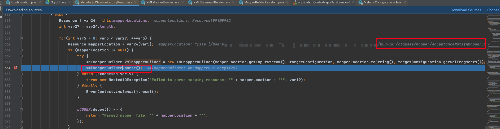
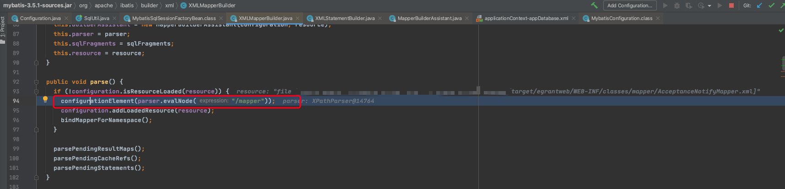
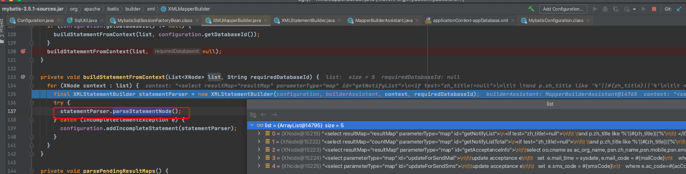
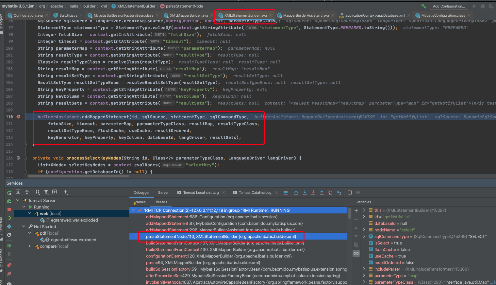
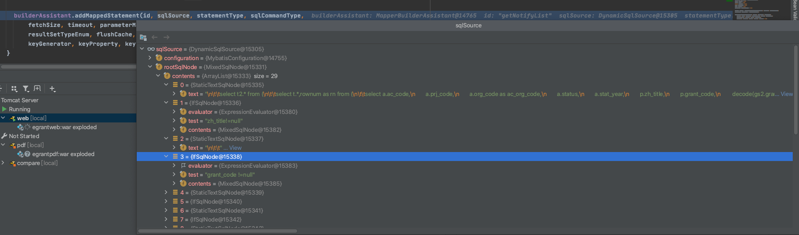
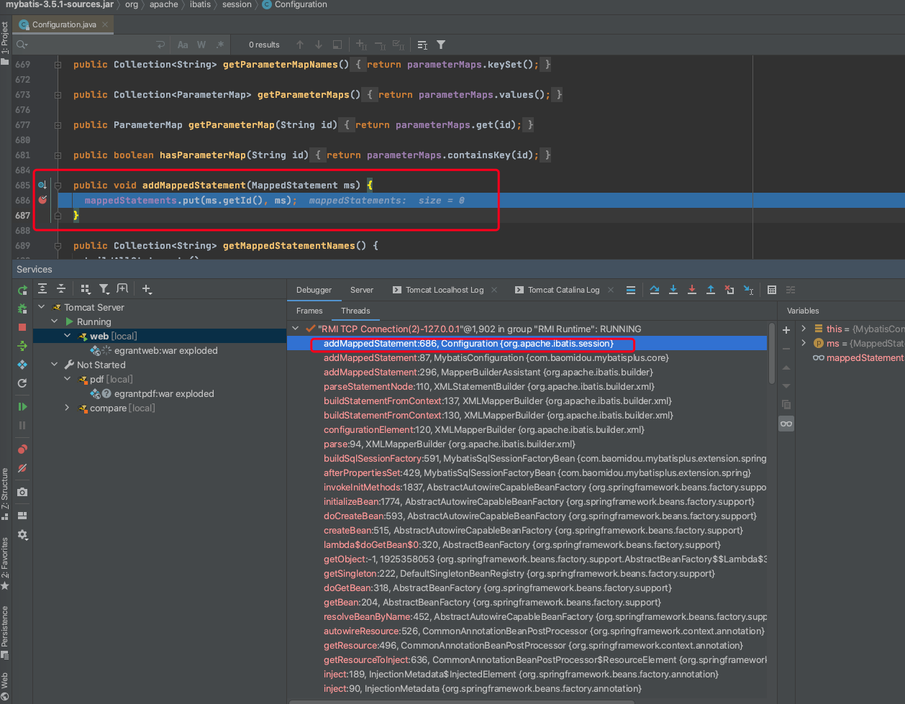
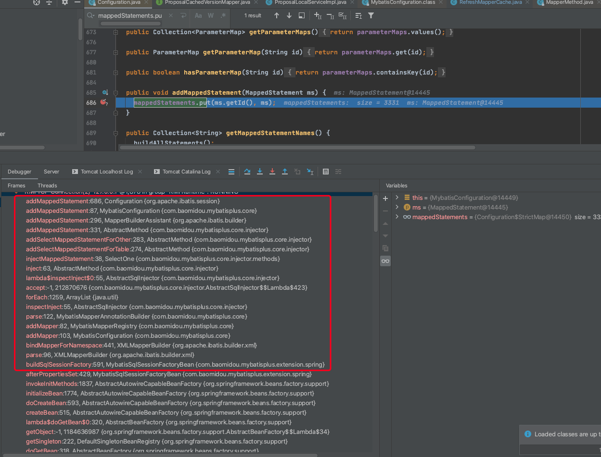
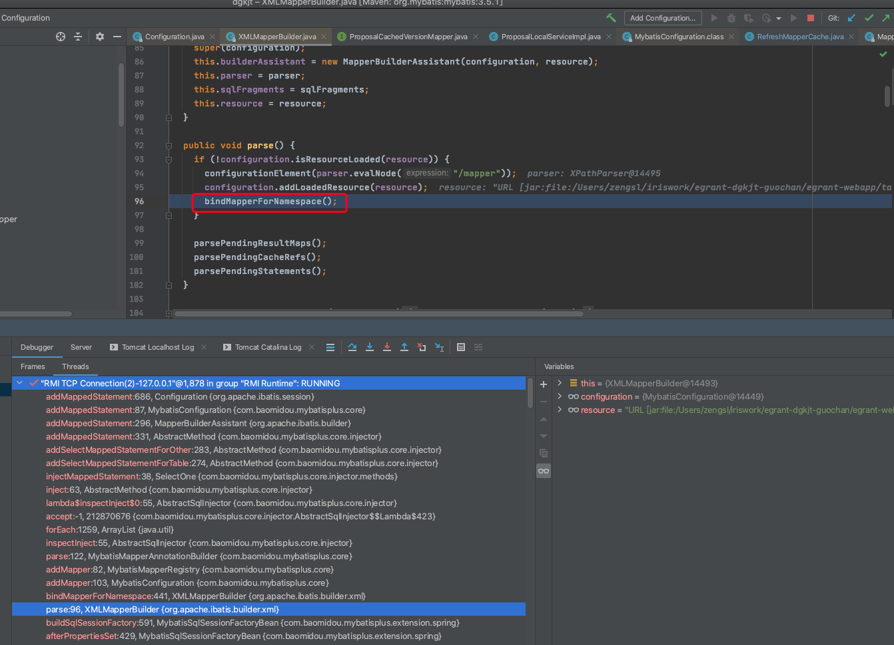
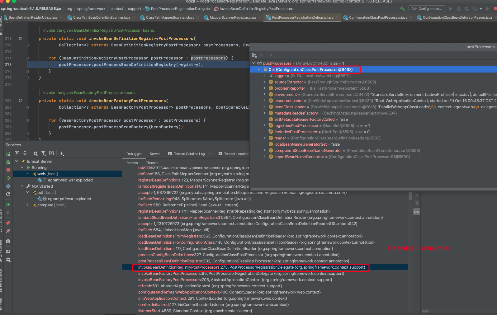
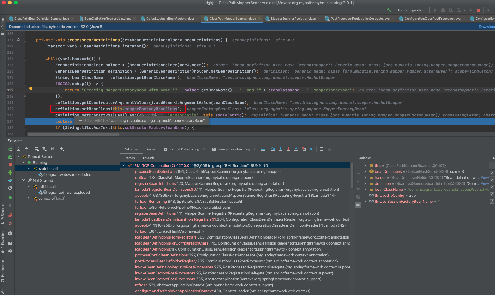

---
order: 2
----
# mybatis-plus内容

::: tip
mybatis版本3.5.1 

mybatis-plus版本3.3.2 
:::

## mapper文件加载过程

mybatis-plus是一个mybats增强工具，所以他的mapper加载过程其实就是mybatis的加载过程（以sql初始化为主）。

编写的所有的mapper文件

- 初始化的入口

在mybatis的`SqlSessionFactoryBean`中的`afterPropertiesSet()`包含了`this.buildSqlSessionFactory()`，其中包含了整个SqlSeesionFactory的构建过程，mapper的加载过程也在其中。

- 遍历和解析mapper文件

- xml解析

由XmlMapperBuilder进行mapper文件的解析

以下方法将完成命名空间、类型别名和sql语句等的解析工作。

~~~ java
private void configurationElement(XNode context) {
    try {
      String namespace = context.getStringAttribute("namespace");
      if (namespace == null || namespace.equals("")) {
        throw new BuilderException("Mapper's namespace cannot be empty");
      }
      builderAssistant.setCurrentNamespace(namespace);
      cacheRefElement(context.evalNode("cache-ref"));
      cacheElement(context.evalNode("cache"));
      parameterMapElement(context.evalNodes("/mapper/parameterMap"));
      resultMapElements(context.evalNodes("/mapper/resultMap"));
      sqlElement(context.evalNodes("/mapper/sql"));
	  // sql语句的解析过程，包含了"select|insert|update|delete"
      buildStatementFromContext(context.evalNodes("select|insert|update|delete"));
    } catch (Exception e) {
      throw new BuilderException("Error parsing Mapper XML. The XML location is '" + resource + "'. Cause: " + e, e);
    }
  }
~~~

遍历"select|insert|update|delete"内容进行解析

解析构建`MappedStatement`所需的内容，其中类型为的`DynamicSqlSource`的sqlSource存放的是每一个sql对象包含的所有结构内容（普通静态文档、if表达式等），使用list存放。

- mapper的存储

`MappedStatement`最终会被存放在一个map中，key为`MappedStatement`对象的Id（mapper文件的命名空间 + “.” + sql的Id）

- 查询

mybatis在查询时也是通过Id从map中获取对应的statment

~~~ java
public MappedStatement getMappedStatement(String id, boolean validateIncompleteStatements) {
    if (validateIncompleteStatements) {
      buildAllStatements();
    }
    return mappedStatements.get(id);
}
~~~

## mapper接口初始化

## @mapper注解初始化

@mapper是mybatis提供的注解

使用@mapper描述的类会使用`MapperFactoryBean`来进行创建

入口在MapperFactoryBean的afterPropertiesSet方法中所调用的checkDaoConfig方法。

~~~ java
public final void afterPropertiesSet() throws IllegalArgumentException, BeanInitializationException {
        // 初始化入口
		this.checkDaoConfig();

        try {
            this.initDao();
        } catch (Exception var2) {
            throw new BeanInitializationException("Initialization of DAO failed", var2);
        }
    }
~~~

BeanDefinition设置BeanClass为MapperFactoryBean

