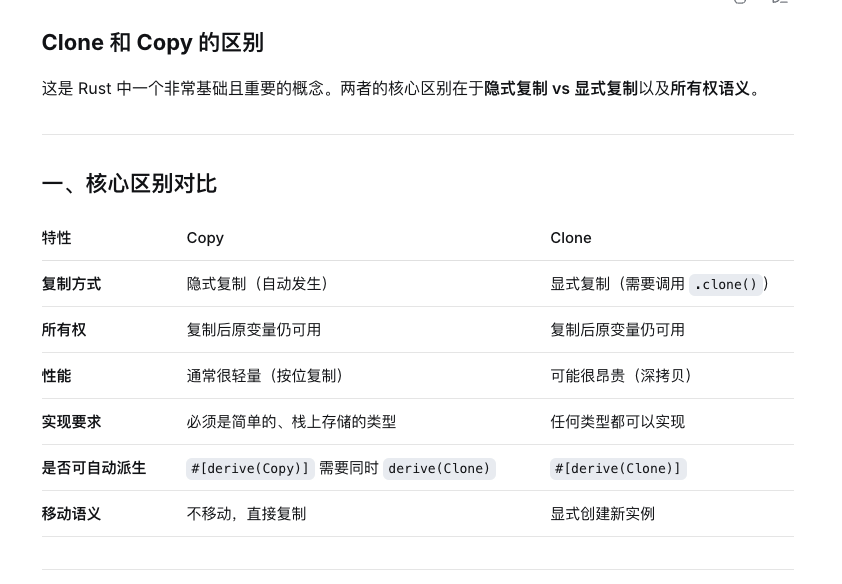

# Rust Study Notes

[rust-course](https://beatai.org/rust-course/about-book)

[rust-practice](https://practice-rust-zh.beatai.org/)

## 字符串与切片

https://beatai.org/rust-course/basic/compound-type/string-slice

 String
 &String
 

### 切片类型: &str


字符串字面量是切片

``` rust
let s: &str = "Hello, world!";

```

``` rust
let s = String::from("hello world");

let hello = &s[0..5];
let world = &s[6..11];
```
range序列语法：[startIndex, endIndex] => 区间[startIndex, endIndex)，用于获取对应的字节区间
其中:
 - 从头开始：[0..2]等效[..2]
 - 截取最后一个字符：[lastIndex..len]等效[lastIndex..]
 - 截取完整：[0..len]等效[..]
 - 由于是字节区间，所以处理UTF-8字符边界需注意（中文占3个字节）

其他切片：

因为切片是对集合的部分引用，因此不仅仅字符串有切片，其它集合类型也有，例如数组：
```rust
let a = [1, 2, 3, 4, 5];

let slice = &a[1..3];

assert_eq!(slice, &[2, 3]);
```


### 字符串定义

字符串是由字符组成的连续集合，Rust 中的字符是 Unicode 类型，因此每个字符占据 4 个字节内存空间，但是在字符串中不一样，字符串是 UTF-8 编码，也就是字符串中的字符所占的字节数是变化的(1 - 4)，这样有助于大幅降低字符串所占用的内存空间。

Rust 在语言级别，只有一种字符串类型： str，它通常是以引用类型出现 &str，也就是上文提到的字符串切片。虽然语言级别只有上述的 str 类型，但是在标准库里，还有多种不同用途的字符串类型，其中使用最广的即是 String 类型。

str 类型是硬编码进可执行文件，也无法被修改，但是 String 则是一个可增长、可改变且具有所有权的 UTF-8 编码字符串，当 Rust 用户提到字符串时，往往指的就是 String 类型和 &str 字符串切片类型，这两个类型都是 UTF-8 编码。

### String 与 &str 的转换

``` rust title=" &str转String"
String::from("hello,world")
"hello,world".to_string()
```

String转&str： 取引用转换
``` rust title=" String转&str"
fn main() {
    let s = String::from("hello,world!");
    // 取引用转换
    say_hello(&s);
    say_hello(&s[..]);
    say_hello(s.as_str());
}

fn say_hello(s: &str) {
    println!("{}",s);
}
```

### 索引字符串

 因为底层存储的是字节以及索引操作性能问题，所以Rust 不允许去索引字符串

 以下代码会报错：
 ``` rust title="索引字符串"
   let s1 = String::from("hello");
   let h = s1[0];
 ```

 ### 操作字符串
 String 是可变字符串，Rust 提供字符串的修改，添加，删除等常用方法：

 #### Push：

通过push()方法追加字符char或push_str()方法追加字符串字面量。这两个方法都是在原有的字符串上追加，并不会返回新的字符串。由于字符串追加操作要修改原来的字符串，则该字符串必须是可变的，即字符串变量必须由 `mut 关键字修饰`。

``` rust title="push"
fn main() {
    let mut s = String::from("Hello ");

    s.push_str("rust");
    println!("追加字符串 push_str() -> {}", s);

    s.push('!');
    println!("追加字符 push() -> {}", s);
}

```

#### Insert：

  可以使用 insert() 方法插入单个字符 char，也可以使用 insert_str() 方法插入字符串字面量，与 push() 方法不同，这俩方法需要传入两个参数，第一个参数是字符（串）插入位置的索引，第二个参数是要插入的字符（串），索引从 0 开始计数，如果越界则会发生错误。由于字符串插入操作要修改原来的字符串，则该字符串必须是可变的，即字符串变量必须由 mut 关键字修饰。

  ``` rust title="insert"
  fn main() {
      let mut s = String::from("Hello rust!");
      s.insert(5, ',');
      println!("插入字符 insert() -> {}", s);
      s.insert_str(6, " I like");
      println!("插入字符串 insert_str() -> {}", s);
  }
  ```

#### Replace

- replace 该方法可适用于 String 和 &str 类型。该方法是返回一个新的字符串，而不是操作原来的字符串。

``` rust title="replace"
fn main() {
    let string_replace = String::from("I like rust. Learning rust is my favorite!");
    let new_string_replace = string_replace.replace("rust", "RUST");
    dbg!(new_string_replace);
}
// 运行结果： 
// new_string_replace = "I like RUST. Learning RUST is my favorite!"
```

- replacen 该方法可适用于 String 和 &str 类型。replacen() 方法接收三个参数，前两个参数与 replace() 方法一样，第三个参数则表示替换的个数。该方法是返回一个新的字符串，而不是操作原来的字符串。

``` rust title="replacen"
fn main() {
    let string_replace = "I like rust. Learning rust is my favorite!";
    let new_string_replacen = string_replace.replacen("rust", "RUST", 1);
    dbg!(new_string_replacen);
}
// 运行结果：
// new_string_replacen = "I like RUST. Learning rust is my favorite!"
```

- replace_range 该方法仅适用于 String 类型。replace_range 接收两个参数，第一个参数是要替换字符串的范围（Range），第二个参数是新的字符串。该方法是直接操作原来的字符串，不会返回新的字符串。该方法需要使用 mut 关键字修饰。

``` rust title="replace_range"
fn main() {
    let mut string_replace_range = String::from("I like rust!");
    string_replace_range.replace_range(7..8, "R");
    dbg!(string_replace_range);
}
// 运行结果：
// string_replace_range = "I like Rust!"
```

### 删除字符串

- pop 该方法可适用于 String 类型。该方法返回 `Option<char>` 类型，如果字符串为空则返回 None，否则返回最后一个字符。该方法会删除字符串的最后一个字符。该方法需要使用 mut 关键字修饰。

``` rust title="pop"
fn main() {
    let mut string_pop = String::from("rust pop 中文!");
    let p1 = string_pop.pop();
    let p2 = string_pop.pop();
    dbg!(p1);
    dbg!(p2);
    dbg!(string_pop);
}
// 运行结果：
// p1 = Some(
//    '!',
// )
// p2 = Some(
//    '文',
// )
// string_pop = "rust pop 中"
```

- remove 该方法是直接操作原来的字符串。但是存在返回值，其返回值是删除位置的字符串，只接收一个参数，表示该字符起始索引位置。remove() 方法是按照字节来处理字符串的，如果参数所给的位置不是合法的字符边界，则会发生错误。

``` rust title="remove"
fn main() {
    let mut string_remove = String::from("测试remove方法");
    println!(
        "string_remove 占 {} 个字节",
        std::mem::size_of_val(string_remove.as_str())
    );
    // 删除第一个汉字
    string_remove.remove(0);
    // 下面代码会发生错误
    // string_remove.remove(1);
    // 直接删除第二个汉字
    // string_remove.remove(3);
    dbg!(string_remove);
}
// 运行结果：
// string_remove 占 18 个字节
// string_remove = "试remove方法"
```
- truncate 该方法是直接操作原来的字符串。无返回值。该方法 truncate() 方法是按照字节来处理字符串的，如果参数所给的位置不是合法的字符边界，则会发生错误。

``` rust title="truncate"
fn main() {
    let mut string_truncate = String::from("测试truncate");
    string_truncate.truncate(3);
    dbg!(string_truncate);
}
// 运行结果：
// string_truncate = "测"
```

- clear 该方法是直接操作原来的字符串。无返回值。该方法 clear() 方法会清空字符串，但不会改变字符串的容量。

``` rs title="clear"
fn main() {
    let mut string_clear = String::from("string clear");
    string_clear.clear();
    dbg!(string_clear);
}
// 运行结果：
// string_clear = ""
```

### 字符串连接

- 使用 + 或者 += 连接字符串

要求右边的参数必须为字符串的切片引用（Slice）类型。当调用 + 的操作符时，相当于调用了 std::string 标准库中的 add() 方法，这里 add() 方法的第二个参数是一个引用的类型。+ 是返回一个新的字符串，所以变量声明可以不需要 mut 关键字修饰。

``` rust title="+"
fn main() {
    let s1 = String::from("hello,");
    let s2 = String::from("world!");
    // 在下句中，s1的所有权被转移走了，因此后面不能再使用s1
    let s3 = s1 + &s2;
    assert_eq!(s3,"hello,world!");
    // 下面的语句如果去掉注释，就会报错
    // println!("{}",s1);
}

```

- 使用 format! 宏连接字符串

format! 这种方式适用于 String 和 &str 。format! 的用法与 print! 的用法类似


### 字符串转义

通过转义的方式 \ 输出 ASCII 和 Unicode 字符或保持字符串的原样。

### 操作 UTF-8 字符串

- 字符遍历

``` rust title="字符遍历"
for c in "中国人".chars() {
    println!("{}", c);
}
// 运行结果：
// 中
// 国
// 人
```

- 字节遍历

``` rust title="字节遍历"
for b in "中国人".bytes() {
    println!("{}", b);
}
// 运行结果：
// 228
// 184
// 173
// 229
// 155
// 189
// 228
// 186
// 186
```

从 UTF-8 字符串获取子串比较复杂,需要借助一些外部库，如：utf8_slice。

### 字符串深度剖析

问题： String 可变，而字符串字面值 str 却不可以？

字符串字面值在编译时就知道其内容，最终字面值文本被直接硬编码进可执行文件中，这使得字符串字面值快速且高效.这主要得益于字符串字面值的不可变性，而String做不到。

String实际上是在堆上分配了一块在编译期位置大小的内容来存放内容。String::from 完成，它创建了一个全新的 String。

对于 Rust 而言，安全和性能是写到骨子里的核心特性，如果使用 GC，那么会牺牲性能；如果使用手动管理内存，那么会牺牲安全，这该怎么办？为此，Rust 的开发者想出了一个无比惊艳的办法：变量在离开作用域后，就自动释放其占用的内存：

``` rust
{
    let s = String::from("hello"); // 从此处起，s 是有效的

    // 使用 s
}                                  // 此作用域已结束，
                                   // s 不再有效，内存被释放
```

与其它系统编程语言的 free 函数相同，Rust 也提供了一个释放内存的函数： drop，但是不同的是，其它语言要手动调用 free 来释放每一个变量占用的内存，而 Rust 则在变量离开作用域时，自动调用 drop 函数：上面代码中，Rust 在结尾的 } 处自动调用 drop。


## 元组

元组是由多种类型组合到一起形成的，因此它是复合类型，元组的长度是固定的，元组中元素的顺序也是固定的。

``` rust title="元组创建"
fn main() {
    let tup: (i32, f64, u8) = (500, 6.4, 1);
}
```

``` rust title="元组解构"
fn main() {
    let tup = (500, 6.4, 1);

    let (x, y, z) = tup;

    println!("The value of y is: {}", y);
}
```

``` rust title="元组访问."
fn main() {
    let x: (i32, f64, u8) = (500, 6.4, 1);

    let five_hundred = x.0;

    let six_point_four = x.1;

    let one = x.2;
}
```

## 结构体

``` rust title="结构体定义"
struct User {
    active: bool,
    username: String,
    email: String,
    sign_in_count: u64,
}
```

``` rust title="结构体创建"
let user1 = User {
    email: String::from("someone@example.com"),
    username: String::from("someusername123"),
    active: true,
    sign_in_count: 1,
};
```

注意:

- 初始化实例时，每个字段都需要进行初始化
- 初始化时的字段顺序不需要和结构体定义时的顺序一致

### 结构体字段访问

通过 . 操作符即可访问结构体实例内部的字段值，也可以修改它们:

``` rust title="结构体字段访问"
let mut user1 = User {
    email: String::from("someone@example.com"),
    username: String::from("someusername123"),
    active: true,
    sign_in_count: 1,
};

user1.email = String::from("anotheremail@example.com");

```

但必须要将结构体实例声明为可变的，才能修改其中的字段，Rust 不支持将某个结构体某个字段标记为可变。

### 结构体简化创建

``` rust title="结构体简化创建"
fn build_user(email: String, username: String) -> User {
    User {
        email: email,
        username: username,
        active: true,
        sign_in_count: 1,
    }
}

```

可以使用简写语法，将字段名和参数名相同，那么可以省略字段名：

``` rust title="结构体简化创建"
fn build_user(email: String, username: String) -> User {
    User {
        email,
        username,
        active: true,
        sign_in_count: 1,
    }
}
```

### 结构体更新语法

``` rust title="结构体更新语法"
let user2 = User {
      active: user1.active,
      username: user1.username,
      email: String::from("another@example.com"),
      sign_in_count: user1.sign_in_count,
  };
```
可以使用 ..user1 语法，将 user1 中除了 email 字段以外的字段值复制给 user2：
``` rust title="结构体更新语法"
let user2 = User {
      email: String::from("another@example.com"),
      ..user1
  };
```
需要注意的是 ..user1 必须在结构体的尾部使用。user1.username所有权发生转换，所以user1.username 不再可用。

### 元组结构体

结构体必须要有名称，但是结构体的字段可以没有名称，这种结构体长得很像元组，因此被称为元组结构体，例如：

``` rust title="元组结构体"
struct Color(i32, i32, i32);
struct Point(i32, i32, i32);

let black = Color(0, 0, 0);
let origin = Point(0, 0, 0);
```

### 单元结构体

如果你定义一个类型，但是不关心该类型的内容，只关心它的行为时，就可以使用 单元结构体：

```rust title="单元结构体"
struct AlwaysEqual;

let subject = AlwaysEqual;

// 我们不关心 AlwaysEqual 的字段数据，只关心它的行为，因此将它声明为单元结构体，然后再为它实现某个特征
impl SomeTrait for AlwaysEqual {

}
```

### 结构体数据的所有权

 User 结构体的定义中，使用了自身拥有所有权的 String 类型而不是基于引用的 &str 字符串切片类型。这个结构体拥有它所有的数据，而不是从其它地方借用数据。

也可以让 User 结构体从其它对象借用数据，不过这么做，就需要引入生命周期(lifetimes)这个新概念（也是一个复杂的概念），简而言之，生命周期能确保结构体的作用范围要比它所借用的数据的作用范围要小。

总之，如果想在结构体中使用一个引用，就必须加上生命周期，否则就会报错：

```rust title="结构体数据所有权(报错)"
struct User {
    username: &str,
    email: &str,
    sign_in_count: u64,
    active: bool,
}

fn main() {
    let user1 = User {
        email: "someone@example.com",
        username: "someusername123",
        active: true,
        sign_in_count: 1,
    };
}
```

### 使用 #[derive(Debug)] 来打印结构体的信息

使用 `#[derive(Debug)]`对结构体进行了标记，才能使用 `println!("{:?}", s);` 的方式对其进行打印输出.`{:#?} `可以对输出进行美化。

如果用`println!("{}", s);`，会提示没有实现Display特征（类似Java的toString方法），因为Rust的打印输出默认使用Display特征，而结构体没有实现Display特征。

还有一个简单的输出 debug 信息的方法，那就是使用 `dbg! 宏`，它会拿走表达式的所有权，然后打印出相应的文件名、行号等 debug 信息，当然还有我们需要的表达式的求值结果。除此之外，它最终还会把表达式值的所有权返回！

## 枚举

``` rust title="枚举定义"
enum PokerSuit {
  Clubs,
  Spades,
  Diamonds,
  Hearts,
}
```

``` rust title="枚举使用"
let heart = PokerSuit::Hearts;
let diamond = PokerSuit::Diamonds;
```

``` rust title="枚举使用"
fn main() {
    let heart = PokerSuit::Hearts;
    let diamond = PokerSuit::Diamonds;

    print_suit(heart);
    print_suit(diamond);
}

fn print_suit(card: PokerSuit) {
    // 需要在定义 enum PokerSuit 的上面添加上 #[derive(Debug)]，否则会报 card 没有实现 Debug
    println!("{:?}",card);
}
```

``` rust title="枚举定义带数据"
enum PokerCard {
    Clubs(u8),
    Spades(u8),
    Diamonds(u8),
    Hearts(u8),
}

fn main() {
   let c1 = PokerCard::Spades(5);
   let c2 = PokerCard::Diamonds(13);
}

```


``` rust title="枚举定义带数据"
enum PokerCard {
    Clubs(u8),
    Spades(u8),
    Diamonds(char),
    Hearts(char),
}

fn main() {
   let c1 = PokerCard::Spades(5);
   let c2 = PokerCard::Diamonds('A');
}

```


``` rust title="枚举定义带数据"
enum Message {
    Quit,
    Move { x: i32, y: i32 },
    Write(String),
    ChangeColor(i32, i32, i32),
}

fn main() {
    let m1 = Message::Quit;
    let m2 = Message::Move{x:1,y:1};
    let m3 = Message::ChangeColor(255,255,0);
}

```

## Option 枚举用于处理空值

``` rust title="Option 枚举用于处理空值"
enum Option<T> {
    Some(T),
    None,
}
```

``` rust title="Option 枚举用于match"
fn plus_one(x: Option<i32>) -> Option<i32> {
    match x {
        None => None,
        Some(i) => Some(i + 1),
    }
}

let five = Some(5);
let six = plus_one(five);
let none = plus_one(None);
```

## 数组

- 固定数组 array
- 动态数组 Vector（高级类型）

``` rust title="固定数组"
fn main() {
    let a = [1, 2, 3, 4, 5];
    // let a: [i32; 5] = [1, 2, 3, 4, 5];
}
```

数组 array 是存储在栈上，性能也会非常优秀。与此对应，动态数组 Vector 是存储在堆上，因此长度可以动态改变。

还可以使用下面的语法初始化一个某个值重复出现 N 次的数组([类型; 长度])：


``` rust title="固定数组创建"
let a = [3; 5];
```

### 访问数组元素

``` rust title="访问数组元素"
fn main() {
    let a = [9, 8, 7, 6, 5];

    let first = a[0]; // 获取a数组第一个元素
    let second = a[1]; // 获取第二个元素
}
```

### 数组元素为非基础类型

``` rust title="数组元素为非基础类型"
// 报错
let array = [String::from("rust is good!"); 8];

println!("{:#?}", array);
```

``` rust title="数组元素为非基础类型"
// 不优雅
// let array = [String::from("rust is good!"),String::from("rust is good!"),String::from("rust is good!")];

// println!("{:#?}", array);

let array: [String; 8] = std::array::from_fn(|_i| String::from("rust is good!"));

println!("{:#?}", array);
```



### 数组切片

``` rust title="数组切片"
let a: [i32; 5] = [1, 2, 3, 4, 5];

let slice: &[i32] = &a[1..3];

assert_eq!(slice, &[2, 3]);
```


### 数组demo

``` rust title="数组demo"
fn main() {
  // 编译器自动推导出one的类型
  let one             = [1, 2, 3];
  // 显式类型标注
  let two: [u8; 3]    = [1, 2, 3];
  let blank1          = [0; 3];
  let blank2: [u8; 3] = [0; 3];

  // arrays是一个二维数组，其中每一个元素都是一个数组，元素类型是[u8; 3]
  let arrays: [[u8; 3]; 4]  = [one, two, blank1, blank2];

  // 借用arrays的元素用作循环中
  for a in &arrays {
    print!("{:?}: ", a);
    // 将a变成一个迭代器，用于循环
    // 你也可以直接用for n in a {}来进行循环
    for n in a.iter() {
      print!("\t{} + 10 = {}", n, n+10);
    }

    let mut sum = 0;
    // 0..a.len,是一个 Rust 的语法糖，其实就等于一个数组，元素是从0,1,2一直增加到到a.len-1
    for i in 0..a.len() {
      sum += a[i];
    }
    println!("\t({:?} = {})", a, sum);
  }
}

```