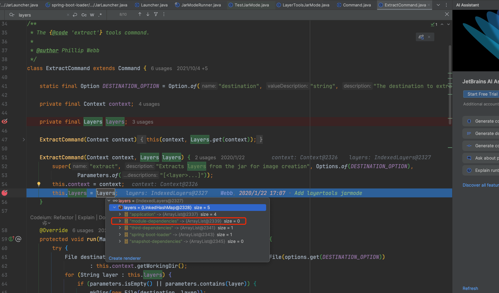
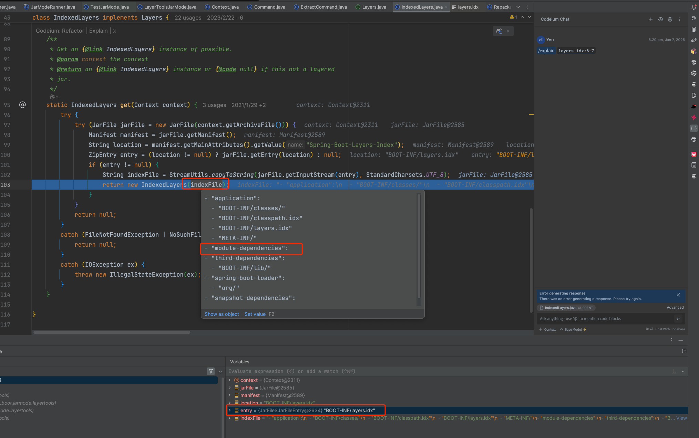

# Spring Boot Layer Tools

> 版本Boot 3.2.8

## 基本使用

> 构建Docker镜像时使用分层工具，可以提高[镜像构建效率](https://docs.spring.io/spring-boot/docs/3.2.12/reference/html/container-images.html#container-images.efficient-images) 

```shell
java -Djarmode=layertools -jar my-app.jar
```

```shell
Usage:
  java -Djarmode=layertools -jar my-app.jar

Available commands:
  list     List layers from the jar that can be extracted
  extract  Extracts layers from the jar for image creation
  help     Help about any command
```

## 注意事项

配置spring-boot-maven-plugin的layers.xml时，采用如下内容：
```xml
<layers xmlns="http://www.springframework.org/schema/boot/layers"
        xmlns:xsi="http://www.w3.org/2001/XMLSchema-instance"
        xsi:schemaLocation="http://www.springframework.org/schema/boot/layers
                          https://www.springframework.org/schema/boot/layers/layers-3.2.xsd">
    <!--application表示class和resource-->
    <application>
        <into layer="spring-boot-loader">
            <include>org/springframework/boot/loader/**</include>
        </into>
        <into layer="application"/>
    </application>

    <!--dependencies所有依赖-->
    <dependencies>
        <into layer="snapshot-dependencies">
            <include>*:*:*SNAPSHOT</include>
        </into>
        <into layer="module-dependencies">
            <includeModuleDependencies/>
        </into>
        <into layer="third-dependencies"/>
    </dependencies>

    <!--定义层顺序，会影响BOOT-INF/layers.idx-->
    <layerOrder>
        <layer>application</layer>
        <!--模块依赖-->
        <layer>module-dependencies</layer>
        <layer>third-dependencies</layer>
        <layer>spring-boot-loader</layer>
        <layer>snapshot-dependencies</layer>
    </layerOrder>
</layers>
```

定制化**`includeModuleDependencies`放入module-dependencies层时出现一个问题：有时候该文件夹下的BOOT-INF/lib不存在**

### 准备

通过`java -Djarmode=layertools -jar demo.jar`开始调试源码：
- 通过Spring Boot Plugin打包

- 启动被调试项目
```shell
java -agentlib:jdwp=transport=dt_socket,server=y,suspend=y,address=8000 -Djarmode=layertools -jar  demo.jar extract
```

- 下载源码，导入IDEA，配置远程调试设置调试端口8000并打断点，启动项目

通过demo.jar内部的MANIFEST文件可以知道启动类是`org.springframework.boot.loader.launch.JarLauncher`


### 源码观察


通过一系列调用，`JarLauncher`会调用`JarModeRunner#main`；同时extract任务是由`ExtractCommand`执行，layers信息是在构造方法中创建，所以需要观察其创建过程中调用的`Layers.get(context)`方法。

```java
ExtractCommand(Context context) {
    // Layers.get(context)获取层
    this(context, Layers.get(context));
}

ExtractCommand(Context context, Layers layers) {
    super("extract", "Extracts layers from the jar for image creation", Options.of(DESTINATION_OPTION),
            Parameters.of("[<layer>...]"));
    this.context = context;
    // 包含层信息
    this.layers = layers;
}
```


```java  
// Layers.java
static Layers get(Context context) {
    // 获取层信息
    IndexedLayers indexedLayers = IndexedLayers.get(context);
    if (indexedLayers == null) {
        throw new IllegalStateException("Failed to load layers.idx which is required by layertools");
    }
    return indexedLayers;
}
```



最终可知extract的内容和jar内部layer.idx的内容有关，而layer.idx中定的module-dependencies层本身不存在BOOT-INF/lib，所以导致module-dependencies层内容为空。具体原因需要看jar打包时如何生成layer.idx
