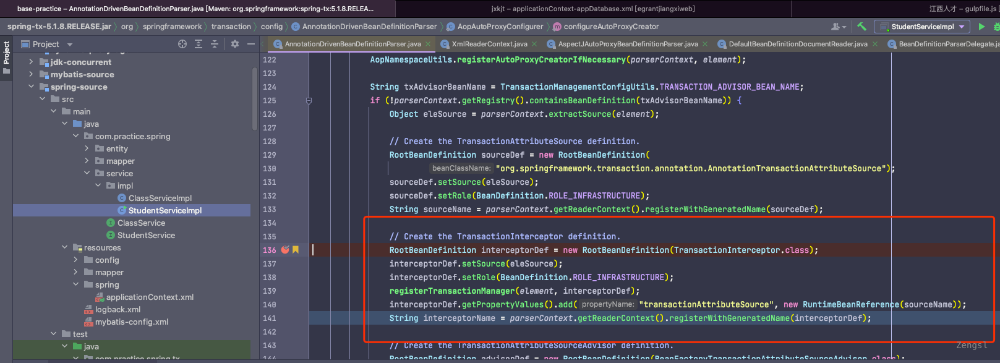

# AOP

> spring-aop:5.2.10.RELEASE

## 概述

Spring的的创建过程分为实例化和初始化。对于初始化而言，Spring提供了可通过`BeanPostProcessor`在初始化前后进行操作的机制。

创建AOP代理的过程是在初始化完成时期完成的，代码如下：

~~~ java
// AbstractAutowireCapableBeanFactory
@Override
public Object applyBeanPostProcessorsAfterInitialization(Object existingBean, String beanName)
		throws BeansException {

	Object result = existingBean;
	for (BeanPostProcessor processor : getBeanPostProcessors()) {
		Object current = processor.postProcessAfterInitialization(result, beanName);
		if (current == null) {
			return result;
		}
		result = current;
	}
	return result;
}

~~~

`AnnotationAwareAspectJAutoProxyCreator`主要用于完成AOP代理创建的过程，由上述代码可知创建方法为`postProcessAfterInitialization`，其中较为关键的是`wrapIfNecessary`

~~~ java
/**
 * Create a proxy with the configured interceptors if the bean is
 * identified as one to proxy by the subclass.
 * @see #getAdvicesAndAdvisorsForBean
 */
@Override
public Object postProcessAfterInitialization(@Nullable Object bean, String beanName) {
	if (bean != null) {
		Object cacheKey = getCacheKey(bean.getClass(), beanName);
		if (this.earlyProxyReferences.remove(cacheKey) != bean) {
			// 包装代理对象方法
			return wrapIfNecessary(bean, beanName, cacheKey);
		}
	}
	return bean;
}

// wrapIfNecessary
protected Object wrapIfNecessary(Object bean, String beanName, Object cacheKey) {
	if (StringUtils.hasLength(beanName) && this.targetSourcedBeans.contains(beanName)) {
		return bean;
	}
	if (Boolean.FALSE.equals(this.advisedBeans.get(cacheKey))) {
		return bean;
	}
	if (isInfrastructureClass(bean.getClass()) || shouldSkip(bean.getClass(), beanName)) {
		this.advisedBeans.put(cacheKey, Boolean.FALSE);
		return bean;
	}

	// Create proxy if we have advice.
	Object[] specificInterceptors = getAdvicesAndAdvisorsForBean(bean.getClass(), beanName, null);
	if (specificInterceptors != DO_NOT_PROXY) {
		this.advisedBeans.put(cacheKey, Boolean.TRUE);
		Object proxy = createProxy(
				bean.getClass(), beanName, specificInterceptors, new SingletonTargetSource(bean));
		this.proxyTypes.put(cacheKey, proxy.getClass());
		return proxy;
	}

	this.advisedBeans.put(cacheKey, Boolean.FALSE);
	return bean;
}
~~~

wrapIfNecessary主要逻辑：

1. [获取拦截器](#获取拦截器)-获取当前bean所配置的通知(advice)对应的拦截器，除了自定义的advice生成的拦截器，还会有Spring设置的拦截器，比如：ExposeInvocationInterceptor。如果没有配置则直接返回当前bean

2. [创建代理对象](#创建代理对象)-通过代理工厂`ProxyFactory`创建代理对象

## 获取拦截器

~~~ java
protected Object[] getAdvicesAndAdvisorsForBean(
		Class<?> beanClass, String beanName, @Nullable TargetSource targetSource) {

	List<Advisor> advisors = findEligibleAdvisors(beanClass, beanName);
	if (advisors.isEmpty()) {
		return DO_NOT_PROXY;
	}
	return advisors.toArray();
}
~~~

## 创建代理对象

先看以下代码：

~~~ java
/**
 * Create an AOP proxy for the given bean.
 * @param beanClass the class of the bean
 * @param beanName the name of the bean
 * @param specificInterceptors the set of interceptors that is
 * specific to this bean (may be empty, but not null)
 * @param targetSource the TargetSource for the proxy,
 * already pre-configured to access the bean
 * @return the AOP proxy for the bean
 * @see #buildAdvisors
 */
protected Object createProxy(Class<?> beanClass, @Nullable String beanName,
		@Nullable Object[] specificInterceptors, TargetSource targetSource) {

	if (this.beanFactory instanceof ConfigurableListableBeanFactory) {
		AutoProxyUtils.exposeTargetClass((ConfigurableListableBeanFactory) this.beanFactory, beanName, beanClass);
	}

	ProxyFactory proxyFactory = new ProxyFactory();
	proxyFactory.copyFrom(this);

	if (!proxyFactory.isProxyTargetClass()) {
		if (shouldProxyTargetClass(beanClass, beanName)) {
			proxyFactory.setProxyTargetClass(true);
		}
		else {
			evaluateProxyInterfaces(beanClass, proxyFactory);
		}
	}

	// 构建Advisor
	Advisor[] advisors = buildAdvisors(beanName, specificInterceptors);
	proxyFactory.addAdvisors(advisors);
	proxyFactory.setTargetSource(targetSource);
	customizeProxyFactory(proxyFactory);

	proxyFactory.setFrozen(this.freezeProxy);
	if (advisorsPreFiltered()) {
		proxyFactory.setPreFiltered(true);
	}

	// 获取代理对象
	return proxyFactory.getProxy(getProxyClassLoader());
}
~~~

对象创建的过程包含以下部分：
	
- 根据拦截器集合构建Advisor集合

- 获取代理对象

### 构建`Advisor`

主要完成拦截器等非`Advisor`对象转换为`Advisor`接口对象的过程，这个过程中也可能会插入一些默认的拦截器

转换过程默认由`DefaultAdvisorAdapterRegistry`的wrap完成

~~~ java
protected Advisor[] buildAdvisors(@Nullable String beanName, @Nullable Object[] specificInterceptors) {
	// Handle prototypes correctly...
	Advisor[] commonInterceptors = resolveInterceptorNames();

	List<Object> allInterceptors = new ArrayList<>();
	if (specificInterceptors != null) {
		allInterceptors.addAll(Arrays.asList(specificInterceptors));
		if (commonInterceptors.length > 0) {
			if (this.applyCommonInterceptorsFirst) {
				allInterceptors.addAll(0, Arrays.asList(commonInterceptors));
			}
			else {
				allInterceptors.addAll(Arrays.asList(commonInterceptors));
			}
		}
	}
	if (logger.isTraceEnabled()) {
		int nrOfCommonInterceptors = commonInterceptors.length;
		int nrOfSpecificInterceptors = (specificInterceptors != null ? specificInterceptors.length : 0);
		logger.trace("Creating implicit proxy for bean '" + beanName + "' with " + nrOfCommonInterceptors +
				" common interceptors and " + nrOfSpecificInterceptors + " specific interceptors");
	}

	Advisor[] advisors = new Advisor[allInterceptors.size()];
	for (int i = 0; i < allInterceptors.size(); i++) {
		// 拦截器对象转换为Advisor对象
		advisors[i] = this.advisorAdapterRegistry.wrap(allInterceptors.get(i));
	}
	return advisors;
}
~~~

### 获取代理对象

通过在`ProxyFactory`中设置当前对象所有的Advisor、原对象等其他配置信息，然后调用`getProxy`方法返回代理对象

~~~ java
public Object getProxy(@Nullable ClassLoader classLoader) {
	return createAopProxy().getProxy(classLoader);
}

protected final synchronized AopProxy createAopProxy() {
	if (!this.active) {
		activate();
	}
	return getAopProxyFactory().createAopProxy(this);
}
	
/**
 * Return the AopProxyFactory that this ProxyConfig uses.
 */
public AopProxyFactory getAopProxyFactory() {
	return this.aopProxyFactory;
}
~~~

`createAopProxy()`会获取代理工厂，并根据之前向`ProxyFactory`设置的配置信息创建Aop代理`AopProxy`

这里的代理工厂一般是`DefaultAopProxyFactory`,createAopProxy会根据判断使用Cglib或者Jdk代理结合之前向`ProxyFactory`配置的信息创建对象。

~~~ java
public AopProxy createAopProxy(AdvisedSupport config) throws AopConfigException {
	if (config.isOptimize() || config.isProxyTargetClass() || hasNoUserSuppliedProxyInterfaces(config)) {
		Class<?> targetClass = config.getTargetClass();
		if (targetClass == null) {
			throw new AopConfigException("TargetSource cannot determine target class: " +
					"Either an interface or a target is required for proxy creation.");
		}
		if (targetClass.isInterface() || Proxy.isProxyClass(targetClass)) {
			return new JdkDynamicAopProxy(config);
		}
		return new ObjenesisCglibAopProxy(config);
	}
	else {
		return new JdkDynamicAopProxy(config);
	}
}
~~~

调用getProxy获取代理对象时会使用增强器`org.springframework.cglib.proxy.Enhancer`将所有的Advisor和一些其他的配置信息设置进代理对象(下方有Cglib对应的完整代码)，`Enhancer`会完成对普通bean的增强功能

~~~ java
//CglibAopProxy

@Override
public Object getProxy(@Nullable ClassLoader classLoader) {
	if (logger.isTraceEnabled()) {
		logger.trace("Creating CGLIB proxy: " + this.advised.getTargetSource());
	}

	try {
		Class<?> rootClass = this.advised.getTargetClass();
		Assert.state(rootClass != null, "Target class must be available for creating a CGLIB proxy");

		Class<?> proxySuperClass = rootClass;
		if (rootClass.getName().contains(ClassUtils.CGLIB_CLASS_SEPARATOR)) {
			proxySuperClass = rootClass.getSuperclass();
			Class<?>[] additionalInterfaces = rootClass.getInterfaces();
			for (Class<?> additionalInterface : additionalInterfaces) {
				this.advised.addInterface(additionalInterface);
			}
		}

		// Validate the class, writing log messages as necessary.
		validateClassIfNecessary(proxySuperClass, classLoader);

		// Configure CGLIB Enhancer...
		Enhancer enhancer = createEnhancer();
		if (classLoader != null) {
			enhancer.setClassLoader(classLoader);
			if (classLoader instanceof SmartClassLoader &&
					((SmartClassLoader) classLoader).isClassReloadable(proxySuperClass)) {
				enhancer.setUseCache(false);
			}
		}
		enhancer.setSuperclass(proxySuperClass);
		enhancer.setInterfaces(AopProxyUtils.completeProxiedInterfaces(this.advised));
		enhancer.setNamingPolicy(SpringNamingPolicy.INSTANCE);
		enhancer.setStrategy(new ClassLoaderAwareGeneratorStrategy(classLoader));

		Callback[] callbacks = getCallbacks(rootClass);
		Class<?>[] types = new Class<?>[callbacks.length];
		for (int x = 0; x < types.length; x++) {
			types[x] = callbacks[x].getClass();
		}
		// fixedInterceptorMap only populated at this point, after getCallbacks call above
		// 设置回调
		enhancer.setCallbackFilter(new ProxyCallbackFilter(
				this.advised.getConfigurationOnlyCopy(), this.fixedInterceptorMap, this.fixedInterceptorOffset));
		enhancer.setCallbackTypes(types);

		// Generate the proxy class and create a proxy instance.
		return createProxyClassAndInstance(enhancer, callbacks);
	}
	catch (CodeGenerationException | IllegalArgumentException ex) {
		throw new AopConfigException("Could not generate CGLIB subclass of " + this.advised.getTargetClass() +
				": Common causes of this problem include using a final class or a non-visible class",
				ex);
	}
	catch (Throwable ex) {
		// TargetSource.getTarget() failed
		throw new AopConfigException("Unexpected AOP exception", ex);
	}
}

~~~

#### 设置代理回调过滤器(ProxyCallbackFilter)

上述代码中
enhancer.setCallbackFilter(new ProxyCallbackFilter(this.advised.getConfigurationOnlyCopy(), this.fixedInterceptorMap, this.fixedInterceptorOffset));

`ProxyCallbackFilter`会在执行Class<?> proxyClass = enhancer.createClass();时被调用accept方法。

#### 构建回调对象集合Callback

`Callback`对象是Spring根据之前获取的Advisor所生成的，此对象会被加入到生成的代理对象中，用于后续代码调用时候的拦截作用。

::: tip

Spring默认使用JDK动态代理来创建代理对象（包括5.x版本）

SpringBoot 2.x 开始，为了解决使用 JDK 动态代理可能导致的类型转化异常而默认使用CGLIB，如果需要默认使用 JDK 动态代理可以通过配置项spring.aop.proxy-target-class=false来进行修改，proxyTargetClass配置已无效。

SpringBoot 2.x是通过`org.springframework.boot.autoconfigure.aop.AopAutoConfiguration`来实现Aop的自动配置
:::

### Advisor是如何初始化的？

先看之前出现过的`AbstractAdvisorAutoProxyCreator`中的获取方法

~~~ java
// AbstractAdvisorAutoProxyCreator

protected Object[] getAdvicesAndAdvisorsForBean(
			Class<?> beanClass, String beanName, @Nullable TargetSource targetSource) {

	List<Advisor> advisors = findEligibleAdvisors(beanClass, beanName);
	if (advisors.isEmpty()) {
		return DO_NOT_PROXY;
	}
	return advisors.toArray();
}

protected List<Advisor> findEligibleAdvisors(Class<?> beanClass, String beanName) {
	List<Advisor> candidateAdvisors = findCandidateAdvisors();
	List<Advisor> eligibleAdvisors = findAdvisorsThatCanApply(candidateAdvisors, beanClass, beanName);
	extendAdvisors(eligibleAdvisors);
	if (!eligibleAdvisors.isEmpty()) {
		eligibleAdvisors = sortAdvisors(eligibleAdvisors);
	}
	return eligibleAdvisors;
}
~~~

查找的过程主要分为两步：

- 查找所有候选的Advisor

- 过滤出对当前bean生效的Advisor

过滤的过程相对来说简单，主要看下所有候选的Advisor是怎么来的，通过下面的代码可用大体得知：

1. 根据父类的规则来获取

2. 从bean工厂`BeanFactoryAspectJAdvisorsBuilder`获取，这里记录了包含`@Aspect`的类和其内部配置的Advisor

~~~ java
@Override
protected List<Advisor> findCandidateAdvisors() {
	// Add all the Spring advisors found according to superclass rules.
	List<Advisor> advisors = super.findCandidateAdvisors();
	// Build Advisors for all AspectJ aspects in the bean factory.
	if (this.aspectJAdvisorsBuilder != null) {
		advisors.addAll(this.aspectJAdvisorsBuilder.buildAspectJAdvisors());
	}
	return advisors;
}
~~~

### 为什么会执行回调？

### 事务拦截器

注册位置

