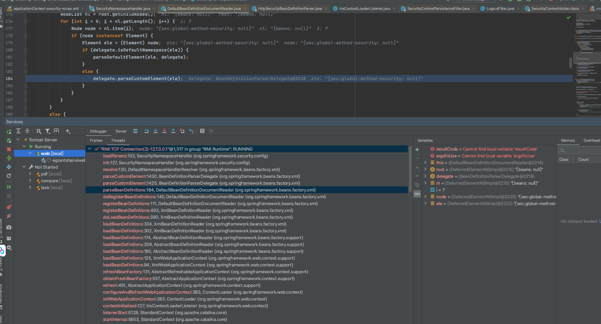
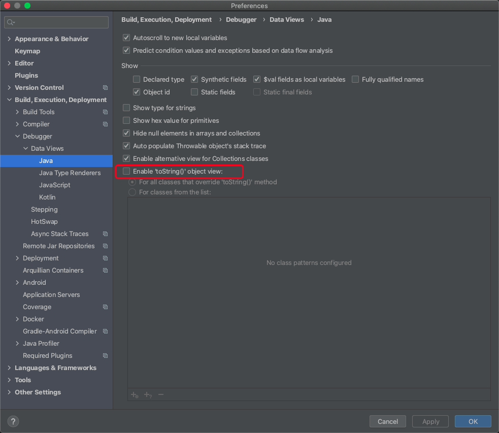
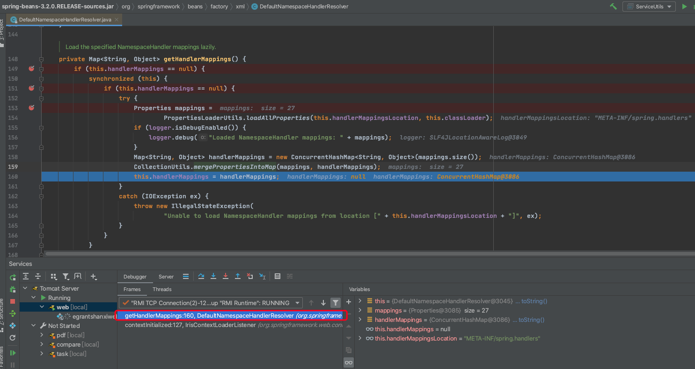
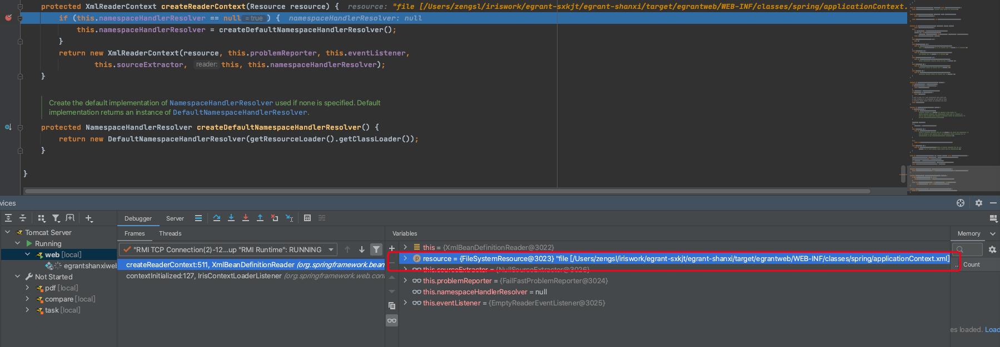
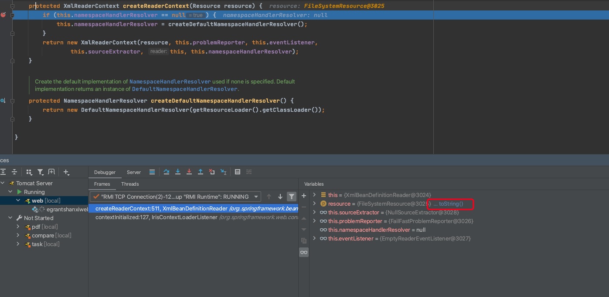

# 容器初始化过程

::: tip
以Spring3.2源码进行阅读，主要是xml的配置方式

:::

## 概要

项目集成spring一般会在web.xml中配置`ContextLoaderListener`和`contextConfigLocation`

`ContextLoaderListener`是用来完成Spring上下文初始化的关键

`contextConfigLocation`参数是用来指定spring配置文件的路径

因为是扫描xml的配置方式，那么使用的应用上下文为`XmlWebApplicationContext`

~~~xml
<!--Spring启动的监听器-->
  <listener>
    <listener-class>org.springframework.web.context.ContextLoaderListener</listener-class>
  </listener>
<context-param>
    <param-name>contextConfigLocation</param-name>
    <param-value>classpath:spring/applicationContext*.xml</param-value>
  </context-param>
~~~

`ContextLoaderListener`的contextInitialized是用来初始化上下文的入口

~~~ java
/**
 * Initialize the root web application context.
 */
public void contextInitialized(ServletContextEvent event) {
	this.contextLoader = createContextLoader();
	if (this.contextLoader == null) {
		this.contextLoader = this;
	}
	this.contextLoader.initWebApplicationContext(event.getServletContext());
}
~~~


`ContextLoader`的configureAndRefreshWebApplicationContext方法完成上下文初始化工作，其中调用的`wac.refresh()`是整个初始化的核心

~~~ java
protected void configureAndRefreshWebApplicationContext(ConfigurableWebApplicationContext wac, ServletContext sc) {
	if (ObjectUtils.identityToString(wac).equals(wac.getId())) {
		// The application context id is still set to its original default value
		// -> assign a more useful id based on available information
		String idParam = sc.getInitParameter(CONTEXT_ID_PARAM);
		if (idParam != null) {
			wac.setId(idParam);
		}
		else {
			// Generate default id...
			if (sc.getMajorVersion() == 2 && sc.getMinorVersion() < 5) {
				// Servlet <= 2.4: resort to name specified in web.xml, if any.
				wac.setId(ConfigurableWebApplicationContext.APPLICATION_CONTEXT_ID_PREFIX +
						ObjectUtils.getDisplayString(sc.getServletContextName()));
			}
			else {
				wac.setId(ConfigurableWebApplicationContext.APPLICATION_CONTEXT_ID_PREFIX +
						ObjectUtils.getDisplayString(sc.getContextPath()));
			}
		}
	}

	// Determine parent for root web application context, if any.
	ApplicationContext parent = loadParentContext(sc);

	wac.setParent(parent);
	wac.setServletContext(sc);
	String initParameter = sc.getInitParameter(CONFIG_LOCATION_PARAM);
	if (initParameter != null) {
		wac.setConfigLocation(initParameter);
	}
	customizeContext(sc, wac);
	// refresh是整个初始化的核心
	wac.refresh();
}
~~~

refresh方法由`AbstractApplicationContext`提供，里面包含了“刷新内部bean工厂”、“注册Bean的前置处理器”、“初始化事件多播器”、“初始化bean”、“注册监听器”、“完成bean工厂初始化”和“发布事件”等工作。

下文将会整个过程逐步分析

~~~ java
public void refresh() throws BeansException, IllegalStateException {
	synchronized (this.startupShutdownMonitor) {
		// Prepare this context for refreshing.
		prepareRefresh();

		// Tell the subclass to refresh the internal bean factory.
		ConfigurableListableBeanFactory beanFactory = obtainFreshBeanFactory();

		// Prepare the bean factory for use in this context.
		prepareBeanFactory(beanFactory);

		try {
			// Allows post-processing of the bean factory in context subclasses.
			postProcessBeanFactory(beanFactory);

			// Invoke factory processors registered as beans in the context.
			invokeBeanFactoryPostProcessors(beanFactory);

			// Register bean processors that intercept bean creation.
			registerBeanPostProcessors(beanFactory);

			// Initialize message source for this context.
			initMessageSource();

			// Initialize event multicaster for this context.
			initApplicationEventMulticaster();

			// Initialize other special beans in specific context subclasses.
			onRefresh();

			// Check for listener beans and register them.
			registerListeners();

			// Instantiate all remaining (non-lazy-init) singletons.
			finishBeanFactoryInitialization(beanFactory);

			// Last step: publish corresponding event.
			finishRefresh();
		}

		catch (BeansException ex) {
			// Destroy already created singletons to avoid dangling resources.
			destroyBeans();

			// Reset 'active' flag.
			cancelRefresh(ex);

			// Propagate exception to caller.
			throw ex;
		}
	}
}
~~~


## 刷新准备工作

由`prepareRefresh()`完成


## 刷新获取bean工厂

由`ConfigurableListableBeanFactory beanFactory = obtainFreshBeanFactory();`完成

此过程将完成**BeanDefinitions的加载**，加载过程整体预览




### loadBeanDefinitions

`refreshBeanFactory()`调用`loadBeanDefinitions(beanDefinitionReader)`

1. 此方法遍历contextConfigLocation所配置的application*.xml路径，使用`XmlBeanDefinitionReader`的`loadBeanDefinitions`加载所对应路径的文件

将配置文件转化为Resource对象，如果配置文件采用的是通配符*的表达方式则会返回Resource数组

2. 对每一个Resource对象对象进行加载，整个加载过程都是由`XmlBeanDefinitionReader`完成

3. 由doLoadBeanDefinitions调用registerBeanDefinitions完成bean注册过程。此过程会创建`ReaderContext`，其包含了配置文件中的命名空间解析器`namespaceHandlerResolver`和`XmlBeanDefinitionReader`等其他信息

~~~ java
public int registerBeanDefinitions(Document doc, Resource resource) throws BeanDefinitionStoreException {
	BeanDefinitionDocumentReader documentReader = createBeanDefinitionDocumentReader();
	documentReader.setEnvironment(this.getEnvironment());
	int countBefore = getRegistry().getBeanDefinitionCount();
	// createReaderContext获取配置文件对应的命名空间解析器
	documentReader.registerBeanDefinitions(doc, createReaderContext(resource));
	return getRegistry().getBeanDefinitionCount() - countBefore;
}
~~~

4. 由`doRegisterBeanDefinitions`完成进一步等解析调用和准备工作，此过程会创建一个delegate委托器`BeanDefinitionParserDelegate`

~~~java
protected void doRegisterBeanDefinitions(Element root) {
	String profileSpec = root.getAttribute(PROFILE_ATTRIBUTE);
	if (StringUtils.hasText(profileSpec)) {
		Assert.state(this.environment != null, "environment property must not be null");
		String[] specifiedProfiles = StringUtils.tokenizeToStringArray(profileSpec, BeanDefinitionParserDelegate.MULTI_VALUE_ATTRIBUTE_DELIMITERS);
		if (!this.environment.acceptsProfiles(specifiedProfiles)) {
			return;
		}
	}

	// any nested <beans> elements will cause recursion in this method. In
	// order to propagate and preserve <beans> default-* attributes correctly,
	// keep track of the current (parent) delegate, which may be null. Create
	// the new (child) delegate with a reference to the parent for fallback purposes,
	// then ultimately reset this.delegate back to its original (parent) reference.
	// this behavior emulates a stack of delegates without actually necessitating one.
	BeanDefinitionParserDelegate parent = this.delegate;
	
	// 创建BeanDefinitionParserDelegate
	this.delegate = createHelper(readerContext, root, parent);

	preProcessXml(root);
	// bean定义解析调用
	parseBeanDefinitions(root, this.delegate);
	postProcessXml(root);

	this.delegate = parent;
}

~~~

5. 遍历xml配置文件中的节点，使用delegate委托器`BeanDefinitionParserDelegate`进行解析

通过delegate委托器的`isDefaultNamespace`方法判断根节点或者子节点是否是默认命名空间。如果不是默认节点，那么调用delegate的`parseCustomElement`方法。否则调用DefaultBeanDefinitionDocumentReader中的`parseDefaultElement`

默认命名空间为`BEANS_NAMESPACE_URI = "http://www.springframework.org/schema/beans"`

`parseCustomElement`解析非默认的XML元素

~~~ java
public BeanDefinition parseCustomElement(Element ele, BeanDefinition containingBd) {
	String namespaceUri = getNamespaceURI(ele);
	// 获取命名空间对应的处理类，NamespaceHandlerResolver中维护了一个命名空间和对应处理类的映射关系的map
	NamespaceHandler handler = this.readerContext.getNamespaceHandlerResolver().resolve(namespaceUri);
	if (handler == null) {
		error("Unable to locate Spring NamespaceHandler for XML schema namespace [" + namespaceUri + "]", ele);
		return null;
	}
	return handler.parse(ele, new ParserContext(this.readerContext, this, containingBd));
}
~~~
- 从元素中获取命名空间地址，如`http://www.springframework.org/schema/security`

- 获取readerContext

	通过readerContext中`DefaultNamespaceHandlerResolver`所维护的命名空间与NamespaceHandler类的映射关系维护对象`handlerMappings`,获取该命名空间地址对应的NamespaceHandler类，创建实例并进行init初始化然后返回。
	
	`http://www.springframework.org/schema/security`对应的处理类是`class org.springframework.security.config.SecurityNamespaceHandler`

	以SecurityNamespaceHandler为例子,init()调用loadParsers()初始化该命名空间下面的所有元素和对应的BeanDefinitionParser的映射关系，存放至一个map中
	
	~~~ java
	private void loadParsers() {
		// Parsers
		parsers.put(Elements.LDAP_PROVIDER, new LdapProviderBeanDefinitionParser());
		parsers.put(Elements.LDAP_SERVER, new LdapServerBeanDefinitionParser());
		parsers.put(Elements.LDAP_USER_SERVICE, new LdapUserServiceBeanDefinitionParser());
		parsers.put(Elements.USER_SERVICE, new UserServiceBeanDefinitionParser());
		parsers.put(Elements.JDBC_USER_SERVICE, new JdbcUserServiceBeanDefinitionParser());
		parsers.put(Elements.AUTHENTICATION_PROVIDER, new AuthenticationProviderBeanDefinitionParser());
		parsers.put(Elements.GLOBAL_METHOD_SECURITY, new GlobalMethodSecurityBeanDefinitionParser());
		parsers.put(Elements.AUTHENTICATION_MANAGER, new AuthenticationManagerBeanDefinitionParser());
		parsers.put(Elements.METHOD_SECURITY_METADATA_SOURCE, new MethodSecurityMetadataSourceBeanDefinitionParser());

		// Only load the web-namespace parsers if the web classes are available
		try {
			ClassUtils.forName("org.springframework.security.web.FilterChainProxy", getClass().getClassLoader());
			parsers.put(Elements.DEBUG, new DebugBeanDefinitionParser());
			parsers.put(Elements.HTTP, new HttpSecurityBeanDefinitionParser());
			parsers.put(Elements.HTTP_FIREWALL, new HttpFirewallBeanDefinitionParser());
			parsers.put(Elements.FILTER_INVOCATION_DEFINITION_SOURCE, new FilterInvocationSecurityMetadataSourceParser());
			parsers.put(Elements.FILTER_SECURITY_METADATA_SOURCE, new FilterInvocationSecurityMetadataSourceParser());
			parsers.put(Elements.FILTER_CHAIN, new FilterChainBeanDefinitionParser());
			filterChainMapBDD = new FilterChainMapBeanDefinitionDecorator();
		} catch(Throwable t) {
			logger.error("Failed to load required web classes", t);
		}
	}
	
	~~~
	
- 调用NamespaceHandler的parse方法进行解析

	根据xml元素调用其对应的BeanDefinitionParser的parse方法进行解析，比如`<sec:http`中http对应的解析器为`HttpSecurityBeanDefinitionParser`
	
	每一个元素的解析器所做工作都不同，这里不做更深入的分析。

### 命名空间处理器映射

handlerMappings与`DefaultNamespaceHandlerResolver`是绑定在一起的，handlerMappings的初始化也就在其创建过程中

~~~ java
protected XmlReaderContext createReaderContext(Resource resource) {
	if (this.namespaceHandlerResolver == null) {
		// 创建默认命名空间处理器
		this.namespaceHandlerResolver = createDefaultNamespaceHandlerResolver();
	}
	return new XmlReaderContext(resource, this.problemReporter, this.eventListener,
			this.sourceExtractor, this, this.namespaceHandlerResolver);
}
~~~

创建`DefaultNamespaceHandlerResolver`调用的构造器包含classLoader和handlerMappingsLocation两个参数

classLoader是WebappClassLoader

handlerMappingsLocation使用的是默认值是"META-INF/spring.handlers"


~~~ java
public static final String DEFAULT_HANDLER_MAPPINGS_LOCATION = "META-INF/spring.handlers";

public DefaultNamespaceHandlerResolver(ClassLoader classLoader) {
	this(classLoader, DEFAULT_HANDLER_MAPPINGS_LOCATION);
}
	
public DefaultNamespaceHandlerResolver(ClassLoader classLoader, String handlerMappingsLocation) {
	Assert.notNull(handlerMappingsLocation, "Handler mappings location must not be null");
	this.classLoader = (classLoader != null ? classLoader : ClassUtils.getDefaultClassLoader());
	this.handlerMappingsLocation = handlerMappingsLocation;
}
~~~

在调用resolve方法的时候会调用`getHandlerMappings()`获取处理器映射，在所有jar包中收集META-INF/spring.handlers内容

~~~ java
private Map<String, Object> getHandlerMappings() {
	if (this.handlerMappings == null) {
		synchronized (this) {
			if (this.handlerMappings == null) {
				try {
					Properties mappings =
							PropertiesLoaderUtils.loadAllProperties(this.handlerMappingsLocation, this.classLoader);
					if (logger.isDebugEnabled()) {
						logger.debug("Loaded NamespaceHandler mappings: " + mappings);
					}
					Map<String, Object> handlerMappings = new ConcurrentHashMap<String, Object>(mappings.size());
					CollectionUtils.mergePropertiesIntoMap(mappings, handlerMappings);
					this.handlerMappings = handlerMappings;
				}
				catch (IOException ex) {
					throw new IllegalStateException(
							"Unable to load NamespaceHandler mappings from location [" + this.handlerMappingsLocation + "]", ex);
				}
			}
		}
	}
	return this.handlerMappings;
}
~~~

如在spring-beans-3.2.0.RELEASE.jar包中找到spring.handlers

~~~ properties
# spring-beans-3.2.0.RELEASE.jar中spring.handlers内容如下
http\://www.springframework.org/schema/c=org.springframework.beans.factory.xml.SimpleConstructorNamespaceHandler
http\://www.springframework.org/schema/p=org.springframework.beans.factory.xml.SimplePropertyNamespaceHandler
http\://www.springframework.org/schema/util=org.springframework.beans.factory.xml.UtilNamespaceHandler
~~~


### 注意

最初通过IDEA等工具进行调试等时候并没有发现进入`getHandlerMappings()`中的断点

通过观察代码发现`getHandlerMappings()`除了在上文提到的`resolve`方法中调用，还在toString方法中调用了。

修改IDEA中Java的Debugger的设置，去除勾选`Enable toString（）object view`



修改之后重新启动项目，能够成功进入断点




`Enable toString（）object view`配置在调试时候的区别就是查看变量是否直接调用toString显示内容，还是手动调用

勾选




取消勾选




## finishBeanFactoryInitialization

调用BeanPostProcess#postProcessBeforeInitialization -> 创建Bean-> @PostConstruct标记的方法 ->BeanPostProcess#postProcessAfterInitialization

### Bean获取/创建

> Spring 5.3.28

doGetBean-> createBean-> doCreateBean -> createBeanInstance -> instantiateBean -> getInstantiationStrategy().instantiate

根据getInstantiationStrategy判断是通过Cglib还是JDK代理来创建Bean实例，一般使用的策略是`SimpleInstantiationStrategy`。

如果是没有特殊设置：实现接口的类就通过JDK默认代理，否则使用Cglib

::: warning
代理对象创建之后还没有结束，后续会根据是否有AOP的需求来判断是否需要通过cglib增强。例如：@Transactional注解会使得bean通过AOP让cglib增强Bean
:::

```java {4}
@Override
	public Object instantiate(RootBeanDefinition bd, @Nullable String beanName, BeanFactory owner) {
		// Don't override the class with CGLIB if no overrides.
		if (!bd.hasMethodOverrides()) {
			Constructor<?> constructorToUse;
			synchronized (bd.constructorArgumentLock) {
				constructorToUse = (Constructor<?>) bd.resolvedConstructorOrFactoryMethod;
				if (constructorToUse == null) {
					final Class<?> clazz = bd.getBeanClass();
					if (clazz.isInterface()) {
						throw new BeanInstantiationException(clazz, "Specified class is an interface");
					}
					try {
						if (System.getSecurityManager() != null) {
							constructorToUse = AccessController.doPrivileged(
									(PrivilegedExceptionAction<Constructor<?>>) clazz::getDeclaredConstructor);
						}
						else {
							constructorToUse = clazz.getDeclaredConstructor();
						}
						bd.resolvedConstructorOrFactoryMethod = constructorToUse;
					}
					catch (Throwable ex) {
						throw new BeanInstantiationException(clazz, "No default constructor found", ex);
					}
				}
			}
			return BeanUtils.instantiateClass(constructorToUse);
		}
		else {
			// Must generate CGLIB subclass.
			return instantiateWithMethodInjection(bd, beanName, owner);
		}
	}
```


`@Async`所标记的类是在`AsyncAnnotationBeanPostProcessor#postProcessAfterInitialization`中给Bean增加切面，切面会在AsyncAnnotationAdvisor中做好，可以参考`@EnableAsync`。