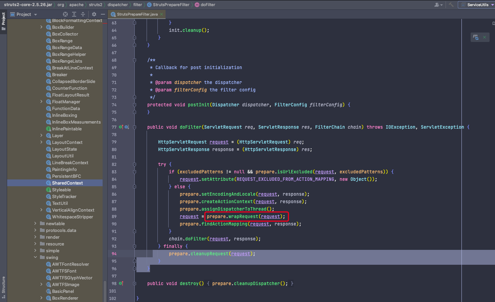
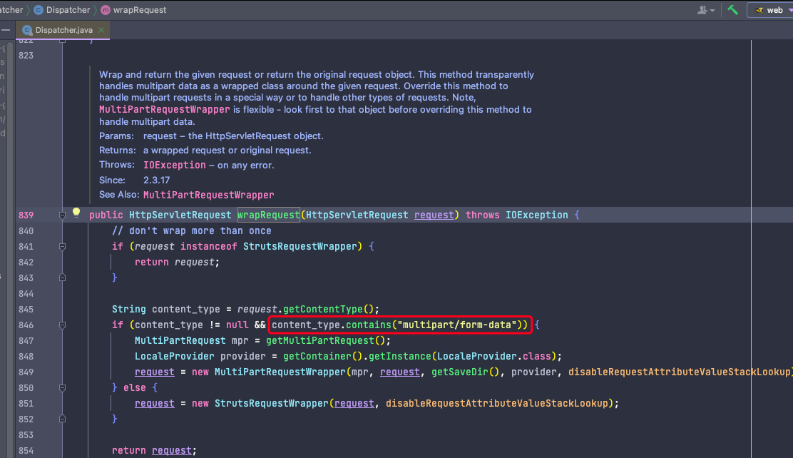

---
order: 3
----
# Struts2文件上传失败

解决测试环境无法上传文件的问题，主要由金蝶服务器和struts2升级至2.5导致

## 问题描述

Action中无法获取到文件等其他参数

## 问题分析

request对象未被Struts2包装成`MultiPartRequestWrapper`

包装的过程是在struts准备过滤器完成`StrutsPrepareFilter`

从上述入口进入找到以下代码

~~~ java
//Dispatcher
public HttpServletRequest wrapRequest(HttpServletRequest request) throws IOException {
  // don't wrap more than once
  if (request instanceof StrutsRequestWrapper) {
    return request;
  }
	// 是否进行包装的判断条件判断
  // 是否开启Multipart，默认是开启的。如果没有在struts.xml通过常量struts.multipart.enabled进行关闭的话
  // 判断当前请求是否是一个Multipart请求，主要判断当前请求是否是POST请求，是否满足正则的规则
  if (isMultipartSupportEnabled(request) && isMultipartRequest(request)) {
    MultiPartRequest multiPartRequest = getMultiPartRequest();
    LocaleProviderFactory localeProviderFactory = getContainer().getInstance(LocaleProviderFactory.class);
		// 完成包装
    request = new MultiPartRequestWrapper(
      multiPartRequest,
      request,
      getSaveDir(),
      localeProviderFactory.createLocaleProvider(),
      disableRequestAttributeValueStackLookup
    );
  } else {
    request = new StrutsRequestWrapper(request, disableRequestAttributeValueStackLookup);
  }

  return request;
}

public static final String MULTIPART_FORM_DATA_REGEX = "^，主要由multipart/form-data(?:\\s*;\\s*boundary=[0-9a-zA-Z'()+_,\\-./:=?]{1,70})?(?:\\s*;\\s*charset=[a-zA-Z\\-0-9]{3,14})?";

protected boolean isMultipartRequest(HttpServletRequest request) {
  String httpMethod = request.getMethod();
  String contentType = request.getContentType();
	// 主要判断当前请求是否是POST请求，是否满足正则的规则
  // 正则的默认值是常量MULTIPART_FORM_DATA_REGEX，主要由multipart/form-data 、 分隔符boundary、字符集设置，三部分组成，顺序不能错
  return REQUEST_POST_METHOD.equalsIgnoreCase(httpMethod) &&
    contentType != null &&
    multipartValidationPattern.matcher(contentType.toLowerCase(Locale.ENGLISH)).matches();
}

~~~

通过远程调试发现测试环境中content Type为`multipart/form-data;charset=UTF-8; boundary=----WebKitFormBoundaryeDGdJAybHiBkHqXA`

字符集顺序不满足要求！

通过远程调试发现请求经过第一个过滤器（org.springframework.web.filter.CharacterEncodingFilter）设置UTF-8编码之后，contentType中的内容会被修改（开发环境在tomcat8.5中是不会被修改）如：`multipart/form-data;boundary=----WebKitFormBoundaryeDGdJAybHiBkHqXA`变为`multipart/form-data;charset=UTF-8; boundary=----WebKitFormBoundaryeDGdJAybHiBkHqXA` 由于测试机使用的是金蝶服务器，request对象是由金蝶实现的，无法往下进行看了。

## 问题解决

修改正则表达式的匹配规则，做一下兼容即可

修改struts.xml，增加常量配置

~~~ xml
<constant name= "struts.multipart.validationRegex" value="^multipart/form-data(?:\s*;\s*charset=[a-zA-Z\-0-9]{3,14})?(?:\s*;\s*boundary=[0-9a-zA-Z'()+_,\-./:=?]{1,70})?(?:\s*;\s*charset=[a-zA-Z\-0-9]{3,14})?"/>
~~~

使用2.3版本的系统不会有问题，因为其判断逻辑比较简单。

> 很多框架在升级之后，一些约束规则都会变得更加严格。