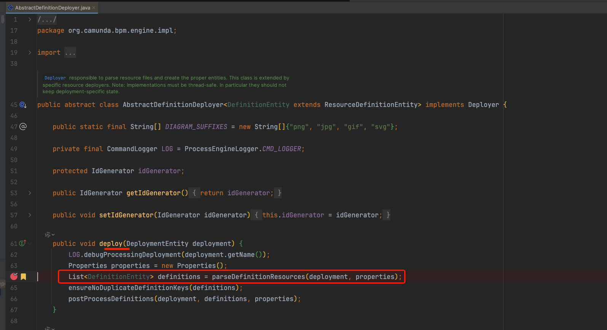
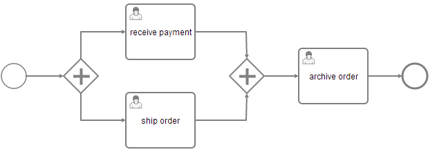

# Camunda

> 针对Camunda7.23版本的记录，Camunda8主要针对云服务方向。下述涉及到的JAVA API操作，通常有对应的Rest API

## 参考资料

- [get-started](https://docs.camunda.org/get-started/)
- [Camunda 7](https://docs.camunda.org/manual/7.23/)

## 核心概念

### 流程定义

流程定义是流程结构的定义，定义了流程的节点、连线、变量、任务、监听器、属性等信息，适配BPMN2.0标准

#### 流程定义查询

```java
List<ProcessDefinition> processDefinitions = repositoryService.createProcessDefinitionQuery()
    .processDefinitionKey("invoice")
    .orderByProcessDefinitionVersion()
    .asc()
    .list();
```

#### 流程定义文件查询

```java
// 方法一
BpmnModelInstance bpmnModelInstance = repositoryService.getBpmnModelInstance(processInstance.getProcessDefinitionId());
String processDefinitionXml = Bpmn.convertToString(bpmnModelInstance);

// 方法二
select t.BYTES_
      from act_ge_bytearray t where  t.DEPLOYMENT_ID_ = ?  and t.NAME_ = ?;
```

#### Keys and Versions

key  是流程定义的唯一标识符，version是流程定义的版本号，key和version组合唯一标识一个流程定义. key对应下列定义文件中的id属性。

```xml
<process id="invoice" name="invoice receipt" isExecutable="true">
  ...
</process>
```

同一个流程多次部署时(key相同)，流程引擎会为其定义不同的version


#### 挂起流程定义

RuntimeService Java API可以禁用一个流程定义，禁用的流程定义将无法实例化，但是已经启动的流程实例不受影响。

#### 相关代码

执行解析BPMN XML模型，获取流程定义



由`BpmnParse`解析


act_re_procdef表中的CATEGORY_字段来源于targetNamespace

### Process Instances 流程实例

流程实例流程定义的一个独立执行。流程实例与流程定义之间的关系就像面向对象编程中的对象和类一样。

> 原文：A process instance is an individual execution of a process definition. The relation of the process instance to the process definition is the same as the relation between Object and Class in Object Oriented Programming (the process instance playing the role of the object and the process definition playing the role of the class in this analogy).

#### 开启流程实例

```java
ProcessInstance instance = runtimeService.startProcessInstanceByKey("invoice");
```

带参数开启流程实例

```java
Map<String, Object> variables = new HashMap<String,Object>();
variables.put("creditor", "Nice Pizza Inc.");
ProcessInstance instance = runtimeService.startProcessInstanceByKey("invoice", variables);
```
进程变量可供进程实例中的所有任务(Task)使用，并在进程实例进入等待状态时自动持久化到数据库。


**Start Process Instances via Tasklist 通过web界面开启流程实例**

略过，一般很少直接使用web界面开启流程实例。


#### Start a Process Instance at Any Set of Activities  

在任意活动集开启流程实例

```java
ProcessInstance instance = runtimeService.createProcessInstanceByKey("invoice")
  .startBeforeActivity("SendInvoiceReceiptTask")
  .setVariable("creditor", "Nice Pizza Inc.")
  .startBeforeActivity("DeliverPizzaSubProcess")
  .setVariableLocal("destination", "12 High Street")
  .execute();
```

通过`startProcessInstanceByKey` and `startProcessInstanceById`方法在默认的初始化活动开启流程实例,通常都是在流程定义的简单空白的开始事件。

通过流式API可以在流程实例的任意位置开启流程实例

```java
ProcessInstance instance = runtimeService.createProcessInstanceByKey("invoice")
  .startBeforeActivity("SendInvoiceReceiptTask")
  .setVariable("creditor", "Nice Pizza Inc.")
  .startBeforeActivity("DeliverPizzaSubProcess")
  .setVariableLocal("destination", "12 High Street")
  .execute();
```

流式构建器允许提交任意数量的所谓的实例化指令。在调用 execute 时，流程引擎会按照指定的顺序执行这些指令。在上面的示例中，引擎首先启动 SendInvoiceReceiptTask 任务并执行流程，直到达到等待状态，然后启动 DeliverPizzaTask 任务并执行同样的操作。执行完这两条指令后， execute 调用返回。

**Variables in Return 返回变量**


```java
ProcessInstanceWithVariables instance = runtimeService.createProcessInstanceByKey("invoice")
  .startBeforeActivity("SendInvoiceReceiptTask")
  .setVariable("creditor", "Nice Pizza Inc.")
  .startBeforeActivity("DeliverPizzaSubProcess")
  .setVariableLocal("destination", "12 High Street")
  .executeWithVariablesInReturn();
```

#### 查询流程实例

``` java
runtimeService.createProcessInstanceQuery()
    .processDefinitionKey("invoice")
    .variableValueEquals("creditor", "Nice Pizza Inc.")
    .list();
```


####  流程实例交互

在对特定流程实例（或流程实例列表）执行查询后，您可能想与之交互。与流程实例进行交互有多种可能性，其中最主要的有：

- Triggering it (make it continue execution):
  Through a Message Event
T hrough a Signal Event

- 触发事件(程序继续执行) `Message Event`或者 `Signal Event`
- 取消实例： 通过`RuntimeService.deleteProcessInstance`方法
- 开启/取消任意活动： [Process Instance Modification](https://docs.camunda.org/manual/7.23/user-guide/process-engine/process-instance-modification/)

#### 挂起流程实例

通常当流程实例无法继续执行时，可以将其挂起。

例如：如果流程变量与预期不符，就可以暂停实例并安全地更改变量。

挂起的流程实例，其状态是不允许修改的。


### Executions 执行

如果您的流程实例包含多个执行路径（例如在并行网关之后），您必须能够区分流程实例内当前激活的路径。在下面的示例中，接收付款和发送订单这两个用户任务可以同时处于活动状态。



**在内部，流程引擎会在流程实例内创建两个并发执行，每个并发执行路径一个**。例如，当进程引擎到达嵌入式子进程或多实例时，也会为作用域创建执行。

```java
runtimeService.createExecutionQuery()
    .processInstanceId(someId)
    .list();
```

### Activity Instances 活动实例

活动实例概念与执行概念类似，但角度不同。执行可以被想象成在流程中移动的标记，而活动实例则代表活动（任务、子流程......）的单个实例。因此，活动实例的概念更注重状态。

活动实例也按照BPMN 2.0提供的范围结构形成一棵树。那些“在同一子流程层级上”的活动（即属于同一范围，包含在同一子流程内）它们的活动实例会在树中处于相同的层级。这里的“span a tree”可以理解为形成一棵树，而“on the same level of subprocess”指的是这些活动在同一个子流程中处于相同的位置或级别。

例如：活动实例用于[流程实例修改](https://docs.camunda.org/manual/7.23/user-guide/process-engine/process-instance-modification/)和[activity-instance-tree](https://docs.camunda.org/manual/7.23/webapps/cockpit/bpmn/process-instance-view/#activity-instance-tree)


活动实例查询
```java
ActivityInstance rootActivityInstance = runtimeService.getActivityInstance(processInstance.getProcessInstanceId());

```

每个活动实例都有一个唯一的 ID。ID 是持久的，如果多次调用此方法，相同的活动实例将返回相同的活动实例 ID。(但是，可能会分配不同的执行，请参见下文）

#### 与执行(Executions)的关系

流程引擎中的 "执行"（Execution）概念与 "活动实例"（activity instance）概念并不完全一致，因为执行树通常与 BPMN 中的活动/范围概念不一致。一般来说，执行和活动实例（ActivityInstances）之间有 n-1 的关系，也就是说，在给定的时间点上，一个活动实例可以链接到多个执行。此外，并不能保证启动某个活动实例的同一个执行也会结束该活动实例。流程引擎会对执行树的压缩进行一些内部优化，这可能会导致执行被重新排序和修剪。这可能会导致某个执行启动了某个活动实例，但另一个执行却结束了该活动实例的情况。另一种特殊情况是流程实例：如果流程实例正在执行流程定义范围以下的非范围活动（例如用户任务），那么它将同时被根活动实例和用户任务活动实例引用。


### Jobs and Job Definitions 定时任务

``` java
// job查询
managementService.createJobQuery()
  .duedateHigherThan(someDate)
  .list()

// job定义查询
managementService.createJobDefinitionQuery()
  .processDefinitionKey("orderProcess")
  .list()


// job挂起
List<JobDefinition> jobDefinitions = managementService.createJobDefinitionQuery()
        .processDefinitionKey("orderProcess")
        .activityIdIn("processPayment")
        .list();

for (JobDefinition jobDefinition : jobDefinitions) {
  managementService.suspendJobDefinitionById(jobDefinition.getId(), true);
}  
```