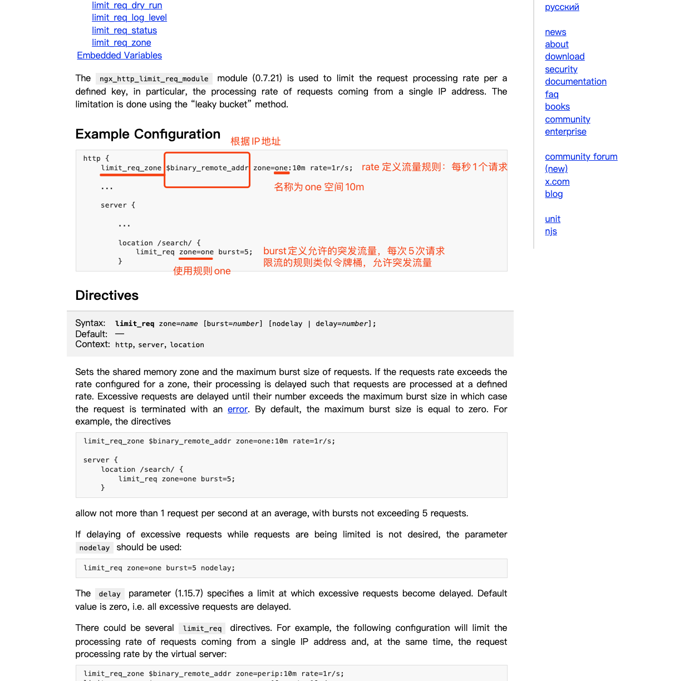

# 限流

## NGINX限流

### limit_req模块

https://nginx.org/en/docs/http/ngx_http_limit_req_module.html



### limit_conn模块
https://nginx.org/en/docs/http/ngx_http_limit_conn_module.html

### limit_rate指令

ngx_http_core_module模块中的两个指令：limit_rate_after、limit_rate

```
# 20M以内不限速，超过20M限制下载速度为 2k/s
location / {
  limit_rate_after 20m;
  limit_rate 2k;
  root html;
}
```