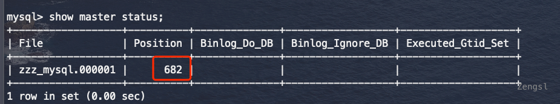

# 安装与配置

> MySQL8.0.28
>
> Mycat1.6.7.5
>
> CentOS 7

[Yum安装方式参考文档](https://dev.mysql.com/doc/refman/8.0/en/linux-installation-yum-repo.html)


| 机器（虚拟机）                |                            |
| ----------------------------- | -------------------------- |
| K8s-master01(192.168.143.129) | 安装Mycat 安装MySQL （从） |
| K8s-node01(192.168.143.130)   | 安装MySQL （主）           |
| K8s-node02(192.168.143.131)   | 安装MySQL                  |


### 安装步骤

1. 安装Yum仓库

[Yum源下载地址](https://dev.mysql.com/get/mysql80-community-release-el7-5.noarch.rpm)

``` shell
# 安装yum仓库
# sudo yum install mysql80-community-release-el7-{version-number}.noarch.rpm 版本号替换为自己下载的版本
sudo yum install mysql80-community-release-el7-5
```

2. 安装Mysql

```shell
sudo yum install mysql-community-server
```

3. 启动服务

```shell
systemctl start mysqld
# 查看状态
systemctl status mysqld
```

4. 初始化工作

```shell
# 获取临时密码
sudo grep 'temporary password' /var/log/mysqld.log
# 登陆root账户，修改密码
mysql -uroot -p
ALTER USER 'root'@'localhost' IDENTIFIED BY 'Aa12345.';
#如果远程工具无法连接Mysql 需要执行 update user set host = '%' where user = 'root';
# 刷新权限
flush privileges;
# quit 退出ß

# 创建新用户
create user 'zzz'@'%' identified with mysql_native_password by 'Aa12345.';
grant all on *.* to 'zzz'@'%';
flush privileges;
```


## Mycat安装

[Mycat-server-1.6.7.5-release](https://github.com/MyCATApache/Mycat-Server/releases/download/Mycat-server-1675-release/Mycat-server-1.6.7.5-release-20200422133810-linux.tar.gz)

```shell
 tar -zxvf /opt/software/Mycat-server-1.6.7.5-release-20200422133810-linux.tar.gz -C /usr/local
 
 cd /usr/local/mycat
 # 配置server.xml 主要配置用户和能访问的schema
 # 修改schemas为user对应user这张表
 
 # 配置schema.xml
 # 1.配置dataHost
 # 2.配置dataNode
 # 3.配置schema
 # 配置table
 
 mkdir logs
 # 启动mycat
 /usr/local/mycat/bin/mycat console
 
 # mysqladmin flush-hosts -uroot -p
 
 # 由于Mycat1.6.7不兼容MySQL8.x，需要将mycat/lib下的MySQL的驱动替换
 下载对应版本的MySQL驱动包https://repo1.maven.org/maven2/mysql/mysql-connector-java/8.0.28/mysql-connector-java-8.0.28.jar
 # 将mysql-connector-java-8.0.28.jar上传至mycat/lib中，并删除mysql-connector-java-5.1.35.jar
```


## Mysql主从

```shell
# 1.修改主MySQL配置/etc/my.cnf
# 插入
log-bin=zzz_mysql
server-id=1

# 2.修改从MySQL配置/etc/my.cnf
# 插入
server-id=2

# 3.主库创建备份账户并授权
create user 'repl'@'%' identified by 'Aa12345.';
grant replication slave on *.* to 'repl'@'%';

# 4.主库进行锁表
FLUSH TABLES WITH READ LOCK;
# 找到binlog位置 记录position 稍后配置给从库
show master status;
# 新开一个连接窗口进行主库数据备份
mysqldump --all-databases --source-data > dbdump.db -uroot -p;
# 将备份文件复制到从库服务器上面，在从库服务器执行 scp root@k8s-node01:~/dbdump.db .
# 从库加载备份
mysql < dbdump.db -uroot -p

# 解除主库锁表
unlock tables;

# 从库设置主的配置，这里要使用上面新创建的用户以及主库show master status中显示的内容
change master to
   master_host='k8s-node01',
   master_user='repl',
   master_password='Aa12345.',
   master_log_file='zzz_mysql.000001',
   master_log_pos=682;
   
 # 从库执行 start slave;
 # MySQL 8.0.22之后使用  START REPLICA 
# show slave status;可以查看一下从库状态


```




主配置log-bin

