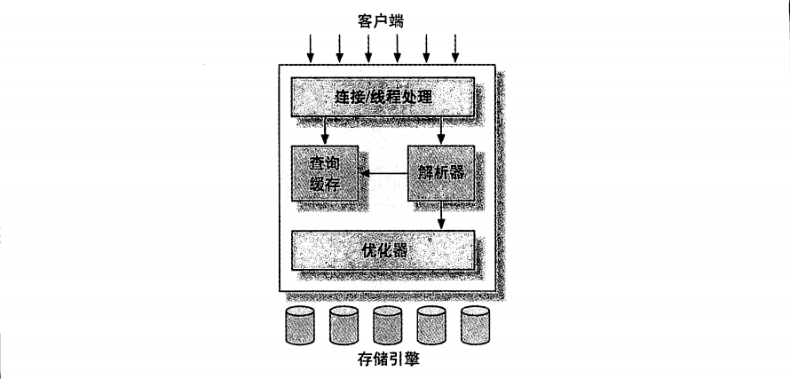
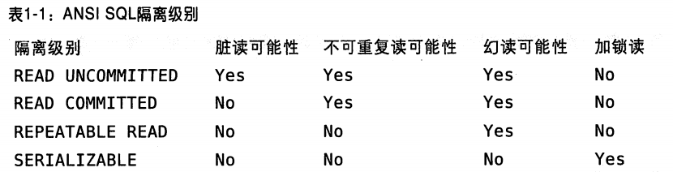
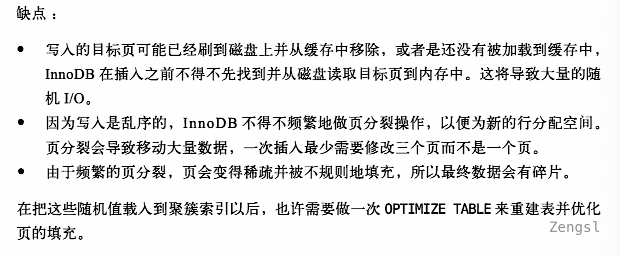
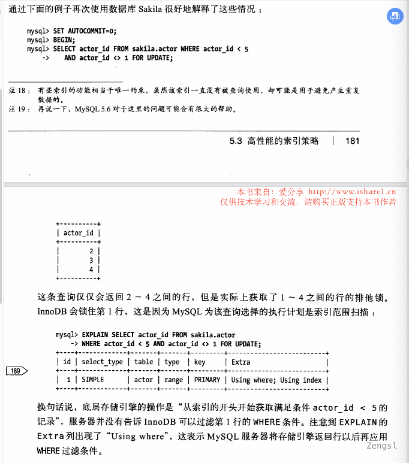
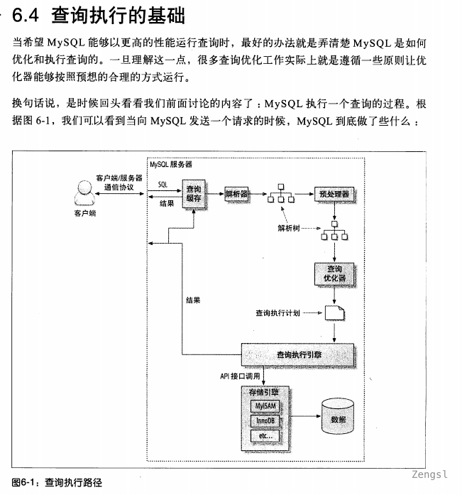

# 介绍

《高性能Mysql》第三版

 MySQL技术内幕InnoDB存储引擎第2版

[Innodb中事务隔离级别和锁的关系](https://tech.meituan.com/2014/08/20/innodb-lock.html)

[MySQL·源码分析·InnoDB Repeatable Read隔离级别之大不同](http://mysql.taobao.org/monthly/2017/06/07/)

[淘宝数据库月报](http://mysql.taobao.org/monthly/)

## 架构


MySQL服务器逻辑架构图



最上层的服务并不是MySQL所独有的，大多数基于网络的客户端/服务器的工具或者服务都有类似的架构。比如连接处理、授权认证、安全等等。

第二层架构是MySQL比较有意思的部分。大多数MySQL的核心服务功能都在这一层，包括查询解析、分析、优化、缓存以及所有的内置函数（例如，日期、时间、数学和加密函数），所有跨存储引擎的功能都在这一层实现：存储过程、触发器、视图等。

第三层包含了存储引擎。存储引擎负责MySQL中数据的存储和提取。和GNU/Linux下的各种文件系统一样，每个存储引擎都有它的优势和劣势。服务器通过API与存储引擎进行通信。这些接口屏蔽了不同存储引擎之间的差异，使得这些差异对上层的查询过程透明。存储引擎API包含几十个底层函数，用于执行诸如“开始一个事务”或者“根据主键提取一行记录”等操作。但存储引擎不会去解析SQL注1，不同存储引擎之间也不会相互通信，而只是简单地响应上层服务器的请求。


注1：InnoDB是一个例外，它会解析外键定义，因为MySQL服务器本身没有实现该功能。

注2：MySQL5.5或者更新的版本提供了一个API，支持线程池（Thread-Pooling）插件，可以使用池中

### 锁

共享锁和排他锁，也叫读锁和写锁。

读锁是共享的，或者说相互不阻塞的。写锁则是排他的，也就是说一个写锁会阻塞其他的写锁和读锁，这是出于安全策略的考虑，只有这样，才能确保在给定的时间里，只有一个用户能执行写入，并防止其他用户读取正在写入的同一资源。

**锁粒度：**

一种提高共享资源并发性的方式就是让锁定对象更有选择性。尽量只锁定需要修改的部分数据，而不是所有的资源。更理想的方式是，只对会修改的数据片进行精确的锁定。任何时候，在给定的资源上，锁定的数据量越少，则系统的并发程度越高，只要相互间不发生冲突即可。

加锁也需要消耗资源。锁的各种操作，包括获得锁、检查锁是否已经解除、释放锁等，都会增加系统的开销。所谓的锁策略，就是在锁的开销和数据的安全性之间寻求平衡，这种平衡本身也会影响到性能。大多数商业数据库一般都是在表上加行级锁。
在MySQL中每种存储引擎都可以实现自己的锁策略和锁粒度。

LOCK TABLES

tbl_name [AS alias] {READ [LOCAL] | [LOW_PRIORITY] WRITE}

[, tbl_name [AS alias] {READ [LOCAL] | [LOW_PRIORITY] WRITE}] ...

1. 表锁 

表锁是MySQL中最基本的锁策略，并且是开销最小的策略。表锁会锁定整张表，读锁之间是相互不阻塞的。

允许事务在行级上的锁和表级上的锁同时存在。锁定整个表，开销最小，但是也阻塞了整个表。

开销小，加锁快；不会出现死锁；锁定粒度大，发生锁冲突的概率最高，并发度最低。

2. 行锁

在InnoDB和XtraDB，以及其他一些存储引擎中实现了行级锁。行级锁只在存储引擎层实现，而MySQL服务器层没有实现。

只允许事务读一行数据。行锁的粒度实在每一条行数据，当然也带来了最大开销，但是行锁可以最大限度的支持并发处理。

开销大，加锁慢；会出现死锁；锁定粒度最小，发生锁冲突的概率最低，并发度也最高。

- 一致性非锁定读

读取一个锁定的数据行不需要等待锁释放，而是读取其快照。这是MySQL InnoDB中默认设置下的读取方式。在不同的隔离级别下是不同的，READ COMMITTED和REPEATABLE READ下，InnoDB使用非锁定的一致性读。然而，对于快照数据的定义却不相同。在READ COMMITTED事务隔离级别下，对于快照数据，非一致性读总是读取被锁定行的最新一份开招数据。而在REPEATABLE READ事务隔离级别下，对于快照数据，非一致性读总是读取事务开始时的行数据版本。

- 一致性锁定读

在某些情况下用户需要显示地对数据库读取操作进行加锁以保证数据逻辑的一致性。而这要求数据库支持加锁语句，也就是显示锁定。


	- SELECT ... LOCK IN SHARE MODE

	- SELECT ... FOR UPDATE

- 自增长与锁

AUTO-INC Locking

- 外键和锁

外键主要用于引用完整性的约束检查。在InnoDB存储引擎中，对于一个外键列，如果没有显式地对这个列加索引，InnoDB存储引擎自动对其加一个索引，因为这样可以避免表锁一这比Oracle数据库做得好，Oracle数据库不会自动添加索引，用户必须自己手动添加，这也导致了Oracle数据库中可能产生死锁。
对于外键值的插人或更新，首先需要查询父表中的记录，即SELECT父表。但是对于父表的SELECT操作，不是使用一致性非锁定读的方式，因为这样会发生数据不一致的问题，因此这时使用的是SELECT-LOCKIN SHARE MODE方式，即主动对父表加一个S锁。
如果这时父表上已经这样加X锁，子表上的操作会被阻塞，

### 锁算法

InnoDB存储引擎有3种行锁的算法：

- Record Lock：单个记录上的锁

- Gap Lock：间隙锁，锁定一个范围，但不包含记录本身

- Next-Key Lock：Gap Lock + Record Lock，锁定一个范围，并且锁定本身

Record Lock总是会去锁住索引记录，如果InnoDB存储引擎表在建立的时候没有设置任何一个索引，那么这时InnoDB存储引擎会使用隐式的主键来进行锁定。

Next-Key Lock是结合了Gap Lock和Record Lock的一种锁定算法，在Next-Key Lock算法下，**InnoDB对于行的查询都是采用这种锁定算法**。

Gap Lock的作用是为了阻止多个事务将记录插入到同一个范围内，而导致Phantom Problem问题到产生。

用户可以通过以下两种方式来显示地关闭Gap Lock：

- 将事务隔离级别设置为READ COMMITTED

- 将参数innodb_locks_unsafe_for_binlog设置为1

在上述的配置下，除了外键约束和唯一性检查依然需要的GapLock，其余情况仅使用Record Lock进行锁定。
但需要牢记的是，上述设置破坏了事务的隔离性，并且对于 replication，可能会导致主从数据的不一致。此外，从性能上来看，READ COMMITTED 也不会优于默认的事务隔离级别READ REPEATABLE。

最后需再次提醒的是，对于唯一键值的锁定，Next-Key Lock降级为Record Lock仅存在于查询所有的唯一索引列。若唯一索引由多个列组成，而查询仅是查找多个唯一索引列中的其中一个，那么查询其实是range类型查询，而不是point类型查询，故InnoDB存储引擎依然使用Next-Key Lock进行锁定。

**解决Phantom Problem（幻想问题）**

在默认的事务隔离级别下，即REPEATABLE READ下，InnoDB存储引擎采用Next-Key Locking机制来避免Phantom Problem（幻像问题）。这点可能不同于与其他的数据库，如Oracle数据库，因为其可能需要在SERIALIZABLE的事务隔离级别下才能解决Phantom Problem。
Phantom Problem是指在同一事务下，连续执行两次同样的SQL语句可能导致不同的结果，第二次的SQL语句可能会返回之前不存在的行。s

[InnoDB Locking](https://dev.mysql.com/doc/refman/5.7/en/innodb-locking.html)

### 隔离级别 




### MySQL事务

特性：ACID

事务分类：

- 扁平事务
- 带有保存点的扁平事务
- 链事务
- 嵌套事务
- 分布式事务
在使用分布式事务时，InnoDb存储引擎的事务隔离级别必须设置为SERIALIZABLE

XA事务由一个或多个资源管理器、一个事务管理器以及一个应用程序组成

- 资源管理器：提供访问事务资源的方法。通常一个数据库就是一个资源管理器。

- 事务管理器：协调参与全局事务中的各个事务。需要和参与全局的所有资源管理器进行通信。

- 应用程序：定义事务的边界，指定全局事务中的操作。

分布式事务使用两段式提交的方式。

第一阶段：所有参与全局事务的节点都开始准备（PREPARE），告诉事务管理器它们准备好提交了。

第二阶段：事务管理器告诉资源管理器执行ROLLBACK还是COMMIT。

任何一个节点显示不能提交，则所有的节点都被告知需要回滚。与本地事务不同的是，分布式事务需要多一次的PREPARE操作，待收到所有节点的同意信息后，再进行COMMIT或者ROLLBACK操作。


MySQL提供了两种事务型的存储引擎：InnoDB和NDB Cluster。另外还有一些第三方存储引擎也支持事务，比较知名的包括XtraDB和PBXT。后面将详细讨论它们各自的一些特点。

MySQL默认开启AUTOCOMMIT，可以通过执行`show variables like 'AUTOCOMMIT';`查看，可以通过`SET AUTOCOMMIT = 0`进行关闭

当自动提交被关闭之后，需要执行rollback或者commit之后才认为事务结束。一些DDL命令执行时会自动执行事务提交操作（具体需要看对应当文档）

可以通过`SETTRANSACTION ISOLATIONLEVEL`设置隔离级别

MySQL服务层不管理事务，事务是由下层当存储引擎实现的。所以在同一个事务中使用多种存储引擎是不可靠的。

### 事务日志

事务日志可以帮助提高事务的效率。使用事务日志，存储引擎在修改表的数据时只需要修改其内存拷贝，再把该修改行为记录到持久在硬盘上的事务日志中，而不用每次都将修改的数据本身持久到磁盘。事务日志采用的是追加的方式，因此写日志的操作是磁盘上一小块区域内的顺序I/O，而不像随机I/O需要在磁盘的多个地方移动磁头，所以采用事务日志的方式相对来说要快得多。事务日志持久以后，内存中被修改的数据在后台可以慢慢地刷回到磁盘。目前大多数存储引擎都是这样实现的，我们通常称之为预写式日志（Write-Ahead Logging），修改数据需要**写两次磁盘**。

如果数据的修改已经记录到事务日志并持久化，但数据本身还没有写回磁盘，此时系统崩溃，存储引擎在重启时能够自动恢复这部分修改的数据。具体的恢复方式则视存储引擎而定。


### 事务实现（事务日志）

事务隔离由锁来实现。原子性、一致性、持久性通过数据库的redo log和undo log来完成。redo log称为重做日志，用来保证事务的原子性和持久性。undo log用来保证事务的一致性。

- redo

- undo 完成回滚操作和MVCC，redo log也会产生redo log

#### 隐式和显式锁定

InnoDB使用的是两阶段锁定协议。在事务执行的过程中，随时都可以执行锁定，锁只有在执行COMMIT或者ROLLBACK的时候才会释放，并且所有的锁是在同一时刻被释放。锁定都是隐式锁定，InnoDB会根据隔离级别在需要的时候自动加锁。

InnoDB也支持显示锁定，这些语句不属于SQL规范：

- SELECT ... LOCK IN SHARE MODE

- SELECT ... FOR UPDATE

MySQL也支持 LOCK TABLES 和 UNLOCK TABLES 语句，这是在服务器层实现的，和存储引擎无关。


### 多版本并发控制

MySQL大多数事务型存储引擎实现的都不是简单的行级锁。基于提升并发性能的考虑，他们一般都同时实现了多版本并发控制(MVCC)。不仅是MySQL，包括Oracle、PostgreSQL等其他数据库也都实现了MVCC，但各自但实现机制不同，因为MVCC没有一个同一的实现标准。

### MySQL存储引擎

MySQL将每一个数据保存为数据目录下的一个子目录。创建表时，会在数据库子目录下创建一个和表同名的.frm文件保存表的定义。不同存储引擎保存数据和索引的方式是不同的，但表但定义则是在MySQL服务层同一处理的。

查看sys_user 表的定义信息 `show TABLE status like 'sys_user'` 

MySQL 5.0之后的版本，可以查询INFORMATION_SCHEMA中对应的表。 


推荐阅读官方手册中“InnoDB事务模型和锁”


- InnoDB

表是基于聚簇索引建立的。InnoDB的索引结果和MySQL的其他存储引擎有很大的不同，聚簇索引对主键查询有很高的性能。不过他的二级索引（非主键索引）中必须包含主键列，如果主键列很大的话，其他索引都会很大。因此，若表上的索引较多的话，主键应当尽可能的小。

InnoDB内部做了很多优化，包括从磁盘读取数据时采用可预测性预读，能够自动在内存中创建hash索引加速读操作的自适应哈希索引，以及能够加速插入操作的插入缓冲区等。

## 基准测试

### 测试工具

集成测试工具

- ab

- http_load

- JMeter

单组件式测试工具

- mysqlslap

- MySQL Benchmark Suite(sql-bench)

- Super Smack

- Database Test Suite

- Percona's TPCC-MySQL Tool

- sysbench

内置函数  BENCHMARK()

## 服务器性能剖析

### 剖析工具

mk-quer-digets、pt-quer-digets、New Relic

### 剖析单条查询

主要有三种方法：SHOW STATUS、SHOW PROFILE、检查慢查询日志的条目


### 其他方式

1. 使用USER_STATISTICS表

Percona Server和MariaDB都引入了一些额外的对象级别使用统计的`INFORMATION_SCHEMA`表，这些最初是由Google开发的。这些表对于查找服务器各部分的实际使用情况非常有帮助。在一个大型企业中，DBA负责管理数据库，但其对开发缺少话语权，那么通过这些表就可以对数据库活动进行测量和审计，并且强制执行使用策略。对于像共享主机环境这样的多租户环境也同样有用。另外，在查找性能问题时，这些表也可以帮助找出数据库中什么地方花费了最多的时间，或者什么表或索引使用得最频繁，抑或最不频繁。下面就是这些表：

SHOW TABLES FROM INFORMATION_SCHEMA LIKE '%_STATISTICS'; 

2. 使用strace

strace可以用来跟踪系统调用的情况

## Schema与数据类型优化

可以给整形类型指定宽度，比如INT(11)，对于大多数应用这是没有意义的：他不会限制值的合法范围，只是规定了MySQL的一些交互工具用来显示字符的个数。对于存储和计算来说，INT(1)和INT(20)是相同的。

### 缓存表和汇总表

- 物化视图

MySQL本身不支持，可以使用开源工具Flexviews来实现

- 计数器表

``` sql
create table daily_hit_counter
(
    day  date             not null,
    slot tinyint unsigned not null,
    cnt  int unsigned     not null,
    primary key (day, slot)
) ENGINE = InnoDB;

select *
from daily_hit_counter;

insert into daily_hit_counter(day, slot, cnt)
values (CURRENT_DATE, RAND() * 100, 1)
on DUPLICATE KEY UPDATE cnt = cnt + 1;

update daily_hit_counter as c inner join (select day, sum(cnt) as cnt, MIN(slot) as mslog
                                          from daily_hit_counter
                                          group by day) as x USING (day)

set c.cnt = IF(c.slot = x.mslog, x.cnt, 0),
    c.slot=if(c.slot = x.mslog, 0, c.slot);

delete
from daily_hit_counter
where slot <> 0
  and cnt = 0;
```

## 索引

如果索引列包含了多个值，那么列的顺序也十分重要，因为MySQL只能高效地使用索引的最左前缀列。创建一个包含两个列的索引，和创建两个只包含一个列的索引是大不相同的。

在MySQL中，索引是存储引擎层而不是服务层实现的。所以并没有统一的索引标准。即使多个存储引擎支持同一类索引，其底层实现也可能不同。

- B-Tree

B-Tree（B+Tree）索引是常见的一种类型，大多数MySQL引擎都支持（Archive例外）。

支持：全值匹配、匹配最左前缀、匹配列前缀、匹配范围值、精确匹配某一列并范围匹配另外一列、只访问索引的查询

索引树中的节点是有序的，所以除了查找之外，还可以用于查询中的order by、group by等操作。

- Hash索引

模拟Hash索引

等。。

- 聚簇索引

在InnoDB表中按主键顺序插入行。从性能的角度考虑，使用UUID来作为聚簇索引则会很糟糕：它使得聚簇索引的插入完全随机，最坏的情况会使得数据没有任何聚集特性。

UUID主键插入行不仅花费时间更长，而且索引占用空间也更大。一方面是由于主键字段更长；另一方面是由于页分裂和碎片导致的。而且uuid的新行主键值不一定比之前插入的大，所以InnoDB无法简单的总是把新行插入到索引的最后，而是需要为新行寻找合适的位置-通常是已有数据的中间位置-并且分配空间。这会增加很多额外工作，并导致数据分布不够优化。



- 覆盖索引

如果一个索引包含（或者说覆盖）所有需要查询的字段的值，就叫做“索引覆盖”。

MySQL只能使用B-Tree索引做覆盖索引。不是所有引擎都支持覆盖索引。

- 索引和锁

索引和减少InnoDB访问的行数，从而减少锁的数量。但这只有当InnoDB在存储引擎层能够过滤掉所有不需要的行时才有效。



InnoDB在二级索引上使用共享(读)锁，但访问主键索引需要排他(写)锁。这消除了使用覆盖索引的可能性，并且使得`SELECT FOR UPDATE`比`LOCK IN SHARE MODE`或非锁定查询要慢很多。

对于范围条件查询，MySQL无法再使用范围列后的其他索引列，但对“多个等值条件查询”则无限制。
如果MySQL支持松散索引扫描，就能在一个索引上使用多个范围条件了。


### 维护索引和表

`check table`检查表是否发生了损坏，不是所有引擎都支持

`repair table`修复损坏的表，不是所有引擎都支持。如果不支持可以执行`ALTER TABLE innodb_tb1 ENGINE=INNODB`

`SHOW INDEX FROM xxx`查看索引的基数。Cardinality基数显示了存储引擎估算索引列有多少个不同的取值。5.0以上版本还可以通过INFORMATION_SCHEMA.STATISTICS表很方便查询到这些信息。

**索引和表都可能碎片化**

索引碎片化会导致查询性能下降。

表数据存储碎片化更加复杂，有三种类型的数据碎片：

- 行碎片

- 行间碎片

- 剩余空间碎片

对于MyISAM表，这三类碎片化都可能发生。但InnoDB不会出现短小的行碎片；InnoDB会移动短小的行并重写到一个片段中。
通过`OPTIMIZE TABLE`或者导出再导入的方式来重新整理数据，这对多数存储引擎都是有效的。对于i鞋存储引擎如MyISAM，可以通过排序算法重建索引的方式来消除碎片。老版本InnoDB没有什么方法，但新版本InnoDB新增了在线添加和删除索引功能，可以通过先删除再重建但方式来消除索引碎片化。

对于不支持`OPTIMIZE TABLE`的存储引擎，可以通过一个不做任何操作的ALTER TABLE操作来重建表`ALTER TABLE <table> ENGINE=<engine>;` 这种方法会消除MySQL 表的碎片化。

## 查询性能优化

通常来说，查询的生命周期大致可以按照顺序来看：从刚客户端，到服务器，让好在服务器上进行解析，生成执行计划，**执行**，并返回结果给客户端。“执行”可以认为是整个生命周期中最重要的阶段，这其中包括了大量为了检索数据到存储引擎的调用以及调用后的数据处理，包括排序、分组等。



查询状态 

`show full processlist`

查询缓存

MySQL会优先坚持这个查询是否命中查询缓存中的数据。


### 案例

- 计算两点之间的距离

``` sql
create Table locations
(
    id   int   not null primary key auto_increment,
    name varchar(30),
    lat  float not null,
    lon  float not null
);

insert into locations(name, lat, lon)
values ('Charlottesville,Virginia', 38.03, -78.48),
       ('Chicago,Illinois', 41.85, -87.65),
       ('Washington,DC', 38.89, -77.04);
-- 计算Charlottesville距离100英里以内的点。
-- 计算公式：   AC0S( COS(latA) * C0S(latB) * 0S(lonA - lonB) + SIN(1atA) * SIN(1atB)
-- 计算结果是一个弧度，需要乘以地球点半径，也就是3959英里或者6371千米。
SELECT *
FROM locations
WHERE 3979 * ACOS(
                COS(RADIANS(lat)) * COS(RADIANS(38.03)) * COS(RADIANS(lon) - RADIANS(-78.48)) +
                SIN(RADIANS(lat)) * SIN(RADIANS(38.03))
    ) <= 100;
   
```

这类查询不仅无法使用索引，而且还会非常消耗CPU给服务器带来很大的压力

由于本身计算两点之间距离就是估算的值，因为实际上不可能通过两点之间直线直接到达。实际的距离是会比该估算值更大。
那么可以将此用一个边长为200英里的正方形来代替，一个顶点到中心的距离大概是141英里，这和实际计算的100英里相差的不大。那我们根据正方形公式来计算弧度为0.0253（100英里）的中心到边长的距离：

``` sql
SELECT *
FROM locations
WHERE lat BETWEEN 38.03 - DEGREES(0.0253) AND 38.03 + DEGREES(0.0253)
  AND lon BETWEEN -78.48 - DEGREES(0.0253) AND -78.48 + DEGREES(0.0253);
```

针对上述查询进行索引优化，增加索引（lat,lon）或者（lon,lat）。因为MySQL5.5和之前的版本，如果第一列是范围查询的话，就无法使用索引后面的列了。
再次通过IN优化，先增加两列，用来存储坐标的近似值，然后在用IN将所有点的整数值都放在列表中

```sql
alter table locations
    add lat_floor int not null default 0,
    add lon_floor int not null default 0,
    add key (lat_floor, lon_floor);
	
SELECT FLOOR(38.03 - DEGREES(0.0253))    AS lat_lb,
       CEILING(38.03 + DEGREES(0.0253))  AS lat_ub,
       FLOOR(-78.48 - DEGREES(0.0253))   AS lon_lb,
       CEILING(-78.48 + DEGREES(0.0253)) AS lon_ub;
	   
SELECT *
FROM locations
WHERE lat BETWEEN 38.03 - DEGREES(0.0253) AND 38.03 + DEGREES(0.0253)
  AND lon BETWEEN -78.48 - DEGREES(0.0253) AND -78.48 + DEGREES(0.0253)
  AND lat_floor in (36, 37, 38, 29, 49)
  and lon_floor in (-80, -79, -78, -77);
```

## 工具

### 监测工具

innotop


