# Update执行过程分析

开启事务->SQL解析、查询计划生成->查询要修改的数据->校验锁和加锁->修改数据和生成日志->本地提交->主备复制->返回提交成功->脏页刷入磁盘

## 开启事务

start transaction;
update user set name = 'zzz' where id = 1;
commit;

第一次执行增删改SQL时分配一个事务号

## SQL解析、查询计划生成

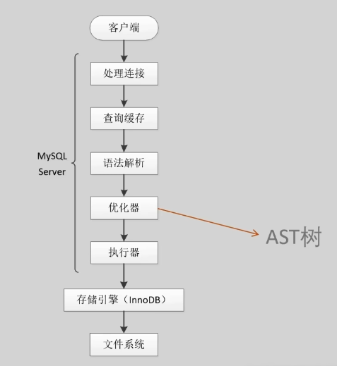

查询缓存再MySQL5.7版本默认禁用，在MySQ8.0版本被删除

## 查询要修改的数据

- 对磁盘和buffer pool的读取都是以页为单位
- 表空间号 + 页号
- 传入页号这个参数到buffer pool，然后到buffer pool判断这个页是否在buffer pool中。如果在，则直接返回我们想要的页；如果不在，则从磁盘中加载这个页到buffer pool中，然后返回给用户。

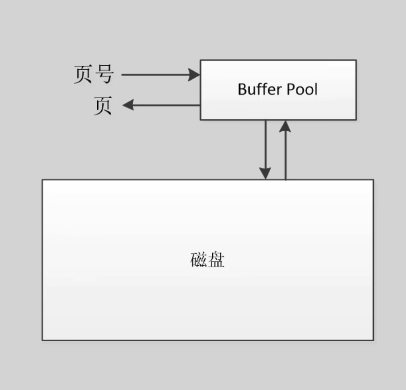

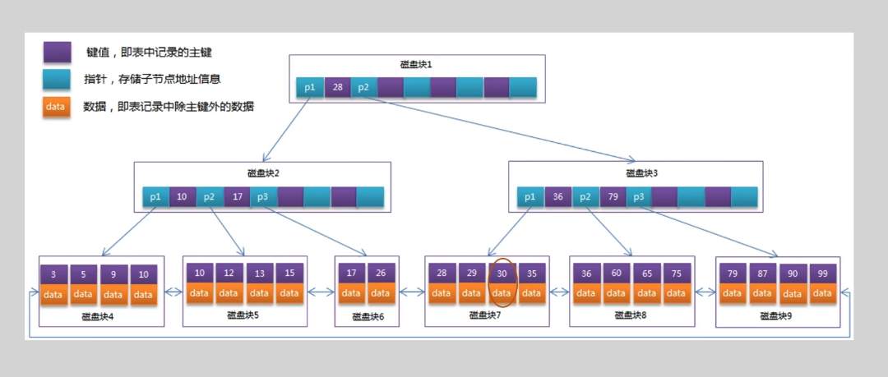

关键过程：

###  buffer pool读取过程

缓存池中的三条主要的链：

Free List：空闲链，主要负责管理未被使用的缓存池空间。

LRU List：最近最少使用的链，主要负责在缓冲池满时淘汰缓冲页。

Flush List：脏链，主要负责管理要被刷新到磁盘的页。

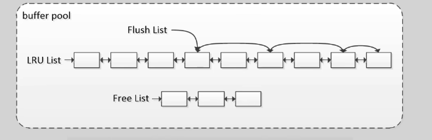

### 解析页过程

> 页包含数据页和索引页，这里仅针对数据页进行描述

- 数据页格式(16kb)

- 每条数据在物理上时乱序的，逻辑上用一个单向链表连接起来。链表以infimum和supremun这两个特殊记录标记首尾。

- infimunm指向第一条记录，最后一条记录指向supremunm。

- Page Directory结构可以帮助我们加快对页的搜索。

- 查找一个数据页时，就会在PageDirectory进行二分查找，每次查找都要取道槽对应的行进行主键比较；直到最终找到数据或确认没有对应的数据。

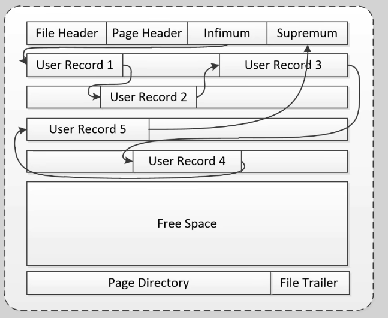

为方便理解，将结构进行调整展示：

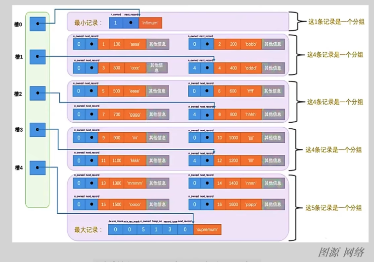

- 行格式：COMPACT、REDUNDANT、**DYNAMIC**、COMPRESSED

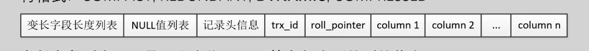

- 变长字段列表：记录一些类似varchar等变长类型的列信息

- NULL值列表：记录可以为NULL的列信息

- 记录头信息： 记录该行数据的一些额外信息

- trx_id：记录最近更新这行记录的事务号

- roll_ptr：一个指向undo log的指针

- trx_id和roll_ptr：MySQL自动生成的隐藏咧，主要用于实现MVCC（多版本并发控制）

- 没有显示指定主键的表，会生成一个row_id的虚拟主键隐藏列

## 校验锁和加锁

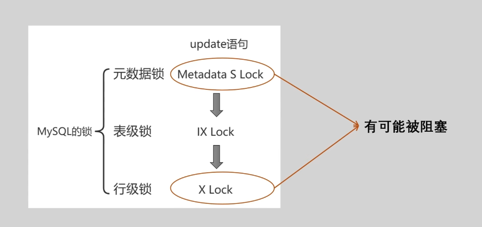

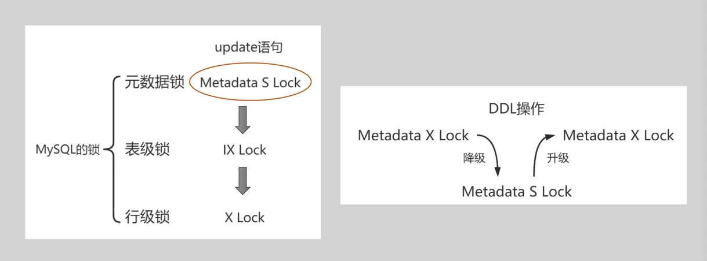

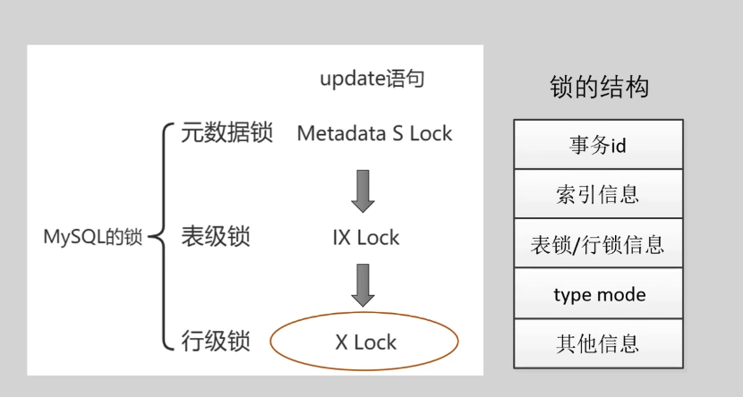

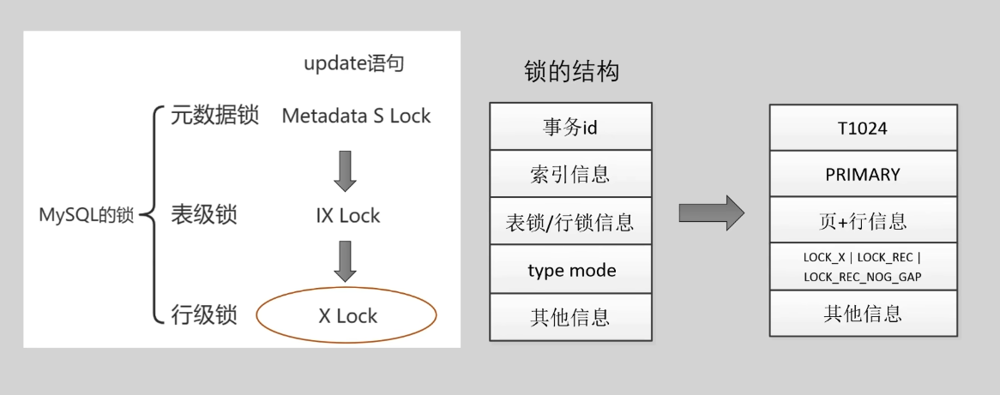

## 修改数据和生成日志

1. 数据页（缓存页）

- 修改前后这行数据的大小完全没变->就地更新
- 任何字段的大小发生了变化->插入一条新纪录

2. undo log

undo log记录的是事务T改变了元素X，而原来的值是V，这样一个<T,X,v>三元组

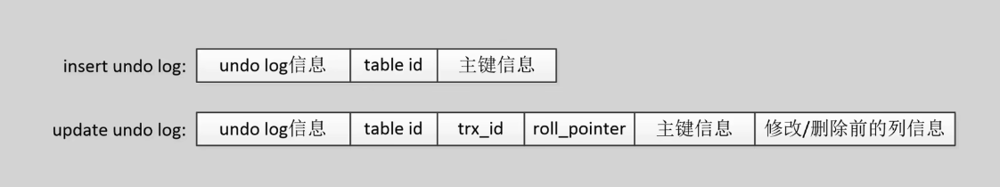

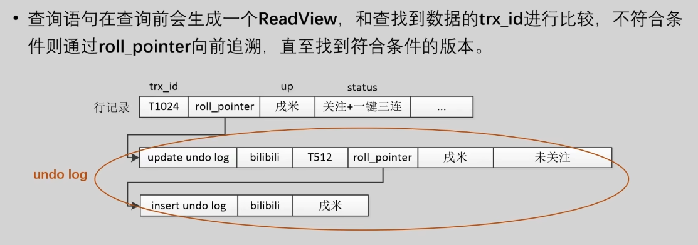

3. redo log

redo log记录的是事务T改变了元素X，而元素X原来的值V，这样一个<T,X,v>三元组.

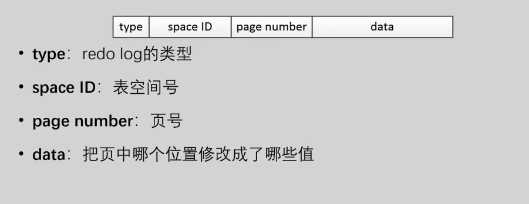

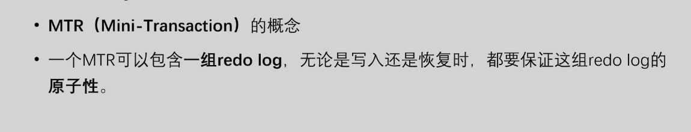

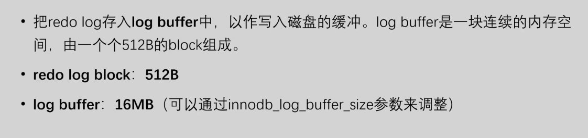

- SQL执行完成后、事务提交前，redo log是否需要落盘？—— NO

- 可能导致redo log落盘的一些原因：

  1. 事务提交；

  2. log buffer空间不足（低于50%）时；

  3. 后台线程周期性刷log buffer；

  4. MySQL服务正常关闭时；

  5. 做checkpoint时；

  ## 本地提交

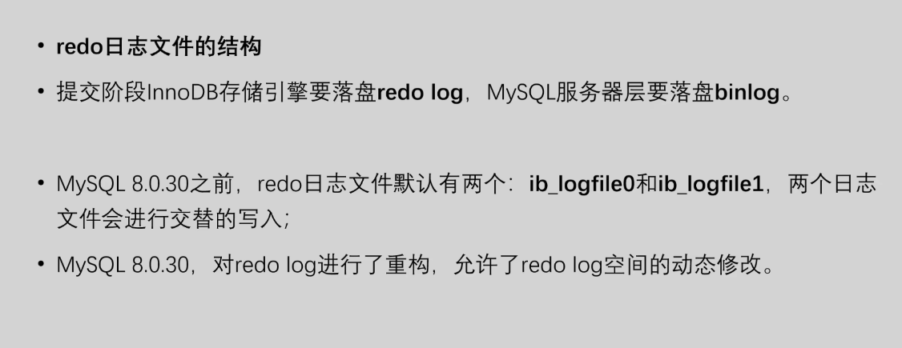

- 如何保证binlog和redo log的状态一致？

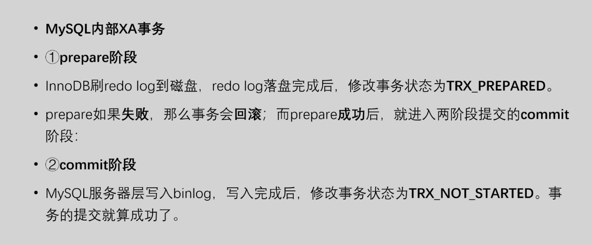

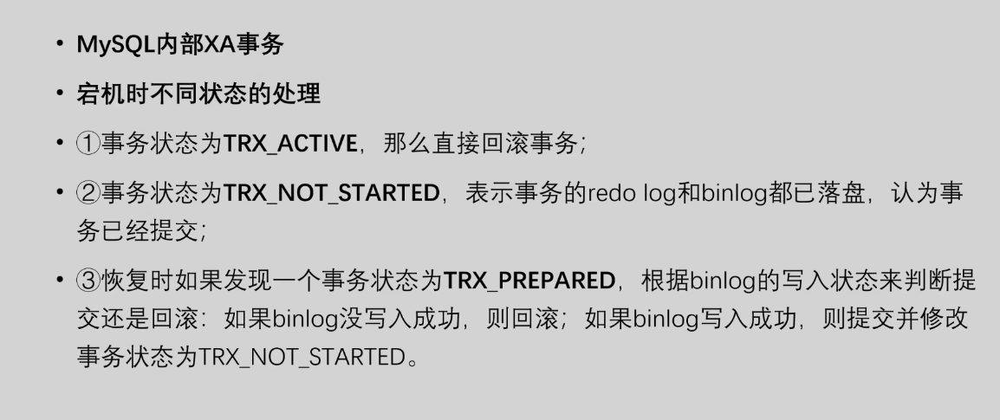

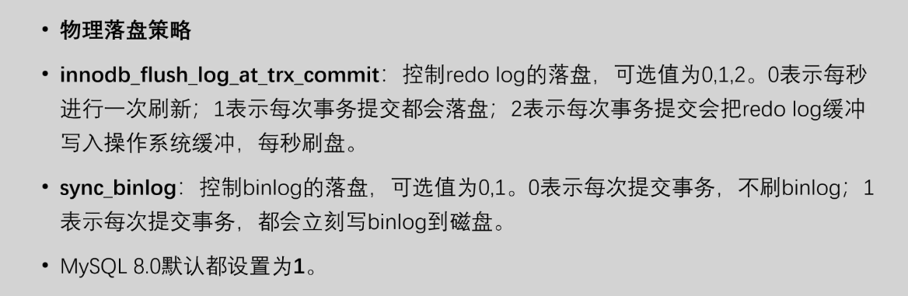

## 主备复制

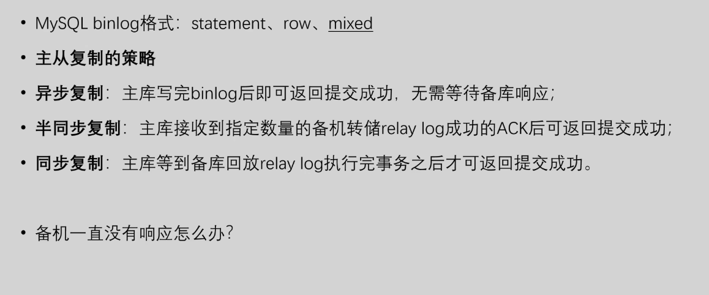

## 脏页落盘 

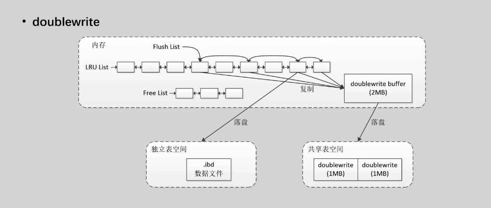
