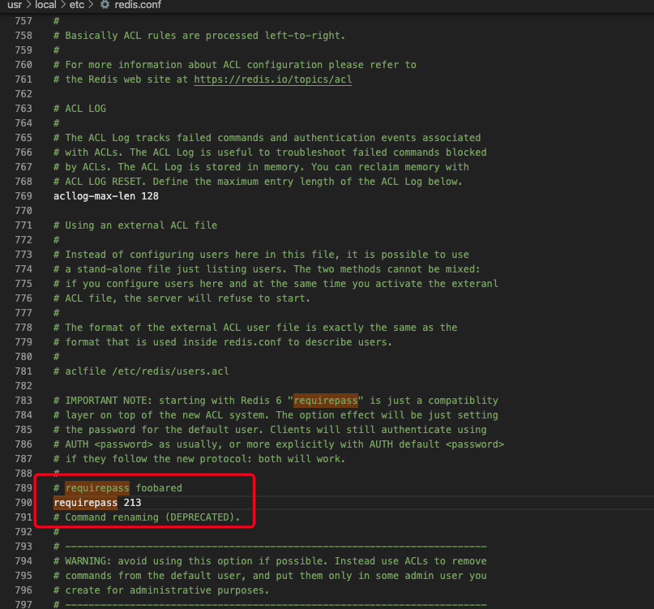

---
category:
  - 数据库
tag:
  - Redis
  - NoSQL
title: 安装与配置
---
# Redis的安装与配置

## 安装
[下载地址](https://redis.io/download)

Linux用户可以从下载地址下载指定版本的tar包进行安装
~~~ shell
wget http://download.redis.io/releases/redis-6.0.7.tar.gz
tar xzf redis-6.0.7.tar.gz
cd redis-6.0.7
make
~~~

mac 用户可以使用brew进行安装
~~~ shell
brew install redis
~~~

windows用户可以直接从下载地址中选择适合的版本zip包进行安装
[windows下载地址](https://github.com/tporadowski/redis/releases)

以mac为例，安装完之后命令行执行`redis-server`启动redis服务

启动完成之后可以新建命令行窗口执行客户端命令`redis-cli`来连接redis服务

~~~ shell
$ src/redis-server

$ src/redis-cli
redis> set foo bar
OK
redis> get foo
"bar"
~~~

## 配置

默认的配置文件为redis.conf或者redis.windows.conf

启动redis服务时，如果没有指定配置文件，那么会使用默认配置文件

~~~
redis-server [配置文件路径]
~~~

### 设置密码
在配置文件中找到 requirepass，在下方设置自己的密码

mac的redis配置文件位置/usr/local/etc