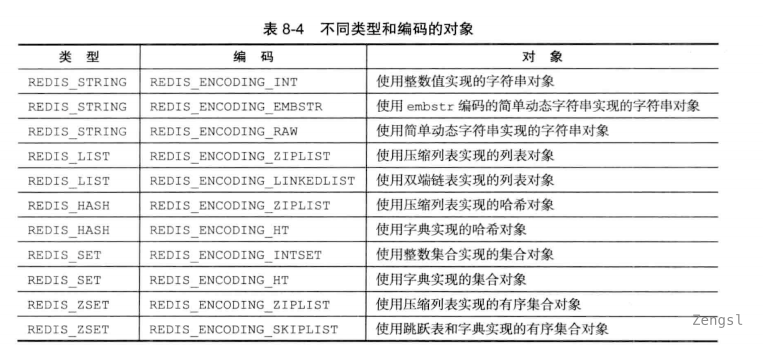
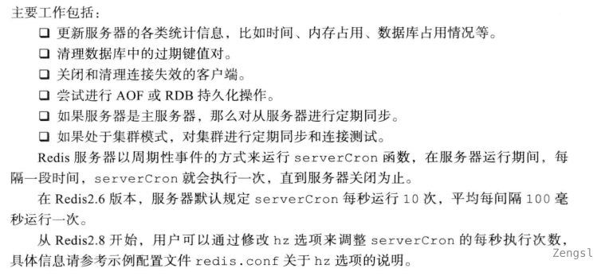
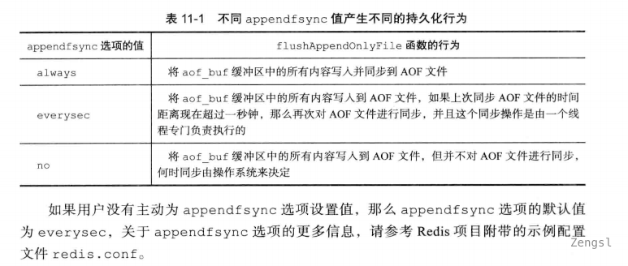
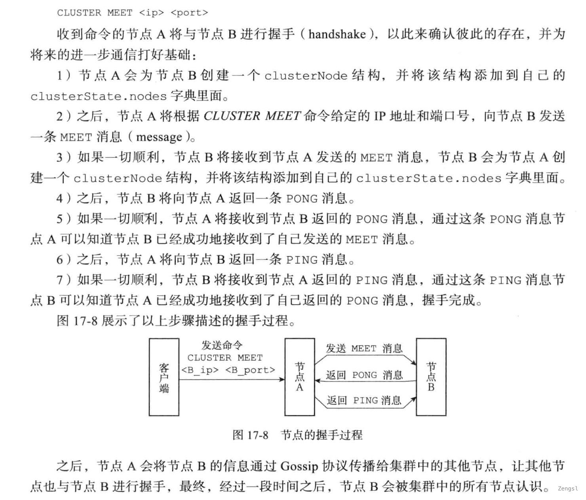

---
category:
  - 数据库
tag:
  - Redis
  - NoSQL
date: 2020-09-10

---
# Redis

记录Redis的相关知识

[在线教程](https://try.redis.io/)

[官网](https://redis.io/)


## 类型

### String

- 字符串

- 数值

- bitmap 

setbit 长度一位 

使用场景：统计用户登录天数、计算活跃用户数量、12306订票

### list

双向链表，key拥有链表的头尾指针，放入有序

同向操作：栈

异向操作：队列

下标操作：数组

使用场景：

充当以上数据结构、分页、微信抢红包等


### hash

使用场景：

商品详情页、聚合场景


### set

特点： 去重，无序

使用场景：

随机事件和抽奖等 

推荐系统，共同好友，推荐好友 

### zset

使用场景：

排行榜

有序事件

评论+分页（动态）


type 【key】查看类型 

object encoding 【key】 查看底层数据结构


底层结构：

压缩表、跳跃表（skiplist）


主缓存

二级缓存

## 二进制数组(bitmap)

BITSET、BITGET、BITCOUNT、BITTOP

底层是用String(SDS)进行存储的，因为SDS是二进制安全的。采用**逆序**（低字节位保存在数组前方）保存位数组，所以当程序对buf数组进行扩展之后，写入操作可以直接在新扩展的二进制位中完成，而不必改动位数组原来已有的二进制位。

BITCOUNT是采用遍历二进制位计数的方式来进行统计的，可以使用查表法来进行优化（空间换时间），但是受限于查表法带来的内存亚丽，以及缓存不命中可能带来的影响，我们只能靠了创建键长为8位或者键长为16位的表，而这两种表带来的效率提升，对于处理非常长的位数组来说仍然远远不够。为了高效的实现BITCOUNT命令，我们需要一种不会带来内存压力、并且可以在一次检查中统计个二进制位的算法。

二进制位统计算法：variable-precision SWAR

Redis对于BITCOUNT命令的实现用到了查表和variable-precision SWAR

> 偏移量从0开始计数

## 新类型

### HyperLogLog

基数计数

```shell
# pfadd，向hyperloglog中添加数据，相同元素会去重
# pfcount 统计个数
# pfmerge 合并
```

### Geospatial

地理位置的基本操作

``` shell
# 添加地址位置信息：geoadd 地理位置 经度 纬度 名称
# GEOADD key longitude latitude member [longitude latitude member ...]
# 获取经纬度信息：geopos 地理位置 名称 
# 获取两个地点之间的直线距离： geodist
# 以给定的维度为中心，计算半径内的元素：georadius
```


### Stream

Redis5添加

``` shell
XADD
XRANGE
```

相比旧有的Sorted Set+ Hash的模式，Streams对内存的节省做了很好的优化

## 底层数据结构

> 主要针对2.9版本进行描述

SDS、linkedlist、dictionary、ziplist、inset、skiplist

###  基础数据类型的底层实现

总览：

| 类型   | Redis 2.9               | 新版本 |
| ------ | ----------------------- | ------ |
| string | int、SDS（embstr、raw） |        |
| list   | ziplist、linkedlist     |        |
| hash   | ziplist、dictionary     |        |
| set    | intset、dictionary      |        |
| zset   | ziplist、skiplist       |        |


Redis数据库中的key、value键值对分别对应两个`redisObject`的结构体对象，key固定都是string类型的，而value对应类型跟创建命令有关，对应5中基本数据类型。

``` c
typedef struct redisObject {

    // 类型
    unsigned type:4;

    // 编码
    unsigned encoding:4;

    // 对象最后一次被访问的时间
    unsigned lru:REDIS_LRU_BITS; /* lru time (relative to server.lruclock) */

    // 引用计数
    int refcount;

    // 指向实际值的指针
    void *ptr;

} robj;
```


`type`命令可以查看值对象对应的数据类型，对应5中基本数据类型string、hash、list、set、zset

`object encoding`命令可以查看值对象对应的具体编码，根据编码可以确定对应的底层数据结构，也就是redis对象中encoding的值。




不同类型的底层转换规则：

**string类型**

主要有三种编码：int、embstr、raw

- 如果存放整数值，并且整数值可以用long来保存的话，那么encoding会设置为int，void*会转换为long
- 如果存放字符串，且字符串长度大于32字节，那么会使用SDS来保存内容，encoding会设置为raw
- 如果存放字符串，且字符串长度小于等于32字节，encoding会设置为embstr。embstr编码是专门为存放短字符串的一种优化编码方式，这种编码方式和raw是一致的，只不过raw编码方式会调用两次内存分配函数来创建redisObject和sdshdr（SDS的数据结构），而embstr编码通过调用一次内存分配函数来分配一段连续的内存空间存放redisObject和sdshdr

> 32这个值之后被改为了39，最新版本具体的数值按当前情况为准。


embstr编码字符串没有对应的redis函数，所以是只读的。所以在对embstr类型数据进行操作的时候会先转换为raw编码，然后再进行修改操作。所以embstr编码字符串修改之后总会变成一个raw编码的字符串对象。

int编码字符串修改之后是否会改变存储类型需要看具体的操作，比如调用incrby可能就不会，调用incrbyfloat就会变味embstr编码，调用append会变为raw编码，等。

**字符串类型对象是这五种类型中唯一一个会被其他四种类型对象嵌套的对象。**


**list类型**

主要有两种编码：ziplist、linkedlist

当列表对象同时满足以下两种条件时，列表对象使用ziplist编码：

- 列表对象所保存的所有字符串元素的长度都小于64字节；
- 列表对象保存的元素数量小于512个；

通过修改list-max-ziplist-value选项和list-max-ziplist-entries选项进行调整。


**hash类型**

主要有两种编码：ziplist、hashtable

当哈希对象同时满足以下两种条件时，列表对象使用ziplist编码：

- 哈希对象所保存的所有键值对的键和值的字符串长度都小于64字节；
- 哈希对象保存的键值对数量小于512个；

通过修改set-max-intset-entries选项进行调整。


**set对象**

集合对象的编码可以是inset和hashtable

当集合对象同时满足以下两种条件时，集合对象使用inset编码：

- 集合对象保存的所有元素都是整数值
- 集合对象保存的元素数量不超过512个。

通过修改zset-max-ziplist-value选项和zset-max-ziplist-entries选项进行调整。


**zset对象**

有序集合对象的编码可以是ziplist和skiplist

当有序集合对象同时满足以下两种条件时，有序集合对象使用ziplist编码：

- 有序集合对象保存的所有元素大小都小于64字节。

- 有序集合对象保存的元素数量小于128个。

当使用skiplist编码时，底层使用`zset`结构进行存储，zset包含跳跃表和字典表，字典表中是以元素的成员为key，分值为value进行存储。虽然zset结构同时使用字典和跳跃表来保存元素，但是这两种数据结构都会通过指针来共享相同元素的成员和分值，并不会造成内存的浪费。

```c
/*
 * 有序集合
 */
typedef struct zset {

    // 字典，键为成员，值为分值
    // 用于支持 O(1) 复杂度的按成员取分值操作
    dict *dict;

    // 跳跃表，按分值排序成员
    // 用于支持平均复杂度为 O(log N) 的按分值定位成员操作
    // 以及范围操作
    zskiplist *zsl;

} zset;


/*
 * 跳跃表
 */
typedef struct zskiplist {

    // 表头节点和表尾节点
    struct zskiplistNode *header, *tail;

    // 表中节点的数量
    unsigned long length;

    // 表中层数最大的节点的层数
    int level;

} zskiplist;

/* ZSETs use a specialized version of Skiplists */
/*
 * 跳跃表节点
 */
typedef struct zskiplistNode {

    // 成员对象
    robj *obj;

    // 分值
    double score;

    // 后退指针
    struct zskiplistNode *backward;

    // 层
    struct zskiplistLevel {

        // 前进指针
        struct zskiplistNode *forward;

        // 跨度
        unsigned int span;

    } level[];

} zskiplistNode;
```


### 高版本Redis的调整

quicklist：链表中的元素分段用ziplist存储

> Redis3.2版本开始对列表数据结构进行了改造，使用 quicklist 代替了 ziplist 和 linkedlist.

### 对象

- 对象的回收

Redis通过实现引用计数的方式来实现垃圾回收，通过redisObject#refcount来保存对象引用。有三个API可以进行操作`incrRefCount`、`decrRefCount`、`restRefCount（重置引用计数，但是不释放对象）`

```c
typedef struct redisObject {

    // 类型
    unsigned type:4;

    // 编码
    unsigned encoding:4;

    // 对象最后一次被访问的时间
    unsigned lru:REDIS_LRU_BITS; /* lru time (relative to server.lruclock) */

    // 引用计数
    int refcount;

    // 指向实际值的指针
    void *ptr;

} robj;
```

`OBJECT REFCOUNT`命令可以查看对象的引用数量

- 对象的共享

仍是通过对象的引用计数来实现，Redis发现如果存在相同的对象就直接将指针指向现有对象，并且引用计数加一。

**目前来说，Redis会在初始化服务器时，创建一万个字符串对象，这些对象包含0～9999的所有整数值。当要用到0～9999这些字符串对象时，服务器就会使用这些共享对象，而不是创建新对象。**这些共享对象也可以被其他嵌套使用了字符串类型的数据类型所使用。

创建共享字符串的数量可以通过修改redis.h/REDIS_SHARED_INTEGERS常量来调整。

- 对象空转时间

redisObject#lru存放了最后一次访问对象的时间

`OBJECT IDLETIME`可以查看空转时长，其通过当前时间减去lru记录的时间计算得出。执行此命令是不会修改对象lru时间。

如果服务器打开了maxmemory选项，并且服务器用于回收内存算法为volatile-lru或者allkeys-lrun，那么当服务器占用内存超过maxmemory限制之后就会释放空转时间较长的键值，从而回收内存。

配置文件中可以调整maxmemory选项和maxmemory-policy选项。


## 事件


### 事件分类

Redis服务器是一个事件驱动程序，服务器需要处理以下两类事件：

- 文件事件

 服务器与客户端通过套接字进行连接，而文件事件就是服务器对套接字的抽象。文件事件就是用来处理服务器与客户端之间的网络请求操作。

Redis基于**Reactor模型**开发了网络事件处理器，这个事件处理器被称为文件事件处理器（file event handle），基于IO多路复用程序来同时监听多个套接字，并根据套接字目前执行的任务来指定不同的事件处理器。

文件事件处理器由以下部分组成：套接字、I/O多路复用程序、文件事件分派器（file event dispatcher）、事件处理器。

- 时间事件

服务器中一些操作（比如serverCron函数）需要在给定时间执行，而时间事件就是对这类操作的抽象。

时间事件有id、when、timeProc（时间事件处理器）三个属性，有两种类型：

1. 周期性事件
2. 定时事件

目前Redis版本（2.9）没有使用定时事件。

一个时间事件具体是周期性的还是定时是根据时间事件处理函数的返回值来确定的：如果返回`ae.h/AE_NOMORE`，那么就是定时执行，执行完之后就会删除。如果不是`ae.h/AE_NOMORE`，就是周期性事件，会根据返回值更新when的属性。

服务器将所有时间事件都存放在一个无序链表中，每当事件执行器运行时就会遍历整个链表找到时间到达的时间事件，并调用对应的处理函数。

`serverCron`就是一个周期性事件，其主要职责如下：



### 事件调度与执行

事件的调用与执行由`ae.c/aeProcessEvent`函数来控制，用于协调这两种事件的执行时间以及何时执行。

大致过程：先从时间事件中找到最快要执行的时间事件，用它的值来作为阻塞监听文件描述符的超时事件，然后在分别执行文本事件和时间事件，如果没有文本事件和时间事件则会进入下一次事件循环，因为会优先执行文本事件，所以时间事件会比预定的时间来的更晚一点。具体细节可以看源码。


## 客服端


客户端分为两种：

- 伪客户端

文件描述符fd的值为-1，目前主要是载入AOF和执行lua脚本中的Redis命令时会使用到。

lua伪客户端结构`redis.h/redisServer#lua_client`

- 普通客户端

客户端结构`redis.h/redisClient`

文件描述符fd的值大于-1的整数。

`Client list`命令用于返回所有连接到服务器的客户端信息和统计数据，包括name、flags等信息，具体可以参考官方文档。

其中flags描述了客户端的角色和状态，这些状态包括WATCH的变量是否被修改、是否在执行事务等。


输入缓冲区`redisClient/querybuf`限制大小为1G，是一个SDS结构。

输出缓冲区分为固定和不固定的两种存储方式，较小的内容则存放在字符数组中（大小为16kb）。较大的存放在链表中，但是还是会有软性限制、软性限制时长、硬性限制参数来进行限制输出缓冲区大小。

> 为什么输出缓冲区的固定存储方式不跟输入缓冲区一样是用SDS呢？可能因为是固定长度所以觉得没有必要，也用不上SDS的一些功能？好像用SDS也没多大问题吧？


## 服务器


`serverCron`比较重要，AOF文件重写、AOF缓冲写入文件、RDB文件写入等逻辑都会在该函数内部触发。


## 发布订阅

PUB、SUBSCRIBE、PPUB、PSUBSCRIBE、PUBSUB


## 慢查询日志

slowlog-log-slower-than选项：指定执行时间超过多少微妙的命令会记录到日志上。

1秒=1 000 000微妙

slowlog-max-len选项：指定服务器最多保存多少条慢查询日志。超过限制数量之后会将最早的一条慢查询日志删除。

```shell
CONFIG SET slowlog-log-slower-than 0
CONFIG SET slowlog-max-len 5
# 查询慢查询日志
SLOWLOG GET
```


## 监视器

MONITOR命令可以让客户端变成监视器，实时打印服务器当前处理的命令请求。

## 命令

查看key可以使用scan来替代keys *

# Redis实战

## 数据安全和性能保障

### 持久化选项

#### RDB

1. 开发环境尽量贴近生产环境，有助于判断快照生成的是否过于频繁或过于稀少（过于频繁会浪费资源，而过于稀少则带有丢失大量数据的隐患）

2. 对日志进行聚合计算

~~~ python
# 日志处理函数接受的其中一个参数为回调函数，
# 这个回调函数接受一个Redis连接和一个日志行作为参数，
# 并通过调用流水线对象的方法来执行Redis命令。
def process_logs(conn, path, callback):
    # 获取文件当前的处理进度。
    current_file, offset = conn.mget( 
        'progress:file', 'progress:position') 
    pipe = conn.pipeline()

    # 通过使用闭包（closure）来减少重复代码
    def update_progress():    
        # 更新正在处理的日志文件的名字和偏移量。
        pipe.mset({
            'progress:file': fname,
            'progress:position': offset 
        })
        # 这个语句负责执行实际的日志更新操作，
        # 并将日志文件的名字和目前的处理进度记录到Redis里面。
        pipe.execute()

    # 有序地遍历各个日志文件。
    for fname in sorted(os.listdir(path)): 
        # 略过所有已处理的日志文件。
        if fname < current_file:
            continue
        inp = open(os.path.join(path, fname), 'rb')
        # 在接着处理一个因为系统崩溃而未能完成处理的日志文件时，略过已处理的内容。
        if fname == current_file:
            inp.seek(int(offset, 10)) 
        else:
            offset = 0
        current_file = None
        # 枚举函数遍历一个由文件行组成的序列，
        # 并返回任意多个二元组，
        # 每个二元组包含了行号lno和行数据line，
        # 其中行号从0开始。
        for lno, line in enumerate(inp):
            # 处理日志行。
            callback(pipe, line)
            # 更新已处理内容的偏移量。
            offset += int(offset) + len(line) 
            # 每当处理完1000个日志行或者处理完整个日志文件的时候，
            # 都更新一次文件的处理进度。
            if not (lno+1) % 1000: 
                update_progress()
        update_progress()
        inp.close()

~~~


3. 大数据

随着数据量增加BGSAVE在创建子进程所耗费的时间会越来越多。如果数量达到数十个GB，并且所剩余的空闲内存不多，或者redis运行在虚拟机上，那么执行BGSAVE可能造成长时间的停顿，也可能引发系统大量使用虚拟内存，从而导致redis的性能降低至无法使用。
停顿时长与redis所在系统硬件有关。可以考虑关闭自动保存，转为手动触发BGSAVE或者SAVE命令。手动触发BGSAVE一样可能会导致停顿，不同的是我们可以控制停顿出现的时间。
另一方面虽然SAVE会导致Redis阻塞直到快照生成完成，但是因为不需要创建子进程，所以不会像BGSAVE那样因为创建子进程而导致redis阻塞。光是创建子进程就有可能花费很长的时间

**Redis服务器启动之后会有一个周期性操作函数serverCron默认每隔100毫秒执行一次。该函数其中一项工作就是执行BGSAVE命令，执行逻辑大致如下：根据配置的save选项的条件和redisServer的dirty计数器，只要有一个选项满足条件即执行BGSAVE命令。执行完成之后dirty计数器会被重置，lastsave属性会记录改次执行成功的时间，保存格式为二进制。服务器启动时只要检测到RDB文件就会载入，因为AOF执行效率更高，所以如果开启了AOF功能则不然。服务器在载入RDB文件时会进行阻塞，直到载入完成之后**


分析RDB文件：

```shell
# od命令 
# /usr/local/var/db/redis/dump.rdb
# -c 使用ASCII编码格式打印
# -cx 使用ASCII编码格式和十六进制格式打印，这样可以更加方便看清楚checksum校验和的内容（校验和采用小端表示）
od -c dump.rdb
```

Redis自带的redis-check-dump可以检查RDB文件


#### AOF

与RDB记录数据库中的键值对不同，AOF持久化记录的是服务端的写操作命令，以Redis命令的请求协议格式保存。

Redis进程就是一个事件循环，这个事件循环中的文件事件负责接收客户端的命令请求，以及向客户端发送命令回复，而时间事件负责执行像`serverCron`函数这样需要定时执行的函数。因为服务器在处理文本事件时可能会执行写命令，将写命令请求追加到aof缓冲区中，所以在服务器每次结束一个事件循环之后会调用`flushAppendOnlyFile`函数，考虑是否需要将aof_buf缓冲区中的内容写入和保存至aof文件中（与appendfsync选项有关）。



**重写AOF：**

Redis 可以在 AOF 文件体积变得过大时，自动地在后台对 AOF 进行重写。

重写命令`BGREWRITE`，Redis使用新AOF文件替换旧AOF文件的过程实际上是不会读取老的AOF文件，而是根据当前服务器的状况去生成。

原理：首先从数据库中读取键现在的值，然后用一条命令去记录键值对，代替之前记录这个键值对的多条命令。实际上因为list、set、zset、hash中可能包含多个元素键值，所以服务器会判断元素数量是否大于常量值`redis.h/REDIS_AOF_REWRITE_ITEMS_PER_CMD`（当前为64）

过程：主进程会fork一个子进程来执行重写操作，当fork子进程之后**AOF重写缓冲区**开始工作，主进程正常响应客户端的请求，会将写命令追加至**AOF缓冲区**和**AOF重写缓冲区**。当子进程执行完重写操作生成新的AOF文件之后会发送一个信号通知主进程，主进程接到信号之后会调用信号处理函数开始将**AOF重写缓冲区**写入至新的AOF文件中，然后对新AOF文件进行改名，原子的覆盖老的AOF文件完成新老文件的替换。这个信号处理函数执行完成之后，主进程就可以正常的处理命令请求了。**整个AOF重写过程，只有信号处理函数执行过程会阻塞父进程（服务器进程）。**

> 使用子进程而不是线程执行重写操作，因为子进程持有主进程的数据副本，可以在不使用锁的情况下保障数据安全性。
>
> 如果你不小心执行了 FLUSHALL 命令， 但只要 AOF 文件未被重写， 那么只要停止服务器， 移除 AOF 文件末尾的 FLUSHALL 命令， 并重启 Redis ， 就可以将数据集恢复到 FLUSHALL 执行之前的状态。


### 复制

`SLAVEOF`命令进行复制操作

Redis2.8之前采用老的复制方法，之后采用新的复制方法。

#### 旧复制方法

复制功能分为同步（SYNC）和命令传播（command propagate）两个操作：

- 同步操作用作于将从服务器的数据库状态同步至主服务器当前所处的数据库状态。
- 命令传播作用于主服务器数据库状态被修改，与从服务器数据库状态出现不一致的时候，让主从服务器数据库回到一致状态。

断线后重复制的效率很低：重连主服务器之后会重新发送SYNC命令进行初始同步，主服务器会执行bgsave保存RDB文件然后发送给从服务器，从服务器会接受RDB文件进行数据还原（这里没有描述主服务器执行bgsave过程中产生的新数据）。其实从服务器并不需要RDB文件中包含的所有数据，只需要断线之后做的修改操作。

SYNC是一个非常耗费资源的操作。

#### 新复制方法

采用PSYNC命令代替SYNC命令来处理复制过程中的同步操作，PSYNC命令有**“完全同步”**和**“部分同步”**两种模式。

- 完全同步和SYNC类似
- 部分同步用于断线重连之后的重复制：当从服务器在断线后重新连接主服务器之后，**如果条件允许**，主服务器可以将主从服务器断线之后的所有写命令发送给从服务器，从服务器只要接收并执行这些写命令，就可以将数据库状态更新至主服务器当前所属状态。主服务器会先发送CONTINUE回复，之后再发送需要执行的命令，从服务器接收到CONTINUE回复之后会等待主服务发送需要执行的命令。

部分重同步的实现主要依赖这三部分：**主和从服务器的复制偏移量**、**主服务器的复制积压缓冲区**、**服务器运行ID**。

每次命令传播时会主、从服务器都会记录复制偏移量（字节数），主服务器同时会将命令和对应的偏移量记录到一个FIFO队列中。复制积压缓冲区默认大小为1M，可以通过修改配置文件`repl-backlog-size`选项来进行调整，一般可以设置为` 2 * seconds * write_size_per_second`。

从服务器断线重连之后会给主服务器发送服务器运行ID，主服务器用于判断是否和自己相同，不相同则执行完整重同步操作，否则进行进一步的判断。

**执行SLAVEOF命令之后，主要会经历以下几个过程：**

从服务器保存主服务器IP/PORT信息->建立套接字连接->发送PING命令（返回PONG为成功）->身份验证->从服务器发送监听端口（REPLCONF listening-port  [port-num]）给主服务器记录至客户端信息中->执行PSYNC->命令传播。

#### 心跳检测

在命令传播阶段，从服务器默认会以每秒一次的频率，向服务器发送命令：

```shell
REPLCONF ACK <replication_offset>
```

replication_offset是从服务器当前的复制偏移量，发送`REPLCONF ACK`主要有三个作用：

- 检测主从服务器的网络连接状态
- 辅助实现min-slaves选项
- 检测命令丢失

##### 检测主从服务器的网络连接状态

主服务器如果超过*1秒*没有收到从服务器发送过来的`REPLCONF ACK`命令就会认为从服务器出现了问题。

通过向主服务器发送`INFO replicaton`命令得到的响应内容，其中lag一栏中可以看到从服务器距离上一次发送`REPLCONF ACK`命令过去了多少秒。

##### 辅助实现min-slaves选项

Redis中通过min-slaves-to-write和min-slaves-max-lag两个选项来防止主服务器在不安全的情况下进行写命令。

min-slaves-to-write：最少的从服务器数量

min-slaves-max-lag：从服务器最大的最大延迟值（lag）

> 新版本参数变为：min-replicas-to-write 3 min-replicas-max-lag 10

若从服务器的数量少于min-slaves-to-write或者从服务器的延迟时间都大于等于min-slaves-max-lag，服务器将拒绝执行写命令。

##### 检测命令丢失

如果主服务器在同步写命令给从服务器的过程中，由于网络故障，导致命令丢失，那么再从服务器给主服务器发送`REPLCONF ACK <replication_offset>` 命令时，主服务器会根据从服务器发送过来的复制偏移量来判断其写命令是否丢失（是否小于主服务器当前值）。如果丢失，则根据该复制偏移量的值，从复制堆积缓冲区中拿到丢失的写命令同步给从服务器。


### Sentinel

#### 初始化和建立通信

Redis高可用的一个解决方案：由一个或者多个Sentinel实例组成的Sentinel系统可以监视一个或者多个主服务器以及主服务器下面的从服务器。如果被监视的主服务器进入下线状态之后，会从主服务器下面的从服务器中选出一个做为新的主服务器。

```shell
redis-sentinel /path/to/sentinel.conf
```

Sentinel本质上是一个运行在特殊模式下的Redis服务器，其初始化过程与普通Redis服务器不同，配置的命令和命令实现也不同、默认的一些配置也不同等。PING、SENTINEL、INFO、SUBSCRIBE、UNSUBSCRIBE、PSUBSCRIBE和PUNSUBSCRIBE是客户端能对Sentinel执行的所有命令。

Sentinel进行一系列初始化工作后会与主服务器创建命令连接和订阅连接两个异步网络连接，同时Sentinel默认会以每10秒一次的频率给Master服务器发送INFO请求来获取Master和Slaves的信息，进行更新和创建Slaves等操作，创建Slaves信息之后也会创建两个异步网络连接。核心结构:`sentinelState`、`sentinelRedisInstance`。

默认会以每两秒一次的频率，通过建立的命令了连接向所有监视的主从服务器发送以下命令：

```shell
PUBLISH __sentinel__:hello "<s_ip>,<s_port>,<s_runid>,<s_epoch>,<m_name>,<m_ip>,<m_port>,<m_epoch>"
## Sentinel同时也会订阅消息 SUBSCRIBE __sentinel__:hello
```

该主题会被所有订阅了该消息的Sentinel服务器所感知，所以通过获取订阅Sentinel服务器发现其他新的Sentinel服务器，然后为新发现的Sentinel服务器创建数据结构并创建命令连接。

**总的来说：Sentinel不仅会和监控的主从服务器之间创建连接，还会和其他同样监视着主从服务器的Sentinel服务器创建“命令连接”**

#### 主观下线

默认情况下，Sentinel会以每秒一次的频率向相关的所有服务器发送PING命令（包括所有主从服务器和其他Sentinel服务器）来判断是否在线，有效响应结果有：PONG、LOADING、MASTERDOWN，除此之外都是无效响应。当超过down-after-milliseconds选项值之后，Sentinel服务器会主观认为下线，并修改对应的客户端实例中的属性flags，打开SRI-S-DOWN值。

#### 客观下线

当Sentinel服务器认为某个主服务器主观下线之后，他会向所有监控该主服务器的Sentinel服务器发送`SENTINEL is-master-down-by-addr <ip> <port> <current_epoch> <runid>`命令，询问是否认为该主服务器下线（主观或者客观）。响应结果包括：<down_state>、<leader_runid>、<leader_epopch>，如果响应结果中认为该服务器下线的Sentinel数量（包括自己）大于发起询问的Sentinel服务器所配置的quorum值，那么就认为该主服务器客观下线，并打开SRI-O-DOWN值。

#### 选举领头Sentinel

当一个主服务器被判断为客观下线之后，监视它的Sentinel会进行协商，选举出一个领头Sentinel，并由这个Sentinel来对下线主服务器进行故障转移操作。

每个Sentinel都会要求别的Sentinel将自己设置为局部领头Sentinel，只处理最先接受到的协商请求（也即只设置一次），而拒绝后面的请求。如果超过半数Sentinel都认为某个Sentinel是局部领头节点，那么该Sentinel则成为领头Sentinel。

#### 故障转移

领头Sentinel将会对下线的Master进行故障转移操作：

- 从已下线的主服务器中的所有从服务器中选取一个做为新的主服务器
- 让已下线的主服务器中的从服务器改为复制新的主服务器
- 让已下线的主服务器设置为新的主服务器的从节服务器，当这个旧的主服务器重新上线时，它就会成为新主服务器的从服务器。


### Cluster

#### 节点

独立的节点之间通过`CLUSTER MEET`命令来进行连接，`CLUSTER NODES`命令可以查看当前集群节点信息。

节点在启动时会根据`cluster-enable`配置选项是否为yes来决定是否开启服务器的集群模式。

集群节点会继续使用单机节点中的服务器组件，同时会扩展一些额外工作，比如：`serverCron`函数会调用集群模式特有的`clusterCron`函数。

数据结构：

`cluster.h/clusterNode`结构、`cluster.h/clusterLink`结构，以及`cluster/clusterState`结构。

握手过程如下：

与新节点握手成功之后，会通过**Gossip协议**传播给集群中的其他节点，让其他节点也与此新的节点进行握手。



#### 槽指派

Redis集群通过分片的方式来保存数据库中的键值对：集群的整个数据库被分为16384个槽（slot），**数据库中的每个键都属于这16384个槽的其中一个**，集群中的每个节点可以处理0个或最多16384个槽。

执行`Cluster MEET`之后的集群可能处于下线状态，因为集群中没有处理任何的slot，通过向节点发送`CLUSTER ADDSLOTS`命令，我们可以将一个或多个槽指派给节点负责。当集群中所有的的槽都分配完了之后，集群进入上线状态，可以通过`CLUSTER INFO`查看

##### 在集群中执行命令

当客户端向节点发送与数据库键有关的命令时，接收命令的节点会计算出名了要处理的数据库键属于哪个槽，并检查这个槽是否指派给了自己：

- 如果键所在的槽正好就指派给了当前节点，那么节点直接执行这个命令。
- 如果键所在的槽没有指派给当前节点，那么节点会向客户端返回一个MOVED错误，指引客户端转向（redirect）至正确的节点，并再次发送之前想要执行的命令。

如何计算键属于哪个槽？

`CLUSTER KEYSLOT [key]`命令可以查看一个给定的键属于哪个槽

`clusterState/slots_to_keys`中用一个跳跃表来记录了槽和key值之间的关系。

##### 重新分片

Redis集群的重新分片操作是由Redis的集群管理软件redis-trib负责执行的，Redis提供了进行重新分片所需的所有命令，而redis-trib则通过向源节点和目标节点发送命令来进行重新分片操作。

##### 故障转移与检测

`CLUSTER REPLICATE [node_id]`命令可以设置从节点

集群中的每个节点都会定期地向集群中的其他节点发送PING消息，以此来检测对方是否在线。超过时间未响应则会认为该节点已经下线，并通知其他节点，当过半负责处理槽点的主节点都认为某个主节点报告为疑似下线，那么这个主节点就被标记为已经下线（FAIL）。

从下线主节点的所有从节点中选举出一个节点作为新的主节点

##### 消息

MEET消息、PING消息、PONG消息、FALL消息、PUBLISH消息

消息分为消息头和消息正文。

消息头：`cluster.h/clusterMsg`

```c
// 用来表示集群消息的结构（消息头，header）
typedef struct {
    char sig[4];        /* Siganture "RCmb" (Redis Cluster message bus). */
    // 消息的长度（包括这个消息头的长度和消息正文的长度）
    uint32_t totlen;    /* Total length of this message */
    uint16_t ver;       /* Protocol version, currently set to 0. */
    uint16_t notused0;  /* 2 bytes not used. */

    // 消息的类型
    uint16_t type;      /* Message type */

    // 消息正文包含的节点信息数量
    // 只在发送 MEET 、 PING 和 PONG 这三种 Gossip 协议消息时使用
    uint16_t count;     /* Only used for some kind of messages. */

    // 消息发送者的配置纪元
    uint64_t currentEpoch;  /* The epoch accordingly to the sending node. */

    // 如果消息发送者是一个主节点，那么这里记录的是消息发送者的配置纪元
    // 如果消息发送者是一个从节点，那么这里记录的是消息发送者正在复制的主节点的配置纪元
    uint64_t configEpoch;   /* The config epoch if it's a master, or the last
                               epoch advertised by its master if it is a
                               slave. */

    // 节点的复制偏移量
    uint64_t offset;    /* Master replication offset if node is a master or
                           processed replication offset if node is a slave. */

    // 消息发送者的名字（ID）
    char sender[REDIS_CLUSTER_NAMELEN]; /* Name of the sender node */

    // 消息发送者目前的槽指派信息
    unsigned char myslots[REDIS_CLUSTER_SLOTS/8];

    // 如果消息发送者是一个从节点，那么这里记录的是消息发送者正在复制的主节点的名字
    // 如果消息发送者是一个主节点，那么这里记录的是 REDIS_NODE_NULL_NAME
    // （一个 40 字节长，值全为 0 的字节数组）
    char slaveof[REDIS_CLUSTER_NAMELEN];

    char notused1[32];  /* 32 bytes reserved for future usage. */

    // 消息发送者的端口号
    uint16_t port;      /* Sender TCP base port */

    // 消息发送者的标识值
    uint16_t flags;     /* Sender node flags */

    // 消息发送者所处集群的状态
    unsigned char state; /* Cluster state from the POV of the sender */

    // 消息标志
    unsigned char mflags[3]; /* Message flags: CLUSTERMSG_FLAG[012]_... */

    // 消息的正文（或者说，内容）
    union clusterMsgData data;

} clusterMsg;
```


消息正文：联合体`cluster.h/clusterMsgData`

```c
union clusterMsgData {

    /* PING, MEET and PONG */
    struct {
        /* Array of N clusterMsgDataGossip structures */
        // 每条消息都包含两个 clusterMsgDataGossip 结构
        clusterMsgDataGossip gossip[1];
    } ping;

    /* FAIL */
    struct {
        clusterMsgDataFail about;
    } fail;

    /* PUBLISH */
    struct {
        clusterMsgDataPublish msg;
    } publish;

    /* UPDATE */
    struct {
        clusterMsgDataUpdate nodecfg;
    } update;

};
```


Redis集群中的各个节点通过Gossip协议来交换各自关于不同节点的状态信息，其中Gossip协议由METT、PING、PONG三种消息实现，这三种消息都由两个`cluster.h/clusterMsgDataGossip`结构组成：

```c
typedef struct {

    // 节点的名字
    // 在刚开始的时候，节点的名字会是随机的
    // 当 MEET 信息发送并得到回复之后，集群就会为节点设置正式的名字
    char nodename[REDIS_CLUSTER_NAMELEN];

    // 最后一次向该节点发送 PING 消息的时间戳
    uint32_t ping_sent;

    // 最后一次从该节点接收到 PONG 消息的时间戳
    uint32_t pong_received;

    // 节点的 IP 地址
    char ip[REDIS_IP_STR_LEN];    /* IP address last time it was seen */

    // 节点的端口号
    uint16_t port;  /* port last time it was seen */

    // 节点的标识值
    uint16_t flags;

    // 对齐字节，不使用
    uint32_t notused; /* for 64 bit alignment */

} clusterMsgDataGossip;
```

Gossip协议消息通常需要一段时间才能传播至整个集群，而发送FAIL消息可以让集群里所有的节点立即知道某个主节点已下线，从而尽快判断是否需要将集群标记为下线，又或者对下线主节点进行故障转移。


### 处理系统故障

#### 验证快照和AOF

redis-check-aof

redis-check-dump


#### 更换故障服务器

当主从服务器中的主服务器A宕机之后：

方案一：

1. 对从服务器B进行SAVE备份

2. 将服务器C设置为新的主服务器，并备份文件传输给服务器C

3. 通过SAVEOF命令对服务器B进行修改，将其指向新的主服务器C

方案二：

原从服务器B升级为主服务器，并为其创建从服务器C（哨兵模式sentinel）

无论任何一种方案，都需要对客户端做相应的调整。如果要重启redis的话，那么可能还需要对服务器的持久化配置进行更新

### Redis事务

Redis事务与传统的关系型数据库的事务是不同的。

相关命令：MULTI、EXEC、WATCH、UNWATCH、DISCARD

关键字：流水线pipelining

MULTI命令可以将执行该命令的客户端从非事务状态切换至事务状态，这一切换是通过在客户端状态的flags属性中打开REDIS_MULTI标识来完成的。在事务状态中除了EXEC、DISCARD、WATCH、MULTI四个命令之外，其他命令都不会立即执行。

我们可以将一些列要执行的命令放在MULTI、EXEC，会批量一起发送给服务器，在调用EXEC之前不会执行任何实际的操作，MULTI用来开启一个新的事务,之后的命令都会加入到队列中，当调用EXEC之后会一并发送给服务器。

```c
// redis.h/redisClient 中 multiState mstate; 

typedef struct redisClient {
  
  
    // 事务状态
    multiState mstate;      /* MULTI/EXEC state */
  
}

/*
 * 事务状态
 */
typedef struct multiState {

    // 事务队列，FIFO 顺序
    multiCmd *commands;     /* Array of MULTI commands */

    // 已入队命令计数
    int count;              /* Total number of MULTI commands */
    int minreplicas;        /* MINREPLICAS for synchronous replication */
    time_t minreplicas_timeout; /* MINREPLICAS timeout as unixtime. */
} multiState;
```

WATCH命令是一个乐观锁，可以在EXEC命令执行之前监视一个或者多个键，并在EXEC命令执行时，检查被监视的键是否至少有一个已经被修改过了，如果是的话，服务器将拒绝执行事务，并向客户端返回代表事务执行失败的空回复。

```c
typedef struct redisDb {

    // 正在被 WATCH 命令监视的键
    dict *watched_keys;         /* WATCHED keys for MULTI/EXEC CAS */

} redisDb;
```

**Redis事务和传统的关系型数据库事务最大的区别在于，Redis不支持事务回滚机制，即使事务队列中的某个命令在执行期间出现了错误，整个事务也会继续执行下去，直到将事务队列中的所有命令逗执行完毕为止。但如果是命令入队出错而被服务器拒绝执行，事务中所有命令都不会被执行。**

> Redis的作者在事务功能的文档中解释说，不支持事务回滚是因为这种复杂的功能和Redis追求简单高效的设计主旨不相符，并且他认为，Redis事务的执行时错误通常都是变成错误产生的，这种错误通常只会出现在开发环境中，而很少会在实际的生产环境中出现，所以他认为没有必要为Redis开发事务回滚功能。


UNWATCH可以在执行WATCH之后和执行MULTI之前对连接进行重置

DISCARD可以在执行MULTI之后和执行EXEC之前对连接进行重置


### 非事务型流水线

MULTI和EXEC对要执行对命令进行包裹，一次性传输给服务器虽然可以减少与服务器之间对通信次数，但是本身也是有开销的。如果这些命令本身是不需要事务的，那么可以使用非事务型流水线

针对与Python，获取pipeline时传入Flase，且不需要使用MULTI和EXEC对所需执行命令进行包裹。相较于

### lua脚本


### 性能

可以Redis附带的`redis-benchmark`程序对相关命令做性能测试

redis-benchmark -c 1 -q -a iris@2003 

mac i9 32G 测试结果还没有书中的例子性能高？

这个测试结果和实际的有一定差距，因为redis-benchmark不会处理执行命令所获得的命令回复，所以节约了大量对于命令回复所进行的语法分析的时间


## 使用Redis来记录日志

> Linux和UNix中常见的两种记录日志的方式：文件追加、syslog服务。将syslog服务替换为syslog-ng，syslog-ng配置语言更加简单。

传统的方式记录日志都是记录在各自服务器中，而使用redis来记录日志可以做集中式的管理


## 构建程序应用组件

### 分布式锁

`WATCH`是乐观锁，只会在数据被其他客户端修改了之后对执行了这个命令的用户进行通知，而不会阻止其他客户端对数据对修改

Redis提供的`setnx`拥有基本的加锁功能

为锁设置超时时间，避免程序加锁之后出现崩溃，导致其他客户端无法获取锁的问题


### 计数信号量

计数信号量是一种锁，它可以让用户限制一项资源最多能够同时被多少个进程访问

技术信号量和其他锁的区别：当客户端获取锁失败时，客户端会选择等待；而获取信号量失败时，通常直接退出，并向用户提示“资源繁忙”，由用户决定下一步如何处理。

相关概念：系统时间、是否公平、锁

公平计数信号量+锁的实现是最正确的一种方式

### 任务队列


### 文件分发


## 降低内存占用

### 短结构

#### 压缩列表表示

在列表、散列和有序集合的长度较短或者体积较小的时候，Redis可以选择使用一种名为**压缩列表**（ziplist）的紧凑存储方式来存储这些结构。

**压缩列表**是列表、散列和有序集合这3种不同类型的对象的一种**非结构化**（unstructured）表示：

与Redis在通常情况下使用双链表表示列表、使用散列表表示散列、使用散列表加上跳跃表（skiplist）表示有序集合的做法不同，
压缩列表会以序列化的方式存储数据，这些序列化数据每次被读取的时候都要进行解码，每次被写人的时候也要进行局部的重新编码，并且可能需要对内存里面的数据进行移动。

Redis配置：

~~~ conf
hash-max-ziplist-entries 512

hash-max-ziplist-value 64

zset-max-ziplist-entries 128

zset-max-ziplist-value 64

# Redis 6.0.9 只有list-max-ziplist-size -2
list-max-ziplist-entries 512

list-max-ziplist-value 64

~~~

列表、散列和有序集合的基本配置选项都很相似，它们都由-max-ziplist-entries选项和-max-ziplist-value选项组成，并且这3组选项的语义也基本相同：

entries选项说明列表、散列和有序集合在被编码为压缩列表的情况下，允许包含的最大元素数量；而value选项则说明了压缩列表每个节点的最大体积是多少个字节。

当这些选项设置的限制条件中的任意一个被突破的时候，Redis就会将相应的列表、散列或是有序集合从压缩列表编码转换为其他结构，而内存占用也会因此而增加。

命令：

`DEBUG OBJECT`可以查看对象对结构，观察 encoding 中表示的压缩方式。serializedlength信息表示占用来多少字节的内存

::: tip

serializedlength信息表示占用来多少字节的内存，但是对于压缩列表编码及集合的特殊编码之外的其他编码来说，这个数值并不代表结构的实际内存占用量。

quicklist是Redis 3.2版本以后针对链表和压缩列表进行改造的一种数据结构，是 zipList 和 linkedList 的混合体，相对于链表它压缩了内存。进一步的提高了效率。

:::

**当压缩列表被转化为普通的结构之后，即使结构将来重新满足配置选项设置的限制条件，结构也不会重新转换回压缩列表**

跟列表、散列和有序集合不同，集合并没有使用压缩列表表示，而是使用了另外一种具有不同语义和限制的紧凑表示


#### 集合的整数集合编码

**整数集合（intset）**

跟列表、散列和有序集合一样，体积较小的集合也有自己的紧凑表示，同时满足以下三点：

1. 整数包含的所有成员都可以被解释为十进制整数，

2. 这些整数又处于平台的有符号整数范围之内，

3. 集合成员的数量又足够少（跟下方配置有关）

那么Redis就会以有序整数数组的方式存储集合，这种存储方式又被称为整数集合（intset）

~~~ conf

set-max-intset-entries 512

~~~


#### 长压缩列表和大整数集合带来的性能问题

对一个压缩列表表示的对象的其中一部分进行读取或者更新，，可能会需要对整个压缩列表进行解码，甚至还需要对内存里面的数据进行移动，因此读写一个长度较大的压缩列表可能会给性能带来负面的影响。

使用整数集合编码的集合结构也有类似的问题，不过整数集合的问题并非来源于编码和解码数据，而在于它在执行插人操作或者删除操作时需要对数据进行移动。


### 分片结构

不通过lua脚本来实现分片
	
### 打包存储二进制位和字节	

利用高效打包和更新字符串的4个命令：`GETRANGE` 、`SETRANGE` 、`GETBIT` 、`SETBIT`


## 扩展Redis

### 扩展读性能


- 使用从服务器树，减轻顶级主服务器的压力

- 压缩网络连接，从而减少需要传送的数据量

如使用带压缩的SSH隧道，同时记得配置SSH连接在断线之后自动进行重连

加密和压缩的开销与加密算法的选择与压缩级别的选择有关

- 使用Redis Sentinel配合Redis复制功能，对下线的主服务器进行故障转移


----

ziplist

quicklist


zset 当所有分值都相同都时候，会按照成员名字来进行排序。如果分值都为0都话，会按照字符串都二进制顺序进行排序 ？？？

[排序](https://redis.io/commands/zadd#elements-with-the-same-score)


zremrangeByScore -inf +inf


全局命令

`SORT`

`INFO`


Redis经验分享和相关文章

http://mng.bz/2ivv一-这篇文章介绍了如何在多个数据中心之间进行带压缩功能的Redis 复制。

http://mng.bz/LCgm 使用Redis实现实时更新。
http://mng.bz/UgAD
使用Redis字符串存储实时数据。

http://mng.bz/1OJ7--Instagram分享了他们在Redis里面存储大量键值对的经验。

http://mng.bz/X564简单地总结了一些适合使用Redis来解决的问题，其中一部分问题在本书已经提到过了。

http://mng.bz/oClc一一讲述了Craigslist是如何对Redis进行数据分片的。

htp://mng.bz/07kX-讲述了一个在手机和电脑之间同步照片的应用是怎样在系统的各个方面使用Redis的。

http://mng.bz/4dgD
介绍了Disqus是怎样在生产环境中使用Redis的。

ttp://mng.bz/21iE-
使用Redis存储RSS feed信息。

http://mng.bz/L254
个早期的例子，介绍了如何使用Redis的列表来存储过滤后的
Twitter消息。

《Redis设计与实现》