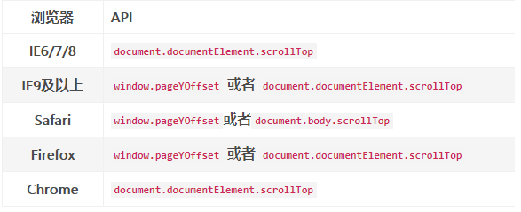

# 屏幕快照

由于某系统专家评审存在丢失专家意见的问题，现场希望能够对专家评审页面截图保存并不被专家察觉。

> 使用html2canvas通过JavaScript的方式来实现屏幕快照功能

##  整体思路

1. 使用html2canvas将指定document对象转换成canvas对象，再从canvas获取指定类型的图片格式的base64流。

2. 将base64流传输至后台进行持久话操作（可直接对流存储，页面通过iframe接续或转成图片存至文件系统）

3. 在页面将流或图片输出显示

##  相关代码 

1. JS引入

在主页面引入`polyfill.min.js`和`html2canvas.js`

~~~ javascript

~~~

`polyfill.min.js` 的作用：es6转es5，使ie兼容es6 promisse语法,需要加载其他script前

`html2canvas.js` 实现屏幕快照

2. 前端处理

在专家暂存提交时调用截图功能，并将加密base64流回写form表单隐藏域。文本内容过长，建议不要在ajax中直接传递此参数。

调用API生成当前屏幕快照，在需要触发屏幕快照的位置调用下面的代码，该代码将屏幕快照转换为指定类型的图片格式的base64流。

~~~ javascript
html2canvas(document.getElementById('formDiv'),{
			logging: false, //日志开关，便于查看html2canvas的内部执行流程
			scrollY: getPageScroll(),
			scrollX: 0,
			useCORS: true,
onclone :function (dom) {
//处理textarea 不换行问题
$(dom.getElementById("formDiv")).find("textarea").each(function () {
$(this).replaceWith("
<pre>"+$(this).val()+"</pre>
");
});
}
}).then(function(canvas) {
				var imageData = canvas.toDataURL("image/png");
				imageData = imageData.replace("data:image/png;base64,", "");
				$("#imageData").val(imageData);
	});
~~~

 scrollY：y轴偏移量，此案例中未滚动条高度（此处通过含少数计算，不能写在promise语法外，否则取不到）

 scrollX：x轴偏移量,此案例中横坐标不出现滚动条，不需要设置偏移量

 useCORS：是否支持跨域（主要针对document内是否有站外引用其他图片）

 canvas.toDataURL("image/png")：指定输出为那种类型文件流文件

 **获取滚动条高度方法**

由于不同浏览器获取滚动条高度方法不同，这里通过`getPageScroll`封装了多浏览器的滚动条高度获取方法

~~~ javascript
function getPageScroll(){
		var yScroll;
		if (self.pageYOffset) {
			yScroll = self.pageYOffset;
			//xScroll = self.pageXOffset;
		} else if (document.documentElement && document.documentElement.scrollTop){
			yScroll = document.documentElement.scrollTop;
		} else if (document.body) {
			yScroll = document.body.scrollTop;
		}
		return 0-yScroll;
	}
~~~

3. 后台存储

- 后台将前端传入的base64字节流转img进行存储

- 文件名为当前时间戳，存储地址为各个环境下文件系统绝对路径下ScreenCapture/日期文件夹

- 具体转化方法请见工具类`ImageBase64.java`,此处调用传入四个参数base64流字符串、存储路径、文件名和文件类型

~~~ java
// 设置日期格式，作为图片名
DateFormat dfImageName = new SimpleDateFormat("yyyyMMddhhmmss");
String fileName = dfImageName.format(new Date());
// 设置日期格式，作为目录名
DateFormat dfDirectory = new SimpleDateFormat("yyyyMMdd");
// 创建一个用于保存图片的文件夹
String savePath =  "ScreenCapture" + File.separator + dfDirectory.format(new Date());
String absolutePath = buildAbsoluteFilePath(savePath);
ImageBase64.base64StringToImage(base64img,absolutePath,fileName,"png");
~~~

4. 页面展示

通过tb_show进行弹框展示下述页面进行图片展示

~~~ jsp
<html>
<head>
<title>查看评议表截图</title>
<%@ include file="/common/meta.jsp"%>
</head>
<body>
<c:set var="file">${domainPath }${res_app2 }/${filePath }</c:set>

</body>
</html>
~~~

img宽度可设置略短于tb_show设置的弹框宽度，高度auto。

## 实际问题

> 曾出现的问题

1. canvas对象获取base流时抛`Cannot read property 'ownerDocument' of null`异常 

可能是以下4种原因

- html2canvas第一个参数document必须是js原生对象，不能使用jquery对象

- 无法获取到对应的document，可能id错误

- html2canvas只支持div元素，所以获取的document对象必须指定是哪块div

- html2canvas不支持iframe

2. 截取图像位置偏移问题

开发初期，截取的图像上不总是为一大片空白，下部分不能截完全，经过多方尝试参考html2canvas的api发现可以通过控制偏移量解决。至于向上偏移还是向下偏移，偏移多少经过试验可以得到，当y坐标出现滚动条时，y轴偏移量为滚动条高度的负值。

3. 兼容性问题

兼容性从两方面出发，一方面是html2canvas.js使用了大量promise语法，ie浏览器不支持es6,此时需引入polyfill.min.js，该js的作用就是使得ie浏览器能识别promise语法。

另一方面，在获取滚动条高度时，不同浏览器语法不同且不通用，已经封装至getPageScroll函数内。
	 
4. textarea问题
	
屏幕快照会导致大文本域中的内容显示不全或者丢失保存格式。通过查阅文档发现，可以在`onclone`回调方法中将`textarea`替换成`div`并且使用`pre`来保留格式，可以查阅上文**前端处理**。

 
 
参考文档：
 
[html2canvas官网](http://html2canvas.hertzen.com/)