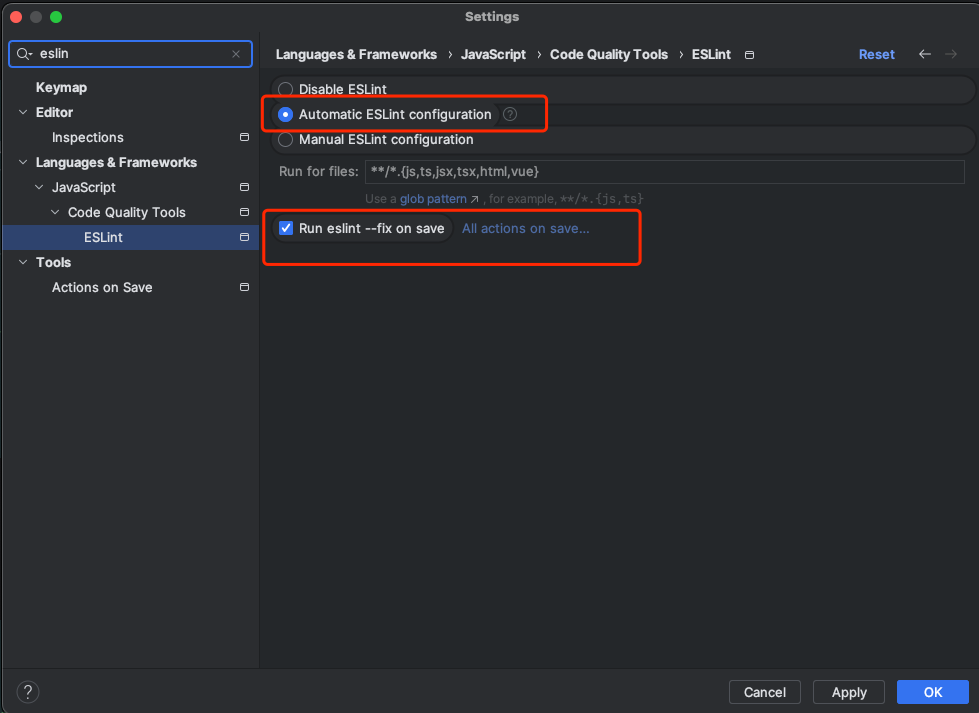

---
category:
  - 前端
tag:
  - node
  - config
  - eslint
date: 2023-12-21
---

# 配置

> 在[RuoYi-Vue](https://gitee.com/y_project/RuoYi-Vue)前端项目基础上面增加一些基础配置

## Eslint

通过使用[ESLint](https://eslint.org/) 检查代码，并做修复。

推荐使用[antfu-eslint-config](https://github.com/antfu/eslint-config)作为默认配置，在此基础上面根据自己的需要进行调整。使用方式如下：

> 不同版本的配置方式可能存在差异，当前基于2.4.6进行配置。

- 安装eslint

```shell
pnpm i -D eslint @antfu/eslint-config
```

推荐package.json中type设置为`module`

- 在项目根目录下创建eslint.config.js，并按需调整。

```js
// eslint.config.js
import antfu from '@antfu/eslint-config'
// package.json可以配置成
//    "lint": "eslint .",
//     "lint:fix": "eslint . --fix",
/*可以配置成保存自动fix*/
export default antfu({}, {
    "rules": {
        "curly": "off",
        "no-console": "off",
        "vue/component-tags-order": ["error", {
            "order": [["script", "template"], "style"]
        }]
    }
})
```

- 增加script

```json {5,6}
// package.json
{
  "scripts": {
    "lint": "eslint .",
    "lint:fix": "eslint . --fix"
  }
}
```

在VSCode或者WebStorm中可以设置成保存自动执行`eslint fix`，通过Cmd/Ctrl + S触发，在WebStorm中当前没有修改过的文件可能无法触发。



```json
// settings.json VSCode
{
  "editor.codeActionsOnSave": {
    "source.fixAll": "never",
    "source.fixAll.eslint": "explicit",
    "source.organizeImports": "never"
  }
}
```

## husky

利用[husky](https://github.com/typicode/husky)实现项目规范，完成执行测试、代码规范检查、提及代码消息格式检查等一系列工作。

- 安装husky

```shell

pnpm add husky -D

```

- 增加prepare命令

```shell {5}
# package.json
{
  "name": "",
  "scripts": {
    "prepare": "husky install",
  }
}
```

- 运行prepare

```shell
pnpm run prepare
```

- 增加pre-commit

```shell
npx husky add .husky/pre-commit "npm test"
```

- 设置pre-commit

```shell
#!/usr/bin/env sh
. "$(dirname -- "$0")/_/husky.sh"

#npm test
# 与eslint、stylelint结合

# 与@commitlint结合
# pnpm add @commitlint/{config-conventional,cli} -D


# 用于测试
#exit 1 # Commit will be aborted
```

## commitlint

> 需要提前安装好husky

- 安装

```shell
# 安装commitlint和commitlint通用配置。这里可以不安装通用配置并自行配置
npm install --save-dev @commitlint/{cli,config-conventional}
# husky增加commit-msg
npx husky add .husky/commit-msg  'npx --no -- commitlint --edit ${1}'
git add .husky/commit-msg
```

- 在根目录下增加commitlint.config.ts

```ts
// 在IDEA中安装Git Commit Template插件，辅助生成规范的提交消息的编写格式。插件地址：https://github.com/MobileTribe/commit-template-idea-plugin
// 消息的标准格式：
// <type>(<scope>): <subject>
// <BLANK LINE>
// <body>
// <BLANK LINE>
// <footer>
// 大致分为三个部分(使用空行分割):
// - 标题行: 必填, 描述主要修改类型和内容
// - 主题内容: 描述为什么修改, 做了什么样的修改, 以及开发的思路等等
// - 页脚注释: 放 Breaking Changes 或 Closed Issues
// type部分包含：
//     feat("Features", "A new feature"),
//     fix("Bug Fixes", "A bug fix"),
//     docs("Documentation", "Documentation only changes"),
//     style("Styles", "Changes that do not affect the meaning of the code (white-space, formatting, missing semi-colons, etc)"),
//     refactor("Code Refactoring", "A code change that neither fixes a bug nor adds a feature"),
//     perf("Performance Improvements", "A code change that improves performance"),
//     test("Tests", "Adding missing tests or correcting existing tests"),
//     build("Builds", "Changes that affect the build system or external dependencies (example scopes: gulp, broccoli, npm)"),
//     ci("Continuous Integrations", "Changes to our CI configuration files and scripts (example scopes: Travis, Circle, BrowserStack, SauceLabs)"),
//     chore("Chores", "Other changes that don't modify src or test files"),
//     revert("Reverts", "Reverts a previous commit");
// scope: commit 影响的范围, 比如: route, component, utils, build...
// subject: commit 的概述, 建议符合 50/72 formatting https://stackoverflow.com/questions/2290016/git-commit-messages-50-72-formatting
// body: commit 具体修改内容, 可以分为多行, 建议符合 50/72 formatting
// footer: 一些备注, 通常是 BREAKING CHANGE 或修复的 bug 的链接.

// <type>(<scope>): <subject>是必须的，<body>部分我们也建议适当描述。
module.exports = {
    // 继承常规的设置
    extends: ['@commitlint/config-conventional'],
    // 本地规则 https://commitlint.js.org/#/reference-rules 会覆盖 @commitlint/config-conventional中的内容
    rules: {
        'body-max-line-length': [2, 'always', 300],
        'header-max-length': [2, 'always', 100],
    },
}

```

## 限制使用包管理器

增加script

```shell {4}
# package.json
{
  "scripts": {
    "preinstall": "npx only-allow pnpm"
  }
}
```

## Typescript

- 安装

```shell
pnpm add typescript -D
```

- 在根目录下创建tsconfig.json,按需调整

```json
// tsconfig.json
{
  "compilerOptions": {
    "baseUrl": "./",
    "module": "ESNext",
    "target": "ESNext",
    "lib": [
      "DOM",
      "ESNext"
    ],
    "strict": true,
    "esModuleInterop": true,
    "jsx": "preserve",
    "skipLibCheck": true,
    "moduleResolution": "node",
    "resolveJsonModule": true,
    "noUnusedLocals": true,
    "strictNullChecks": true,
    "allowJs": true,
    "forceConsistentCasingInFileNames": true,
    "types": [
      "vitest",
      "vite/client",
      "vue/ref-macros",
      "element-plus/global"
    ],
    "paths": {
      "@/*": [
        "src/*"
      ]
    },
    "outDir": "dist"
  },
  "exclude": [
    "dist",
    "node_modules"
  ]
}

```

## vitest

增加vitest测试框架

``` shell
pnpm add vitest -D
```

## unplugin

[unplugin-vue-components](https://github.com/unplugin/unplugin-vue-components)自动导入组件

[unplugin-auto-import](https://github.com/unplugin/unplugin-auto-import)自动导入指令

## Git

设置Git仓库的git message格式校验、代码检查等。

## 示例项目

待补充...
