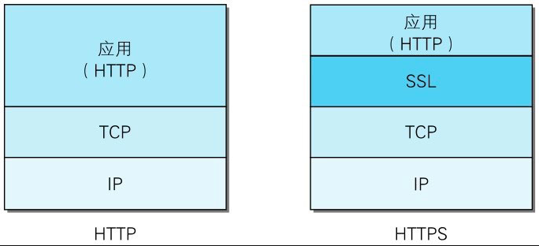
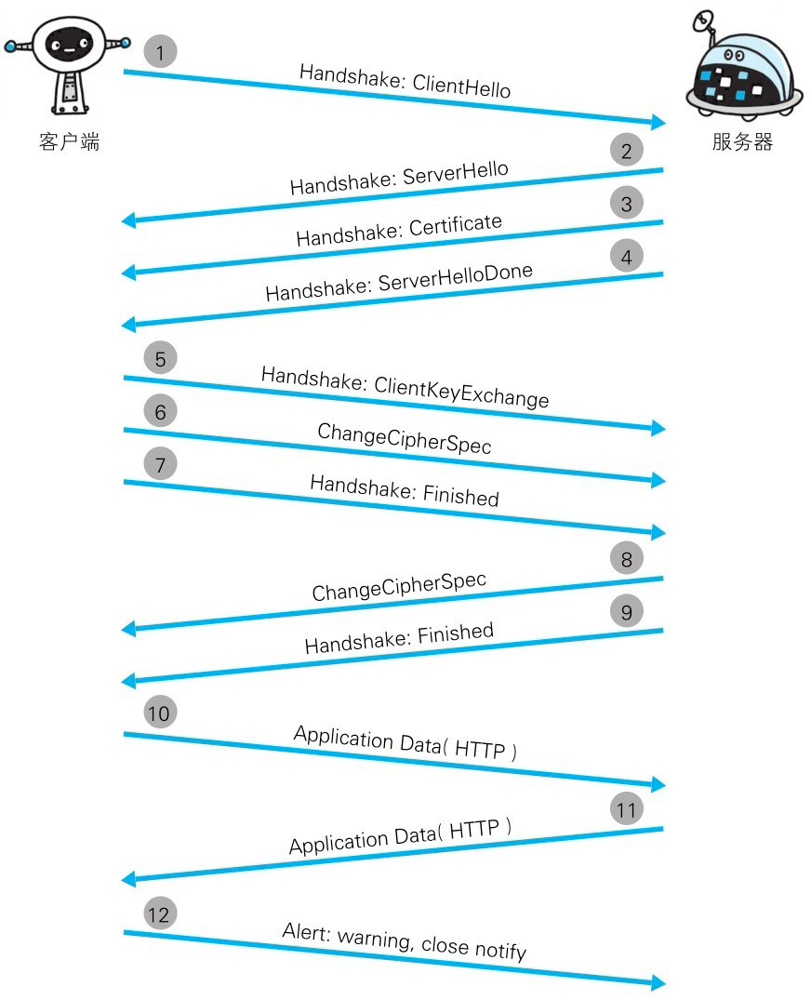

# HTTPS

## 什么是HTTPS

HTTP加上**加密处理**和**认证**以及**完整性保护**后即是HTTPS

HTTPS是身披SSL外壳的HTTP

HTTPS并非是应用层的一种新协议。只是HTTP通信接口部分用SSL（SecureSocket Layer）和TLS（Transport Layer Security）协议代替而已。

通常，HTTP直接和TCP通信。当使用SSL时，则演变成先和SSL通信，再由SSL和TCP通信了。简言之，所谓HTTPS，其实就是身披SSL协议这层外壳的HTTP。

## 为什么要使用HTTPS

HTTP有以下不足：

- 通信使用明文（不加密），内容可能会被窃听

- 不验证通信方的身份，因此有可能遭遇伪装

- 无法证明报文的完整性，所以有可能已遭篡改

为了有效防止这些弊端，有必要使用HTTPS

## 加密方式

HTTPS采用共享密钥加密和公开密钥加密两者并用的混合加密机制。

若密钥能够实现安全交换，那么有可能会考虑仅使用公开密钥加密来通信。但是公开密钥加密与共享密钥加密相比，其处理速度要慢。所以应充分利用两者各自的优势，将多种方法组合起来用于通信。

在交换密钥环节使用公开密钥加密方式，之后的建立通信交换报文阶段则使用共享密钥加密方式。

简单来说就是“客户端使用公钥对一个共享密钥进行加密，然后服务器拿到数据之后使用公钥对应对私钥进行解密，从中获取到共享密钥”

### 证书

公钥和私钥是成对的，服务器如何将公钥告知客户端呢？如果还是通过网络传输，那岂不是又存在被中间人获取的风险。这里就需要一个客户端和服务器都信任的第三方机构来完成这项担保工作。

服务器将自己的公钥向第三方机构申请证书，客户端向服务器请求证书，拿到证书之后用缓存在本地的第三方机构的公钥对证书进行解密，拿到服务器提供的加密公钥。

仅仅是这样还不够，因为中间人也可以向第三方申请证书。当中间人拦截请求，将原本当证书替换为自己申请的证书，由于证书都是由同一个第三方机构颁发的，所以在客户端都是可以解密的，客户端并不知道证书是否被调包了。

所以还需要数字签名和认证。

### 数字签名和认证

服务器将自己的公钥向第三方发送申请证书请求时，第三方大概会做几件事：

1. 公钥（第三方私钥加密）、生成证书的方法（如：md5）等信息作为证书的内容

2. 根据证书内容，使用对应的方法生成一个证书编号

3. 证书编号通过第三方机构私钥进行加密，这个也叫做数字签名

4. 证书内容 + 数字签名整合为最终的证书

每次客户端从服务器中获取到证书之后会对证书进行验证：

1. 如果客户端计算出来的证书编号与证书中的证书编号相同，则验证通过：

现实中，浏览器和操作系统都会维护一个权威的第三方机构列表（包括它们的公钥）。因为客户端接收到的证书中会写有颁发机构，客户端就根据这个颁发机构的值在本地找相应的公钥。

> 证书就是HTTPS中数字证书，证书编号就是数字签名，而第三方机构就是指数字证书签发机构（CA）

## 通信过程

服务器、客户端双方需要通过ROOT CA建立双向信任

HTTPS的通信步骤主要分为两个阶段：

1. 通过握手协议建立SSL连接（1～9）
	
客户端发起请求，携带客户端生成的随机数、以及客户端支持的加密方法等信息

服务器将**公开密钥证书**传给客户端，携带服务器生成的随机数、确认双方使用的加密方法等信息

客户端将共享密钥（Pre-master secret的随机密码串）通过服务器提供低公钥加密之后，传递给服务器。

双方根据约定的加密方法，使用前面的三个随机数，生成"对话密钥"（session key），用来加密接下来的整个对话过程
	
2. SSL连接建立成功之后，进行应用层协议的通信，即发送HTTP请求。

> 《图解HTTP》
> 
> [图解SSL/TLS协议](http://www.ruanyifeng.com/blog/2014/09/illustration-ssl.html)
> 
> [HTTPS 证书被伪造了怎么办？](https://network.51cto.com/art/202007/620700.htm)