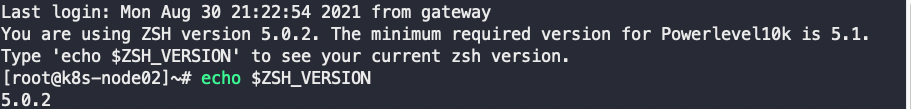

# Linux安装与配置

::: tip
主要是针对虚拟机CentOS安装方法
:::

## 下载

地址１：[https://man.linuxde.net/download/CentOS_6_8](https://man.linuxde.net/download/CentOS_6_8)

地址２：[https://mirrors.aliyun.com/centos/](https://mirrors.aliyun.com/centos/)

[CentOS所有版本下载地址分享](https://www.linuxidc.com/Linux/2016-08/133846.htm)

[CentOS-7-x86_64-Minimal-2009.iso](https://mirrors.aliyun.com/centos/7/isos/x86_64/CentOS-7-x86_64-Minimal-2009.iso)

## 安装

新建虚拟机，跟着指示往一步步进行安装。

## 配置

### 配置网络
minimal版本缺少很多东西，没有`ifconfig`命令，可用`ip address`能够看到一些网络信息。刚安装完是上不了网的，原因是没有开启网卡。

启动网卡

1. 修改网卡配置vi /etc/sysconfig/network-scripts/ifcfg-ens33

将onboot=no 改成yes

2. 重启网卡 /etc/init.d/network restart

3. ping www.baidu.com进行测试


配置固定IP

Mac中参考[Mac VMware Fusion CentOS7配置静态IP](https://www.cnblogs.com/itbsl/p/10998696.html)

改完之后要重启网卡

如：

`cat /Library/Preferences/VMware Fusion/vmnet8/nat.conf`

``` conf {9-11}
# VMware NAT configuration file
# Manual editing of this file is not recommended. Using UI is preferred.

[host]

# Use MacOS network virtualization API
useMacosVmnetVirtApi = 1

# NAT gateway address
ip = 192.168.143.1
netmask = 255.255.255.0

# Last DHCP address
lastDhcpAddress = 192.168.143.127

# VMnet device if not specified on command line
device = vmnet8

略...

```

`cat /Library/Preferences/VMware Fusion/vmnet8/dhcpd.conf`

``` conf {6}
allow unknown-clients;
default-lease-time 1800;                # default is 30 minutes
max-lease-time 7200;                    # default is 2 hours

subnet 192.168.143.0 netmask 255.255.255.0 {
	range 192.168.143.128 192.168.143.254;
	option broadcast-address 192.168.143.255;
	option domain-name-servers 192.168.143.2;
	option domain-name localdomain;
	default-lease-time 1800;                # default is 30 minutes
	max-lease-time 7200;                    # default is 2 hours
	option netbios-name-servers 192.168.143.2;
	option routers 192.168.143.2;
}
host vmnet8 {
	hardware ethernet 00:50:56:C0:00:08;
	fixed-address 192.168.143.1;
	option domain-name-servers 0.0.0.0;
	option domain-name "";
	option routers 0.0.0.0;
}

```

本机DNS：192.168.0.1 和 114.114.114.114

修改之后的/etc/sysconfig/network-scripts/ifcfg-ens33

~~~ apacheconf {4,15-19}
TYPE=Ethernet
PROXY_METHOD=none
BROWSER_ONLY=no
BOOTPROTO=static
DEFROUTE=yes
IPV4_FAILURE_FATAL=no
IPV6INIT=yes
IPV6_AUTOCONF=yes
IPV6_DEFROUTE=yes
IPV6_FAILURE_FATAL=no
IPV6_ADDR_GEN_MODE=stable-privacy
NAME=ens33
UUID=bc77f5df-bb3e-4d35-b818-55777477605a
DEVICE=ens33
ONBOOT=yes
IPADDR=192.168.143.129
GATEWAY=192.168.143.1
NETMASK=255.255.255.0
DNS1=192.168.0.1
DNS2=114.114.114.114
~~~

安装ifconfig命令 `yum install net-tools.x86_64`后，可以通过ifconfig观察ip。

### 更新yum源

先安装wget命令：`yum install wget`

[阿里源](https://developer.aliyun.com/mirror/centos?spm=a2c6h.13651102.0.0.3e221b115kbrLJ)

安装yum工具`yum install -y yum-utils`包含`yum-config-manager`


### 配置ssh

``` shell
# 安装ssh服务
yum install openssh-server
# 启动ssh服务
service sshd start
```

配置xshell连接linux终端

### 更新内核

~~~shell
yum update kernel 
yum update && yum upgrade
~~~

### 安装其他工具

~~~ shell
yum install p7zip 
yum install gcc
yum install java
yum install lrzsz

~~~

### 创建用户
useradd username  创建用户
passwd username  给已创建的用户设置密码
userdel username  删除用户


### 设置共享文件夹

``` shell
# 检查是否安装了samba
rpm -qi samba

# 安装samba
yum install samba
```


[配置网络](https://cloud.tencent.com/developer/article/1508541)


### 安装oh-my-zsh

切换zsh

``` shell
yum install -y zsh

# 查看已有shell，找到zsh的路径
cat /etc/shells

# 切换shell
sudo chsh -s /bin/zsh

# 查看是否切换成功。
echo $SHELL

# 参考mac的zsh安装步骤

# zsh插件
  git clone https://gitee.com/wangnd/zsh-completions.git ${ZSH_CUSTOM:=~/.oh-my-zsh/custom}/plugins/zsh-completions


git clone https://gitee.com/mo2/zsh-syntax-highlighting.git ${ZSH_CUSTOM:=~/.oh-my-zsh/custom}/plugins/zsh-highlighting

echo "source ${ZSH_CUSTOM:=~/.oh-my-zsh/custom}/plugins/zsh-highlighting/zsh-syntax-highlighting.zsh" >> ${ZDOTDIR:-$HOME}/.zshrc


git clone https://gitee.com/pankla/zsh-autosuggestions.git ${ZSH_CUSTOM:-~/.oh-my-zsh/custom}/plugins/zsh-autosuggestions

git clone --depth=1 https://gitee.com/romkatv/powerlevel10k.git ${ZSH_CUSTOM:-$HOME/.oh-my-zsh/custom}/themes/powerlevel10k

ZSH_THEME="powerlevel10k/powerlevel10k"

# 查看已有主题
ls .oh-my-zsh/themes


```


安装Powerlevel10k主题

如果出现以下错误就升级zsh



如果是centos是用yum升级，只能升级到5.0.2。需要手动升级

[手动升级](https://blog.csdn.net/qq_40938528/article/details/117338066)

~~~ shell
# 复制到虚拟机
scp zsh-5.8.tar.xz  root@192.168.143.129:/opt

tar -xvf zsh-5.8.tar.xz

cd zsh-5.8/

#安装gcc
yum install gcc

# 安装ncurses-devel或者curses-devel
yum install ncurses-devel
# yum install gcc  ncurses-devel
# 删除低版本zsh
sudo yum remove zsh

./configure

make && make install

#/etc/shells中添加/usr/local/bin/zsh
cat >> /etc/shells << EOF
/usr/local/bin/zsh
EOF

sudo chsh -s /usr/local/bin/zsh

#导入配置  scp ~/.p10k.zsh  root@192.168.143.131:/opt
# cp /opt/.p10k.zsh ~/
~~~

实在不行，安装不了10就安装9