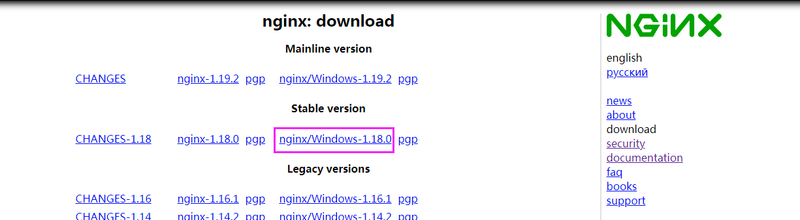
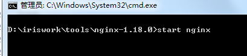
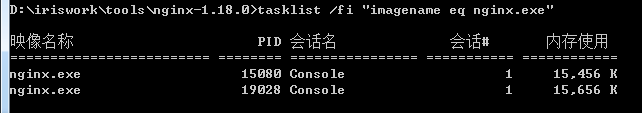
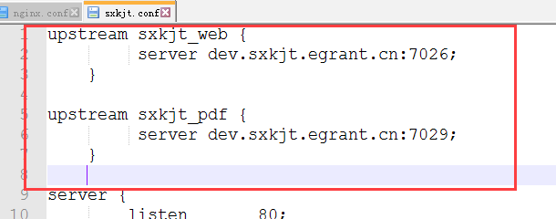
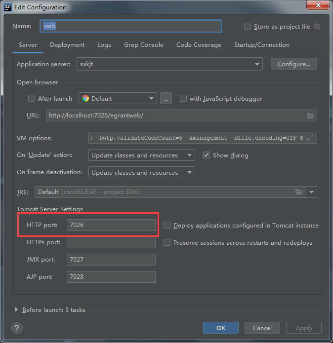

# windows版

## 安装方式

[官网资料](http://nginx.org/en/docs/windows.html)

1. 下载安装包

  


 
 [下载地址](http://nginx.org/en/download.html)
 
2. 解压安装包


3. 启动nginx

   通过cmd进入nginx-1.18.0目录

   可以在文件夹地址栏直接输入cmd+回车，快速通过cmd进入当前路径下。

   执行`start nginx` ，会出现一闪而过的现象，此现象正常。接下来确认下nginx是否启动。

   

   通过`tasklist`查看nginx进程，确认是否启动

   ```bash
   tasklist /fi "imagename eq nginx.exe"
   ```

   

   能看到进程说明启动成功了，这里显示了两个进程，一个是主进程，另一个是工作进程。

   如果nginx没有启动，可以通过查看错误日志文件 `logs\error.log`

   如果错误日志没有创建，原因会被报告至`Windows Event Log`

   如果错误页面没有按照预先设置好的页面展示，也可以通过错误日志查找原因

   Windows版的nginx使用运行他的目录作为配置中相对路径的前缀

   **配置文件中路径必须被指定为UNIX风格，使用斜杠**

   ~~~
   access_log   logs/site.log;
   root         C:/web/html;
   ~~~

4. 运行方式

   Windows版本的nginx作为标准的控制台应用(而不是服务)，可以通过一些命令来管理。

   ~~~ shell
   nginx -s stop	fast shutdown
   nginx -s quit	graceful shutdown
   nginx -s reload	changing configuration, starting new worker processes with a new configuration, graceful shutdown of old 					worker processes
   nginx -s reopen	re-opening log files
   ~~~

   

## 配置文件

采用主配置文件+项目配置文件的方式，将每一个项目独立配置，主配置文件进行引入。

- 项目配置文件

  创建目录

  D:\iriswork\tools\nginx-1.18.0\conf\egrant

  创建项目配置文件，如:sxkjt.conf
  
  如果有servers目录，可不创建egrant，把配置文件放入servers目录下

  ~~~ conf
  upstream sxkjt_web {
           server 127.0.0.1:7026;
      }
  
  upstream sxkjt_pdf {
           server 127.0.0.1:7029;
      }
  	
  server {
          listen       80;     
          server_name   dev.sxkjt.egrant.cn;
          #add_header X-Frame-Options ALLOWALL;
          #add_header Access-Control-Allow-Origin *;
  
          #charset koi8-r; 
  
          #access_log  logs/host.access.log  main;
          set_real_ip_from 127.0.0.1;    #允许可此网段过来的访问可以修改real_ip；
          real_ip_header X-Forwarded-For;     #将$x-forward-for的值替换掉real_ip
  
  
           location / {
              root   D:/iriswork/tools/nginx-1.18.0/html;
              index  index.html index.htm;
          }       
       
        
        location /egrantres/ {
  			expires 1s;
                          alias D:/iriswork/egrant-sxkjt/egrant-static-resource/egrantres/;
                  }       
  
        location /egrantres_app/ {
  			expires 1s;
                          alias D:/iriswork/egrant-sxkjt/app-static-resource/egrantres/app/;
                  }    
  				
        location /egrantres_app2/ {
  			expires 1s;
                          alias  D:/iriswork/egrant-sxkjt/app-static-resource/;
                  }       
  
  
  
          location /egrantweb/ {
           proxy_pass http://sxkjt_web;
           proxy_redirect off ;
           proxy_set_header Host $host;
           proxy_set_header X-Real-IP $remote_addr;
           proxy_set_header REMOTE-HOST $remote_addr;
           proxy_set_header X-Forwarded-For $proxy_add_x_forwarded_for;
           proxy_connect_timeout 300;             #跟后端服务器连接超时时间，发起握手等候响应时间
           proxy_send_timeout 300;                #后端服务器回传时间，就是在规定时间内后端服务器必须传完所有数据
           proxy_read_timeout 600;                #连接成功后等待后端服务器的响应时间，已经进入后端的排队之中等候处理
           proxy_buffer_size 256k;                #代理请求缓冲区,会保存用户的头信息以供nginx进行处理
           proxy_buffers 4 256k;                  #同上，告诉nginx保存单个用几个buffer最大用多少空间
           proxy_busy_buffers_size 256k;          #如果系统很忙时候可以申请最大的proxy_buffers
     #      proxy_temp_file_write_size 256k;       #proxy缓存临时文件的大小
           proxy_next_upstream error timeout invalid_header http_500 http_503 http_404;
     #     proxy_max_temp_file_size 128m;
     #      proxy_cache mycache;        
     #      proxy_cache_valid 200 302 60m;        
     #      proxy_cache_valid 404 1m;
       }
  
  
  
         location /egrantpdf/ {
           proxy_pass http://sxkjt_pdf;
           proxy_redirect off ;
           proxy_set_header Host $host;
           proxy_set_header X-Real-IP $remote_addr;
           proxy_set_header REMOTE-HOST $remote_addr;
           proxy_set_header X-Forwarded-For $proxy_add_x_forwarded_for;
           proxy_connect_timeout 600;
           proxy_send_timeout 600;
           proxy_read_timeout 600;
           proxy_buffer_size 256k;
           proxy_buffers 4 256k;
           proxy_busy_buffers_size 256k;
      #     proxy_temp_file_write_size 256k;
           proxy_next_upstream error timeout invalid_header http_500 http_503 http_404;
      #     proxy_max_temp_file_size 128m;
      #     proxy_cache mycache;
      #     proxy_cache_valid 200 302 60m;
      #     proxy_cache_valid 404 1m;
      }
   }
  ~~~
  
  
  
- 主配置文件

  D:\iriswork\tools\nginx-1.18.0\conf\nginx.conf

    nginx.conf中引入项目配置文件`	include egrant/sxkjt.conf;`

  ~~~
  
  #user  nobody;
  worker_processes  36;
  
  #error_log  logs/error.log;
  #error_log  logs/error.log  notice;
  #error_log  logs/error.log  info;
  
  #pid        logs/nginx.pid;
  
  
  events {
      worker_connections  1024;
  }
  
  
  http {
      include       mime.types;
      default_type  application/octet-stream;
  
      log_format  main  '$remote_addr - $remote_user [$time_local] "$request" '
                        '$status $body_bytes_sent "$http_referer" '
                        '"$http_user_agent" "$http_x_forwarded_for"';
  
      access_log  logs/access.log  main;
  
      sendfile        on;
      tcp_nopush     on;
  
      #keepalive_timeout  0;
      #keepalive_timeout  65;
      keepalive_timeout  30;
  	
  	#  proxy_cache_path /var/www/cache levels=1:2 keys_zone=mycache:20m max_size=2048m inactive=60m;
  	#  proxy_temp_path /var/www/cache/tmp;
      server_tokens off;
      fastcgi_connect_timeout 3000;
      fastcgi_send_timeout 3000;
      fastcgi_read_timeout 3000;
      fastcgi_buffer_size 256k;
      fastcgi_buffers 8 256k;
      fastcgi_busy_buffers_size 256k;
      fastcgi_temp_file_write_size 256k;
      fastcgi_intercept_errors on;
  
      client_header_timeout 600s;
      client_body_timeout 600s;
      client_max_body_size 100m;       #允许客户端请求的最大单个文件字节数
      client_body_buffer_size 256k;    #缓冲区代理缓冲请求的最大字节数，可以理解为先保存到本地再传给用户
  	
      
      gzip  on;
      gzip_min_length  1k;
      gzip_buffers     4 16k;
      gzip_http_version 1.1;
      gzip_comp_level 6;
      gzip_types       text/plain application/x-javascript text/css application/xml text/javascript application/x-httpd-php;
      gzip_vary on;
      
  	include egrant/sxkjt.conf;
	# include egrant/*;
	# include servers/*;

  }
  ~~~

## 新项目配置

1. 在egrant目录下新增sxkjt.conf文件(根据具体项目修改文件名)

2. 在nginx.conf中将其引入


3. 编辑sxkjt.conf

​        此文件中主要配置了如何将nginx与web服务建立连接，这里配置的是单节点，而非集群方式，集群的配置稍有区别。

**配置upstram**



- upstram是nginx的模块，完成网络数据的接收、处理和转发

- sxkjt_web和sxkjt_pdf是我们为应用服务创建的服务名称。

- 大括号内为服务名称所对应的具体服务，定义了服务的host和端口。在我们项目中对应tomat的http端口

  

**配置虚拟主机server**

- 设置监听端口

  > listen       80;

  监听端口设置为80。因为我们一般直接通过域名访问不指定端口，采用了http的默认80端口，如果采用https方式可以修改为443

- 设置服务名

  > server_name   dev.sxkjt.egrant.cn;

  根据对应的项目进行修改

- 设置location区段

  将静态资源请求直接分发到本地磁盘目录，不通过web服务访问
  
  > location /egrantres/ {
  > 			expires 1s;
  >                         alias D:/iriswork/egrant-sxkjt/egrant-static-resource/egrantres/;
  >                 }  
  >
  >   location /egrantres_app/ {
  > 		expires 1s;
  >                     alias D:/iriswork/egrant-sxkjt/app-static-resource/egrantres/app/;
  >             }     
  
  将服务请求转发到对应的服务，这里的`sxkjt_web`是 upstram中定义的服务名称
  
  > location /egrantweb/ {
  >    proxy_pass http://sxkjt_web;
  >	此处省略...
  >}
  
  修改完配置后执行`nginx -s reload`
  
  
  
## mac

安装 `brew install nginx`

获取帮助信息 `nginx -h`

查询配置信息 `nginx -V`

默认主目录 `/usr/local/Cellar/nginx/1.19.2`

配置文件路径 `/usr/local/etc/nginx/`


启动 `nginx`

