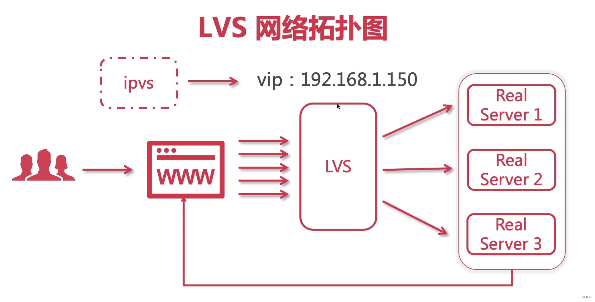

[nginx documentation](https://nginx.org/en/docs/)

## Nginx 配置

### location

``` conf
server {
	listen       80;
  server_name  localhost;

	location / {
		root   html;
		index  index.html index.htm;
	}
	
	# 精确匹配
	location /img/xxx.png {
		root   html;
	}
	
	# 正则表达式 *代表不区分大小写
	location ~* \.(GIF|png|bmp|jpg|jpeg) {
		root   /home;
	}
	
	# 正则表达式 ^~以某个字符路径开头请求
	location ^~ /immoc/img {
		root   /home;
	}
}
```


### Nginx的跨域

- Cors跨域资源共享

- Jsonp、SpringBoot Cors、Nginx

Nginx跨域配置支持

~~~ conf
#允许跨域请求的域，*代表所有 
add_header 'Access-Control-Allow-Origin' *;
#允许带上cookie请求 
add_header 'Access-Control-Allow-Credentials' 'true'; 
#允许请求的方法，比如 GET/POST/PUT/DELETE 
add_header 'Access-Control-Allow-Methods' *; 
#允许请求的header 
add_header 'Access-Control-Allow-Headers' *;
~~~


## 负载均衡概念

四层负载均衡

- F5硬负载均衡

- LVS四层负载均衡

- Haproxy四层负载均衡

- Nginx四层负载均衡

  

七层负载均衡

- Nginx七层负载均衡
- Haproxy七层负载均衡
- apache七层负载均衡

四层负载一般用LVS，主要是用来处理基于TCP、UDP协议，主要是用来转发请求而不是处理。

七层负载一般使用Nginx，主要是是用来处理Http协议，适用于web服务器。他是可以处理请求的，比如对js压缩

DNS地域负载均衡

### 负载均衡算法

常见负载均衡算法：轮询、加权轮询、随机、加权随机、ip hash、url hash、**一致性hash**、least_conn

普通的ip hash很容易因为节点数量调整而重新调整，而且容易造成分布不均的问题。

### 一致性hash算法

对于分布式存储，不同机器上存储不同对象的数据，我们使用哈希函数建立从数据到服务器之间的映射关系。它可以保证当机器增加或者减少时，节点之间的数据迁移只限于两个节点之间，不会造成全局的网络问题。

主要为了解决在分布式部署的情况下，让用户的请求和服务器之间能够保持一个相对稳定的关系，服务器接收到的请求相对均匀。当节点数量修改之后最多只需要调整1～2个节点。

[一致性哈希算法](https://zhuanlan.zhihu.com/p/129049724)


## Nginx的模块化体系


### upstream指令参数

[Module ngx_http_upstream_module (nginx.org)](https://nginx.org/en/docs/http/ngx_http_upstream_module.html)

max_conns 最大连接数

slow_start 慢启动时间（商业版才能使用）

down 设置不可用状态

backup 设置备用机，当其他服务无法使用时开启使用

max_fails、fail_timeout：失败max_fails时就认为宕机，fail_timeout之内不会有请求发送到此宕机的服务，超过时间之后才会尝试请求它，如此反复。


负载均衡策略：轮询、加权轮询、ip hash、url hash、least_conn

``` conf
# ip hash
upstream xxx {
	ip_hash;
}

# url hash
upstream xxx {
	hash $request_uri;
}

# least_conn
upstream xxx {
	least_conn;
}
```

当配置了ip hash算法，如果需要下线某台机器，不能直接把配置删除，要通过增加down属性来完成。

### keepalived配置

[Module ngx_http_upstream_module (nginx.org)](https://nginx.org/en/docs/http/ngx_http_upstream_module.html#keepalive)

提高吞吐量


### 缓存


修改浏览器端缓存

``` conf
# expires [time]
location / {
 expires 10s;
}

# expires @[time]
location / {
 expires @22h20m;
}

# expires -[time] 让缓存失效
location / {
 expires -1h;
}

# expires epoch; 不设置缓存
location / {
 expires epoch;
}

# expires off;  
# expires max;  
```


设置nginx端缓存

``` conf
# proxy_cache_path 设置缓存保存的目录
# key_zone 设置共享内存以及占用空间大小
# max_size 设置缓存大小
# inactive 缓存自动清理时间
# use_temp_path关闭临时目录
proxy_cache_path  /usr/local/nginx/upstream_cache keys_zone=mycache:5m max_size=1g inactive=1m use_temp_path=off;


server {
	listen 80;
	server_name xxxx;
	
	# 开启并且使用缓存
	proxy_cache mycache;
	
	#针对200 和 304状态码的缓存过期时间
	proxy_cache_valid 200 304 8h;
}
```


### 配置ssl

1. 准备证书和密钥
2. Nginx安装SSL模块

~~~ shell
#1.新增--with-http-ssl_module重新执行configure生成makefile
#2.执行make
#3. 执行make install

./configure \
--prefix=/usr/local/nginx \
--pid-path=/var/run/nginx/nginx.pid \
--lock-path=/var/lock/nginx.lock \
--error-log-path=/var/log/nginx/error.log \
--http-log-path=/var/log/nginx/access.log \
--with-http_gzip_static_module \
--http-client-body-temp-path=/var/temp/nginx/client \
--http-proxy-temp-path=/var/temp/nginx/proxy \
--http-fastcgi-temp-path=/var/temp/nginx/fastcgi \
--http-uwsgi-temp-path=/var/temp/nginx/uwsgi \
--http-scgi-temp-path=/var/temp/nginx/scgi
--with-http-ssl_module
~~~

3. 修改Nginx配置文件

   ``` shell
   upstream tomcats {
   
   }
   
   server { 
   	listen 443; 
   	server_name 域名; 
   	# 开启ssl 
   	ssl on; 
   	# 配置ssl证书 
   	ssl_certificate 证书.crt;  #证书密钥都放在conf的目录下
   	# 配置证书秘钥 
   	ssl_certificate_key 密钥.key; 
   	# ssl会话cache 
   	ssl_session_cache shared:SSL:1m; 
   	# ssl会话超时时间 
   	ssl_session_timeout 5m; 
   	# 配置加密套件，写法遵循 openssl 标准 
   	ssl_protocols TLSv1 TLSv1.1 TLSv1.2; 
   	ssl_ciphers ECDHE-RSA-AES128-GCM-SHA256:HIGH:!aNULL:!MD5:!RC4:!DHE; 
   	ssl_prefer_server_ciphers on;
   
   	location / {
   		proxy_pass http://tomcats/;
   		index index.html index.htm;
   	}
   
   }
   ```

   

## Nginx高可用HA

使用Keepalived组件来实现

- 解决单点故障
- 组件免费
- 可以实现高可用HA机制
- 基于VRRP协议

虚拟路由冗余协议VRRP

- Virtual Router Redundancy Protocol
- 解决内网单机故障的路由协议
- 构建有多个路由器MASTER BACKUP
- 虚拟IP-VIP（Vitual IP Address）

### Keepalived双机主备原理


### 安装keepalived

``` shell
tar -zxvf keepalived-2.0.18.tar.gz
cd keepalived-2.0.18/
./configure --prefix=/usr/local/keepalived --sysconf=/etc
# configure出现警告*** WARNING - this build will not support IPVS with IPv6. Please install libnl/libnl-3 dev libraries to support IPv6 with IPVS.
# 安装 yum -y install libnl libnl-devel后重新执行configure
make && make install
whereis keepalived #keepalived: /etc/keepalived /usr/local/keepalived
```


### 双机主备配置步骤

> 两台Nginx机器，192.168.143.129作为Nginx主节点，192.168.143.130为备用节点，虚拟节点为192.168.143.120
>
> hosts 配置
>
> 192.168.143.129 dev.129.com
> 192.168.143.130 dev.130.com
> 192.168.143.120 dev.ha1.com


1. 修改主机配置文件

``` conf
global_defs {
  # 路由id：当前安装keepalived节点主机的标识符，全局唯一
  router_id keep_129
}

# 计算机节点
vrrp_instance VI_1 {
	# 表示的状态 ，当前129机器为主节点 MASTER/BACKUP
 state MASTER
		# 当前实例绑定网卡
    interface ens33
		# 虚拟路由节点 保证主备节点一致
    virtual_router_id 51
		# 优先级/权重，谁的优先级高，在MASTER挂掉以后，就能成为MASTER
    priority 100
	# 主备之间同步检查的时间间隔，默认1s
    advert_int 1
	# 认证授权的密码，防止非法节点的进入
    authentication {
        auth_type PASS
        auth_pass 1111
    }
	# 虚拟IP
    virtual_ipaddress {
        192.168.143.120
    }
}
```
2. 重启之前我们看下ip地址，在ens33网卡下面只有一个ip


``` shell
cd /usr/local/keepalived/sbin
# 启动节点
./keepalived
# 查看 pid ps -ef | grep keepalived 
# 关闭（因为还没有安装keepalived服务）keepalived kill -9 pid
```

3. 启动完keepalived之后多了一个虚拟节点，可以通过此虚拟IP直接访问


这个时候访问dev.ha1.com可以看到129机器服务响应


4. 注册keepalived服务到系统（主备同理）

``` shell
# 注册keepalived服务到系统
cp /home/software/keepalived-2.0.18/keepalived/etc/init.d/keepalived /etc/init.d	
cp /home/software/keepalived-2.0.18/keepalived/etc/sysconfig/keepalived /etc/sysconfig
systemctl daemon-reload
systemctl start keepalived.service
#systemctl restart keepalived.service
```


5. 修改从节点配置文件

```shell
#可以先备份
cp keepalived.conf keepalived.conf.bak
#先将主机上的配置文件copy过来再进行修改
scp /etc/keepalived/keepalived.conf root@192.168.143.130:/etc/keepalived/keepalived.conf
```

6. 备机配置文件keepalived.conf

``` conf
global_defs {
  # 路由id：当前安装keepalived节点主机的标识符，全局唯一
  router_id keep_130 # 修改
}

# 计算机节点
vrrp_instance VI_1 {
# 表示的状态 ，当前129机器为主节点 MASTER/BACKUP
 state BACKUP
# 当前实例绑定网卡
    interface ens33
# 虚拟路由节点 保证主备节点一致
    virtual_router_id 51
# 优先级/权重，谁的优先级高，在MASTER挂掉以后，就能成为MASTER
    priority 80 # 调的比MASTER低一些
# 主备之间同步检查的时间间隔，默认1s
    advert_int 1
# 认证授权的密码，防止非法节点的进入
    authentication {
        auth_type PASS
        auth_pass 1111
    }
# 虚拟IP
    virtual_ipaddress {
        192.168.143.120
    }
}

```

7. 启动服务

``` shell
/usr/local/keepalived/sbin/keepalived
```

这时查看ip，因为主节点还在正常运行，是看不到120这个ip的。


8. 测试

- 访问dev.ha1.com


- 停止主机上的keepalive服务（模拟主机宕机）

``` shell
systemctl stop keepalived.service
```

查看备机ip可以发现，多了一个虚拟ip，虚拟ip已经和备用节点绑定到了一起


访问dev.ha1.com，访问的已经是130备机了。


- 启动主机keepalived服务（模拟主机恢复）

``` shell
systemctl start keepalived.service
```

当主机恢复之后，虚拟ip将重新和主机绑定，访问dev.ha1.com重新回到主机


### 配置Nginx检测脚本

主节点未宕机，Nginx服务挂了

如果是nginx挂了，由于keepalived服务还依旧可以服务，所以虚拟IP还是和主机绑定。但是主机Nginx又无法提供服务，所以就会出现问题。这里需要用脚本去监控Nginx服务状态，在主备节点上分别进行如下操作：

``` shell
# 创建脚本
vim /etc/keepalived/check_nginx_alive_or_not.sh 

# check_nginx_alive_or_not.sh脚本内容如下
#!/bin/bash

A=`ps -C nginx --no-header |wc -l` 
# 判断nginx是否宕机，如果宕机了，尝试重启 
if [ $A -eq 0 ];then 
	/usr/local/nginx/sbin/nginx 
	# 等待一小会再次检查nginx，如果没有启动成功，则停止keepalived，使其启动备用机 
	sleep 3 
	if [ `ps -C nginx --no-header |wc -l` -eq 0 ];then 
		killall keepalived 
	fi 
fi


# 赋权
chmod +x /etc/keepalived/check_nginx_alive_or_not.sh
```

修改keepalived.conf，增加检测脚本配置


``` shell
vrrp_script check_nginx_alive {
    script "/etc/keepalived/check_nginx_alive_or_not.sh"
    interval 2 # 每隔两秒运行上一行脚本 
    weight 10 # 如果脚本运行成功，则升级权重+10
    #weight -10 # 如果脚本运行失败，则降级权重-10
}


track_script { 
    check_nginx_alive # 追踪 nginx 脚本 
}
```


重启keepalived

``` shell
systemctl restart keepalived
```

备机配置

``` shell
scp /etc/keepalived/check_nginx_alive_or_not.sh root@192.168.143.130:/etc/keepalived/
修改keepalived.conf
重启keepalived
```


### 双主热备原理

> 两台Nginx机器，192.168.143.129作为Nginx主节点，192.168.143.130为备用节点，虚拟节点为192.168.143.120
>
> 192.168.143.129作为Nginx备节点，192.168.143.130为主节点，虚拟节点为192.168.143.121
>
> hosts 配置
>
> 192.168.143.129 dev.129.com
> 192.168.143.130 dev.130.com
> 192.168.143.120 dev.ha1.com
>
> 192.168.143.121 dev.ha2.com


主机配置

备机新增主机配置

``` shell
# 新增
# 计算机节点
vrrp_instance VI_2 {
# 表示的状态 ，当前129机器为主节点 MASTER/BACKUP
 state MASTER
# 当前实例绑定网卡
    interface ens33
# 虚拟路由节点 保证主备节点一致
    virtual_router_id 52
# 优先级/权重，谁的优先级高，在MASTER挂掉以后，就能成为MASTER
    priority 100
# 主备之间同步检查的时间间隔，默认1s
    advert_int 1
# 认证授权的密码，防止非法节点的进入
    authentication {
        auth_type PASS
        auth_pass 1111
    }
track_script {
    check_nginx_alive # 追踪 nginx 脚本
}

# 虚拟IP
#    virtual_ipaddress {
  #      192.168.143.121
#    }
}

```

主机新增备机配置

``` shell
# 计算机节点
vrrp_instance VI_2 {
 state BACKUP
# 当前实例绑定网卡
    interface ens33
# 虚拟路由节点 保证主备节点一致
    virtual_router_id 52
# 优先级/权重，谁的优先级高，在MASTER挂掉以后，就能成为MASTER
    priority 80
# 主备之间同步检查的时间间隔，默认1s
    advert_int 1
# 认证授权的密码，防止非法节点的进入
    authentication {
        auth_type PASS
        auth_pass 1111
    }

#track_script {
 #   check_nginx_alive # 追踪 nginx 脚本
#}

# 虚拟IP
    virtual_ipaddress {
        192.168.143.121
    }
}
```


配置完成之后重启，访问dev.ha2.com、dev.ha1.com均正常

如果将192.168.143.129节点关闭keepalived之后，请求将全部打到130节点中。查看130的ip可以发现绑定了两个虚拟IP


## LVS负载均衡

- Linux Virtual Server
- LVS（ipvs）已经被集成到Linux内核中
- 章文嵩博士主导的开源负载均衡项目
- 负载均衡调度器(四层)

[LVS](http://www.linux-vs.org/index.html)

### 网络拓扑图



### 为什要使用LVS+Ngnix

- LVS基于四层，工作效率高

- 单个Nginx承受不了压力，需要集群

- LVS充当Nginx集群的调度着

- Nginx接收请求来回，LVS可以只接收不响应，LVX负载更高

  LVS集成于内核，性能高于应用层的Nginx

### 多种模式

- NAT模式

  优点：

  安全，LVS在公网，RS在内网。

  缺点：

  类似与Nginx，要处理请求，有性能损耗，负载较低。


- TUN模式

  优点：

  只做转发，不处理请求，负载大。

  硬性要求，每一个下行服务器都要有网卡。

  缺点：

  Real Server暴露在公网


- DR模式


## 常见操作

查看请求量

nginx访问量统计

1.根据访问IP统计UV

awk ‘{print $1}’ access.log|sort | uniq -c |wc -l

2.统计访问URL统计PV

awk ‘{print $7}’ access.log|wc -l

3.查询访问最频繁的URL

awk ‘{print $7}’ access.log|sort | uniq -c |sort -n -k 1 -r|more

4.查询访问最频繁的IP

awk '{print $1}' access.log|sort | uniq -c |sort -n -k 1 -r|more

5.根据时间段统计查看日志

cat access.log| sed -n ‘/14\/Mar\/2015:21/,/14\/Mar\/2015:22/p’|more

## 常见问题

### nginx.pid找不到

nginx: [error] open() "/var/run/nginx/nginx.pid" failed (2: No such file or directory)

目录或者文件找不到了

- 创建目录
- 重新指定配置文件目录/usr/local/nginx/sbin/nginx -c /usr/local/nginx/conf/nginx.conf

