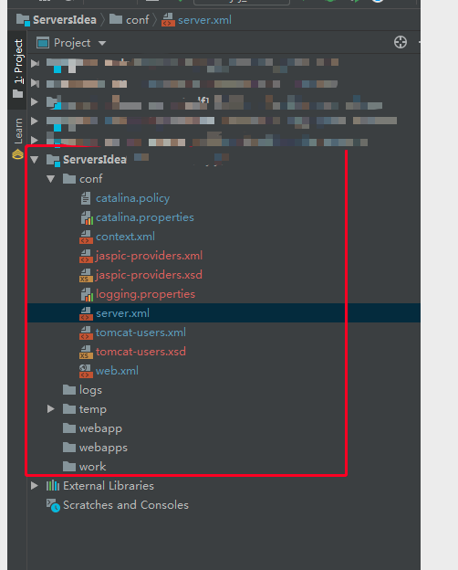
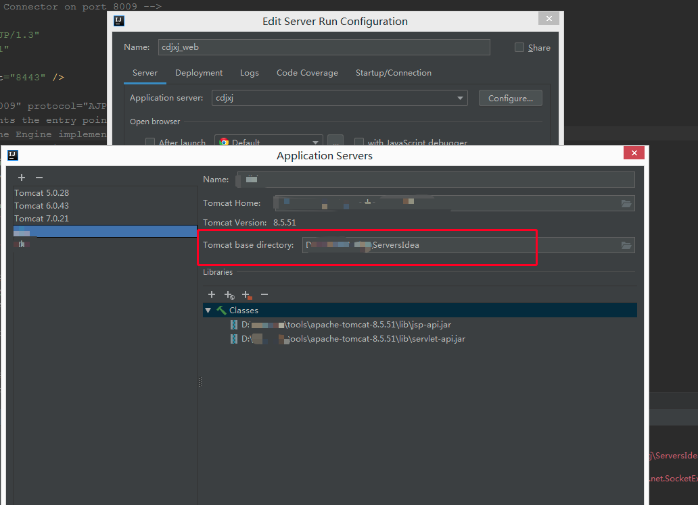
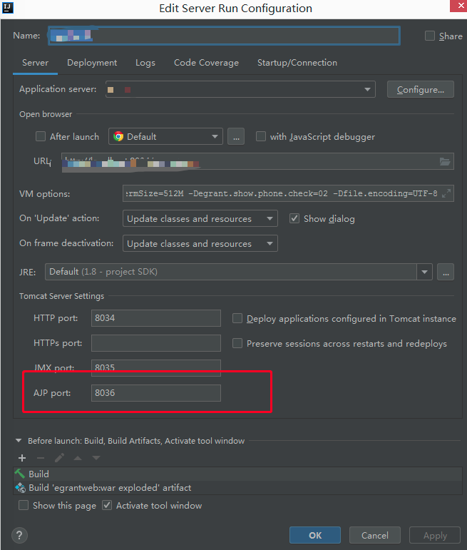
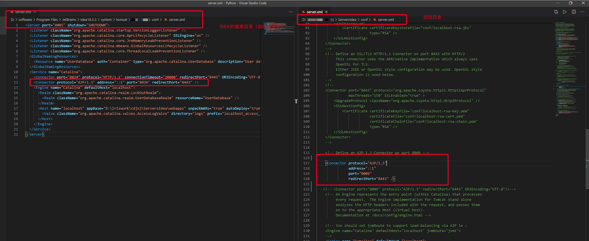

# 常见问题

## 错误一

**报错信息提示 无法打开调试端口**

**场景描述**：

jdk由1.6升级1.8之后，tomcat由7升级成8，同时将项目中的serversIdea文件按照tomcat8.5中的文件copy过来了。

图一（项目服务器配置文件）

图二（项目服务器base目录设置）

图三（项目服务器设置）

**解决办法：**

通过尝试发现需要将项目中服务器配置文件server.xml中的ajp配置需要打开

对idea服务器配置的分析：

需要注意的是idea在启动的时候其实会使用 idea配置文件下面D:\software\Program Files\JetBrains\idea18.3.3\system\tomcat\项目名，下面的服务器配置。

下面是猜想，通过测试得出，暂未找到相关资。

当serversIdea中的server.xml中注释了ajp配置之后 ，启动报错，idea配置文件和项目配置文件是一样的

当serversIdea中的server.xml中打开了ajp配置之后 ，idea配置文件将项目配置文件进行了copy、设置、和压缩几个过程

idea在启动的时候会根据tomcat base directory里面的配置（也就是我们项目重点 serversIdea）copy到idea生成的tomcat服务器配置中，并且会按照服务器配置的端口号（图三）修改server.xml中内容。

过程描述： 
1、复制项目服务器配置中tomcat base directory配置的内容到idea配置目录中tomcat目录下
2、按照项目服务器配置的端口号等其他信息修改配置文件中的内容，比如server.xml

## 错误二

http://tomcat.apache.org/tomcat-8.5-doc/config/ajp.html
根据文档可知，ajp连接器配置不需将 secretRequired设置成false，否则必须要设置一个非空的 secret属性

<Connector protocol="AJP/1.3"
           port="8009"
           redirectPort="8443" URIEncoding="UTF-8" secretRequired="false"/>
		   
		   
		   
## tomcat版本引起jsp报错

ahkjt业务系统从weblogic切换至tomcat之后出现了原正常的jsp页面报错问题（jsp代码确实存在漏洞）。

【图片】

apache-tomcat-6.0.37 切换至 apache-tomcat-6.0.35 之后， jsp报错问题得以解决。