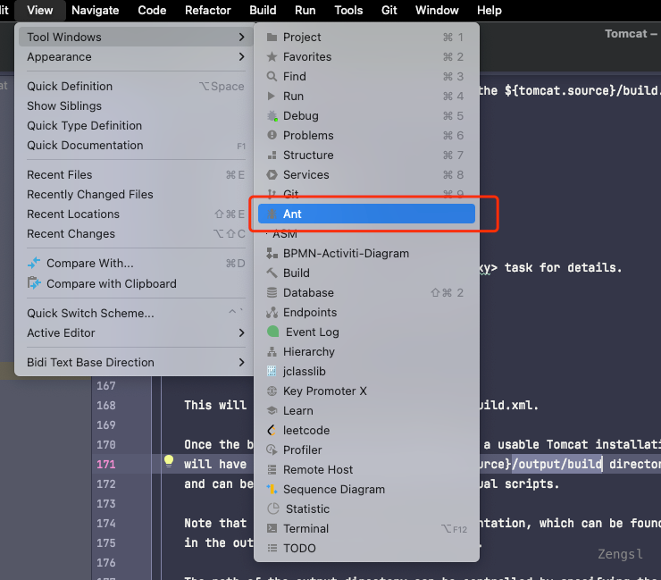
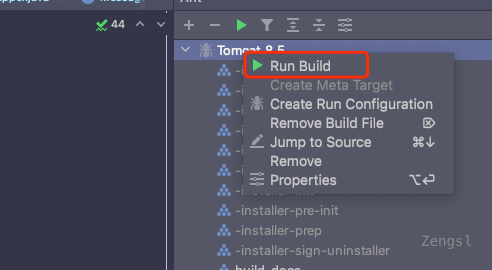
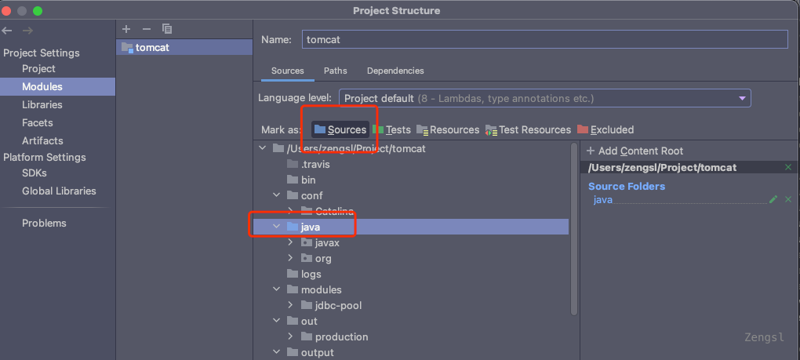
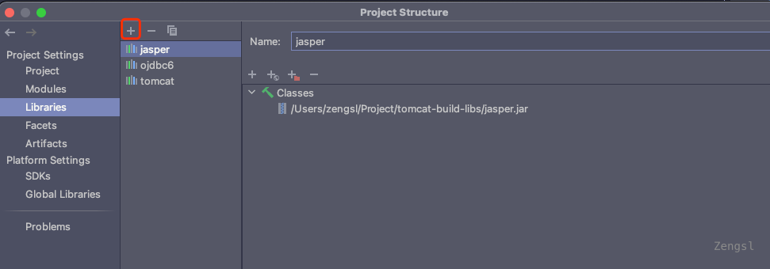
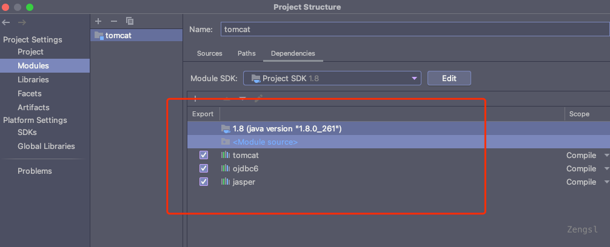
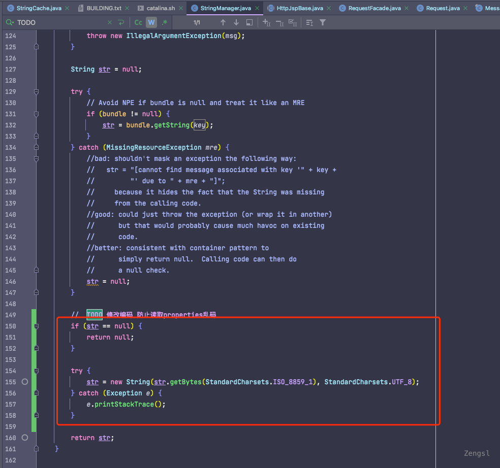
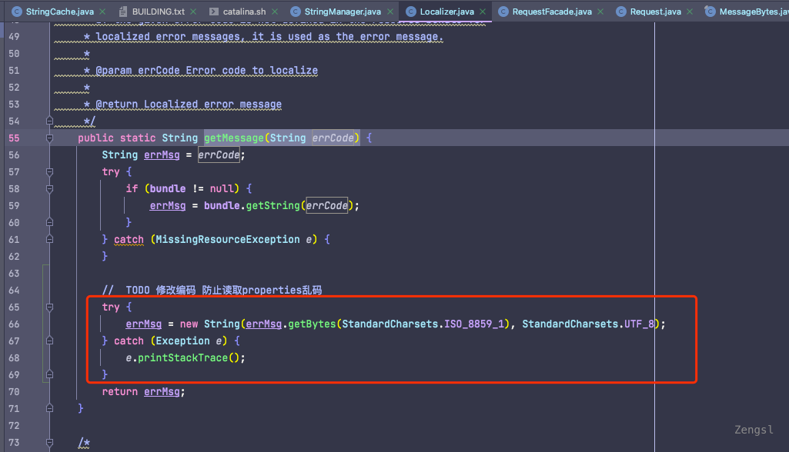
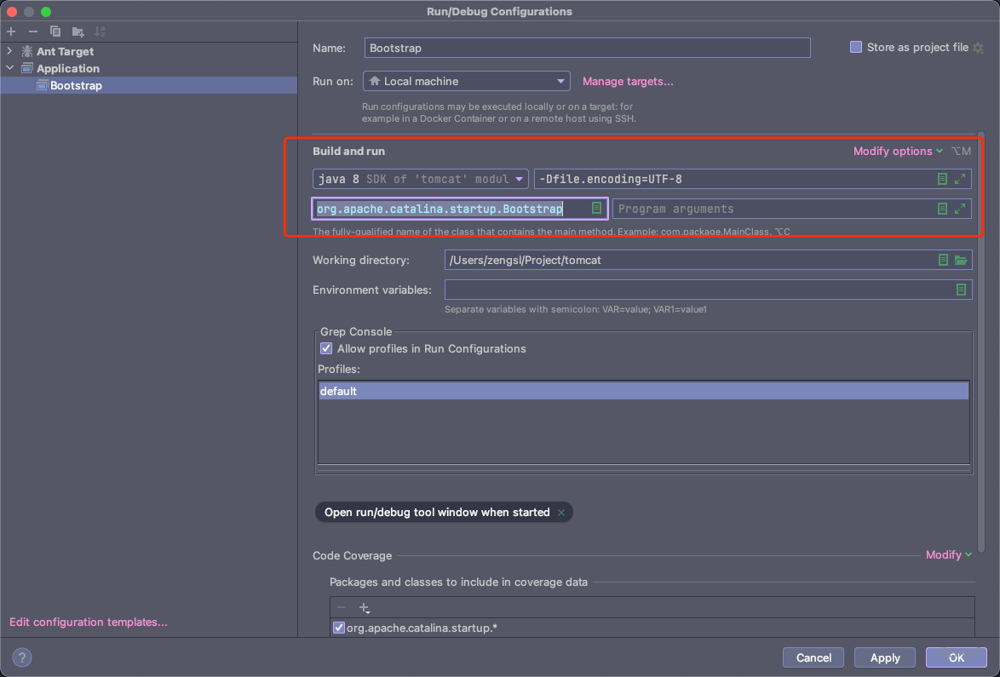
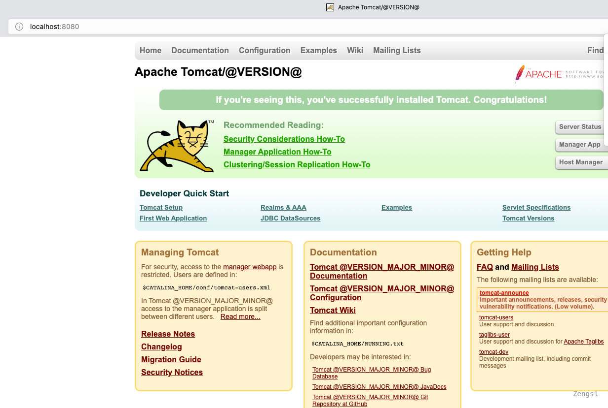

> 以Tomcat8.x为例
# 源码编译

## 源码获取

- [Github](https://github.com/apache/tomcat.git) 推荐
- [官网](https://tomcat.apache.org/download-80.cgi)

> 早期Tomcat使用svn管理代码，低版本[Tomcat6获取地址](http://archive.apache.org/dist/tomcat/tomcat-6/v6.0.1/src/)

## 源码编译

Tomcat源码使用Ant进行编译，编译步骤可以参考源码中BUILDING.txt（根据REAME中描述）的详细内容，这里概括如下：

1. 安装JDK
2. 安装[Ant](https://ant.apache.org/bindownload.cgi)，配置环境变量。
3. 编译源码

编译源码步骤：

- 复制build.properties.default为创建build.properties

- 找到build.properties文件，修改base.path属性，编译所依赖的jar会下载到此参数对应的目录中。
- Ant编译，在项目根目录执行`ant`命令。在/output/build目录下会编译出一个可用的Tomat


### 补充

- Idea使用Ant

如果是使用Idea导项目进行编译的话，那么安装Ant也不是必须的，Idea自带Ant插件。开启和编译方法入下：





配置Ant为非后台编译或选择对应的版本等操作：


## 源码启动

通过编译可以在output/build中生成一个可用的Tomcat，但如果想要调试源码的话还是比较麻烦。通过查看catalina.sh启动脚本发现，最终启动的核心在于运行了`CATALINA_HOME/bin/bootstrap.jar`，解压jar包查看MANIFEST文件。

``` txt {4}
Manifest-Version: 1.0
Ant-Version: Apache Ant 1.10.5
Created-By: 1.8.0_261-b12 (Oracle Corporation)
Main-Class: org.apache.catalina.startup.Bootstrap
Specification-Title: Apache Tomcat Bootstrap
Specification-Version: 8.5
Specification-Vendor: Apache Software Foundation
Implementation-Title: Apache Tomcat Bootstrap
Implementation-Version: 8.5.60-dev
Implementation-Vendor: Apache Software Foundation
X-Compile-Source-JDK: 7
X-Compile-Target-JDK: 7
Class-Path: commons-daemon.jar
```

最终发现入口为`org.apache.catalina.startup.Bootstrap`的main方法。


### Idea手动启动项目

为不对源码做过多修改，这里不采用修改为maven结构的方式。如果想通过maven的方式来启动项目，可以参考下方资料。

- 修改项目结构，将java目录设置为源码目录


    
- 添加依赖，导入编译过程中Ant下载的jar + output/build/lib/jasper.jar+ant.jar。导完之后跟模块做好关联，如下图。

  





ant.jar可以从下载的Ant中获取，因为通过`BootStrap.java`启动时会依赖ant

如果不引入jasper.jar则访问jsp会报错

- 修改的编码

修改国际化资源文件的编码，其他Idea应该设置的编码和server.xml中的编码设置不再赘述。

网上有提供两种做法：[记一次tomcat源码启动控制台中文乱码问题调试过程](https://blog.csdn.net/zhoutaoping1992/article/details/104751705)

这里采用修改代码的方式：

1. 修改`org.apache.tomcat.util.res.StringManager#getString(String key)`



2. 修改`org.apache.jasper.compiler.Localizer#getMessage(String errCode)`



- 配置启动类`BootStrap`



::: tip

因为这里没有过多的需求，要启动的jar直接丢到webapp目录下即可，并没有像网上一样去配置-Dcatalina.home和-Dcatalina.base。可以根据自己的需求去设置。

catalina.home是安装目录

catalina.base是工作目录

多实例部署的时候不需要安装多个Tomcat，可以让实例各自一个工作目录，用于存放conf、log、webapp、lib等非共享信息。同时可以指定同一个安装目录来共享相同的bin文件和lib。

:::

启动Bootstrap之后就可以通过[localhost:8080](localhost:8080)去访问样例项目了。




### 参考资料

[1]. [Tomcat源码学习)](https://gitee.com/stefanpy/tomcat-source-code-learning)

[2].[使用Ant从零开始搭建tomcat源码环境](https://blog.csdn.net/xu1204013031/article/details/111766400)

[3]. [记一次tomcat源码启动控制台中文乱码问题调试过程](https://blog.csdn.net/zhoutaoping1992/article/details/104751705)

[4]. [Apache Tomcat 8 Configuration Reference (8.5.73) - The Host Container](http://tomcat.apache.org/tomcat-8.5-doc/config/host.html)
