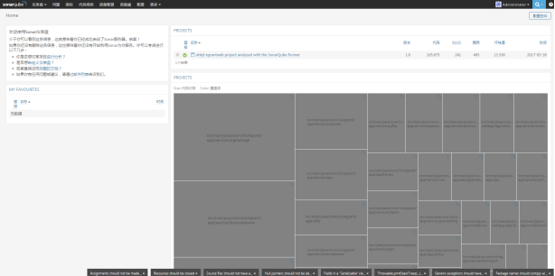
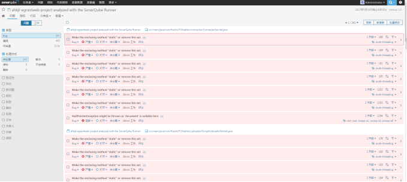

---
tags:
  - 工具
  - Sonar
title: 使用
---

# SonarQube的使用

::: warning
安装目录请不要使用中文
:::

## 安装sonar 
进入[下载地址](https://www.sonarqube.org/downloads/)

1. 选择对应的版本，这里我下载的是 SonarQube 5.6.6 (LTS *)

2. 解压到本地目录（最好不使用中文目录，避免产生问题）

3. 配置环境变量SONAR_QUBE，JAVA_HOME并加入PATH中，SonarQube的版本对jdk也有要求，这里的5.6.6需要安装jdk1.8

4. 默认管理员帐号admin admin

5. 配置wrapper.conf

~~~
#wrapper.java.initmemory=3
#wrapper.java.maxmemory=3
wrapper.java.command=D:/iriswork/tools/jdk/JDK8/bin/java
~~~

6. 安装配置数据库
这里使用的是mysql（如果使用oracle，需要另外安装sonar插件）
~~~ sql
CREATE DATABASE sonar CHARACTER SET utf8 COLLATE utf8_general_ci; 
CREATE USER 'sonar' IDENTIFIED BY 'sonar';
GRANT ALL ON sonar.* TO 'sonar'@'%' IDENTIFIED BY 'sonar';
GRANT ALL ON sonar.* TO 'sonar'@'localhost' IDENTIFIED BY 'sonar';
FLUSH PRIVILEGES;
~~~

7. 配置sonar.properties
设置数据库连接
~~~
sonar.jdbc.username=sonar 
sonar.jdbc.password=sonar 
sonar.jdbc.url=jdbc:mysql://localhost:3306/sonar?useUnicode=true&characterEncoding=utf8&rewriteBatchedStatements=true&useConfigs=maxPerformance
sonar.jdbc.driverClassName=com.mysql.jdbc.Driver 
~~~

启动：bin/目录下找对应系统环境的启动脚本 如win64的 StartSonar.bat

配置好之后通过localhost:9000访问sonar

8. sonar中文包

sonar5.6.6对应的中文包sonar-l10n-zh-plugin-1.11

下载之后放在sonar对应的D:\Program Files\sonarqube\sonarqube-5.6.6\extensions\plugins中即可。

## 安装sonar-runner
1. 选择对应版本，这里下载的是sonar-runner-2.4
高版本的sonar需要sonar-runner-2.4（sonarqube版本在4.4以上，就要下载sonar-runner2.4版本否则会有一定问题）

2. 解压到本地目录

3. 配置环境变量 SONAR_RUNNER_HOME,加入PATH

4. 配置 sonar-runner.properties
~~~ properties
sonar.host.url=http://localhost:9000
sonar.jdbc.url=jdbc:mysql://localhost:3306/sonar?useUnicode=true&amp;characterEncoding=utf8
sonar.jdbc.username=sonar
sonar.jdbc.password=sonar
sonar.sourceEncoding=UTF-8
sonar.login=admin
sonar.password=admin
~~~

5. 在项目主目录创建sonar-project.properties并配置
~~~ properties
sonar.projectKey=ahkjt-egrantweb-sonarqube-runner 
sonar.projectName=ahkjt-egrantweb project analyzed with the SonarQube Runner 
sonar.projectVersion=1.0 
sonar.sources=src 
sonar.binaries=target/classes 
sonar.language=java 
sonar.sourceEncoding=UTF-8 
~~~

6. cmd进入项目主目录执行 `sonar-runner`命令

## maven集成

1、 在maven中配置sonar

~~~ xml
<profile>
 <id>sonar</id>
 <activation>

        <activeByDefault>true</activeByDefault>

      </activation>
 <properties>

        <sonar.jdbc.url>

               jdbc:mysql://localhost:3306/sonar?useUnicode=true&characterEncoding=utf8

        </sonar.jdbc.url>

        <sonar.jdbc.driver>com.mysql.jdbc.Driver</sonar.jdbc.driver>

        <sonar.jdbc.username>sonar</sonar.jdbc.username>

        <sonar.jdbc.password>sonar</sonar.jdbc.password>

        <sonar.host.url>http://localhost:9000</sonar.host.url>

      </properties>
</profile>

~~~

执行mvn sonar:sonar命令

最后再访问sonar管理界面 localhost:9000

