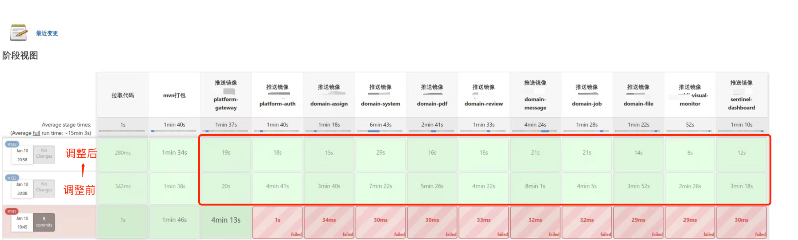
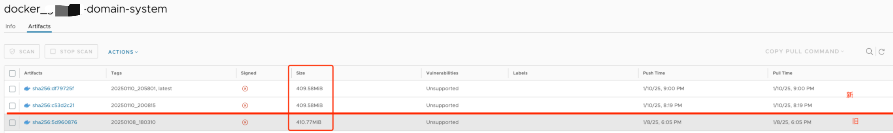
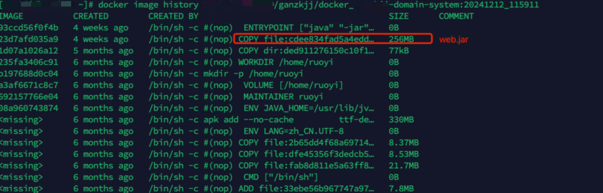
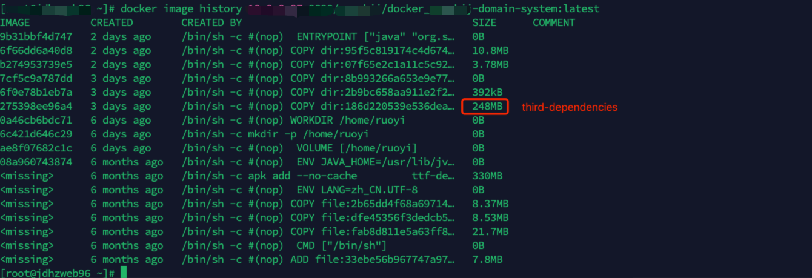
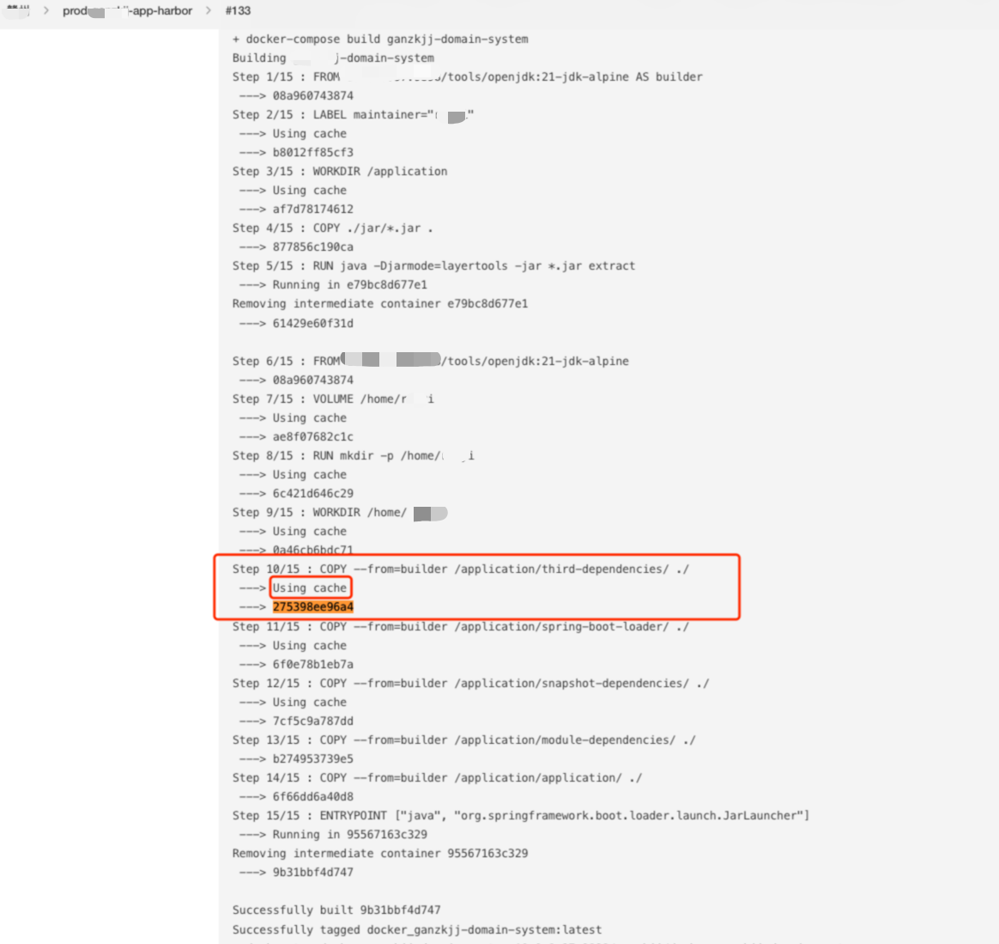

---
category:
  - Devops
  - SpringBoot
  - Docker
tag:
  - docker
  - optimize
order: 2
---
# Docker镜像调优

## SpringBoot Jar 分层构建

> SpringBoot 3.2.8  
> Maven 3

需要将第三方包和项目模块分离成不同的层。

优势：

- 操作简单，只需要修改 `Dockfile`

- 部署简单，不需要关注lib是否调整，可以避免因忘记更新lib而导致的问题

- 契合容器化管理理念，充分利用缓存

整体流程：

设置layers.xml -> spring-boot-maven-plugin使用layers.xml -> Dockerfile多阶段分层构建

::: tip

通过spring-boot-maven-plugin:buildImage可以直接生成OCI镜像来替代自行维护Dockerfile构建镜像

:::

更多详细内容可以参考：[SpringBoot MavenPlugin](/back/spring-boot/maven-plugin.md)


### 定制layers.xml

**起因**

通常情况下，多模块项目内容的更新频率排序：

```text
application(classes/resource) > modules dependencies -> ... -> third dependencies

当前部署应用模块 -> 模块依赖 -> ... -> 第三方依赖
```

由此可知更新频率最高的就是`application`内容，其次是`modules dependencies` 。默认是与项目所依赖的第三方包统一放置在一起，这样会造成很大的性能浪费。 
所以需要把“功能性模块”放置单独的层 `module-dependencies` ，而把第三方模块放置 `third-dependencies`

**做法**

定制内容

```xml title="${basedir}/src/main/resources/layers.xml"
<!--内容-->
<layers xmlns="http://www.springframework.org/schema/boot/layers"
        xmlns:xsi="http://www.w3.org/2001/XMLSchema-instance"
        xsi:schemaLocation="http://www.springframework.org/schema/boot/layers
                          https://www.springframework.org/schema/boot/layers/layers-3.2.xsd">
    <!--application表示class和resource-->
    <application>
        <into layer="spring-boot-loader">
            <include>org/springframework/boot/loader/**</include>
        </into>
        <into layer="application"/>
    </application>

    <!--dependencies所有依赖 包括第三方库和本地模块-->
    <dependencies>
        <into layer="snapshot-dependencies">
            <include>*:*:*SNAPSHOT</include>
        </into>
        <into layer="module-dependencies">
             <!--支持通配符-->
             <include>groupId:artifactId:*</include>
        </into>
        <into layer="third-dependencies"/>
    </dependencies>

    <!--定义层顺序，会影响BOOT-INF/layers.idx-->
    <layerOrder>
        <!--第三方依赖-->
        <layer>third-dependencies</layer>
        <layer>spring-boot-loader</layer>
        <layer>snapshot-dependencies</layer>
        <!--模块依赖-->
        <layer>module-dependencies</layer>
        <layer>application</layer>
    </layerOrder>

    <!--SpringBootPlugin默认配置 https://docs.spring.io/spring-boot/docs/3.2.12/maven-plugin/reference/htmlsingle/#packaging.layers.configuration -->
    <!--<application>
        <into layer="spring-boot-loader">
            <include>org/springframework/boot/loader/**</include>
        </into>
        <into layer="application" />
    </application>
    <dependencies>
        <into layer="application">
            <includeModuleDependencies />
        </into>
        <into layer="snapshot-dependencies">
            <include>*:*:*SNAPSHOT</include>
        </into>
        <into layer="dependencies" />
    </dependencies>
    <layerOrder>
        <layer>dependencies</layer>
        <layer>spring-boot-loader</layer>
        <layer>snapshot-dependencies</layer>
        <layer>application</layer>
    </layerOrder>-->
</layers>
```

使用

``` xml title="pom.xml"
<plugin>
    <groupId>org.springframework.boot</groupId>
    <artifactId>spring-boot-maven-plugin</artifactId>
    <version>${spring-boot.version}</version>
    <executions>
        <execution>
            <goals>
                <goal>repackage</goal>
            </goals>
        </execution>
    </executions>
    <configuration>
        <layers>
            <enabled>true</enabled>
            <configuration>${basedir}/src/main/resources/layers.xml</configuration>
        </layers>
    </configuration>
</plugin>
```


### Dockerfile


```dockerfile
# 定制的基础镜像 只保留运行环境
FROM ip:port/tools/openjdk:21-jdk-alpine AS builder
# author
LABEL maintainer="Leo"
WORKDIR /application
COPY ./jar/*.jar .
RUN java -Djarmode=layertools -jar *.jar extract

FROM ip:port/tools/openjdk:21-jdk-alpine
# 挂载目录
VOLUME /home/zzz
# 创建目录
RUN mkdir -p /home/zzz
# 指定路径
WORKDIR /home/zzz
# 第三方依赖
COPY --from=builder /application/third-dependencies/ ./
COPY --from=builder /application/spring-boot-loader/ ./
COPY --from=builder /application/snapshot-dependencies/ ./
# 项目模块依赖
COPY --from=builder /application/module-dependencies/ ./
COPY --from=builder /application/application/ ./
ENTRYPOINT ["java", "org.springframework.boot.loader.launch.JarLauncher"]
```

COPY 顺序需要注意，变化频率高的放在更下方，而把变化频率较低的第三方包放在靠上方，这样可以充分利用`Docker Build Cache` 


### 多模块项目下的最佳实践

**避免重复的layers.xml**

将layers.xml放在根项目下，其他部署模块直接引用。

**问题**

Maven本身没有提供一个可以获取到根项目路径的地址，通常有两种做法：

- 部署模块的pom.xml中配置spring-boot-maven-plugin时通过相对路径引用到根路径下的layers.xml
- 每一个模块都设置一个名为`rootProject.dir`的properties属性，该属性由各个模块自行维护：根据自身的位置通过相对路径的方式找到根项目路径。

以上两种方式都需要维护相对路径，有一定工作量且维护性差。

**解决**

利用directory-maven-plugin插件

```xml title="rootProject/pom.xml"
<build>
    <pluginManagement>
        <plugins>
            <!--统一定义spring-boot-maven-plugin 各子模块子需要简单引用-->
            <plugin>
                <groupId>org.springframework.boot</groupId>
                <artifactId>spring-boot-maven-plugin</artifactId>
                <version>${spring-boot.version}</version>
                <executions>
                    <execution>
                        <goals>
                            <goal>repackage</goal>
                        </goals>
                    </execution>
                </executions>
                <configuration>
                    <layers>
                        <enabled>true</enabled>
                        <!--使用根项目下的layers.xml-->
                        <configuration>${rootProject.dir}/layers.xml</configuration>
                    </layers>
                </configuration>
            </plugin>
        </plugins>
    </pluginManagement>
    <plugins>
        <plugin>
            <groupId>org.commonjava.maven.plugins</groupId>
            <artifactId>directory-maven-plugin</artifactId>
            <version>1.0</version>
            <executions>
                <execution>
                    <id>directories</id>
                    <goals>
                        <goal>directory-of</goal>
                    </goals>
                    <!--Default Lifecycle -> initialize-->
                    <phase>initialize</phase>
                    <configuration>
                        <!--定义根项目目录-->
                        <property>rootProject.dir</property>
                        <!--填写根项目的坐标值-->
                        <project>
                            <groupId>xxxx</groupId>
                            <artifactId>xxxx</artifactId>
                        </project>
                    </configuration>
                </execution>
            </executions>
        </plugin>
    </plugins>
</build>
```


```xml title="应用模块/pom.xml"
<build>
    <finalName>${project.artifactId}</finalName>
    <plugins>
        <plugin>
            <groupId>org.springframework.boot</groupId>
            <artifactId>spring-boot-maven-plugin</artifactId>
            <!--按需配置-->
            <!--<configuration>
                <includeSystemScope>true</includeSystemScope>
            </configuration>-->
        </plugin>
    </plugins>
</build>


```

### 最终效果

**生产推送镜像的相对时间**




**镜像大小**

镜像总大小没有明显区别，区别在于第三方包未更新时推送镜像的时间因为利用了docker cache而有了非常可观的减少，充分利用了缓存。



```shell title="观察镜像结构"
docker image history xxx:tag
```

旧镜像：



新镜像：



缓存命中：



观察某一模块，200+M直接命中cache，效率提升明显。


## SlimToolkit镜像瘦身

官方地址：[SlimToolkit](https://github.com/slimtoolkit/slim)

### 安装

```shell title="Mac安装"
brew install docker-slim
```

[其他安装方式](https://github.com/slimtoolkit/slim#installation)


### 使用

```shell
# 分析并创建一个slim前缀的镜像
docker-slim build imageName
```

## Hadolint

官方地址：[https://github.com/hadolint/hadolint#install
](https://github.com/hadolint/hadolint#install)
```shell
brew install hadolint
hadolint [dockerfile]
```

## 其他
> 待跟进学习

Clair、Trivy、Hadolint、Anchore Engine、Snyk、Docker Scan、Microscanner
