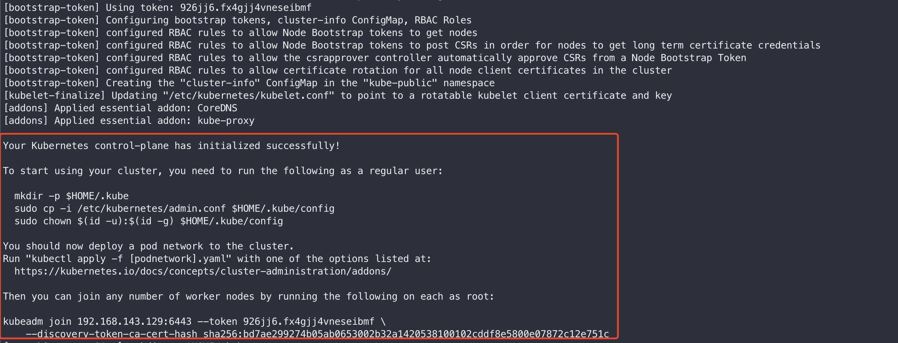
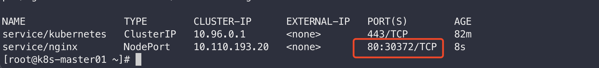
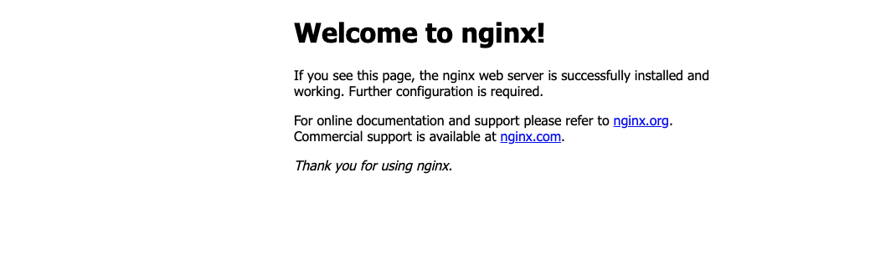
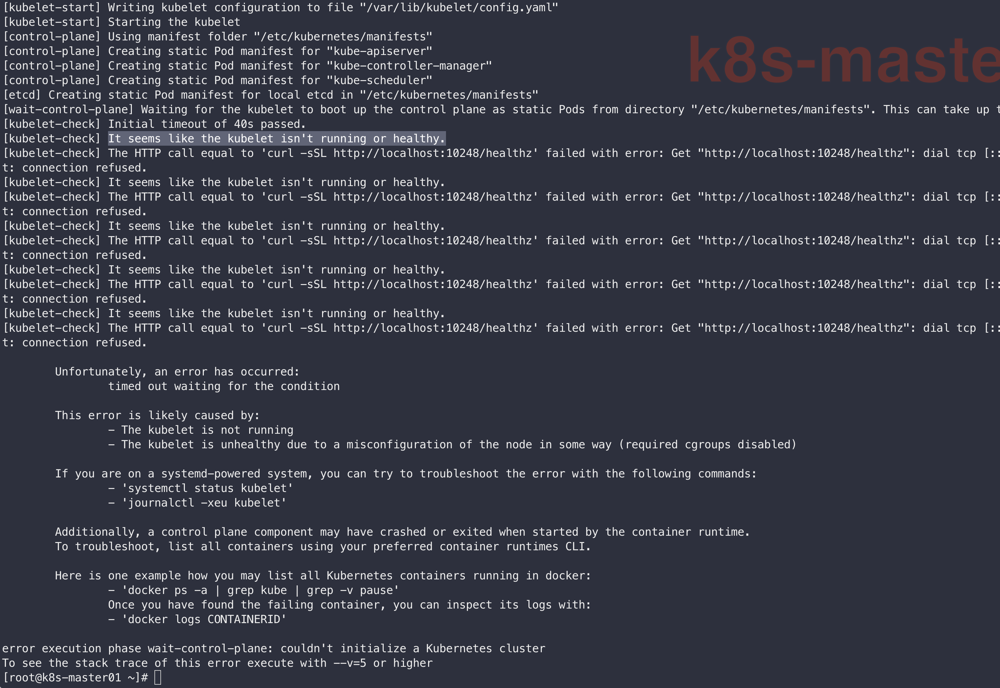
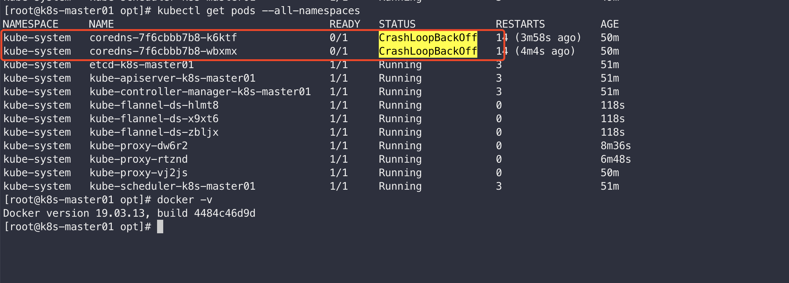
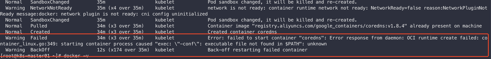

---
tag:
  - k8s
  - kubernetes
  - 虚拟化技术
---

> 资料来源于[k8s教程由浅入深-尚硅谷](https://www.bilibili.com/video/BV1GT4y1A756?p=19)
> [英文文档](https://kubernetes.io/docs/home/) [中文文档](https://kubernetes.io/zh/docs/home/) 照着文档一步步来，访问不了的源就换为国内的。

## docker-desktop-for-mac安装

[k8s-docker-desktop-for-mac](https://github.com/maguowei/k8s-docker-desktop-for-mac.git)


安装dashborad

[参考文档](https://kuboard.cn/install/install-k8s-dashboard.html#%E8%AE%BF%E9%97%AE)

## 二进制安装

参考尚硅谷视频

## kubeadm安装

此方式是官方推荐的安装方式，[Installing kubeadm](https://kubernetes.io/docs/setup/production-environment/tools/kubeadm/install-kubeadm/)

::: warning
安装docker，k8s的版本最好是指定一个稳定版本，尽量不要使用最新的。否则，可能会出现kubeadm init下载所需依赖的版本过高，导致无法下载等一系列问题。
:::

### 准备环境

| 类型         | Ip              |
| ------------ | --------------- |
| k8s-master01 | 192.168.143.129 |
| k8s-node01   | 192.168.143.130 |
| k8s-node02   | 192.168.143.131 |


#### 检查mac地址和product_uuid是否每个节点唯一

- 使用`ip link`或者`ifconfig -a`去检查mac地址
- 使用`sudo cat /sys/class/dmi/id/product_uuid`

#### 允许iptables检查桥接流量

通过`lsmod | grep br_netfilte`检查`br_netfilte`模块是否加载。运行`sudo modprobe br_netfilter`进行加载

执行以下脚本命令

``` shell

cat <<EOF | sudo tee /etc/modules-load.d/k8s.conf
br_netfilter
EOF

cat <<EOF | sudo tee /etc/sysctl.d/k8s.conf
net.bridge.bridge-nf-call-ip6tables = 1
net.bridge.bridge-nf-call-iptables = 1
EOF
sudo sysctl --system
```


#### 时间同步

``` shell
# 时间同步
yum install ntpdate -y
ntpdate time.windows.com
```

#### 关闭防火墙

``` shell
# 不关的话，在执行kubeadm init的时候就会报错
systemctl stop firewalld
systemctl disable firewalld
```

#### 关闭swqp

~~~ shell
# 临时
swapoff -a 

#临时
sed -ri 's/.*swap.*/#&/' /etc/fstab 

~~~

#### 设置主机名

非必须，只为更好区分

``` shell
hostnamectl set-hostname k8s-master01
hostnamectl set-hostname k8s-node01
hostnamectl set-hostname k8s-node02


# 配置hosts
cat >>/etc/hosts<<EOF
192.168.143.129 k8s-master01
192.168.143.130 k8s-node01
192.168.143.131 k8s-node02
EOF
```

### 安装Docker

[Docker安装](https://kubernetes.io/docs/setup/production-environment/container-runtimes/#docker)


使用官方提供的yum安装方式

``` shell
# k8s安装docker，这里应该只需要安装docker-ce。咱这里就参考官网来操作了
# 可指定版本进行安装
# sudo yum install docker-ce-<VERSION_STRING> docker-ce-cli-<VERSION_STRING> containerd.io
sudo yum install docker-ce-18.09.1 docker-ce-cli-18.09.1 containerd.io
#sudo yum install docker-ce docker-ce-cli containerd.io

# 设置开机启动
sudo systemctl enable docker

# 启动docker
sudo systemctl start docker
```


修改yum源，把Docker的yum源改为阿里的

``` shell
# 配置阿里的docker源，这步应该是在使用yum安装docker之前
cat >/etc/yum.repos.d/docker.repo<<EOF
[docker-ce-edge]
name=Docker CE Edge - \$basearch
baseurl=https://mirrors.aliyun.com/docker-ce/linux/centos/7/\$basearch/edge
enabled=1
gpgcheck=1
gpgkey=https://mirrors.aliyun.com/docker-ce/linux/centos/gpg
EOF

# 配置docker镜像源和cgroupDriver和kubelet保持一致
cat > /etc/docker/daemon.json << EOF
{
  "registry-mirrors": ["https://b9pmyelo.mirror.aliyuncs.com"],
   "exec-opts": ["native.cgroupdriver=systemd"],
  "log-driver": "json-file",
  "log-opts": {
    "max-size": "100m"
  },
  "storage-driver": "overlay2"
}
EOF
```


### 安装 kubeadm, kubelet and kubectl

``` shell
# 配置阿里源的k8s源
cat > /etc/yum.repos.d/kubernetes.repo << EOF
[kubernetes]
name=Kubernetes
baseurl=https://mirrors.aliyun.com/kubernetes/yum/repos/kubernetes-el7-x86_64
enabled=1
gpgcheck=0
repo_gpgcheck=0
gpgkey=https://mirrors.aliyun.com/kubernetes/yum/doc/yum-key.gpg https://mirrors.aliyun.com/kubernetes/yum/doc/rpm-package-key.gpg
EOF

# 关闭selinux
# 关闭selinux以允许容器访问宿主机的文件系统，例如pod网络所需的。您必须这样做，直到kubelet中的SELinux支持得到改进
sudo setenforce 0
sudo sed -i 's/^SELINUX=enforcing$/SELINUX=permissive/' /etc/selinux/config


# 安装
# 可指定版本进行安装
sudo yum install -y kubelet kubeadm kubectl --disableexcludes=kubernetes

# 设置开机启动
sudo systemctl enable --now kubelet
# kubelet 现在每隔几秒钟重新启动一次，因为它在崩溃循环中等待 kubeadm 告诉它要做什么
```

### 用kubeadm创建集群

[用kubeadm创建集群](https://kubernetes.io/docs/setup/production-environment/tools/kubeadm/create-cluster-kubeadm/)


#### Master节点初始化

``` shell
kubeadm init --apiserver-advertise-address=192.168.143.129 --image-repository registry.aliyuncs.com/google_containers  --service-cidr=10.96.0.0/12  --pod-network-cidr=10.244.0.0/16 --kubernetes-version v1.18.0
# 指定版本--kubernetes-version v1.18.0
# --pod-network-cidr指定不冲突的IP，跟CNI配置有关系,不能与宿主机有重叠！
# --service-cidr指定不冲突的IP
```


``` shell
# init过程中会下载所依赖镜像， 提前查看所需的所有镜像 sudo kubeadm config images list
# 执行docker images可以查看下载情况

# 以coredns/coredns下载失败报错为例：
#从https://github.com/coredns/coredns/releases下载对应版本
# copy到远程linux
scp coredns_1.8.4_linux_amd64.tgz root@192.168.143.129:/opt
# 载入镜像
cat coredns_1.8.4_linux_amd64.tgz | docker import - coredns:v1.8.4
# 另建一个并修改标签
docker tag coredns:v1.8.4  registry.aliyuncs.com/google_containers/coredns:v1.8.4
```

安装成功之后看到有successfully！按照给出的后续操作内容继续进行操作。这里也有提示说要用`kubectl apply -f [podnetwork].yaml`去部署一个pod网络



``` shell
mkdir -p $HOME/.kube
sudo cp -i /etc/kubernetes/admin.conf $HOME/.kube/config
sudo chown $(id -u):$(id -g) $HOME/.kube/config

kubeadm join 192.168.143.129:6443 --token 926jj6.fx4gjj4vneseibmf \
    --discovery-token-ca-cert-hash sha256:bd7ae299274b05ab0653002b32a1420538100102cddf8e5800e07872c12e751c
# 在node节点中进行执行，复制粘贴的时候要注意粘贴的内容是否一致，否则会导致执行失败。
```

~~~ shell
kubectl get nodes
kubectl get pods -n kube-system
~~~

::: details 重新init和join

``` shell
#重新init和join前需要先执行kubeadm reset 可能还要删除配置$HOME/.kube/config文件
kubeadm reset
rm -rf $HOME/.kube/config

#如果需要重置网络请执行
ifconfig cni0 down && ip link delete cni0
ifconfig flannel.1 down && ip link delete flannel.1
rm -rf /var/lib/cni/
```

:::


#### 配置CNI

[pod-network](https://kubernetes.io/docs/setup/production-environment/tools/kubeadm/create-cluster-kubeadm/#pod-network)

``` shell
# 语法：kubectl apply -f <add-on.yaml>

# 我们这使用Flannel这种网络模型
kubectl apply -f https://raw.githubusercontent.com/coreos/flannel/master/Documentation/kube-flannel.yml
# 警告：Warning: policy/v1beta1 PodSecurityPolicy is deprecated in v1.21+, unavailable in v1.25+

# 检查CoreDNS Pod 是否 Running 来确认其是否正常运行
kubectl get pods --all-namespaces

#查询命令
#kubectl get pods coredns-646fd479c9-ln7tf -n kube-system -o yaml | grep image:
#kubectl get pods coredns-646fd479c9-ln7tf -n kube-system -o wide
#kubectl logs -n kube-system coredns-7f6cbbb7b8-k6ktf
```

其他[Kubernetes networking model](https://kubernetes.io/docs/concepts/cluster-administration/networking/#how-to-implement-the-kubernetes-networking-model)

#### 测试

在k8s集群中创建一个pod，验证是否正常运行：

``` shell
kubectl create deployment nginx --image=nginx
kubectl expose deployment nginx --port=80 --type=NodePort
#kubectl expose deployment nginx --port=8087 --type=NodePort 用8087端口无法访问，被坑了好久！！！


# 查看一下对外的端口
kubectl get pod,svc

# kubectl delete pod/nginx-f89759699-2cjqr
```

80端口已经成功映射到31527上了



通过以下连接去访问宿主机的服务：

http://192.168.143.129:31527/

http://192.168.143.130:31527/

http://192.168.143.131:31527/



## 问题

[部署Kubernetes(k8s)时，为什么要关闭swap、selinux、防火墙？](https://www.zhihu.com/question/374752553)不关闭的话在初始化等很多步骤时都有可能产生错误。

### Kubeadm init下载coredns失败

[coredns/coredns:v1.8.0 下载失败](https://www.cnblogs.com/pinghengxing/p/14665253.html)


###  kubelet isn't running or healthy

[【kubeadm初始化报错】failed to run Kubelet: misconfiguration: kubelet cgroup driver: "cgroupfs" is different from docker cgroup driver: "systemd" - 东北小狐狸 - 博客园 (cnblogs.com)](https://www.cnblogs.com/hellxz/p/kubelet-cgroup-driver-different-from-docker.html)

It seems like the kubelet isn't running or healthy. 把docker的cGroupDrvicer配置的和kubelet一样即可。




### CrashLoopBackOff

`coredns` pods 状态为 `CrashLoopBackOff` 



kubectl describe pod  "POD_NAME"  -n  kube-system

kubectl describe pod  coredns-7f6cbbb7b8-k6ktf -n   kube-system




出现这种情况，先照着官网介绍的几种解决方案来试下吧。如果操作步骤没有什么问题的话，那就很有可能跟k8s、dockerd 的版本有关系了，不可过高！！！


### nginx无法访问

部署nginx时没有暴露80端口，而是随意暴露了一个8087端口，导致无法通过浏览器访问到nginx。在宿主机使用curl通过容器的集群IP+内部端口(8087)都无法访问，用80就可以访问。刚学k8s，就没有深入研究这个问题了，把端口重新设置为80即可。
