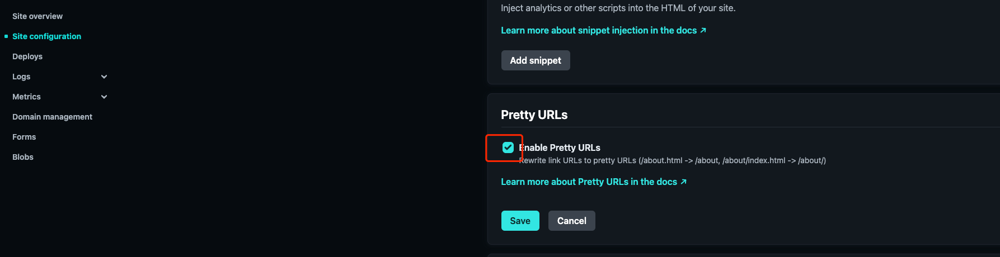

# VuePress搭建博客

::: warning
当前为V1版本的内容，部分内容在V2中可能不适用，当前Blog已升级为V2版本。
:::

## 侧边栏

自动生成侧边栏

``` txt
---
---
```

嵌套的标题链接

``` txt
---
sidebarDepth: 2
---
```

## 代码

代码块中的行高亮

```` md
``` js {4}
export default {
  data () {
    return {
      msg: 'Highlighted!'
    }
  }
}
```
````


 行数区间: 例如 `{5-8}, {3-10}, {10-17}`

- 多个单行: 例如 `{4,7,9}`

- 行数区间与多个单行: 例如 `{4,7-13,16,23-27,40}`


## 自定义容器

``` txt
::: tip
这是一个提示
:::

::: warning
这是一个警告
:::

::: danger
这是一个危险警告
:::

::: details
这是一个详情块，在 IE / Edge 中不生效
:::
```

自定义块中的标题：

```` md
::: danger STOP
危险区域，禁止通行
:::

::: details 点击查看代码
```js
console.log('你好，VuePress！')
```
:::

````

## 部署

### netlify（推荐）

**图片缓存**

在项目发布目录中包含_headers文件，如：blog/.vuepress/public/_headers
```txt
# https://docs.netlify.com/routing/headers/
/assets/*
    Cache-Control: public, max-age=604800
```
[参考链接](https://docs.netlify.com/routing/headers/)

**强制URL小写导致404**

netlify强制url小写。如果存在大写路径，会出现重定向为小写的情况。

- 按需关闭URL美化

可以在netlify页面关闭此功能

配置页面


- 参考[批量改为小写](https://spencer-blog-legacy.vercel.app/2020/05/debugging-netlify-static-site/)

```shell title="批量改为小写"
find my_root_dir -depth -exec rename 's/(.*)\/([^\/]*)/$1\/\L$2/' {} \;
```

### vercel（不推荐）

部署速度比较快，但目前存在域名污染。

更多内容可以参考[部署](https://vuepress.vuejs.org/zh/guide/deployment.html)