# 后端调试

::: tip

idea为2020.2的mac OSX版本

:::

工欲善其事，必先利其器

## 概念介绍

调试模式

断点：断点，调试器的功能之一，可以让程序中断在需要的地方，从而方便其分析。

栈帧：Java虚拟机以方法作为最基本的执行单元，“栈帧”（Stack Frame）则是用于支持虚拟机进行方法调用和方法执行背后的数据结构，它也是虚拟机运行时数据区中的虚拟机栈（Virtual Machine Stack）[插图]的栈元素。栈帧存储了方法的局部变量表、操作数栈、动态连接和方法返回地址等信息

## 启动调试

1. 以调试模式启动服务或者运行代码

## 断点

[IDEA断点文档](https://www.jetbrains.com/help/idea/using-breakpoints.html)

### 断点的类型

IDEA中断点的类型主要有以下几种：

- 行断点（Line Breakpoints）：常用的断点。到达设置断点的代码行时挂起程序。这种类型的断点可以设置在任何可执行代码行上

- 方法断点（Method Breakpoints）：在进入或退出指定的方法或其实现之一时挂起程序，允许您检查该方法的进入/退出条件。当一个方法有多个实现类当时候，如果不知道具体调用当是哪一个实现，那么在方法上面打断点当方法执行当时候会挂起程序。如果断点打在类名上，则在调用对应的默认构造方法中时程序则会中断。

- 字段断点（Field watchpoints）：在读取或写入指定字段时挂起程序。这允许您对与特定实例变量的交互作出反应。例如，如果在一个复杂的过程结束时，某个字段的值明显错误，则设置字段监视点可能有助于确定错误的来源

- 异常断点（Exception breakpoints）：抛出Throwable或其子类时挂起程序。它们全局应用于异常条件，不需要特定的源代码引用。

### Mute breakpoints

如果您不需要在断点处停留一段时间，可以将它们静音。这允许您在不离开调试器会话的情况下继续正常的程序操作。之后，可以取消禁用断点并继续调试。

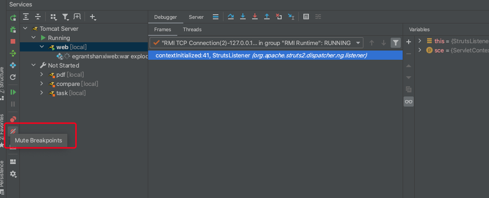

### Enable/disable breakpoints

删除断点时，其内部配置将丢失。要临时关闭单个断点而不丢失其参数，可以禁用它：

有两种方式：

- 对单个断点右键

- 断点视图中修改

部分关键词解释

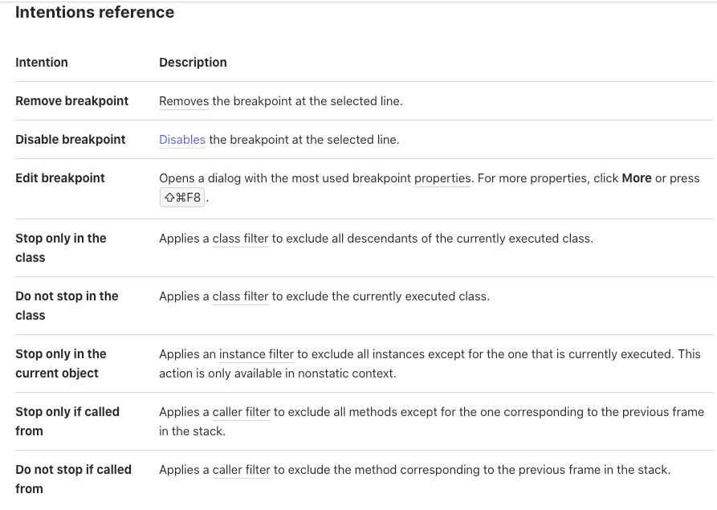

### 断点属性

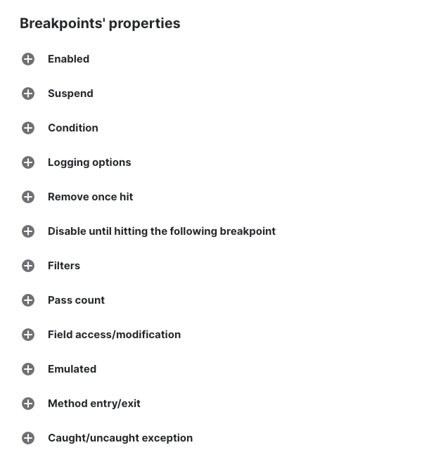

- `Condition`是比较常用的一个属性，我们常说的条件断点就是通过这个属性来进行设置。稍后会针对此属性进行介绍，其他属性不做详细介绍。

	Field access/modification：

	这个选项是针对Filed watchpoints的，默认只设置了Field access
	
	Field access：字段在读取的时候断点生效
	
	Field modification：字段在修改的时候断点生效

- Suspend：控制断点是否需要中断，如果有的时候只想通过断点记录方法调用次数而不需要中断程序，那么可以取消勾选。

	该属性有两个值：

	- All: 当任意一个线程触发来断点之后会中断所有线程

	- Thread: 只有触发断点的线程会被中断（**可用于多线程调试**）

- Pass count : 指定断点是否应仅在命中一定次数后才能工作

- Remove once hit：触发之后就移除

- Disable until hitting the following breakpoint：可以选择一些断点用来触发当前断点，只有触发之后才变成可用。且可以设置执行之后当前断点是保持可用还是禁用

- Filters：IntelliJ IDEA调试器使您能够通过筛选出类、实例和调用方方法来微调断点操作，并且只在需要时挂起程序。

	主要有以下几种过滤器：

	- Catch class filters：针对异常断点，可以控制在具体的某些类中出现异常时触发该异常断点

	- Instance filters：将断点操作限制为特定对象实例。此类型的筛选器仅在非静态上下文中有效

	- Class filters：将断点操作限制为特定类

	- Caller filters：根据当前方法的调用方限制断点操作。如果仅当从某个方法调用（或未调用）当前方法时才需要在断点处停止，请选择此选项

### 条件断点

通过设置断点对Condition属性来控制断点进入的条件

~~~ java
public static void main(String... strings) {
	for (int i = 0; i < 1000; i++) {
		System.out.println("i=" + i);
	}
}
~~~

### 断点状态

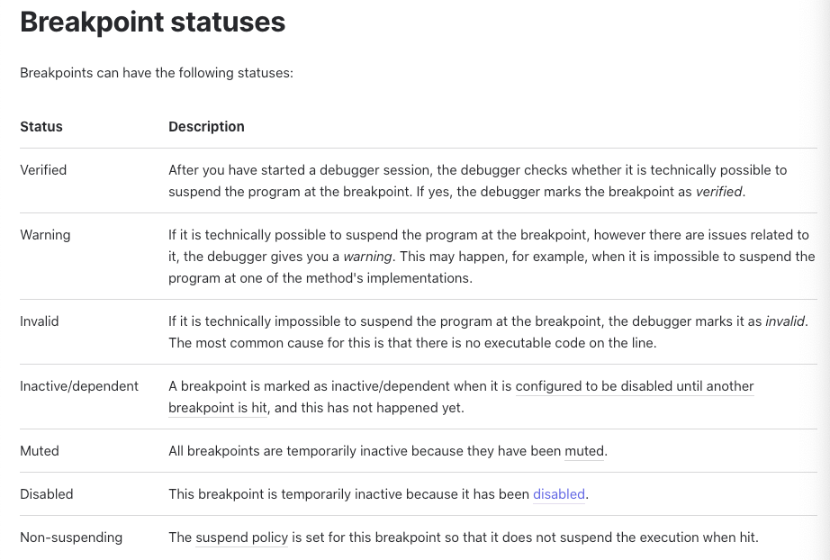

### 断点图标

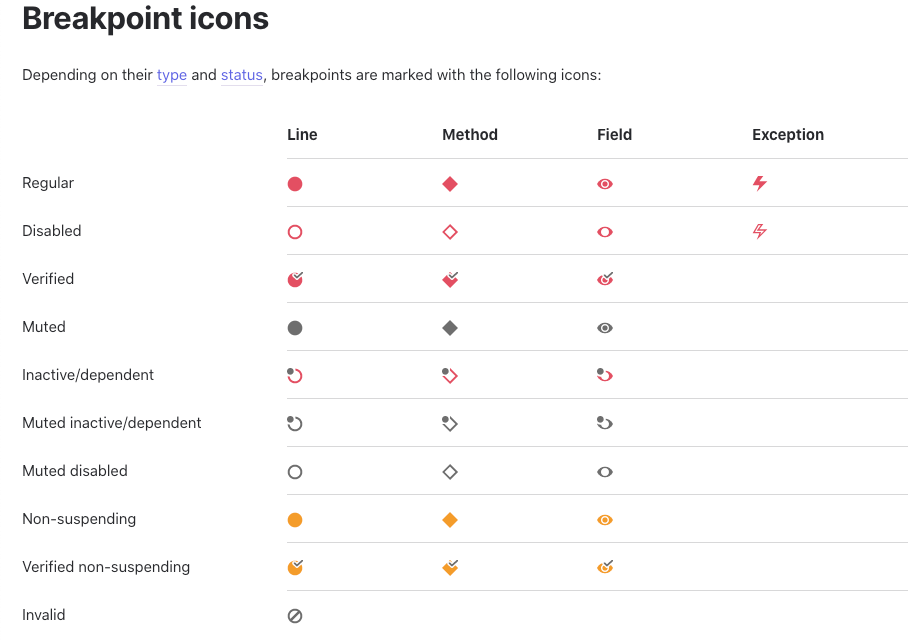

## 调试工具窗口

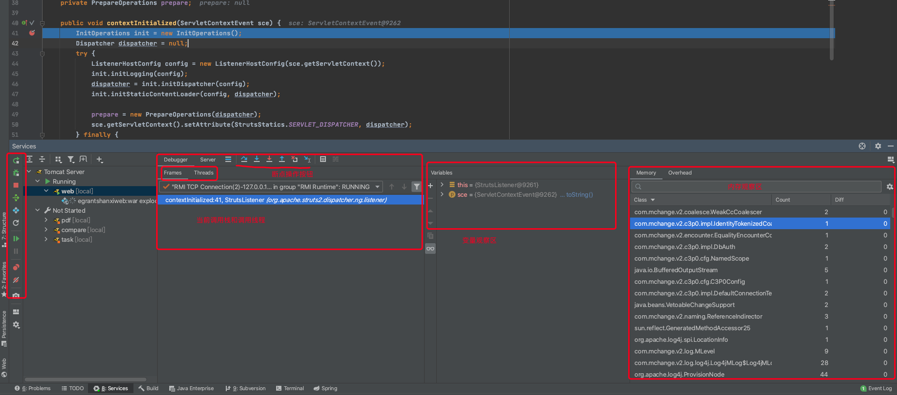

熟悉工具需要了解窗口中每一个按钮、每一个标签页代表的含义，以及其提供的操作。

从左往右对相关对按钮、窗口进行大体的介绍

### 左侧功能栏

与调试有关的几个按钮介绍

 rerun 普通模式重新运行

 调试模式重新运行

 触发一个update动作，对应服务器中的配置 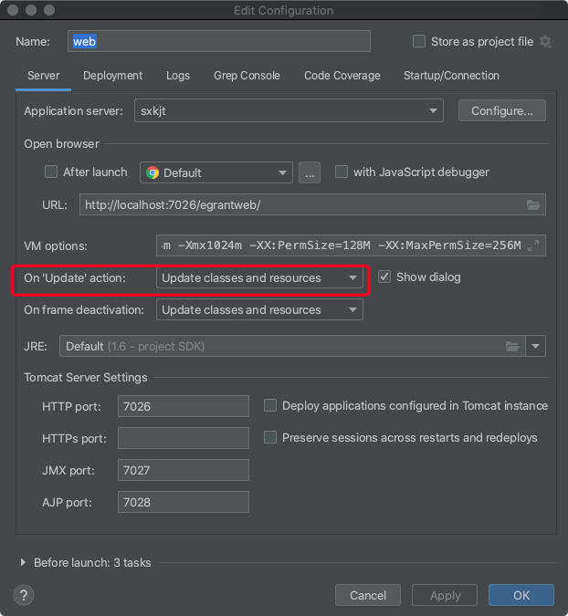

 resume：(中断后)继续

 中断程序（手动中断程序）

 断点视图

 使断点变为mute状态

### 右侧Tabs

可以点击选择需要显示的标签内容

- Frames

	用来显示当前线程的调用栈帧，同时给我们提供的导航功能
		
	
	
	这里默认可能不会显示类库中的栈帧，可以通过右上方的按钮来进行切换显示/隐藏
	
	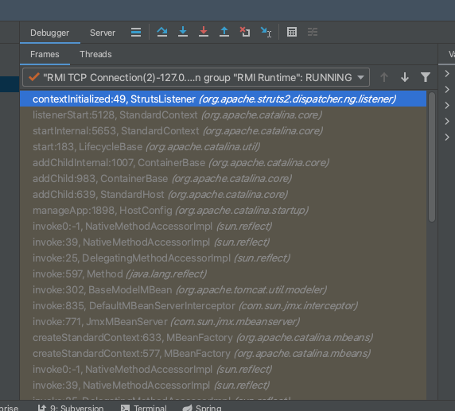
	
- Threads

	显示活动线程的列表并允许您在它们之间切换。从该选项卡中，可以文本格式导出线程信息
	
	如果视图中没有显示Threads，可以在右侧自定义视图中进行勾选 
	
- Variables

	列出当前上下文中可用的变量，并允许您分析和**修改程序状态**。

- Watches

	显示/管理自己设置的监视器，我们可以添加我们需要观察的变量、表达式等。也可以在当前中断的程序中选择需要观察的变量或者表达式右键点击`Add to Watches`
	
	默认情况下`Watches`的内容是在`Variables`中进行显示，如果需要监视的内容很多，还可以通过点击将其显示在单独的监视窗口中
	
- Memory
	
	提供堆上当前可用对象的信息，并允许您监视和分析它们的生存期

	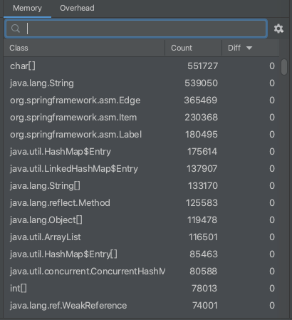
	
- Overhead

	用于监视特定调试器功能消耗的资源并优化调试器性能。

	
	
## 逐步完成程序

[Idea文档 stepping-through-the-program](https://www.jetbrains.com/help/idea/stepping-through-the-program.html#run-to-cursor)

调试按钮在debugger工具栏中

> 每个按钮都有对应的快捷键，鼠标放上去就有提示

 step over 跨过当前代码行并将您带到下一行，即使高亮显示的行中包含方法调用。方法的实现被跳过，直接转到调用方方法的下一行

 step into 单步进入方法以显示其内部发生的情况。当您不确定方法是否返回正确的结果时，请使用此选项

 Force step into 强制进入方法，即使常规的单步进入会跳过这个方法

 Steps out 跳出当前方法，回到调用方法

下面的例子，单步进入`count()`方法，执行`Steps out`会跳到第3行
~~~ java
public static void main(String... strings) {
	count();
	System.out.println("over");

}

public static void count(){
	for (int i = 0; i < 1000; i++) {
		System.out.println("i=" + i);
	}
}
~~~

 Drop Frame 允许您撤消堆栈中的最后一帧并恢复上一帧。例如，如果您错误地走得太远，或者希望重新进入一个错过关键点的函数，那么这可能很有用

> 请注意，此选项只影响局部变量，不会恢复整个程序状态，因为它不会还原静态变量和实例变量的值。这可能会导致程序流发生更改。

 Run to Cursor 运行到光标处，也可以通过点击左侧行号触发

 执行表达式

### 其他的调试按钮 

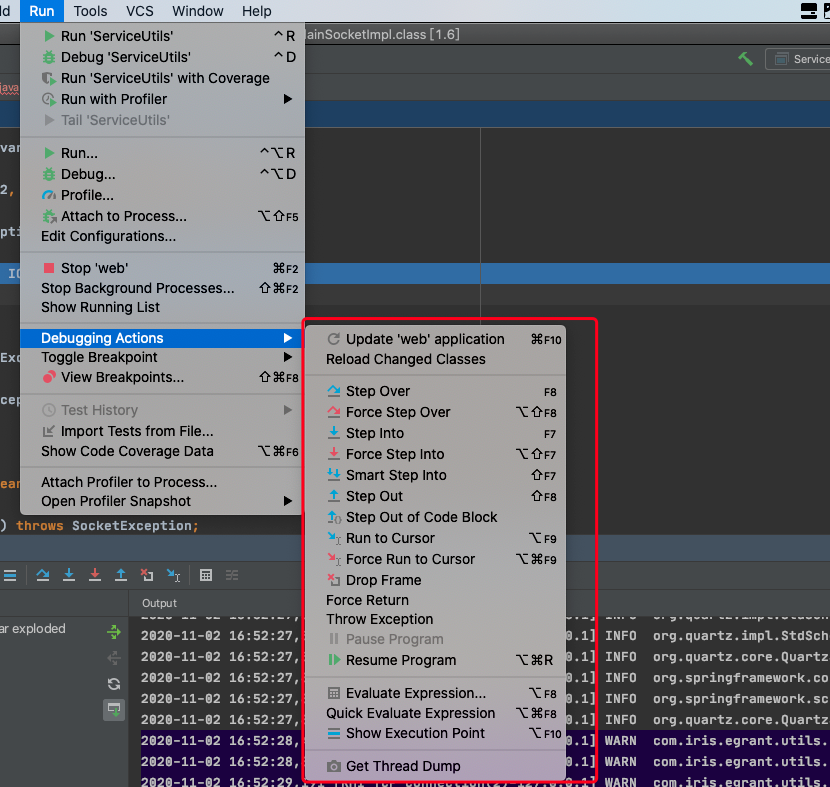

Smart step into 智能步入 当一行中有多个方法调用时，智能单步执行非常有用，并且您希望具体说明要输入哪个方法。此功能允许您选择感兴趣的方法调用

## 远程调试

[IDEA远程调试教程](https://www.jetbrains.com/help/idea/tutorial-remote-debug.html)

[demo](https://gitee.com/zengsl/iris-tutorial.git)

1. 服务端需要开启远程调试并配置好相应的端口
	
	设置VM options `-agentlib:jdwp=transport=dt_socket,server=y,suspend=n,address=5005`
	
	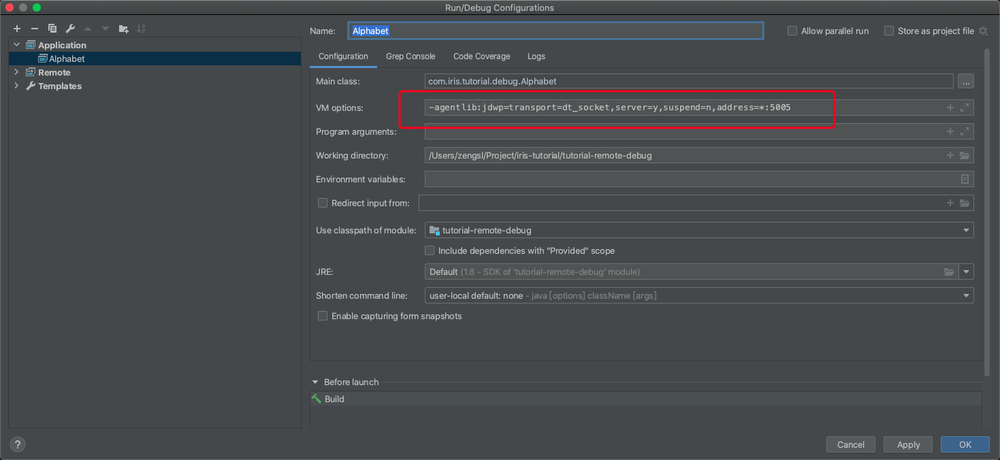
	
	::: tip
	我们也可以直接将项目打成jar包，通过下面的命令直接运行。打包方式可以使用IDEA打包或者maven打包，需要注意的是jar里面中要包含`Main-Class`信息
	
	`java -jar -agentlib:jdwp=transport=dt_socket,server=y,suspend=n,address=5005 tutorial-remote-debug.jar`
	
	[IDEA 打包](https://www.jetbrains.com/help/idea/compiling-applications.html#package_into_jar)
	:::
	
	
	
2. IDE配置好远程调试配置

	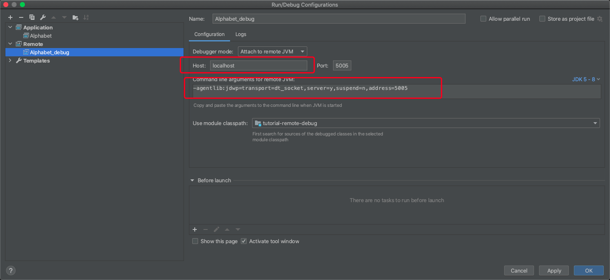
	
3. 设置好之后服务端直接运行（非调试启动），因为代码中设置了休眠时间，所以代码不会很快的执行结束。调试端打好断点以调试方式启动，将进入断点激活调试窗口。

启动服务端如果遇到下图的错误，需要检查下hosts中是否配置了`127.0.0.1 localhost`

我本机是配置了localhost，但是仍然出现此错误。因为最开始是参考IDEA的官方教程，addresss的配置为`address=*:5005`，将其改为`address=5005`就不会出现错误了，这可能跟机器的网络配置有关系。

## toString的影响

在toString中如果调用了初始化或者正常流程中会调用的代码，那么在调试的时候可能断点无法进入该代码

可以修改IDEA中修改java的debugger的配置

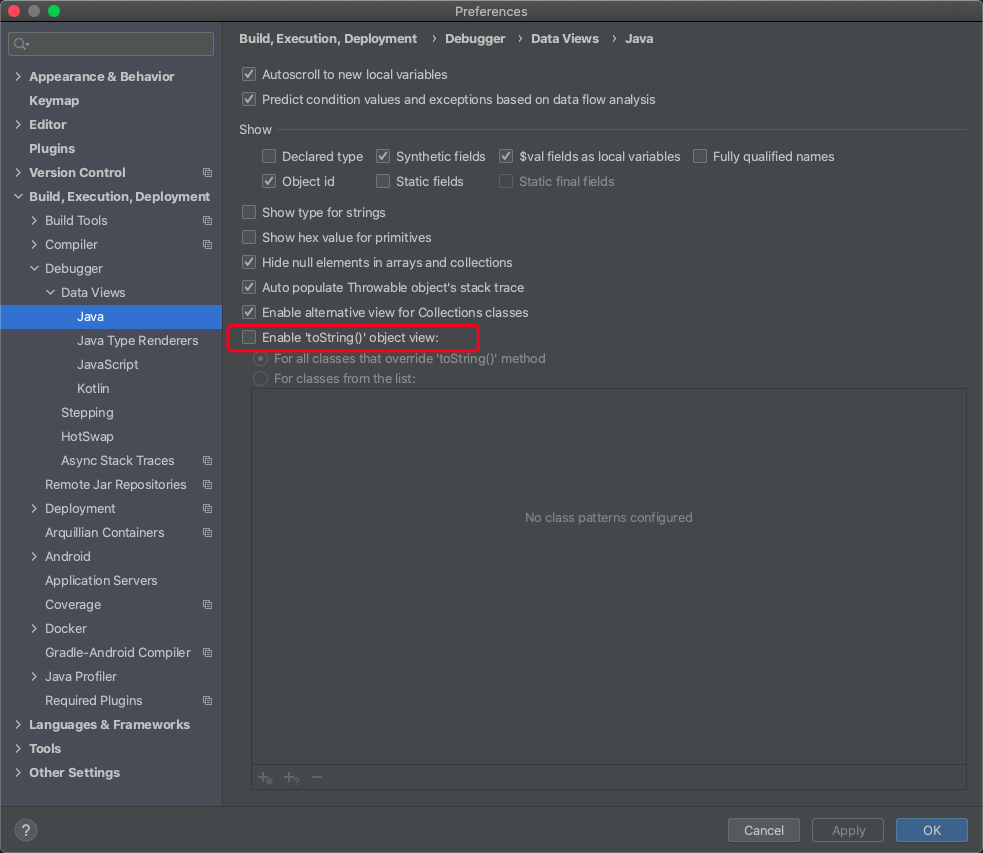

详情可参考[getHandlerMappings](/back/spring/init.html#注意)

## 其他

有时候我们可能要借助“可视化故障处理工具”，如：JHSDBJ、JMC(Java Mission Control)、JConsole、VisualVM。

这里需要特别说明的`BTrace`是一个很神奇的VisualVM插件，它本身也是一个可运行的独立程序。BTrace的作用是在不中断目标程序运行的前提下，通过HotSpot虚拟机的Instrument功能[插图]动态加入原本并不存在的调试代码。这项功能对实际生产中的程序很有意义：如当程序出现问题时，排查错误的一些必要信息时（譬如方法参数、返回值等），在开发时并没有打印到日志之中以至于不得不停掉服务时，都可以通过调试增量来加入日志代码以解决问题

### Arthas

Arthas 是Alibaba开源的Java诊断工具，深受开发者喜爱。

我们可以利用它来反编译代码查看自己的代码到底有没有发布、监控到JVM的实时运行状态和修改线上环境日志级别等。

::: warning
- 执行该程序的用户需要和目标进程具有相同的权限。比如以`admin`用户来执行：`sudo su admin && java -jar arthas-boot.jar` 或 `sudo -u admin -EH java -jar arthas-boot.jar`。

- 如果attach不上目标进程，可以查看`~/logs/arthas/` 目录下的日志。

- 如果下载速度比较慢，可以使用aliyun的镜像：`java -jar arthas-boot.jar --repo-mirror aliyun --use-http`

- `java -jar arthas-boot.jar -h` 打印更多参数信息。
:::

[Arthas doc](https://arthas.aliyun.com/doc/)

[Arthas gitee](https://gitee.com/arthas/arthas)

[Arthas在线教程](https://arthas.aliyun.com/doc/arthas-tutorials.html?language=cn&id=arthas-basics)

## 总结

通过查询官方的文档可以获取最原始的资料，网上第三方写的文章多少包含个人理解，我们可以优先阅读官方文档获取自己的理解，再结合第三方的文章看看他人的理解有什么不同。

能够在本地调试或者远程调试代码是比较好的情况，当不能调试代码的时候该如何做呢？

1. 要对功能熟悉，对他运用对基础知识熟悉，可尽量缩小需要排查对问题范围

2. 某些情况需要猜测代码对运行过程，分析出可能出问题的点

各种Java的IDE工具是如何实现调试器的？

JPDA（Java Platform Debugger Architecture）Java平台调试体系结构。

JVMTI（JVM Tool Interface）是Java虚拟机所提供的native接口，提供了可用于debug和profiler的能力，是实现调试器和其他运行态分析工具的基础，Instrument就是对它的封装。

感兴趣的小伙伴可以阅读下以下两篇文章：

[字节码增强技术探索](https://tech.meituan.com/2019/09/05/java-bytecode-enhancement.html)

[Java动态追踪技术探究](https://tech.meituan.com/2019/02/28/java-dynamic-trace.html)

[Java调试原理初探](https://rdc.hundsun.com/portal/article/939.html)

**参考文档：**

[idea文档](https://www.jetbrains.com/help/idea/using-breakpoints.html#set-breakpoints)

[挖掘IntelliJ IDEA的调试功能](http://qinghua.github.io/intellij-idea-debug/)

[深入理解Java虚拟机：JVM高级特性与最佳实践（第3版）](https://weread.qq.com/web/reader/cf1320d071a1a78ecf19254kc81322c012c81e728d9d180)
