# 前端调试

在Edge、Chrome、FireFox浏览器中通过F12进入开发者工具

主流浏览器的开发者工具使用上都大致相同，可以通过工具找到对应的文档入口。

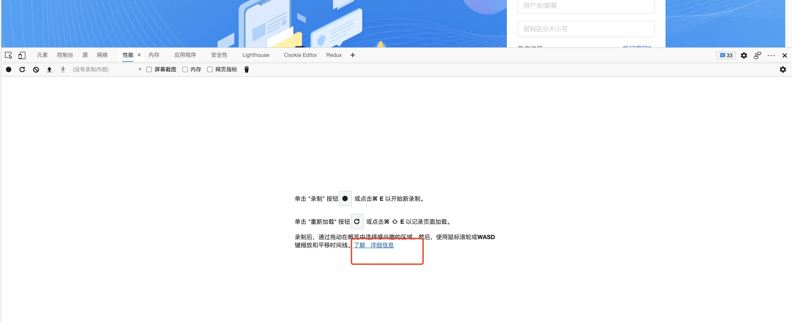

[Edge开发者工具文档](https://docs.microsoft.com/zh-cn/microsoft-edge/devtools-guide-chromium/)

切换设备仿真，主要可以切换不同的移动设备用于手机端调试

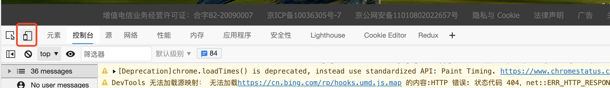

## 元素

可以用来检查DOM或CSS，可以对元素进行增删改操作。

### 样式

修改选中元素的行内样式

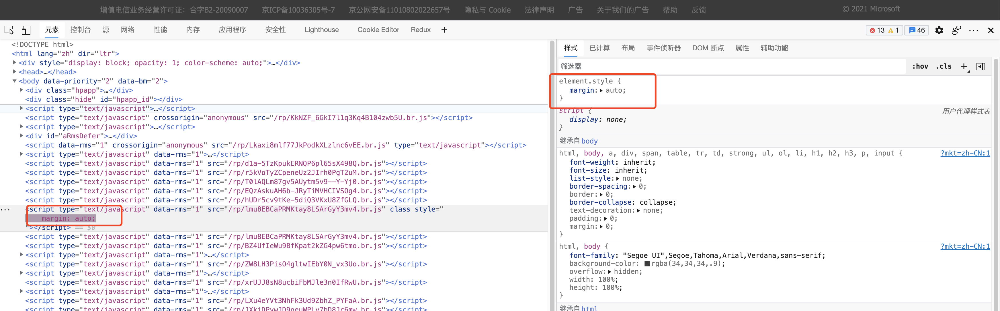

下方可以查看盒子模型，并进行修改

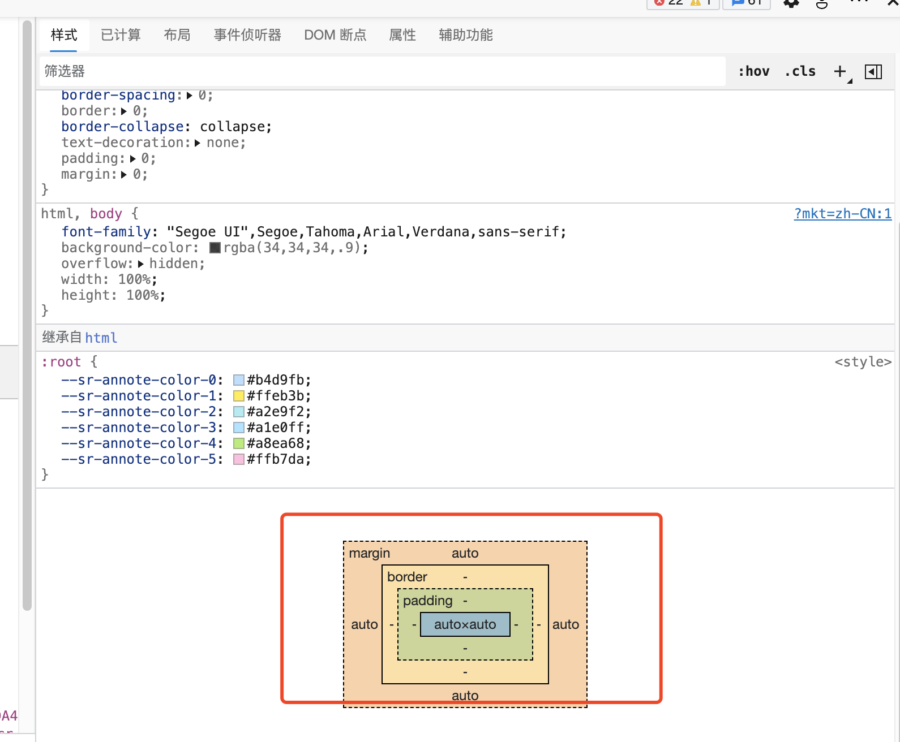

针对于一些鼠标hover状态的样式，我们可以通过选中:hov将元素的状态强制设置为某一状态。

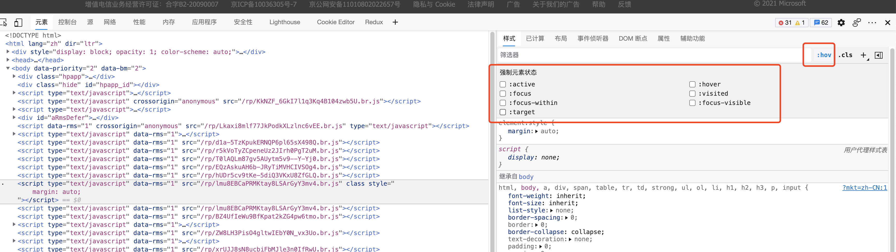

### 事件侦听器

通过事件侦听器查找元素上绑定的事件

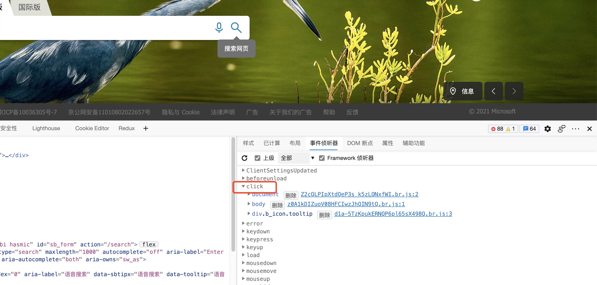

### DOM断点

DOM断点窗口可以查看所有设置的DOM断点

## 控制台

- 观察报错，日志

- 执行js，覆盖js

- 输入函数名，通过展示内容定位到js所在位置进行内容的查看和断点调试

~~~ js
// 日志打印
console.log()
console.error()
console.warn()
// console.dir(document.body)
console.dir()

// 记录执行时间
// 计时开始
console.time('timer1')
// 计时结束 timeEnd会打印出时间
console.timeEnd('timer1')
~~~

## 源(source)

主要可以用来观察、调试js

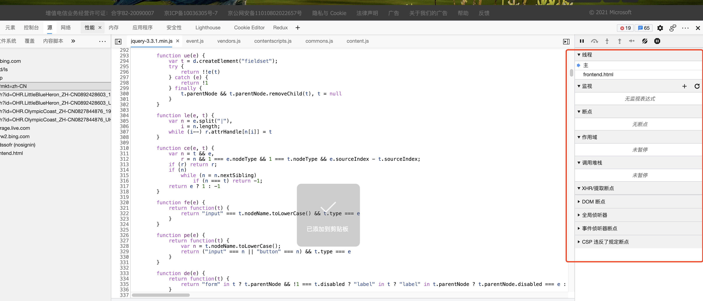

**快捷键**

打开文件

Ctrl + P(windows) 或  ⌘ + P (mac)

### 调试

栈帧等基础概念与后端调试一致

### 断点

- ajax断点

- DOM断点

- 全局侦听器

- 事件侦听器 

## 网络(network)

主要用来观察网络请求，可以通过筛选不同类型的请求进行观察

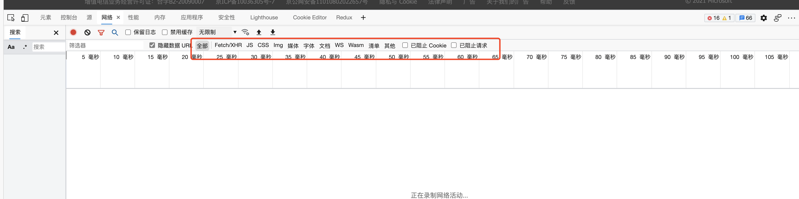

调整网速用于模拟网络较卡时的效果

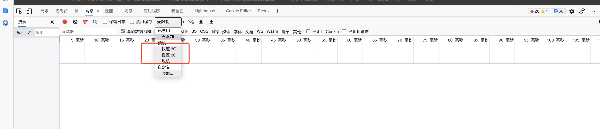

保留日志

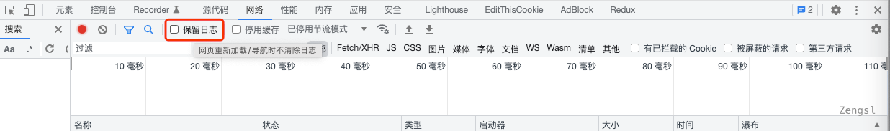

## Lighthouse

生成报告结合“性能”工具进行分析

[调优](https://docs.microsoft.com/zh-cn/microsoft-edge/devtools-guide-chromium/speed/get-started)

## 性能

分析运行时性能

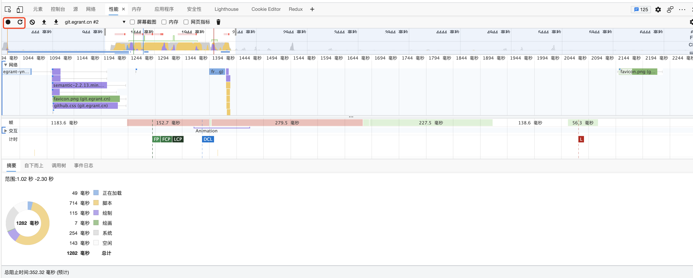

[Edge文档](https://docs.microsoft.com/zh-cn/microsoft-edge/devtools-guide-chromium/evaluate-performance/)

[Lighthouse 优化](https://docs.microsoft.com/zh-cn/microsoft-edge/devtools-guide-chromium/speed/get-started)

## 应用程序

可以查看cookie

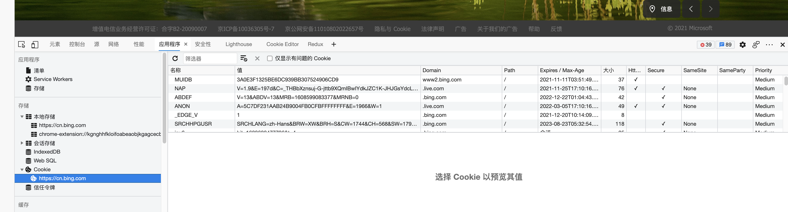

可以安装Cookie Editor插件

## 插件

FeHelper，可以格式化json

例如：访问[获取时间接口](http://poetry.apiopen.top/getTime)，响应结果会被格式化

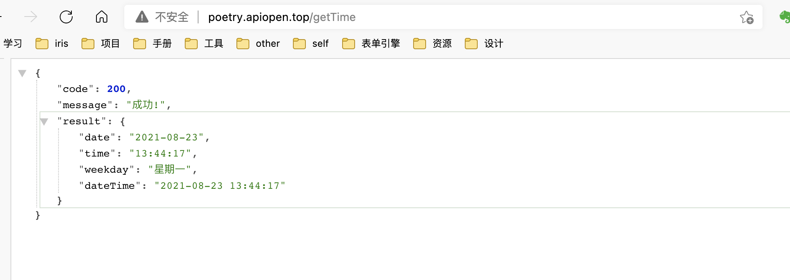