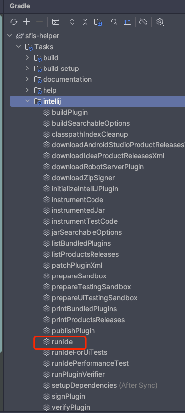

---

date: 2023-12-09

---
# Intellij Plugin

::: info
记录插件开发的要点，学习如何查看文档，从文档中获取想要的内容。
:::

Intelij Platform 提供了丰富的插件SDK，可以通过内置的扩展点、Action进行扩展，根据不同的需求可能会用到不同种类、数量的扩展点、Action等内容。

这里只记录一个按钮点击的插件需求的开发过程，以此对文档有初步的熟悉。

## 插件类型

通常有以下几种：

- 自定义语言支持
- 框架集成
- 工具集成
- 用户界面附加组件
- 主题

通过了解[插件类型](https://plugins.jetbrains.com/docs/intellij/plugin-types.html)，可以找到不同类型插件的Demo

## 插件结构

[https://plugins.jetbrains.com/docs/intellij/plugin-structure.html](https://plugins.jetbrains.com/docs/intellij/plugin-structure.html)

## 插件开发

[插件开发文档](https://plugins.jetbrains.com/docs/intellij/developing-plugins.html)提供多种开发方式，但官方推荐使用[Gradle IntelliJ Plugin](https://plugins.jetbrains.com/docs/intellij/creating-plugin-project.html)，其他方式也可以在文档上找到说明。

如果使用此方式，需要安装Gradle，并配置好Gradle环境，然后就可以使用Gradle进行插件开发了。
因此，你需要知道一些Gradle的知识。

::: tip
Gradle IntelliJ Plugin默认的Gradle配置和开发语言是Kotlin，使用Java可能会出现类找不到的问题。如需使用Java开发，可以在文档中寻找解决方案。
:::

### 插件配置

`plugin.xml`是插件开发的核心配置文件，常用的几个配置信息如下：

#### Depends 平台依赖

```xml
<!--plugin.xml-->
<idea-plugin>
    <!--省略其他...-->
    <depends>com.intellij.modules.platform</depends>
    <depends>com.intellij.database</depends>
</idea-plugin>
```

表示开发依赖的平台，默认是`com.intellij.modules.platform`，也就是基础平台

如果说想要基于数据库插件做开发，需要增加`com.intellij.database` 依赖，同时Gradle中也可能需要增加对应依赖，如：

```kotlin {5}
// build.gradle.kts
intellij {
    version.set("2022.2.5")
    type.set("IU") // Target IDE Platform
    plugins.set(listOf("com.intellij.database"))
}
```

[更多信息](https://plugins.jetbrains.com/docs/intellij/plugin-compatibility.html)

除了基础平台外，不同依赖的平台会提供不同的机制——Extensions、Action、Listener、Service等。下面对一些概念做一些简单说明：

#### Extensions 扩展

扩展是插件扩展 IntelliJ 平台功能的最常见方式，其方式不像向菜单或工具栏添加操作那样简单。扩展点是 IntelliJ 平台中定义的插件可以扩展的 API，扩展点允许您将代码附加到 Intelli。

**以下是使用扩展完成的一些最常见的任务：**

- 扩展点允许插件添加工具窗口（显示在 IDE 用户界面两侧的面板）;

- `com.intellij.toolWindow`和扩展点允许插件将页面添加到“设置”对话框中`com.intellij.applicationConfigurablecom.intellij.projectConfigurable`;

- 自定义语言插件使用许多扩展点来扩展IDE中的各种语言支持功能。

平台和捆绑的插件中提供了 1500 多个扩展点，允许自定义 IDE 行为的不同部分。

下面的例子分别配置了通知组件和工具窗口，工具窗口的界面由Swing UI实现：

::: info

idea Swing UI Designer创建的界面为Java版本，直接使用会出现`NoClassDefFoundError`，可选择通过Kotlin手工创建Form类或者处理以支持Java编译。

:::

```xml
<!--plugin.xml-->
<extensions defaultExtensionNs="com.intellij">
    <notificationGroup id="GetToken" displayType="BALLOON" />

     <toolWindow id="TokenToolWindow" secondary="true" icon="AllIcons.Toolwindows.WebToolWindow" anchor="right"
                 factoryClass="com.zzz.pgn.sfishelper.db.ui.TokenToolWindowFactory"/>
</extensions>
```


#### Listener 监听器

IntelliJ 平台提供了一组事件，用于在特定事件发生时通知插件。

侦听器允许插件订阅通过消息总线传递的事件（有关详细信息，请参阅消息传递基础结构）。

侦听器在应用程序（全局）或项目级别定义。

我们可以根据以下菜单对扩展点和侦听器进行查询，参考已有插件的实现来获取思路：

[https://plugins.jetbrains.com/docs/intellij/extension-point-list.html](https://plugins.jetbrains.com/docs/intellij/extension-point-list.html)

[https://plugins.jetbrains.com/intellij-platform-explorer/extensions](https://plugins.jetbrains.com/intellij-platform-explorer/extensions)

#### Actions 动作

IntelliJ 平台提供了操作的概念。操作是从 AnAction 派生的类，当选择其菜单项或工具栏按钮时，将调用其`actionPerformed`方法。

操作是用户调用插件功能的最常见方式。可以使用键盘快捷键或“帮助”|”查找操作...查找。

操作被组织成组，而组又可以包含其他组。一组操作可以构成工具栏或菜单。组的子组可以形成菜单的子菜单。

用户可以通过菜单和工具栏设置自定义所有已注册的操作。


可以通过开启内部模式，使用[UI-Inspector](https://plugins.jetbrains.com/docs/intellij/internal-ui-inspector.html)，像Chrome开发者工具审查UI元素一样来查看每个按钮、布局的结构，在Mac下使用`Control + Option`+鼠标左键。


### Gradle配置

> 配置本地仓库、仓库源等信息


:star: 设置目标`IDE Platform`：

`IC` ——社区版，默认值

`IU`——ultimate版本

```kotlin {4}
// build.gradle.kts
intellij {
    version.set("2022.2.5")
    type.set("IU") // Target IDE Platform
    plugins.set(listOf("com.intellij.database"))
}
```


:star: 设置插件依赖：

```kotlin {5}
// build.gradle.kts
intellij {
    version.set("2022.2.5")
    type.set("IU") // Target IDE Platform
    plugins.set(listOf("com.intellij.database"))
}
```

[更多信息](https://plugins.jetbrains.com/docs/intellij/plugin-compatibility.html#declaring-plugin-dependencies)


## 测试

- [runIde](https://plugins.jetbrains.com/docs/intellij/tools-gradle-intellij-plugin.html#tasks-runide) 启动测试IDEA



- [修复JVM参数](https://plugins.jetbrains.com/docs/intellij/tools-gradle-intellij-plugin-faq.html#how-to-modify-jvm-arguments-of-runide-task)

```kotlin {5}
// build.gradle.kts
runIde {
        jvmArgs("--add-opens=java.base/jdk.internal.org.objectweb.asm=ALL-UNNAMED")
        jvmArgs("--add-opens=java.base/jdk.internal.org.objectweb.asm.tree=ALL-UNNAMED")
    }
```

- [集成单元测试](https://kotlinlang.org/docs/jvm-test-using-junit.html#add-dependencies)

```kotlin {5}
// build.gradle.kts
tasks {

   test {
        useJUnitPlatform()
    }
}
    
```

## 编译

[buildPlugin](https://plugins.jetbrains.com/docs/intellij/tools-gradle-intellij-plugin.html#tasks-buildplugin)

生成一个可以分享、安装的压缩文件"build/distributions/xxxxx.zip"

## 发布

[publishing-plugin
](https://plugins.jetbrains.com/docs/intellij/publishing-plugin.html)
## 版本兼容

默认内容一般包含：

```kotlin
// build.gradle.kts
tasks {
    // Set the JVM compatibility versions
    withType<JavaCompile> {
        sourceCompatibility = "17"
        targetCompatibility = "17"
    }
    withType<org.jetbrains.kotlin.gradle.tasks.KotlinCompile> {
        kotlinOptions.jvmTarget = "17"
    }

    patchPluginXml {
        sinceBuild.set("222")
        untilBuild.set("233.*")
    }
}
```

版本兼容主要考虑以下几个方面：

- JDK版本，一般参考IDE Platform

```kotlin
// build.gradle.kts
tasks {
    // Set the JVM compatibility versions
    withType<JavaCompile> {
        sourceCompatibility = "17"
        targetCompatibility = "17"
    }
    withType<org.jetbrains.kotlin.gradle.tasks.KotlinCompile> {
        kotlinOptions.jvmTarget = "17"
    }
}
```

- 插件支持的版本范围 [build-number-ranges.html](https://plugins.jetbrains.com/docs/intellij/build-number-ranges.html?from=jetbrains.org#platformVersions)

```kotlin
// build.gradle.kts
tasks {
    patchPluginXml {
        sinceBuild.set("222")
        untilBuild.set("233.*")
    }
}
```


## 资料

- [IntelliJ Platform Plugin SDK](https://plugins.jetbrains.com/docs/intellij/welcome.html)

- [中文文档](https://www.ideaplugin.com/idea-docs/)

- [直播回放 | 9月29日「JetBrains码上道」| 主题：从零开始，开发插件](https://www.bilibili.com/video/BV1rv4y147fb/?share_source=copy_web&vd_source=c71c79a0e59361cee136f3f1c1b16180)

- [IDEA插件开发](https://www.bilibili.com/video/BV1Zi4y1b7fw/?share_source=copy_web&vd_source=c71c79a0e59361cee136f3f1c1b16180)


- [https://kotlinlang.org/docs/home.html](https://kotlinlang.org/docs/home.html)

- [https://www.ideaplugin.com/idea-docs/](https://www.ideaplugin.com/idea-docs/)

- [IntelliJ-IDEA-Open-API-and-Plugin-Development
](https://intellij-support.jetbrains.com/hc/en-us/community/topics/200366979-IntelliJ-IDEA-Open-API-and-Plugin-Development)


## Demo

- [intellij-plugin-sfis](https://github.com/zengsl/intellij-plugin-sfis.git) 检索本机指定日志文件并展示
- [intellij-plugin-lombok-helper](https://github.com/zengsl/intellij-plugin-lombok-helper) 快速打开class文件


