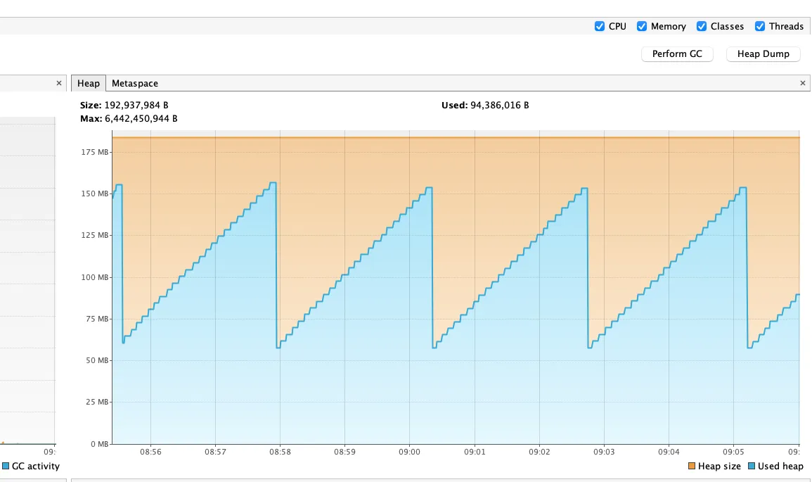
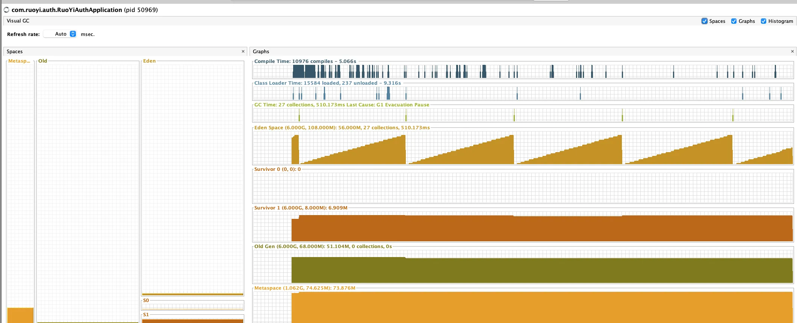
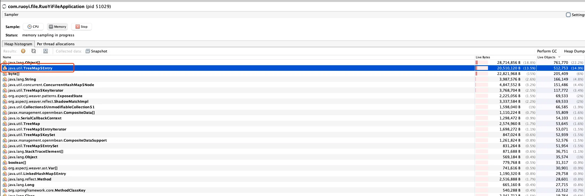
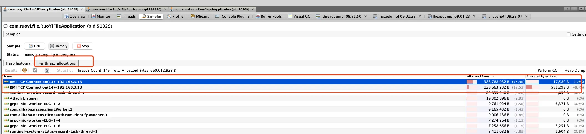
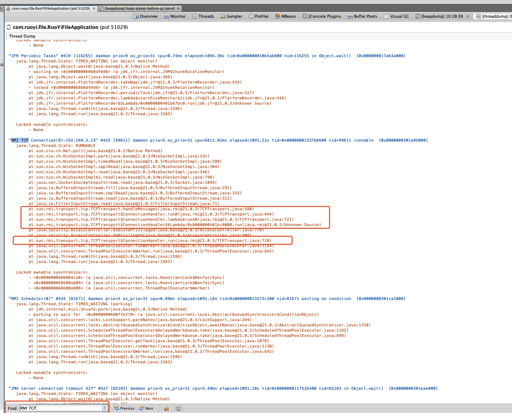
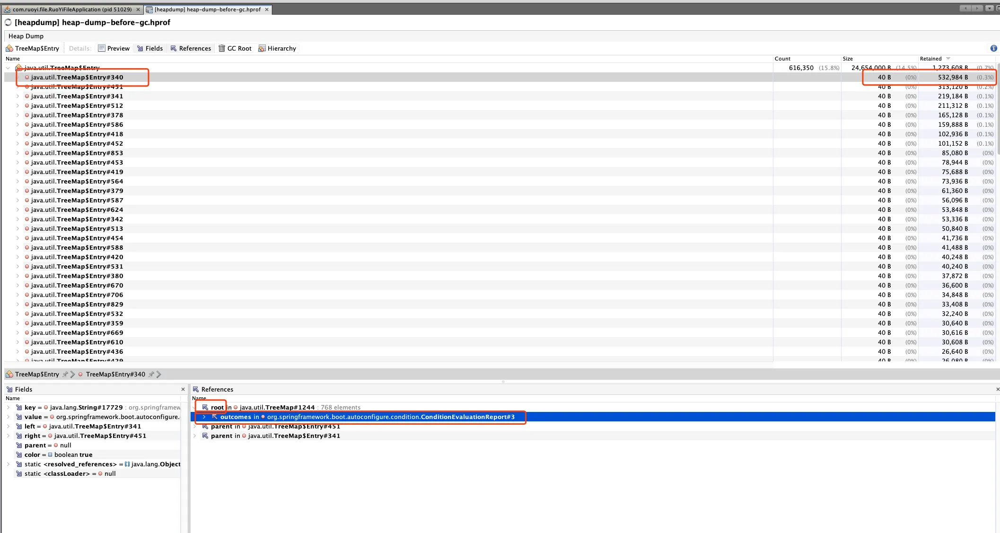
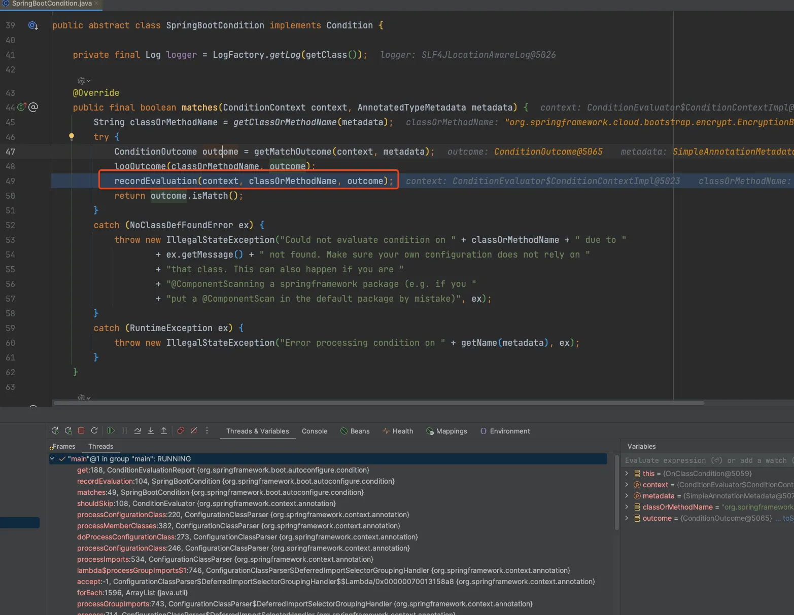
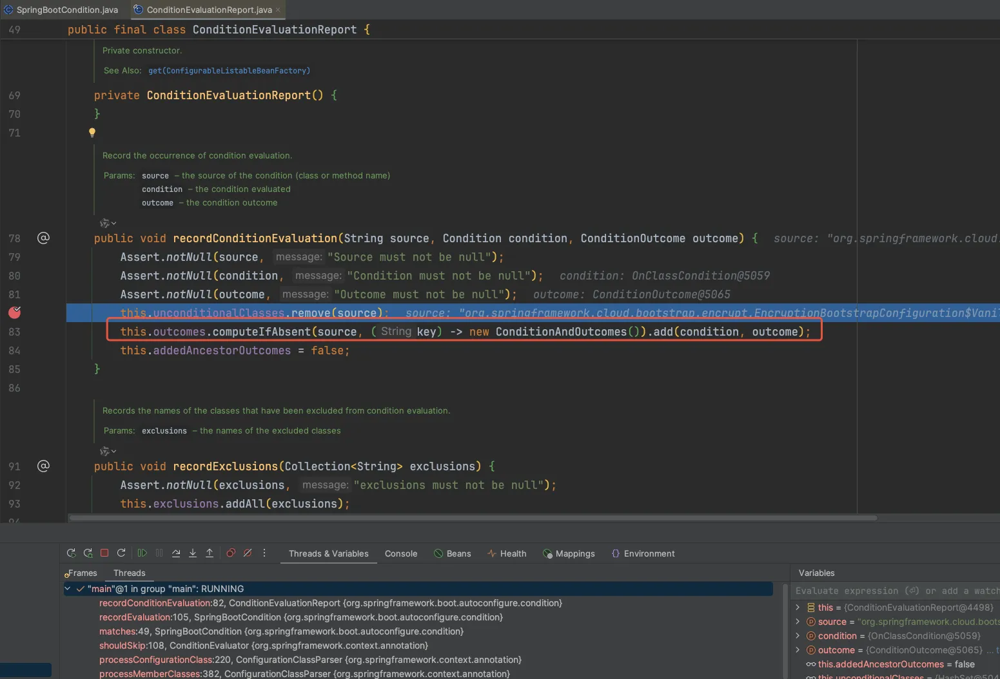
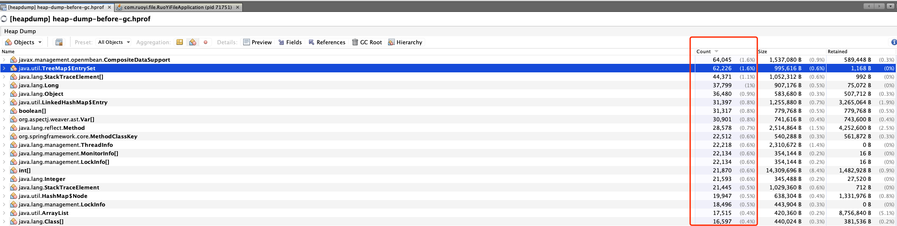
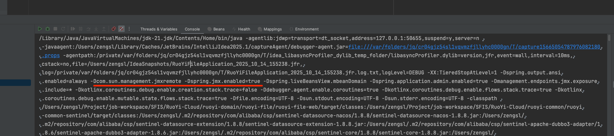

# 调优记录

## 微服务内存稳定增长

### 情况分析

通过visualVm观察发现，内存会从75MB持续增长至170MB左右，然后触发GC，以此往复。



观察gc发现主要是在eden中增加和回收



通过抽样器可以观察到大对象treeMap，疑似jmx功能导致：



通过线程查看，占用内存较大的线程为：




大对象为TreeMap，下一步通过jmap导出所有dump信息,进一步确定和验证是哪些jmx:

在合适的路径下执行dump命令：

```shell
/Library/Java/JavaVirtualMachines/jdk-21.jdk/Contents/Home/bin/jmap -dump:format=b,all,file=heap-dump-before-gc.hprof <pid>
```
利用visualVM载入heap-dump-before-gc.hprof并观察大对象对象：



#### ConditionEvaluationReport

ConditionEvaluationReport作用：

ConditionEvaluationReport是记录和报告 Spring Boot 在启动过程中，所有自动配置类（Auto-configuration）的条件评估（Condition Evaluation）结果。
在application.properties中设置debug=true开启打印结果
每次在执行matches方法时，都会进行记录。

调用过程如下：




**ConditionEvaluationReport目前无法关闭，而且其应该不是主要原因。**

因为对象都在eden创建，且内存每次上升不高，所以一般是大量小对象。按数量排序之后发现，毕竟多的对象都还是与jmx相关。`javax.management.openmbean.CompositeDataSupport#contents`也持有TreeMap


#### JMX

- 直接关闭jmx功能观察:

```yaml
spring:
  jmx:
    enabled: false

management:
  endpoints:
    enabled-by-default: false
```

- 观察内存情况依旧，发现线程`RMI TCP Connection`还存在
- 增加启动参数`-Dcom.sun.management.jmxremote=false`后还是无法关闭`RMI TCP Connection`

通过观察开发环境IDEA启动参数发现，启动命令默认设置开启jmx功能：



### 原因

JMX导致