# PDF内容显示异常
[[toc]]
## 问题描述

PDF内容显示不正常，几乎样式全部丢失，可能会有某一部分内容显示正常（如：首页）。

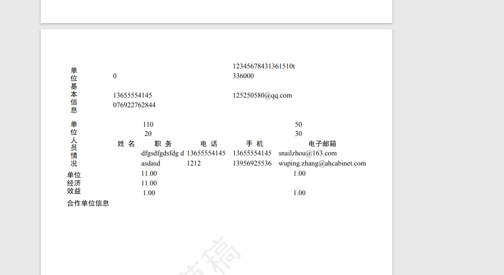

[pdfView请求](http://dev.hnkjt.egrant.cn/egrantpdf/pdf/pdfView?jspUrl=WEB-INF/app-jsp/proposal/pdf/main/pdf_zdyfjh_2021.jsp&keyCode=205381&locale=zh_CN&type=proposal)查看PDF对应的html内容时，一切显示正常，如下图所示。


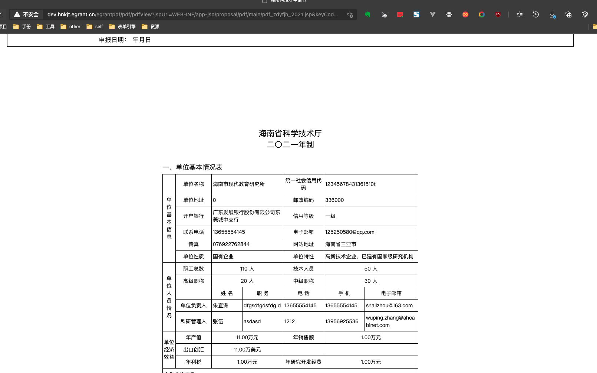


## 问题分析

1. 打开flying-saucer-core框架的日志

   增加配置文件

   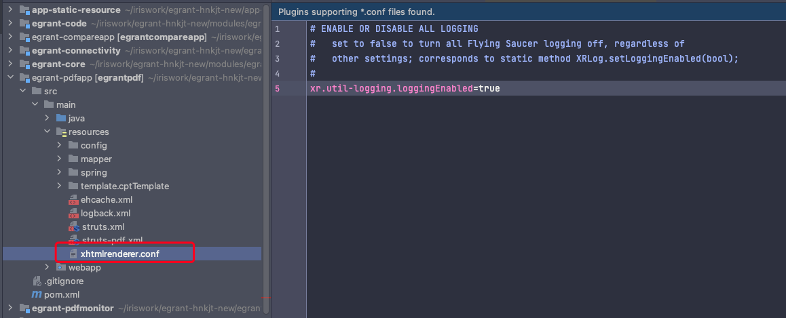

   增加启动参数

   -Dxr.conf=classpath:xhtmlrenderer.conf
   -Dshow-config=DEBUG

2. 查看日志中的异常信息

   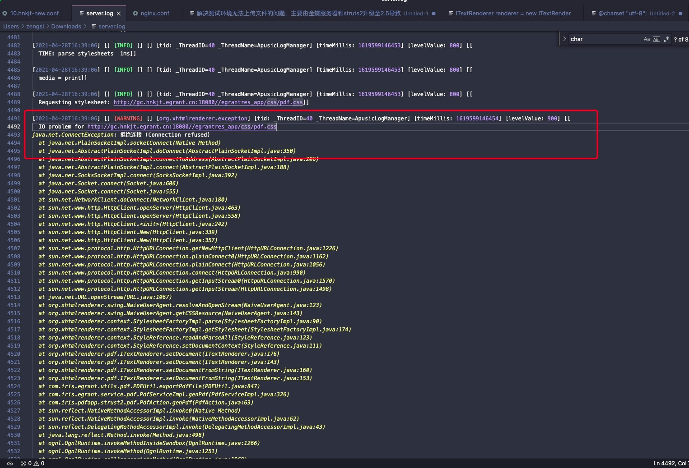


上图中提示的非常明显，请求“http://gc.hnkjt.egrant.cn:80//egrantres_app/css/pdf.css”的连接被拒绝了。


为什么会被拒绝？


连接服务器终端执行`wget http://gc.hnkjt.egrant.cn:18080//egrantres_app/css/pdf.css`可以看到下图的信息

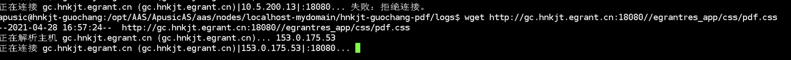

这个信息非常明显，域名解析失败，联系运维配host！

## 问题解决

经沟通得知，很多系统生产环境都是通过在PDF配置生产文件中将和“domainegrant”相似的几个配置域名的参数设置为内网地址。

一般是生产环境才需要把PDF里面的配置文件配成内网地址，但是这个项目的测试环境是配在第三方，且使用非80端口。


## 经验分享

**排查方向**

> 走了一些弯路，其实直接打开框架的日志就可以在后台看到日志。当时在官网没有看到开启日志的方法，后面看源码的时候跟着调试才找到打开日志的方法

- 字体问题

  因为之前处理过字体的问题，所以先入为主以为是字体问题。直接修改了服务器中的样式文件后进行测试，没有效果。

- 样式文件影响

  这个可能性比较小，样式文件和其他系统是一样的，不过也不能完全排除。因为itext版本、flying-saucer、金蝶服务器版本都和其他系统不一样。

- 远程调试

  通过调试**针对字体丢失**这一个问题为入口排查出问题的范围。这里需要说明一下系统使用itext生成PDF的过程为JSP->HTML->PDF

  JSP->HTML可以通过pdfView请求查看是否有异样

  HTML->PDF的过程是通过itext完成的，如下主要分为三个步骤：

  1. “添加字体”

  2. “布局”

  3. “生成PDF”

  ~~~ java
  ITextRenderer renderer = new ITextRenderer();
  String str = getHtmlFile(urlStr, map);
  // 调用setDocumentFromString也可以传入baseURL，这样引入的css可以不需要写绝对路径。但我们系统还是采用绝对路径的引用策略
  renderer.setDocumentFromString(str);
  ITextFontResolver fontResolver = renderer.getFontResolver();
  fontResolver.addFont(buildAbsoluteFilePath("FONT") + SIMSUN, BaseFont.IDENTITY_H, BaseFont.NOT_EMBEDDED); // 宋体字
  fontResolver.addFont(buildAbsoluteFilePath("FONT") + SIMHEI, BaseFont.IDENTITY_H, BaseFont.NOT_EMBEDDED); // 黑体
  fontResolver.addFont(buildAbsoluteFilePath("FONT") + ARIAL, BaseFont.IDENTITY_H, BaseFont.NOT_EMBEDDED); // Arail
  renderer.layout();
  renderer.createPDF(os);
  os.flush();
  os.close();
  ~~~

  通过调试发现“添加字体”成功将字体添加到上下文中。在“生成PDF”时本来是可以获取正确的字体的，但是元素本身的字体并不是我们创建的JSP中设置的，所以问题肯定是处在第二步`renderer.layout()`中

  itext在生成PDF的时候不依赖浏览器引擎，而是自己会将HTML映射成样式对象等元素，所以应该重点查看样式对象是怎么生成的。另外，在调试前通过一些测试代码发现当前页面中的样式和行内样式都是有效的，无效的只有需要引入外部样式的内容，所以应该查看外部样式是哪里加载初始化的。

  [Do we need a browser engine to render HTML+CSS to PDF? (itextpdf.com)](https://kb.itextpdf.com/home/it7kb/ebooks/itext-7-converting-html-to-pdf-with-pdfhtml/chapter-7-frequently-asked-questions-about-pdfhtml/do-we-need-a-browser-engine-to-render-html+css-to-pdf)

- 打开日志


**排查样式初始化逻辑**

怎么找入口？

- 在本地阅读代码，在可能的地方打断点测试。

- 把引入样式的地址改错，让其报错（不过有时候框架可能并不会直接抛出异常或者打印日志）

找到加载的核心代码时最好先观察是不是有cath异常，有的话打上断点方便看异常信息。通过此方法很快就看到“连接被拒绝的异常”，因为已经把框架的日志打开了，同时看了下后台的日志文件也发现上文所述的异常信息。

> 发现真正问题之前，在调试代码的时候发现css文件的地址后面加了一个版本号的参数，如：?v=1231。当时以为是因为这个导致找不到文件，直接debug修改变量，结果发现测试代码的文字内容出来了，以为就这么结束了。但是其他PDF文件的内容并不没有正常显示，而且奇怪的是这个测试PDF重新生成的时候也还是没有问题。这个到最后也不知道是为什么。
>
>  版本号是因为系统使用了gulp对静态资源进行打包，其他系统好像没有几个对PDF的资源进行打包的。


## flying-saucer相关

> Flying Saucer(或者叫xhtmlrender project on java.net)是一个基于iText的开源java库，能够轻松的将html(带css2.1)生成pdf。
>
> iText是一个生成PDF文档的开源java库，能够动态从XML或者数据库生成PDF，同时它具备PDF文档的绝大多数属性(比如加密……)，支持java，C#等。
>
> 我们将flying-saucer和itext结合使用。HTML到PDF的过程中，布局是通过flying-saucer完成，输出PDF是通过itext完成。增加水印等过程都是通过itext完成


### 配置文件

- 初始化代码在`Configuration`的默认构造方法中

- 初始化方式

  1. 配置文件从框架中默认配置文件中进行加载

  2. 可以通过系统中的配置文件进行覆盖或从用户目录加载配置文件

     ```java
     // 用户配置文件路径规则
     System.getProperty("user.home") + File.separator + ".flyingsaucer" + File.separator + "local.xhtmlrenderer.conf"
     ```

  3. 通过系统参数进行配置

  

  ~~~ java
  private Configuration() {
          startupLogRecords = new ArrayList();
  
          try {
              try {
                  // read logging level from System properties
                  // here we are trying to see if user wants to see logging about
                  // what configuration was loaded, e.g. debugging for config itself
                  String val;
                  try {
                      val = System.getProperty("show-config");
                  } catch (SecurityException ex) {
                      // this may happen if running in a sandbox; not a problem
                      val = null;
                  }
                  logLevel = Level.OFF;
                  if (val != null) {
                      logLevel = LoggerUtil.parseLogLevel(val, Level.OFF);
                  }
              } catch (SecurityException e) {
                  // may be thrown in a sandbox; OK
                  System.err.println(e.getLocalizedMessage());
              }
            	// 加载默认的配置文件
              loadDefaultProperties();
  
            	// 获取系统覆盖配置文件名称和加载
              String sysOverrideFile = getSystemPropertyOverrideFileName();
              if (sysOverrideFile != null) {
                  loadOverrideProperties(sysOverrideFile);
              } else {
                	// 获取用户目录覆盖配置文件名称和加载
                  String userHomeOverrideFileName = getUserHomeOverrideFileName();
                  if (userHomeOverrideFileName != null) {
                      loadOverrideProperties(userHomeOverrideFileName);
                  }
              }
              // 加载系统参数配置文件，xr.开头的配置文件可以直接通过系统参数进行配置
              loadSystemProperties();
              logAfterLoad();
          } catch (RuntimeException e) {
              handleUnexpectedExceptionOnInit(e);
              throw e;
          } catch (Exception e) {
              handleUnexpectedExceptionOnInit(e);
              throw new RuntimeException(e);
          }
      }
  ~~~

- 默认配置文件

  可以根据需求进行对应的配置

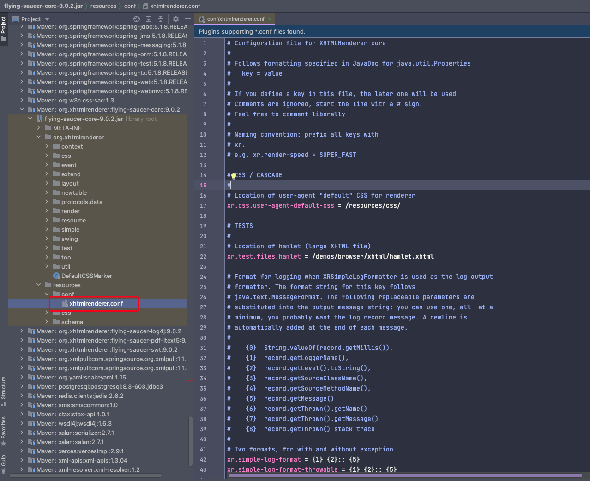

### 概念补充

~~~ java
// 调用setDocumentFromString也可以传入baseURL，这样引入的css可以不需要写绝对路径。但我们系统还是采用绝对路径的引用策略
renderer.setDocumentFromString(str);
// 添加字体 
ITextFontResolver fontResolver = renderer.getFontResolver();
fontResolver.addFont(buildAbsoluteFilePath("FONT") + SIMSUN, BaseFont.IDENTITY_H, BaseFont.NOT_EMBEDDED); // 宋体字
fontResolver.addFont(buildAbsoluteFilePath("FONT") + SIMHEI, BaseFont.IDENTITY_H, BaseFont.NOT_EMBEDDED); // 黑体
fontResolver.addFont(buildAbsoluteFilePath("FONT") + ARIAL, BaseFont.IDENTITY_H, BaseFont.NOT_EMBEDDED); // Arail
// 布局 生成iText对象和样式
renderer.layout();
// 渲染生成PDF
renderer.createPDF(os);
~~~

**样式对象**`Stylesheet`

包含地址、content等内容，映射Stylesheet主要分为初始化和解析内容元素两个过程，主要通过`StylesheetFactoryImpl`、`CSSParser`、`StyleReference`等对象来完成。


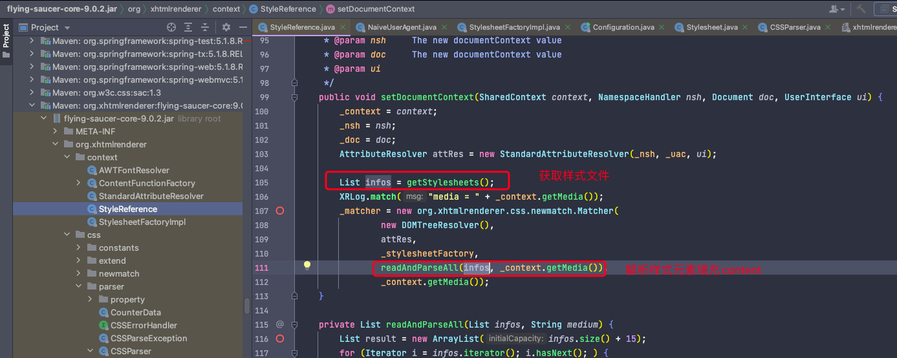


获取到的样式文件第一个为默认的样式文件，由`XhtmlCssOnlyNamespaceHandler`完成，对应我们页面中配置的xmlns

`<html xmlns="http://www.w3.org/1999/xhtml">`，然后才是解析文档的

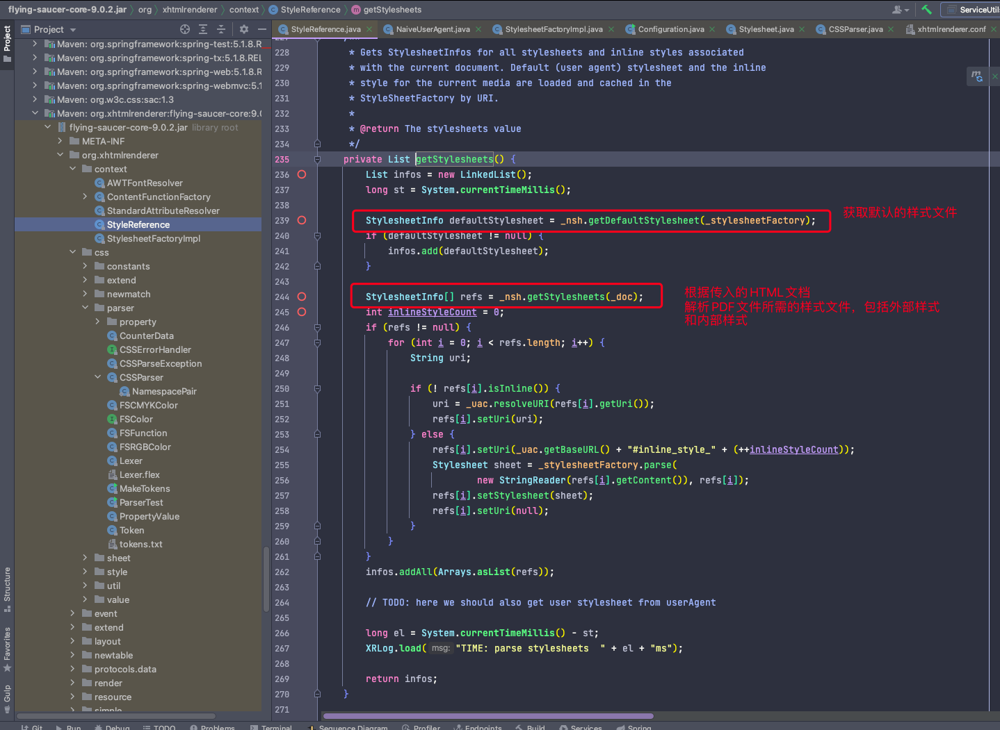


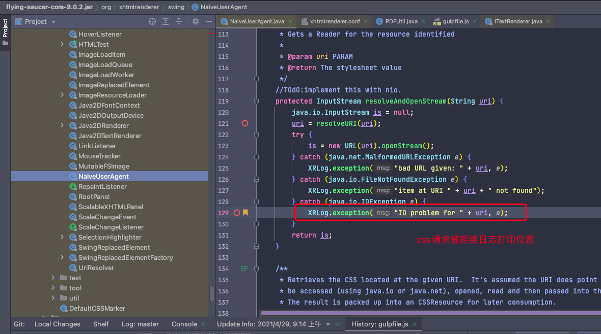


初始化完样式文件之后，还需要初始化文档元素对应的样式和级联样式。

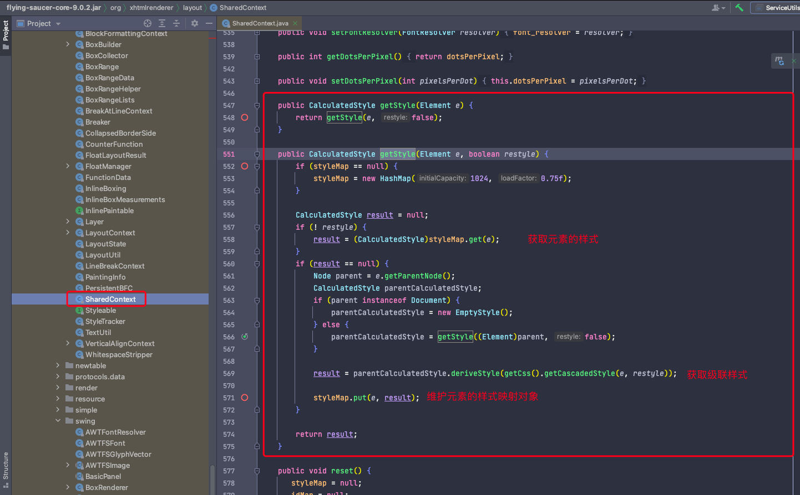


[Examples (itextpdf.com)](https://kb.itextpdf.com/home/it5kb/examples)

[Chapter 2: Defining styles with CSS (itextpdf.com)](https://kb.itextpdf.com/home/it7kb/ebooks/itext-7-converting-html-to-pdf-with-pdfhtml/chapter-2-defining-styles-with-css)

[GitHub - flyingsaucerproject/flyingsaucer: XML/XHTML and CSS 2.1 renderer in pure Java](https://github.com/flyingsaucerproject/flyingsaucer)

## 测试代码

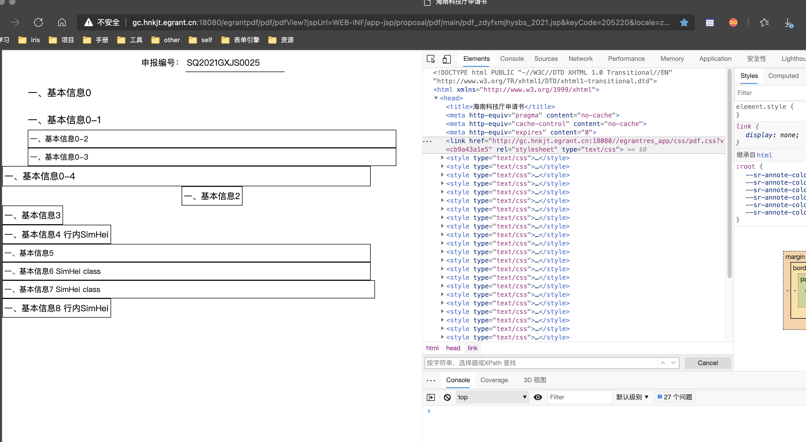

~~~ jsp
<%@ page contentType="text/html; charset=UTF-8"
         pageEncoding="UTF-8" %>
<%@ include file="/common/taglibs.jsp" %>
<%@ include file="/common-app/taglibs.jsp" %>
<!DOCTYPE html PUBLIC "-//W3C//DTD XHTML 1.0 Transitional//EN" "http://www.w3.org/TR/xhtml1/DTD/xhtml1-transitional.dtd">
<html xmlns="http://www.w3.org/1999/xhtml">
<head>
    <title>海南科技厅申请书</title>
    <meta http-equiv="pragma" content="no-cache"/>
    <meta http-equiv="cache-control" content="no-cache"/>
    <meta http-equiv="expires" content="0"/>
    <link href="${domainPath}/${res_app}/css/pdf.css" rel="stylesheet"
          type="text/css"/>
    <style type="text/css">
        .TblList2 {
            width: 690px;
            cellpadding: 5px;
            cellspacing: 5px;
            font-size: 14px;
            font-family: SimSun;
            border: 0.5px solid black;
            word-wrap: break-word;
            word-break: break-all;
        }

        .TblList3 {
            width: 690px;
            cellpadding: 5px;
            cellspacing: 5px;
            font-size: 14px;
            font-family: SimHei;
            border: 0.5px solid black;
            word-wrap: break-word;
            word-break: break-all;
        }

        .TblList4 td{
            width: 690px;
            cellpadding: 5px;
            cellspacing: 5px;
            font-size: 14px;
            font-family: SimHei;
            border: 0.5px solid black;
            word-wrap: break-word;
            word-break: break-all;
        }


        .TblList_head2 td {
            width: 690px;
            padding-top: 20px;
            font-size: 18px;
            text-algin: left;
            font-family: SimHei;
            cellpadding: 0px;
            cellspacing:0px;
            border: 0.5px sliver black;
            border: white;
        }

        body {
            margin: 0px auto;
            padding: 0px;
            font-family: SimSun, Arial;
            align: center;
        }
    </style>


</head>
<body>
<c:set var="xmlstr" value="${xmlData}" scope="request"/>
<x:parse xml="${xmlstr}" var="xmlData" scope="request"/>
<c:set var="sub_grant_code"><x:out select="$xmlData/data/proposal/sub_grant_code"/></c:set>

<table align="center">
    <tr>
        <td class="first_page" colspan="2">
            <div align="center">
                <table>
                    <tr>
                        <td align="right" style="border-left:0px;border-top:0px;border-right:0px;border-bottom:0px;">
                            申报编号：
                        </td>
                        <td width="180px" align="left" style="border-left:0px;border-top:0px;border-right:0px; ">
                            <x:out select="$xmlData/data/proposal/prp_no"/>
                        </td>
                    </tr>
                </table>
            </div>
        </td>

    </tr>
</table>

<table class="TblList_head" align="center">
    <tr>
        <td>一、基本信息0</td>
    </tr>
</table>

<table class="TblList_head2" align="center">
    <tr>
        <td>一、基本信息0-1</td>
    </tr>
</table>


<table class="TblList" align="center">
    <tr>
        <td>一、基本信息0-2</td>
    </tr>
</table>


<table class="TblList" align="center">
    <tr>
        <td>一、基本信息0-3</td>
    </tr>
</table>

<table class="TblList">
    <tr>
        <td style="font-size: 17px;font-family: SimHei;border-left:0px;border-top:0px;border-right:0px;border-bottom:0px;">一、基本信息0-4</td>
    </tr>
</table>


<table align="center">
    <tr>
        <td>一、基本信息2</td>
    </tr>
</table>

<table>
    <tr>
        <td>一、基本信息3</td>
    </tr>
</table>

<table>
    <tr>
        <td style="font-family: SimHei;">一、基本信息4 行内SimHei</td>
    </tr>
</table>

<table class="TblList2">
    <tr>
        <td>一、基本信息5</td>
    </tr>
</table>
<table class="TblList3">
    <tr>
        <td>一、基本信息6 SimHei class</td>
    </tr>
</table>

<table class="TblList4">
    <tr>
        <td>一、基本信息7 SimHei class</td>
    </tr>
</table>

<table>
    <tr>
        <td style="font-family: SimSun;">一、基本信息8 行内SimHei</td>
    </tr>
</table>

</body>

</html>

~~~

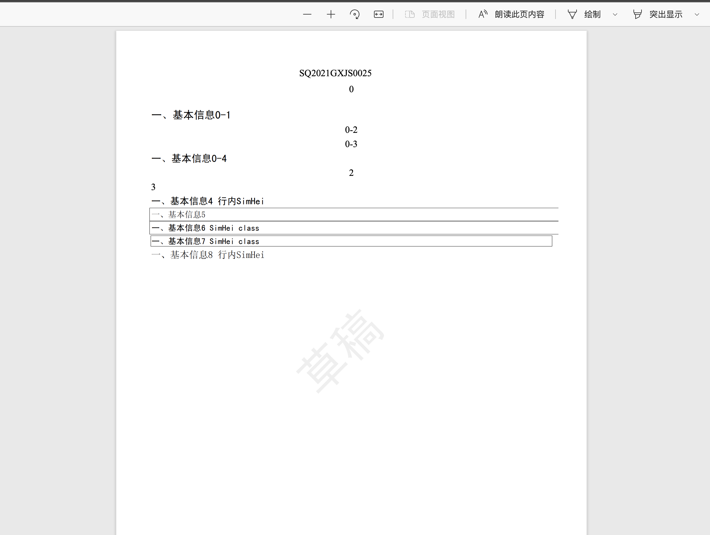

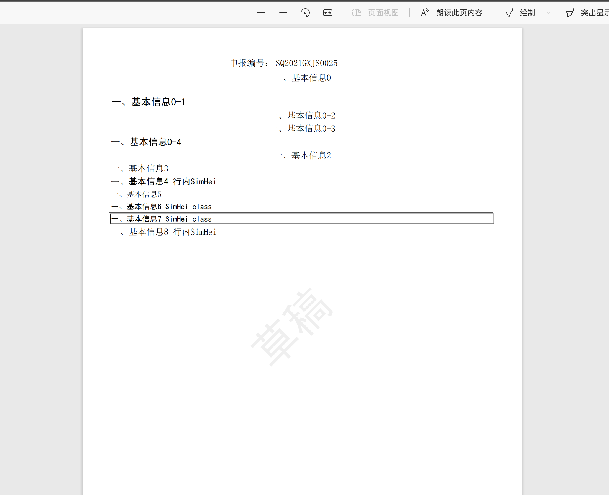


