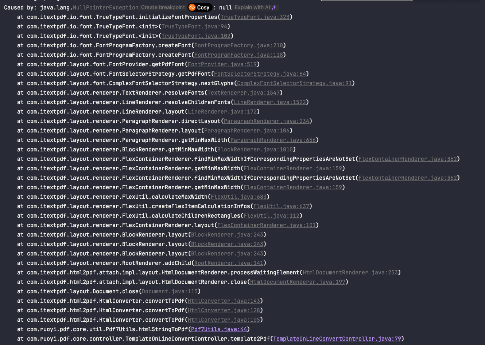
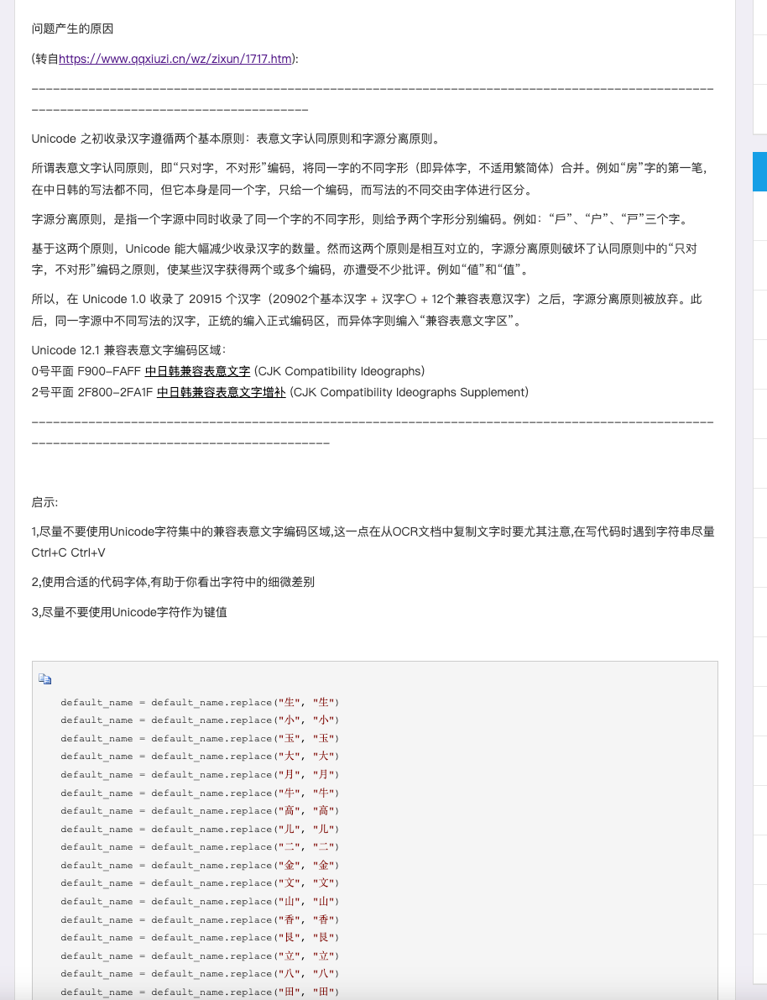
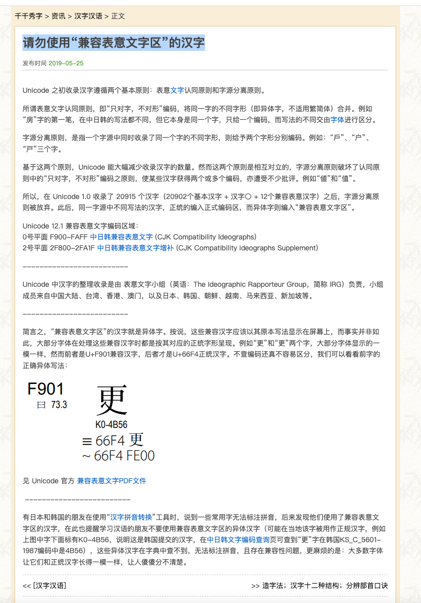
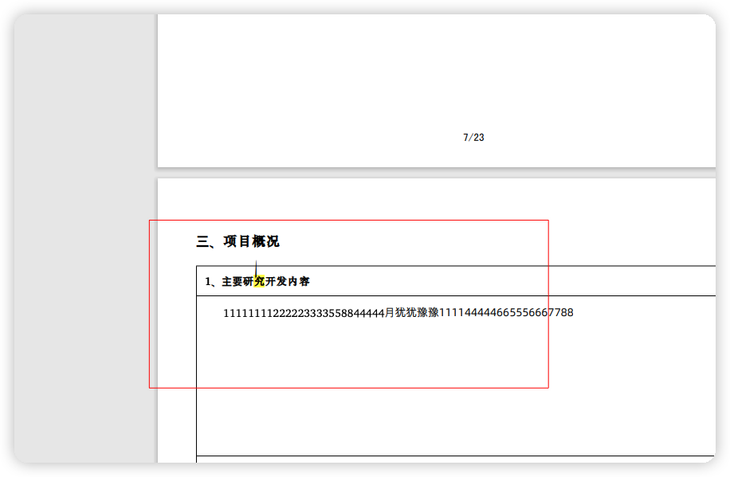
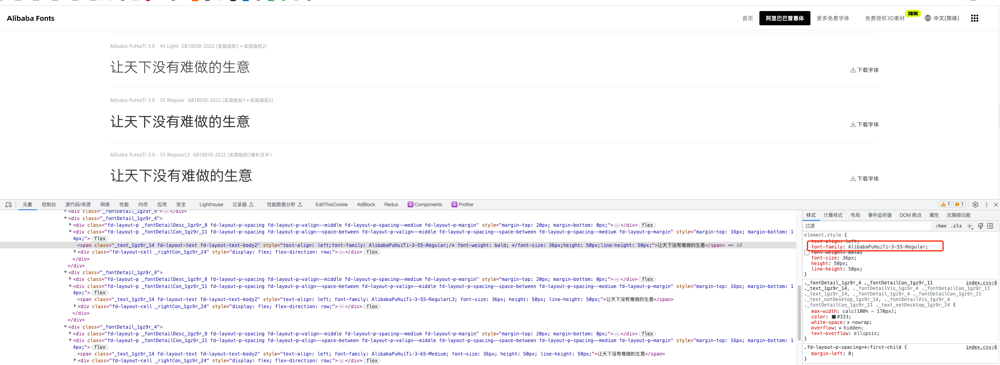
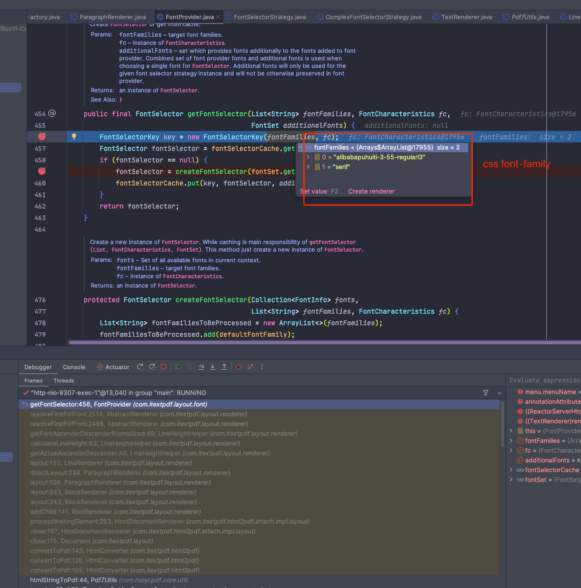
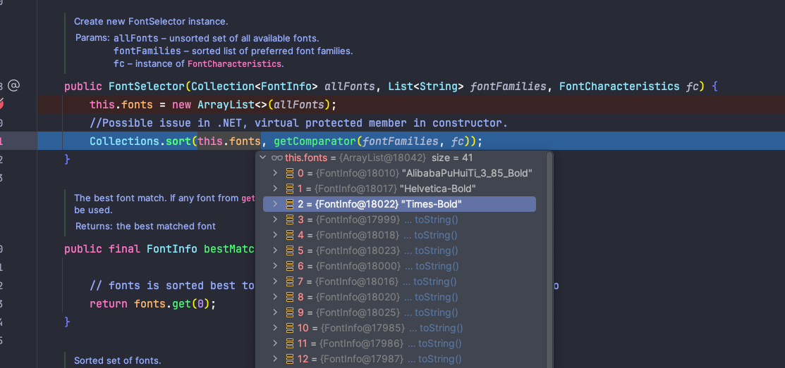
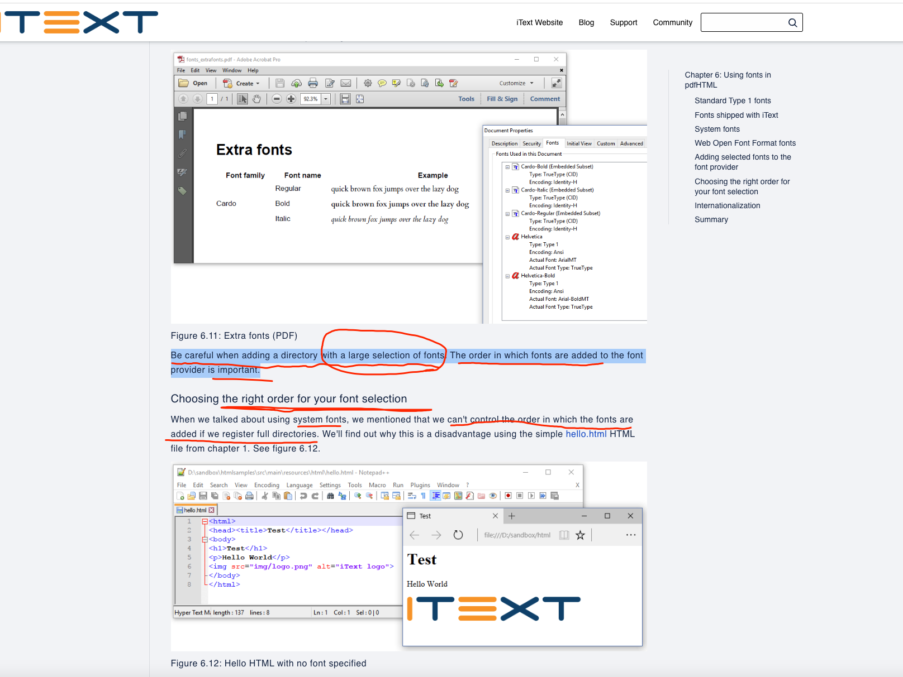
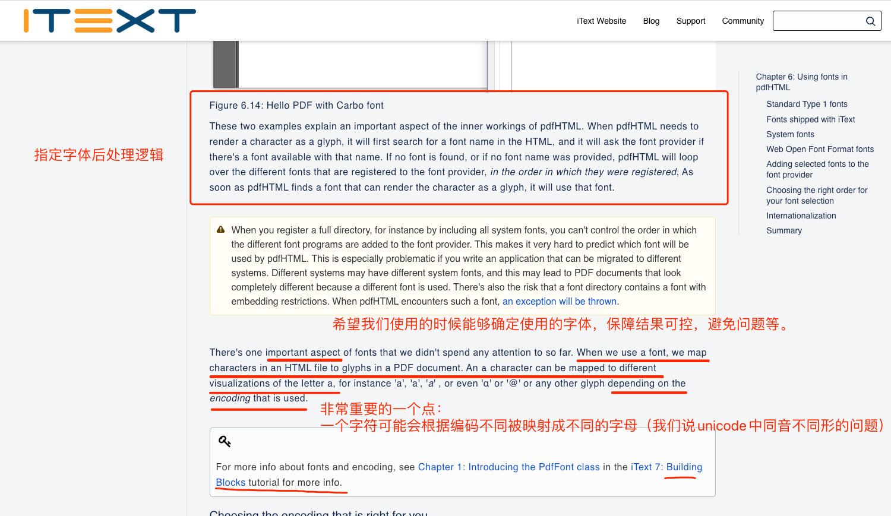

# PDF内容显示异常
[[toc]]
## 问题描述

> layout-7.2.2.jar

Html转化PDF空指针



## 问题分析

> 13.6 (22G120) 默认输入法

```html
<!DOCTYPE html>
<html>

<head>
    <meta charset="UTF-8">
    <title>Demo HTML</title>
</head>
<style>
    /* 公共部分 */
    * {
        margin: 0;
        box-sizing: border-box;
        word-break: break-all;
        font-family: AlibabaPuHuiTi-3-55-RegularL3, serif; 
    }

   
</style>

<body>
<div id="app" class="app">
          <div style="font-weight: bold;font-family: AlibabaPuHuiTi-3-55-RegularL3, serif; ">起⽌止年限究</div>

    </div>
   

</body>

</html>


```

经过缩小范围排查发现是因为包含特殊文字：“⽌”对应的unicode为\u2f4c

而我输入的“止”是\u6b62

我们使用的字体"SimSun"不支持前面这个“⽌”，所以iText从系统中搜索可用字体也没有发现可用字体，则导致报错。

通过[https://home.unicode.org/](https://home.unicode.org/)查询相关unicode的资料发现：


[https://unicode.org/charts/normalization/chart_Han.html](https://unicode.org/charts/normalization/chart_Han.html)

[unicode中的汉字](https://www.cnblogs.com/isakovsky/p/16287906.htm)



[请勿使用“兼容表意文字区”的汉字](https://www.qqxiuzi.cn/wz/zixun/1717.htm)




**所以导致问题的文字可能是通过Copy或者输入法导致。**

## 问题解决

系统安装包含更多的字体
Css 字体族设置更多字体，提高多系统、多文字兼容性

使用[阿里普惠字体3.0](https://fonts.alibabagroup.com/#/font)

- 安装多字体风格
  1. Alibaba PuHuiTi 3.0 - 55 Regular GB18030-2022 (实现级别1＋实现级别2)
  2. Alibaba PuHuiTi 3.0 - 85 Bold GB18030-2022 (实现级别1＋实现级别2) ：解决ITEXT后端模拟CSS解析环境导致加粗之后出现黑线条。在web端加粗可以通过font-weight来设置，但是在后端ITEXT应该是直接去找服务端的字体，没找到就做一个默认处理，而这个默认行为兼容性有限。从而导致问题
     
  3. Alibaba PuHuiTi 3.0 - 55 RegularL3 GB18030-2022 (实现级别3增补汉字）： 提高生僻字兼容

- 有OTF和TTF两种字体格式选择，没有太大区别。Web兼容性上也没问题。https://caniuse.com/?search=OTF
因为主要处理ITEXT转换PDF的问题，正好ITEXT中有一个TureTypeFont，那就选择TTF格式的进行安装。

使用字体 `font-family:AlibabaPuHuiTi-3-55-Regular;`




## 补充


Itext字体选择策略可以从系统中可用的字体中选取一个可以使用的字体。

- HTML转换PDF之前设置FontProvider

```java {5,7,9,11}
// HTML转换PDF之前设置FontProvider
ConverterProperties result = new ConverterProperties();
result.setBaseUri("");
// 设置FontProvider "AlibabaPuHuiTi-3-55-Regular"为默认字体
FontProvider fontProvider = new FontProvider("AlibabaPuHuiTi-3-55-Regular");
// 增加系统字体 从指定的几个系统目录下进行加载，一般是根目录下，不会加载home目录
fontProvider.addSystemFonts();
// 增加制定目录下在字体
fontProvider.addDirectory(PdfProperties.getFontPath());
// 增加标准字体
fontProvider.addStandardPdfFonts();
result.setFontProvider(fontProvider);
fontProvider.getFontSet().getFonts().forEach(System.out::println);
```


```java 
    // 以下操作均往fontProvider#fontSet增加字体
    public int addSystemFonts() {
        int count = 0;
        String[] withSubDirs = {
                FileUtil.getFontsDir(),
                "/usr/share/X11/fonts",
                "/usr/X/lib/X11/fonts",
                "/usr/openwin/lib/X11/fonts",
                "/usr/share/fonts",
                "/usr/X11R6/lib/X11/fonts"
        };
        for (String directory : withSubDirs) {
            count += fontSet.addDirectory(directory, true);
        }

        String[] withoutSubDirs = {
                "/Library/Fonts",
                "/System/Library/Fonts"
        };
        for (String directory : withoutSubDirs) {
            count += fontSet.addDirectory(directory, false);
        }

        return count;
    }
    
    
    /**
     * Add standard fonts to {@link FontSet} cache.
     *
     * @return number of added fonts.
     * @see com.itextpdf.io.font.constants.StandardFonts
     */
    public int addStandardPdfFonts() {
        addFont(StandardFonts.COURIER);
        addFont(StandardFonts.COURIER_BOLD);
        addFont(StandardFonts.COURIER_BOLDOBLIQUE);
        addFont(StandardFonts.COURIER_OBLIQUE);
        addFont(StandardFonts.HELVETICA);
        addFont(StandardFonts.HELVETICA_BOLD);
        addFont(StandardFonts.HELVETICA_BOLDOBLIQUE);
        addFont(StandardFonts.HELVETICA_OBLIQUE);
        addFont(StandardFonts.SYMBOL);
        addFont(StandardFonts.TIMES_ROMAN);
        addFont(StandardFonts.TIMES_BOLD);
        addFont(StandardFonts.TIMES_BOLDITALIC);
        addFont(StandardFonts.TIMES_ITALIC);
        addFont(StandardFonts.ZAPFDINGBATS);
        return 14;
    }
    
    /**
     * Add all the fonts from a directory.
     *
     * @param dir path to directory.
     *
     * @return number of added fonts.
     */
    public int addDirectory(String dir) {
        return fontSet.addDirectory(dir);
    }
```


- 渲染时解析字体



1. 获取好css所设置font-family

2. 创建fontSelector
```java
    /**
     * Create {@link FontSelector} or get from cache.
     *
     * @param fontFamilies target font families.
     * @param fc instance of {@link FontCharacteristics}.
     * @param additionalFonts set which provides fonts additionally to the fonts added to font provider.
     *                        Combined set of font provider fonts and additional fonts is used when choosing
     *                        a single font for {@link FontSelector}. Additional fonts will only be used for the given
     *                        font selector strategy instance and will not be otherwise preserved in font provider.
     *
     * @return an instance of {@link FontSelector}.
     * @see #createFontSelector(Collection, List, FontCharacteristics) }
     */
    public final FontSelector getFontSelector(List<String> fontFamilies, FontCharacteristics fc,
                                              FontSet additionalFonts) {
        FontSelectorKey key = new FontSelectorKey(fontFamilies, fc);
        FontSelector fontSelector = fontSelectorCache.get(key, additionalFonts);
        if (fontSelector == null) {
            fontSelector = createFontSelector(fontSet.getFonts(additionalFonts), fontFamilies, fc);
            fontSelectorCache.put(key, fontSelector, additionalFonts);
        }
        return fontSelector;
    }
```

创建FontSelectorKey作为FontSelector的缓存Key，从缓存中获取不到则调用`createFontSelector`创建FontSelector。

- 创建集合，fontFamilies作为前面的元素。fontFamilies是css font-family属性设置的内容
- 集合增加默认字体，由创建FontProvider对象时设置的默认字体。
- **重点！！！创建FontSelector对象。将FontProvider设置的所有可用字体赋值给集合FontSelector#fonts，并且根据fontFamilies进行排序。**

::: warning
通过css的font-family可以控制字体，前提是操作系统存在，且通过FontProvider增加，最终排序后还保持在前面，否则可能导致意外结果。
:::



经过排序之后我们所希望使用的字体就被排到第一位，因为设置了字体加粗，所以会自动选择为所希望字体的Bold风格。


```java
     /**
     * Create a new instance of {@link FontSelector}. While caching is main responsibility of
     * {@link #getFontSelector(List, FontCharacteristics, FontSet)}.
     * This method just create a new instance of {@link FontSelector}.
     *
     * @param fonts        Set of all available fonts in current context.
     * @param fontFamilies target font families.
     * @param fc           instance of {@link FontCharacteristics}.
     *
     * @return an instance of {@link FontSelector}.
     */
    protected FontSelector createFontSelector(Collection<FontInfo> fonts,
                                              List<String> fontFamilies, FontCharacteristics fc) {
        List<String> fontFamiliesToBeProcessed = new ArrayList<>(fontFamilies);
        fontFamiliesToBeProcessed.add(defaultFontFamily);
        return new FontSelector(fonts, fontFamiliesToBeProcessed, fc);
    }
    
    /**
     * Create new FontSelector instance.
     *
     * @param allFonts     unsorted set of all available fonts.
     * @param fontFamilies sorted list of preferred font families.
     * @param fc           instance of {@link FontCharacteristics}.
     */
    public FontSelector(Collection<FontInfo> allFonts, List<String> fontFamilies, FontCharacteristics fc) {
        this.fonts = new ArrayList<>(allFonts);
        //Possible issue in .NET, virtual protected member in constructor.
        Collections.sort(this.fonts, getComparator(fontFamilies, fc));
    }
```

## 官方文档解释

[chapter-6-using-fonts-in-pdfhtml](https://kb.itextpdf.com/home/it7kb/ebooks/itext-7-converting-html-to-pdf-with-pdfhtml/chapter-6-using-fonts-in-pdfhtml)



[chapter-2-defining-styles-with-css](https://kb.itextpdf.com/home/it7kb/ebooks/itext-7-converting-html-to-pdf-with-pdfhtml/chapter-2-defining-styles-with-css)