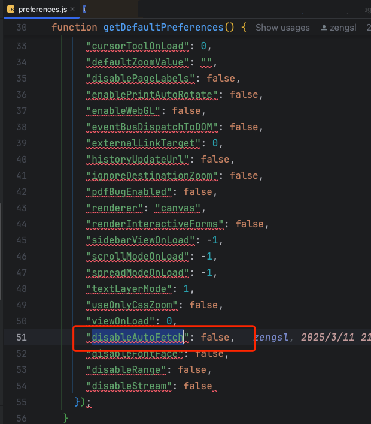

# PDFJS

> 2.4.456

https://github.com/mozilla/pdf.js

https://github.com/mozilla/pdf.js/wiki

PDFJS 是一个用于在网页上显示 PDF 文件的 JavaScript 库。它允许开发者在网页上嵌入 PDF 文件，并提供了一系列的 API 来操作和显示 PDF 文件。

PDFJS 的主要特点包括：

1. 支持多种 PDF 文件格式，包括 PDF/A、PDF/X 等。
2. 支持多种浏览器，包括 Chrome、Firefox、Safari、Edge 等。
3. 支持多种操作系统，包括 Windows、Mac、Linux 等。


## Vue3组件

https://github.com/zengsl/vue-office-pdf

## 特点

### 文件加载

pdfjs支持直接从URL加载PDF文件，也可以从ArrayBuffer对象加载PDF文件。

Blob可以通过arrayBuffer()方法转化为ArrayBuffer对象。

- 如果说传递ArrayBuffer对象，意味着文件已经加载到内存中，可以直接使用，则需要注意内存消耗。

- 如果传递URL，则意味着文件需要从网络上加载，而pdfjs支持Http Range Request。如果后端服务支持Range文件下载，则pdfjs将分片下载文件，大大提升性能。

提升预览性能：

- 传递URL参数，让pdfjs通过默认的range请求方式加载文件，而不是一次性加载整个文件（后端服务需要支持Range Request）。

- 按需修改disableAutoFetch参数为true，禁止pdfjs自动加载PDF文件，而是访问时才加载。disableAutoFetch参数为false则是会预先加载一些内容，但不是全部。大多情况下disableAutoFetch参数为false即可。特殊情况可以利用下述一些方法进行修改。



disableAutoFetch修改方法：

- 源码修改

-  打开文档时传参

``` js
pdfApp.PDFViewerApplication.open(props.pdf, 
        {
          disableAutoFetch: true,
        })
```

- AppOptions.set('disableAutoFetch', true) 不一定有效果

