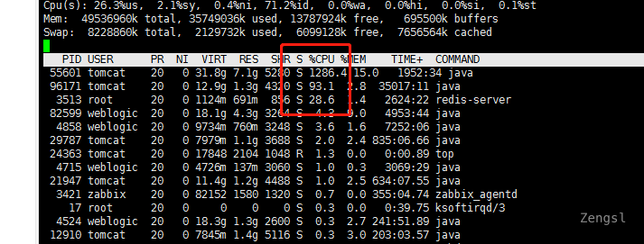
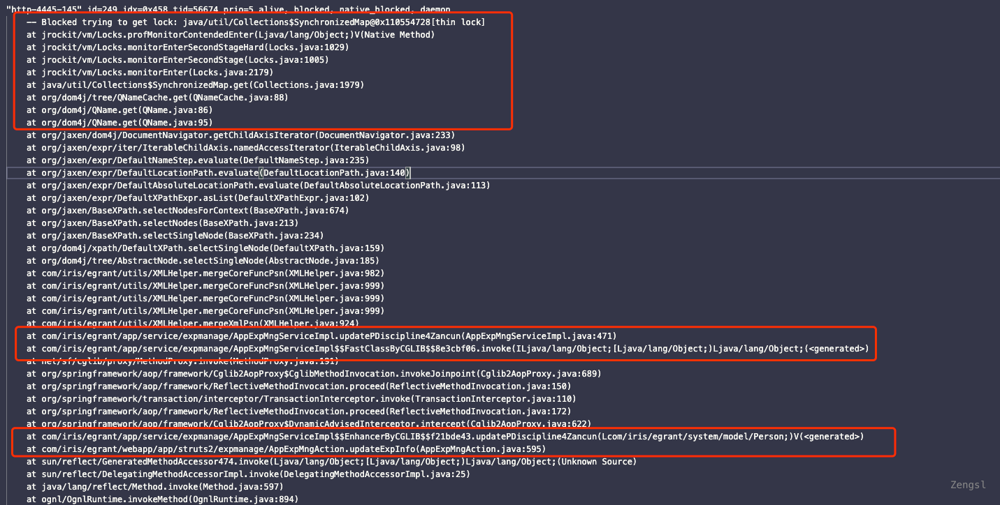
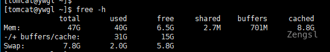
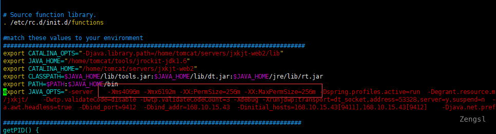
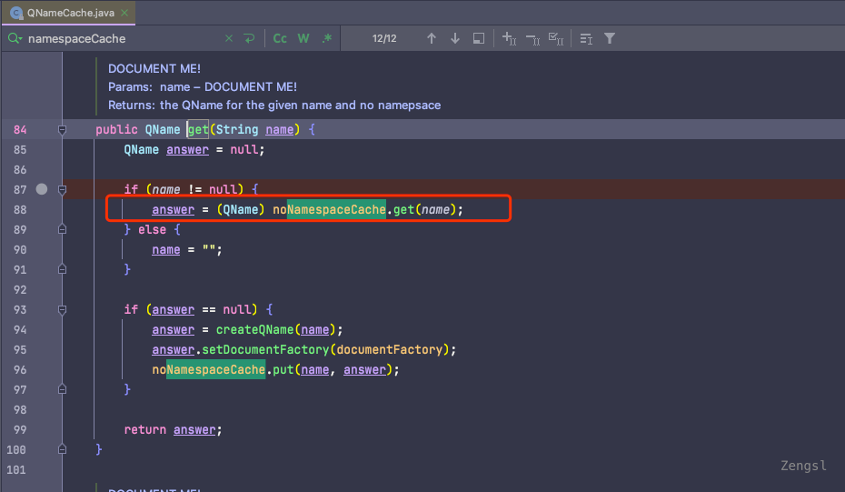
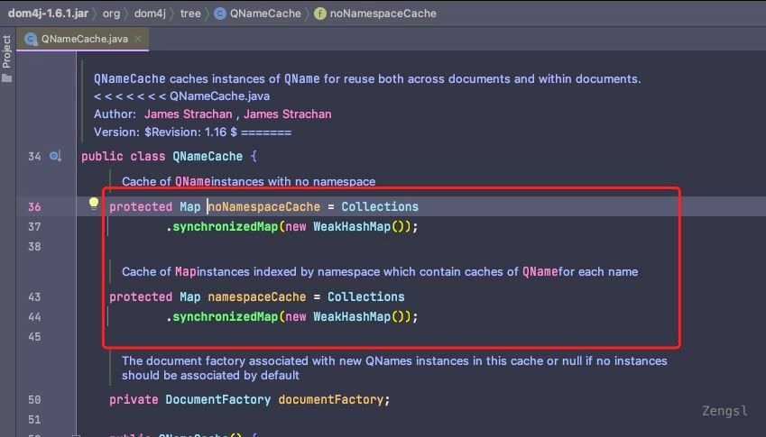
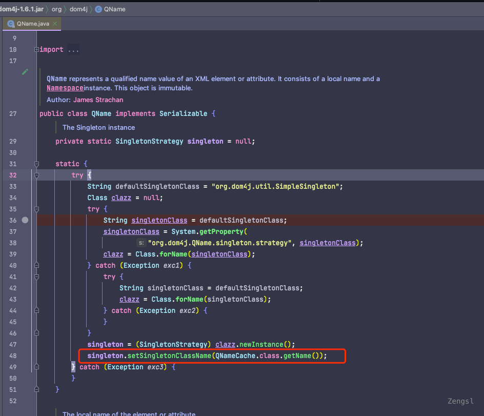
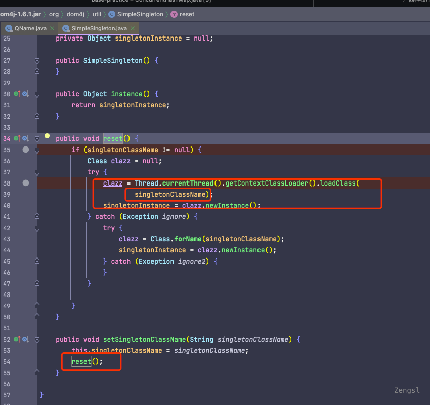

> 生产使用的是jrockit6运行

## 问题描述

系统卡顿，最终导致宕机。


## 问题排查

使用top查看CPU占用率



使用top -Hp pid查看对应进程中线程占用CPU的情况：

- 发现很多GC Work Thread
- 很多线程占用CPU较高

### 查看垃圾收集情况

使用`jstat -gc pid`查看垃圾收集情况**发现full gc比较频繁，且停顿时间较长。full gc是会导致CPU占用率提高的！**有可能是存在大量占用内存的程序，具体原因先深究，先观察下线程情况。内存占用情况也可以使用`jmap`将内存dump下来，并使用相关工具进行分析。


### 查看占用CPU高的线程

从top -Hp中选取占用较高的线程ID，转为16进制。

使用`jstack pid > pid.thread`将线程栈导出为pid.thread文件，根据16进制的线程ID进行查找，同时发现比较多阻塞线程，如下图：



经过与开发沟通，这是专家保存请求，最近批量发送了专家信息维护通知，告知专家进入系统维护个人信息。所以出现较大的登录访问量。

这段代码主要是做xml内容的合并，会进行递归比较节点（做增删改），同时xml解析使用的是Dom4j。众所周知，Dom4j是非常耗内存的，尤其在处理大量xml的时候会出现性能瓶颈，性能差是必然的。**因为占用的内存比较大，所以也就自然会导致内存不够引发full gc，也就对应了上面所说的gc问题。**

由于多种原因，这块代码的逻辑很难去优化，我们最好的方式（考虑成本和风险）就是**加大内存**。

#### 内存情况查看

通过`free -h`查看服务器内存容量，也可以使用`cat /proc/meminfo`，整个机器一共只有47G



通过`ps -ef | grep [web应用名]`查看web应用分配的内存(-Xmx)，或直接看设置应用所分配内存的启动脚本：




根据上面所述目前的情况，应用分配6个G现在看来是不太够，而且据了解这台服务器配置了江西所有的服务，包括：多个web服务、pdf服务、webservice服务、task服务、compare服务。


## 问题处理

### 提高配置

联系科技厅网管加大了24G内存，web应用都分配到12G。之后系统运行情况明显好转。

### Dom4j优化

虽然说增加了内存的容量，但是问题还没有完。上面的业务代码虽然说使用Dom4j占用内存会很大，引发full gc，从而导致CPU占用提升。但是咱上面查看的占用CPU占用较高的线程可不是GC Work Thread，只是普通的业务线程。

我们在此业务线程中并没有用锁，但是却发生了同步。仔细观察可以发现，锁是在Dom4j中的`QNameCache#get`方法，看下具体实现：





这里使用了`Collections#synchronizedMap`来将`WeakHashMap`实现同步操作,`Collections#synchronizedMap`是会包装对应的map给所有的方法都加上同步锁，这样的性能肯定是比较低的。在Dom4j的Github仓库中可以找到类似的issue[Dom4j concurrency problem · Issue #40 · dom4j/dom4j (github.com)](https://github.com/dom4j/dom4j/issues/40) 和[Lock congestion in (QNameCache performs terrible under multi-core loads) · Issue #114 · dom4j/dom4j (github.com)](https://github.com/dom4j/dom4j/issues/114)，提这个问题的人不在少数（高版本也没优化）。

网上也有相关的文章：[dom4j之多线程解析xml文件的锁问题](https://qingzhongli.com/dom4j-multi-thread-blocked/) 、 [记一次性能优化过程中的术与道 - 掘金 (juejin.cn)](https://juejin.cn/post/6844903586917253127)、[dom4j在高并发下创建dom树性能差_BlackC16的博客-CSDN博客](https://blog.csdn.net/BlackC16/article/details/113032249)

大概的解决思路就是重写`QNameCache`的实现，将上图中两个做缓存的Map对象换成`ConcurrentHashMap`或者缓存`ThreadLocal`包装的`WeakHashMap`，针对这两种方式的利弊做个简单的分析：

- `ConcurrentHashMap`相对于`Collections#synchronizedMap`来实现同步，做了较好的优化，其实现与HashMap类似，且保证了部分线程安全，get方法不上锁（读写锁思想）。在JDK1.6中使用分段锁，在JDK8中优化为synchronized和原子操作，其他的不多说了。但在丢失了WeakHashMap的优势（帮助GC，弱引用的概念可以了解下），可能会导致OOM。具体可能存放多少缓存、占用多大的内存，需要结合实际的业务来看，如果可以接受损耗这些空间也是可以采用此方式，用空间换时间。

- `ThreadLocal`包装的`WeakHashMap`就不存在线程安全问题了，本身就是线程独有，同时又拥有`WeakHashMap`的优势。缺点也很明显：会增加内存占用量，每个线程独立维护一个`WeakHashMap`去存放缓存，并发量高的时候总体内存肯定是会增加的。而且使用此方法要复写jar中的`QNameCache`，没那么灵活。

**解决思路：**

通过观察`QNameCache`方法可以发现，整个代码中主要就使用了get、put、values三个方法，我们可以创建一个继承`WeakHashMap`的类，只复写put和values方法。这样可以先保证get方法是无锁的。新增`CustomQNameCache`、`CustomWeakHashMap`三个类。

```java
package org.dom4j;

import java.util.Collection;
import java.util.WeakHashMap;

/**
 * 解决QNameCache中同步锁阻塞的问题，将QNameCache中使用到的values和put方法加锁，而get方法不加锁以提高性能
 * <p>
 * 可以参考Github中的问题描述：https://github.com/dom4j/dom4j/issues/114
 *
 * @author zengsl
 * @version V1.0
 * @date 2021/12/1 3:30 下午
 */
public class CustomWeakHashMap<K, V> extends WeakHashMap<K, V> {

    @Override
    public synchronized Collection<V> values() {
        return super.values();
    }


    @Override
    public synchronized V put(K k, V v) {
        return super.put(k, v);
    }
}
```

```java
package org.dom4j;

/**
 * @author zengsl
 * @version V1.0
 * @date 2021/12/1 3:19 下午
 */
public class CustomDocumentFactory extends DocumentFactory{

    @Override
    protected CustomQNameCache createQNameCache() {
        return new CustomQNameCache(this);
    }
}

```


类创建好了得思考如何让Dom4j使用咱自己的对象。通过调试发现，`QNameCache`是在`QName`的静态代码块中决定的:



比较遗憾的是这里SingletonClassName写死为`QNameCache.class.getName()`了，为了不修改jar报只能曲线救国。注意这里是设置了名字并没有创建出`QNameCache`实例，但是进入方法内部（这里singleton默认的实现是`SimpleSingleton`）可以发现reset方法创建了单例对象。




我们可以自己实现一个这样的对象，在上面`QName`中已经提供了自定义的方式，指定系统参数org.dom4j.QName.singleton.strategy为我们自己实现的类即可。接下来创建`CustomQNameCacheSingleton`，并**配置项目运行参数**`-Dorg.dom4j.QName.singleton.strategy=org.dom4j.CustomQNameCacheSingleton`让其生效。如果`QName`中对于SingletonClassName也支持参数选择的方式就不需要这么麻烦了，很遗憾的是最新版本Dom4j中也是写死的。

``` java
package org.dom4j;

import org.dom4j.util.SimpleSingleton;

/**
 *
 * @author zengsl
 * @version V1.0
 * @date 2021/12/1 6:04 下午
 */
public class CustomQNameCacheSingleton extends SimpleSingleton {

    private String singletonClassName = null;

    private Object singletonInstance = null;

    public CustomQNameCacheSingleton() {
    }

    @Override
    public Object instance() {
        return singletonInstance;
    }

    @Override
    public void reset() {
        if (singletonClassName != null) {
            Class clazz = null;
            try {
                clazz = Thread.currentThread().getContextClassLoader().loadClass(
                        "org.dom4j.CustomQNameCache");
                singletonInstance = clazz.newInstance();
            } catch (Exception ignore) {
                try {
                    clazz = Class.forName(singletonClassName);
                    singletonInstance = clazz.newInstance();
                } catch (Exception ignore2) {
                }
            }

        }
    }

    @Override
    public void setSingletonClassName(String singletonClassName) {
        this.singletonClassName = singletonClassName;
        reset();
    }
}
```


根据这个方式我们还可以对`DocumentFactory`做定制（与本次遇到的问题无关，顺带调整），它也支持通过参数选择具体的实现，同时其也会使用到`QNameCache`做缓存。

创建`CustomDocumentFactory`，配置项目运行参数`-Dorg.dom4j.factory=org.dom4j.CustomDocumentFactory`

``` shell
package org.dom4j;

/**
 * 自定义DocumentFactory实现，修改使用的QNameCache对象 
 *
 * @author zengsl
 * @version V1.0
 * @date 2021/12/1 3:19 下午
 */
public class CustomDocumentFactory extends DocumentFactory{

    @Override
    protected CustomQNameCache createQNameCache() {
        return new CustomQNameCache(this);
    }
}
```


## 参考资料

[1].[记一次接口压力测试与性能调优 - 知乎 (zhihu.com)](https://zhuanlan.zhihu.com/p[/45067134)

[2].[dom4j之多线程解析xml文件的锁问题 – Li's Blog – Java Developer from Jinan, China (qingzhongli.com)](https://qingzhongli.com/dom4j-multi-thread-blocked/)

[3].[dom4j在高并发下创建dom树性能差_BlackC16的博客-CSDN博客](https://blog.csdn.net/BlackC16/article/details/113032249)

[4].[记一次性能优化过程中的术与道 - 掘金 (juejin.cn)](https://juejin.cn/post/6844903586917253127)

