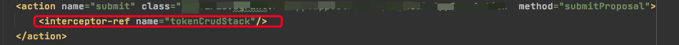
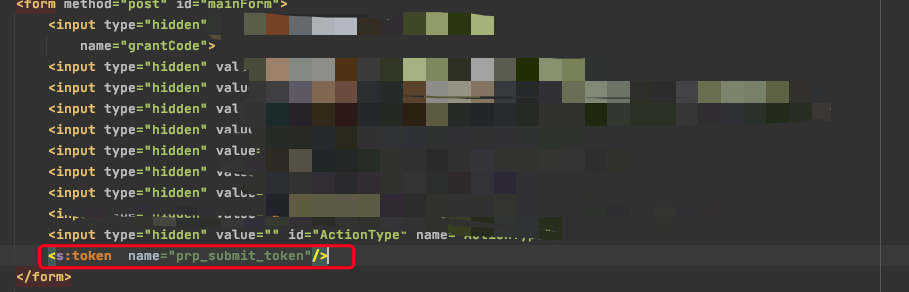

---
---

# 防重复请求

## 表单重复提交

### 几种情况

1. 多次点击“提交”按钮后，重复提交了多次；

2. 已经提交成功之后，按“回退”按钮之后，在点击“提交”按钮后，提交成功；

3. 在控制页面响应的形式为“转发”的情况下，若已经提交成功，然后点击“刷新（F5）”按钮后，再次提交成功。

### 处理方式

通常有两种方式进行处理

1. 前端操作，请求之后通过js将按钮置灰、disable、设置标志位等操作

2. 后台通过token方式

第一种的处理方式只能针对第一种表单重复提交的情况，所以通过token的方式相对来说能覆盖更多的场景，从用户体验上来说前后端结合应该更加完善。

### Token

使用Token的方式一般分为几步：

1. 在进入页面时生成一个token，并且存入session

2. 表单提交时携带token

3. 拦截器判断表单token与服务器session是否一致。如果一致则可以继续操作且将session中的token清理，否则阻止该请求。

**使用Struts2实现**

如果项目中使用的是`Struts2`框架，其自身提供了token或tokenSession两种拦截器，结合`<s:token/>`标签可以实现后台防重复提交。

::: tip
token与tokenSession的区别

相同点：都是为解决struts2中防止表单重复提交而生；

不同点：使用token拦截器，如果发生重复提交时，页面会自动跳转到invalid.token的这个result页面；使用tokenSession拦截器时，依然会响应目标页面，但不会执行tokenSession之后的拦截器，就像什么都没有发生一样。
:::

以token拦截器为例：

为了不影响所有请求，我们可以在需要做拦截的action中配置token拦截器。

由于action中如果设置了拦截器，那么package中配置的拦截器就不会加入action拦截器中。为了不影响原本的一些功能，我们可以增加一个`interceptor-stack`，在拦截器栈中引用原来使用的拦截器栈和token拦截器。

配置拦截器栈

引用拦截器

表单引用

通过name属性与其他的模块进行区分

原理简述：

`<s:token/>`标签会给页面生成一个包含token的隐藏域，同时此token会存入session。然后token拦截器会将表单提交携带的token与session中的token进行匹配

问题：

`<s:token/>`标签可以通过name区分不同模块但是name属性不支持el表达式，所以区分不了同一模块的不同数据。如果同时打开的两个可以提交的页面，根据上述原理简述可以得知，第一个进入的提交页面点击提交表单无法成功。因为当前session中的token值，已经在第二个提交页面加载的时候被`<s:token/>`标签修改了。这个情况要看业务场景是否可以接受，如果不能接受就只能自行实现token拦截方法或者重写`<s:token/>`标签

## ajax重复请求

可使用`jQuery.ajaxPrefilter`来避免，在页面中加入以下代码来废弃后续重复请求

options为我们定义的ajax请求的选项，可以在选项中增加`abortOnRetry：true`来定义该请求需要做重复请求过滤。

~~~ javascript
var currentRequests = {};
$.ajaxPrefilter(function (options, originalOptions, jqXHR) {
	if ( options.abortOnRetry ) {
		var requestKey = options.url + "_" + options.data
		// 如果存在则取消当前请求
		if (currentRequests[requestKey]) {
			jqXHR.abort()
			console.info(requestKey + "取消")
			return
		}
		currentRequests[requestKey] = jqXHR;
		console.info(requestKey + "加入队列")
	}
});
~~~

:::tip
如果需要废弃前面的请求，请修改`jqXHR.abort()`为`currentRequests[requestKey].abort()`

这种有缺陷，队列清除没有自动处理
:::

改造

~~~ javascript
/**
 * jquery ajax请求过滤，防止ajax请求重复发送，对ajax发送错误时进行统一处理
 */
$(function () {

	var pendingRequests = {};
	$.ajaxPrefilter(function (options, originalOptions, jqXHR) {

		if (options.abortOnRetry === true) {
			var requestKey = options.url + "_" + options.data
			// 如果存在则取消当前请求
			if (pendingRequests[requestKey]) {
				jqXHR.abort()
				console.info(requestKey + "取消")
			} else {
				storePendingRequest(requestKey, jqXHR)
			}

			// ajax请求完成时，从临时对象中清除请求对应的数据
			var complete = options.complete;
			options.complete = function (jqXHR, textStatus) {
				// 延时1000毫秒删除请求信息，表示同Key值请求不能在此时间段内重复提交
				setTimeout(function () {
					delete pendingRequests[jqXHR.pendingRequestKey];
				}, 1000);
				//delete pendingRequests[jqXHR.pendingRequestKey];
				if ($.isFunction(complete)) {
					complete.apply(this, arguments);
				}
			}
		}

		//统一的错误处理
		/*var error = options.error;
		options.error = function (jqXHR, textStatus) {
			errorHandler(jqXHR, textStatus);
			if ($.isFunction(error)) {
				error.apply(this, arguments);
			}
		};*/

	});

	/**
	 * 当ajax请求发生错误时，统一进行拦截处理的方法
	 */
	function errorHandler(jqXHR, textStatus) {
		switch (jqXHR.status) {
			case 500:
				internalError(jqXHR);
				break;
			case 403:
				accessDenied(jqXHR);
				break;
			case 408:
				timeoutError(jqXHR);
				break;
			case 404:
				pageNotFound(jqXHR);
				break;
			default:
				otherError(jqXHR, textStatus);
		}
	}

	function pageNotFound(jqXHR) {
		console.log("请求访问的地址或内容不存在！")
	}

	function accessDenied(jqXHR) {
		console.log("content: 你无权进行此操作或页面访问！")
	}

	function internalError(jqXHR) {
		console.log("content: 服务器存在错误，未能正确处理你的请求！")
	}

	function timeoutError(jqXHR) {
		//window.location.href = contextPath + "/j_spring_security_logout";
	}

	function otherError(jqXHR, textStatus) {
		console.log("content: 未知错误，错误代码：" + textStatus)
	}

	/**
	 * 将ajax请求存储到临时对象中，用于根据key判断请求是否已经存在
	 */
	function storePendingRequest(key, jqXHR) {
		pendingRequests[key] = jqXHR;
		jqXHR.pendingRequestKey = key;
		console.info(key + "加入队列")
	}

});

~~~

参考：

[struts2 token拦截器](https://www.cnblogs.com/yy3b2007com/p/6699185.html)

[防止Web表单重复](https://cloud.tencent.com/developer/article/1504267)

[jquery文档](https://jquery.cuishifeng.cn/jQuery.ajaxPrefilter.html)

[jQuery如何防止Ajax重复提交](https://www.jb51.net/article/94784.htm)