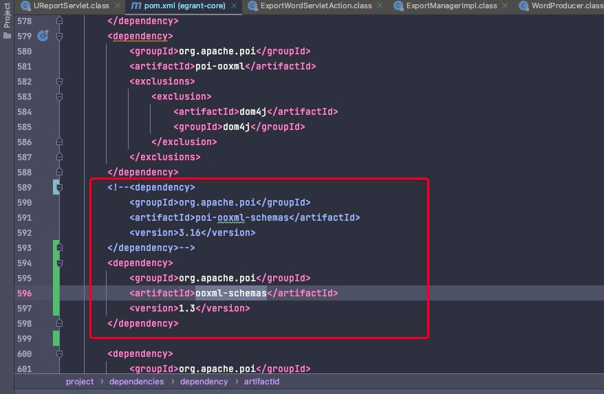
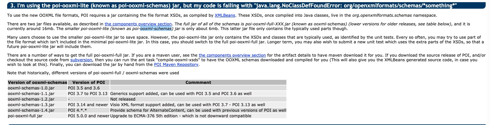

---
---
 
# UReport2问题

## 导出Word空白

通过调试可以看到有异常为org.openxmlformats.schemas.wordprocessingml.x2006.main.CTPageSz找不到（后台没有打印）

要升级下jar包才可以解决

POI官网FAQ中第三点有相关说明http://poi.apache.org/help/faq.html

简单来说就是“poi-ooxml-schemas.jar”是一个精简版本的包，支持功能不全，会缺失一部分内容。如果需要解锁更多功能，则替换引入“ooxml-schemas.jar”即可。下方列出了不同版本jar包之间的对应关系。

