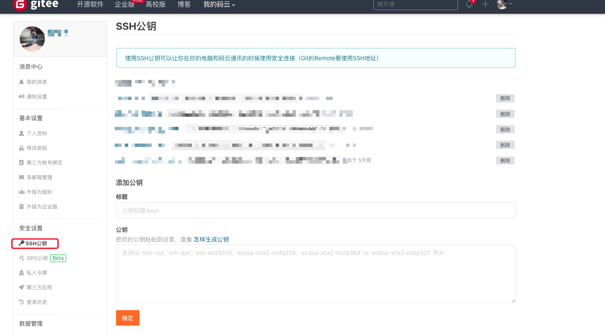
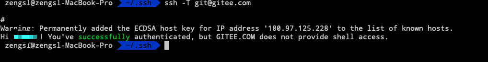

---
tags:
  - 工具
  - Git
title: 安装
---

::: tip
git的代码管理常见的是github以及国内的gitee，公司或者个人还可以使用一些开源的工具如gogs、gitlab等自己搭建
:::

> 公司使用gogs搭建的git仓库，地址： <!--http://git.egrant.cn/-->

## 准备
取消全局 用户名/邮箱 配置（如果没有配置过全局帐号和邮箱可以跳过）
~~~ shell
git config –global –unset user.name
git config –global –unset user.email
~~~

取消密码保存设置
~~~shell
git config --system --unset credential.helper
~~~

## 生成密钥
执行命令（下面是针对不同仓库的一些示例）
~~~shell
 # 邮箱换成自己的
 # github
 ssh-keygen -t rsa -f ~/.ssh/id_rsa.github -C "邮箱"  
 # 码云
 ssh-keygen -t rsa -f ~/.ssh/id_rsa.gitee -C "邮箱"  
 # gogs
 ssh-keygen -t rsa -f ~/.ssh/id_rsa.gogs -C "邮箱"  
 # egrant
 ssh-keygen -t rsa -f ~/.ssh/id_rsa.egrant -C "邮箱"  
~~~
这里的文件名 id_rsa.xxx 并没有严格要求，只是为了规范，可以见名知意

执行完`ssh-keygen`命令之后会生成在~/.ssh/下面生成两个密钥文件,id_rsa.gitee(私钥)、id_rsa.gitee.pub(公钥),公钥里面的内容是需要在仓库中配置的。

详情可参考[生成 SSH 公钥](https://git-scm.com/book/zh/v2/%E6%9C%8D%E5%8A%A1%E5%99%A8%E4%B8%8A%E7%9A%84-Git-%E7%94%9F%E6%88%90-SSH-%E5%85%AC%E9%92%A5)

## 配置仓库

配置git仓库对应的的sshkeys

以公司的gitee为例，使用帐号登录[主页](https://gitee.com/)，从右上方的个人头像进入设置界面

在安全设置中找到SSH公钥，从~/.ssh/id_rsa.xxx.pub复制内容进行添加

## 创建config文件
根据自己需要配置的仓库类型进行配置
在ssh文件夹下创建config文件，内容如下

~~~ shell

cat >> ~/.ssh/config << EOF

#Default gitHub user Self
Host github.com
    HostName github.com
    User git
    IdentityFile ~/.ssh/id_rsa.github

# gitee
Host gitee.com
    Port 22
    HostName gitee.com
    User git
    IdentityFile ~/.ssh/id_rsa.gitee

EOF

# 其他自己搭建的

~~~

## 测试连接

根据不同的地址进行连接测试
~~~shell
ssh -T git@github.com

ssh -T git@git.egrant.cn

ssh -T git@gitee.com
~~~
出现以下提示表示已成功与git仓库建立连接

## 检出

使用`clone`命令从仓库检出代码

**新手尽量一开始不要使用客户端来进行操作，通过执行命令来逐步熟悉git**

~~~ shell
git clone <repository> <directory>
~~~

## 其他
提交代码的时候会提示你是否需要保存密码

可以进入项目文件夹，单独设置每个repo 用户名/邮箱

~~~ shell
git config user.email “xxxx@xx.com”
git config user.name “xxxx”
~~~

## 安装git-flow
~~~ shell
brew install git-flow-avh

~~~