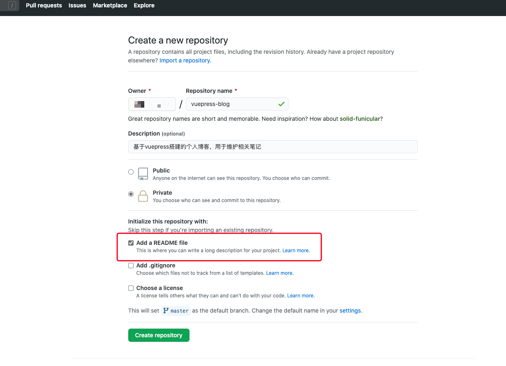

---
tags:
  - 工具
  - Git
title: 部署
---
# 部署

> git安装好之后，我们还需要初始化仓库以及部署远程仓库

## 初始化

新建或者进入一个已存在的项目中执行初始化命令，会生成一个`.git `目录

~~~ shell
git init
~~~

## 关联版本
将指定文件或者所有文件增加入暂存区

~~~ shell
# 将当前路径下所有文件加入暂存区
git add .
~~~

## 提交
新加入版本控制的文件需要通过`git commit`命令将文件提交至本地仓库

~~~ shell
# 使用-m参数给本次提交增加描述信息
git commit -m "init"
~~~

## 关联远程仓库

新建仓库

本地代码与远程仓库关联

~~~ shell
git remote add origin [远程仓库地址]

# 如果新建仓库时勾选了创建README，则需先拉取至本地
git pull
	
~~~

如果pull执行出现以下错误
~~~
There is no tracking information for the current branch.
Please specify which branch you want to merge with.
See git-pull(1) for details.

    git pull <remote> <branch>

If you wish to set tracking information for this branch you can do so with:

    git branch --set-upstream-to=origin/<branch> master

~~~
执行
~~~ shell
git branch --set-upstream-to=origin/master master
~~~

如果出现以下错误
fatal: refusing to merge unrelated histories
说明两个分支是两个不同的版本，具有不同的提交历史,可以进行强制合并
~~~ shell
git pull origin master --allow-unrelated-histories
~~~

代码推送远程仓库

~~~ shell
git push
~~~
