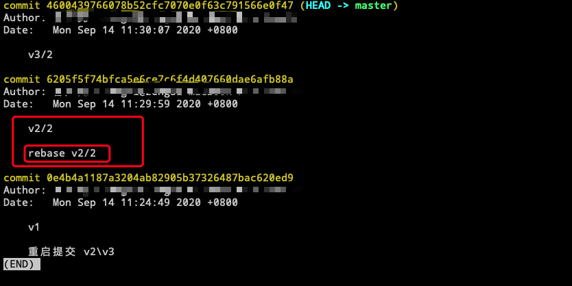
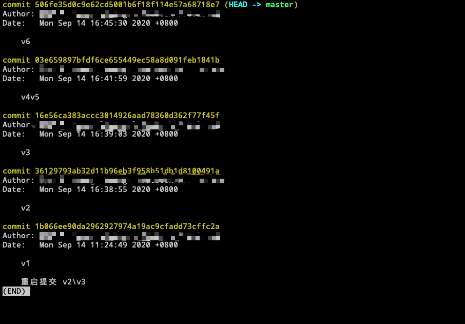

---
tag:
  - 工具
  - Git
title: 命令
---
# 常用命令

## 选择修订版本

参考 [Git-工具-选择修订版本](https://git-scm.com/book/zh/v2/Git-%E5%B7%A5%E5%85%B7-%E9%80%89%E6%8B%A9%E4%BF%AE%E8%AE%A2%E7%89%88%E6%9C%AC)
### 引用日志


当你在工作时， Git 会在后台保存一个引用日志（reflog）， 引用日志记录了**最近几个月**你的 HEAD 和分支引用所指向的历史。

`git reflog`

如果想看仓库中HEAD在五次前的所指向的提交，使用 @{n} 来引用 reflog 中输出的提交记录。

`git show HEAD@{5}`

你同样可以使用这个语法来查看某个分支在一定时间前的位置。 例如，查看你的 master 分支在昨天的时候指向了哪个提交，你可以输入

`$ git show master@{yesterday}`

就会显示昨天 master 分支的顶端指向了哪个提交。 这个方法只对还在你引用日志里的数据有用，所以不能用来查好几个月之前的提交。

可以运行 git log -g 来查看类似于 git log 输出格式的引用日志信息：

~~~ shell
$ git log -g master
commit 734713bc047d87bf7eac9674765ae793478c50d3
Reflog: master@{0} (Scott Chacon <schacon@gmail.com>)
Reflog message: commit: fixed refs handling, added gc auto, updated
Author: Scott Chacon <schacon@gmail.com>
Date:   Fri Jan 2 18:32:33 2009 -0800

    fixed refs handling, added gc auto, updated tests

commit d921970aadf03b3cf0e71becdaab3147ba71cdef
Reflog: master@{1} (Scott Chacon <schacon@gmail.com>)
Reflog message: merge phedders/rdocs: Merge made by recursive.
Author: Scott Chacon <schacon@gmail.com>
Date:   Thu Dec 11 15:08:43 2008 -0800

    Merge commit 'phedders/rdocs'
~~~


值得注意的是，引用日志只存在于本地仓库，它只是一个记录你在 自己 的仓库里做过什么的日志。 其他人拷贝的仓库里的引用日志不会和你的相同，而你新克隆一个仓库的时候，引用日志是空的，因为你在仓库里还没有操作。 git show HEAD@{2.months.ago} 这条命令只有在你克隆了一个项目至少两个月时才会显示匹配的提交—— 如果你刚刚克隆了仓库，那么它将不会有任何结果返回。


### 祖先引用

可以使用 HEAD^ 来查看上一个提交，也就是 “HEAD 的父提交”：`git show HEAD^`
~~~ shell
$ git log --pretty=format:'%h %s' --graph
* 734713b fixed refs handling, added gc auto, updated tests
*   d921970 Merge commit 'phedders/rdocs'
|\
| * 35cfb2b Some rdoc changes
* | 1c002dd added some blame and merge stuff
|/
* 1c36188 ignore *.gem
* 9b29157 add open3_detach to gemspec file list

~~~
::: warning
在 Windows 上转义脱字符
在 Windows 的 cmd.exe 中，^ 是一个特殊字符，因此需要区别对待。 你可以双写它或者将提交引用放在引号中：

$ git show HEAD^     # 在 Windows 上无法工作
$ git show HEAD^^    # 可以
$ git show "HEAD^"   # 可以
:::

你也**可以在 ^ 后面添加一个数字来指明想要哪一个父提交**——例如 **d921970^2** 代表 “d921970 的第二父提交” **这个语法只适用于合并的提交**，因为合并提交会有多个父提交。 合并提交的第一父提交是你合并时所在分支（通常为 master），而第二父提交是你所合并的分支（例如 topic）：

~~~ shell
$ git show d921970^
commit 1c002dd4b536e7479fe34593e72e6c6c1819e53b
Author: Scott Chacon <schacon@gmail.com>
Date:   Thu Dec 11 14:58:32 2008 -0800

    added some blame and merge stuff

$ git show d921970^2
commit 35cfb2b795a55793d7cc56a6cc2060b4bb732548
Author: Paul Hedderly <paul+git@mjr.org>
Date:   Wed Dec 10 22:22:03 2008 +0000

    Some rdoc changes
~~~

**另一种指明祖先提交的方法是 ~（波浪号）**，`HEAD~` 和 `HEAD^` 是等价的

而区别在于你在后面加数字的时候。 HEAD~2 代表“第一父提交的第一父提交”，也就是“祖父提交”——Git 会根据你指定的次数获取对应的第一父提交

HEAD~~~ 等价于 HEAD^3


这两种父级引用可以组合使用，比如`HEAD~3^2`来取得之前引用的第二父提交（假设它是一个合并提交）。

### 提交区间

请查阅文档“提交区间”[Git-工具-选择修订版本](https://git-scm.com/book/zh/v2/Git-%E5%B7%A5%E5%85%B7-%E9%80%89%E6%8B%A9%E4%BF%AE%E8%AE%A2%E7%89%88%E6%9C%AC)


## 贮藏（git stash）与清理（git clean）

[贮藏与清理](https://git-scm.com/book/zh/v2/Git-%E5%B7%A5%E5%85%B7-%E8%B4%AE%E8%97%8F%E4%B8%8E%E6%B8%85%E7%90%86)


## 搜索
[搜索](https://git-scm.com/book/zh/v2/Git-%E5%B7%A5%E5%85%B7-%E6%90%9C%E7%B4%A2)

### `grep`命令

默认情况下 git grep 会查找你工作目录的文件。

常见的情况下可以使用-n或者--line-number选项来输入Git找到的匹配行的行号

可以使用-c 或 --count选项来让 git grep 输出概述的信息， 其中仅包括那些包含匹配字符串的文件，以及每个文件中包含了多少个匹配。

其他的玩法可以阅读文档。

### 日志搜索

git log 命令有许多强大的工具可以通过提交信息甚至是 diff 的内容来找到某个特定的提交。

`-S`选项

例如，如果我们想找到 ZLIB_BUF_MAX 常量是什么时候引入的，我们可以使用`-S`选项（在 Git 中俗称“鹤嘴锄（pickaxe）”选项）来显示新增和删除该字符串的提交。

~~~ shell
$ git log -S ZLIB_BUF_MAX --oneline
e01503b zlib: allow feeding more than 4GB in one go
ef49a7a zlib: zlib can only process 4GB at a time
~~~

`-L`选项

行日志搜索,它可以展示代码中一行或者一个函数的历史

例如，假设我们想查看 zlib.c 文件中`git_deflate_bound` 函数的每一次变更， 我们可以执行 git log -L :git_deflate_bound:zlib.c。 Git 会尝试找出这个函数的范围，然后查找历史记录，并且显示从函数创建之后一系列变更对应的补丁。

**支持正则表达式**

其他的玩法可以阅读文档。

## 重写历史

[重写历史](https://git-scm.com/book/zh/v2/Git-%E5%B7%A5%E5%85%B7-%E9%87%8D%E5%86%99%E5%8E%86%E5%8F%B2)

::: warning
要确保列表中的提交还没有推送到共享仓库中，避免造成产生一次变更的两个版本，因而使他人困惑
:::

### 修改最后一次提交

`git commit --amend`

上面这条命令会将最后一次的提交信息载入到编辑器中供你修改。 当保存并关闭编辑器后，编辑器会将更新后的提交信息写入新提交中，它会成为新的最后一次提交。

另一方面，如果你想要修改最后一次提交的实际内容，那么流程很相似：首先作出你想要补上的修改， 暂存它们，然后用 git commit --amend 以新的改进后的提交来 替换 掉旧有的最后一次提交，

[撤销操作](http://localhost:8080/tools/git/3.command.html#%E6%92%A4%E9%94%80%E6%93%8D%E4%BD%9C)中有运用案例。

使用这个技巧的时候需要小心，因为修正会改变提交的 SHA-1 校验和。 **它类似于一个小的变基——如果已经推送了最后一次提交就不要修正它。**

### 修改多个提交信息

::: tip
Git 没有一个改变历史工具，但是可以使用变基工具来变基一系列提交，基于它们原来的 HEAD 而不是将其移动到另一个新的上面。

`git rebase` 增加 `-i` 选项来交互式地运行变基
:::

必须指定想要重写多久远的历史，这可以通过告诉命令将要变基到的提交来做到。

例如，如果想要修改最近三次提交信息，或者那组提交中的任意一个提交信息， 将想要修改的**最近一次提交的父提交**作为参数传递给 git rebase -i 命令，即 HEAD~2^ 或 HEAD~3。 记住 ~3 可能比较容易，因为你正尝试修改最后三次提交；**但是注意实际上指定了以前的四次提交，即想要修改提交的父提交**：

`git rebase -i HEAD~3`

再次记住这是一个变基命令——在 HEAD~3..HEAD 范围内的每一个修改了提交信息的提交及其 所有后裔都会被重写。**不要涉及任何已经推送到中央服务器的提交——这样做会产生一次变更的两个版本，因而使他人困惑。**

使用`git rebase -i`命令之后会在文本编辑器上给你一个提交的列表，里面展示的信息与`log`命令显示的提交顺序是**相反的**。

需要修改脚本来让它停留在你想修改的变更上。 要达到这个目的，你只要将你想修改的每一次提交前面的 ‘pick’ 改为 ‘edit’,然后保存修改并退出。退出会自动回到命令行，并且给出相关提示信息：

例：

执行`git rebase -i HEAD~2` 修改‘V2/2’这次提交记录，将‘pick’该为’edit‘，退出编辑器


执行`git commit --amend`，修改提交信息，然后退出编辑器

运行`git rebase --continue` 

此命令会自动运用其他的提交操作，整个修改过程就结束了。如果需要将不止一处的 pick 改为 edit，需要在每一个修改为 edit 的提交上重复这些步骤。 每一次，Git 将会停止，让你修正提交，然后继续直到完成。

通过`git log`命令可以看到修改之后的效果



### 重新排序提交

在执行git rebase -i，在编辑器中进行顺序调整即可。

### 压缩提交

通过交互式变基工具，也可以将一连串提交压缩成一个单独的提交。 在变基信息中脚本给出了有用的指令：

~~~ shell
#
# Commands:
# p, pick <commit> = use commit
# r, reword <commit> = use commit, but edit the commit message
# e, edit <commit> = use commit, but stop for amending
# s, squash <commit> = use commit, but meld into previous commit
# f, fixup <commit> = like "squash", but discard this commit's log message
# x, exec <command> = run command (the rest of the line) using shell
# b, break = stop here (continue rebase later with 'git rebase --continue')
# d, drop <commit> = remove commit
# l, label <label> = label current HEAD with a name
# t, reset <label> = reset HEAD to a label
# m, merge [-C <commit> | -c <commit>] <label> [# <oneline>]
# .       create a merge commit using the original merge commit's
# .       message (or the oneline, if no original merge commit was
# .       specified). Use -c <commit> to reword the commit message.
#
# These lines can be re-ordered; they are executed from top to bottom.
#
# If you remove a line here THAT COMMIT WILL BE LOST.
#
# However, if you remove everything, the rebase will be aborted.
#
# Note that empty commits are commented out
~~~

如果，指定 “squash” 而不是 “pick” 或 “edit”，Git 将应用两者的修改并合并提交信息在一起。 所以，如果想要这三次提交变为一个提交，可以这样修改脚本：

~~~ shell
pick f7f3f6d changed my name a bit
squash 310154e updated README formatting and added blame
squash a5f4a0d added cat-file
~~~
当保存并退出编辑器时，Git 应用所有的三次修改然后将你放到编辑器中来合并三次提交信息：

~~~ shell
# This is a combination of 3 commits.
# The first commit's message is:
changed my name a bit

# This is the 2nd commit message:

updated README formatting and added blame

# This is the 3rd commit message:

added cat-file
~~~
当你保存之后，你就拥有了一个包含前三次提交的全部变更的提交。


### 拆分提交

拆分一个提交会撤消这个提交，然后多次地部分地暂存与提交直到完成你所需次数的提交。

可以通过修改`rebase -i`脚本来进行拆分，将要拆分的提交的指令由“pick”修改为“edit”，保存并退出

例如：

创建了两个文件v4.md、v5.md，并且一起commit，然后又提交了个v6.md



现在想对v4v5提交进行拆分 

执行`git rebase -i HEAD~3`

修改v4v5提交指令'pick'改为'edit'，并且保存之后返回命令行


~~~ shell
# 进行提交对混合重置
git reset HEAD^

# 提交v4
git add v4.md
git commit -m "v4"

# 提交v5
git add v5.md
git commit -m "v5"

git rebase --continue
~~~

通过`git log`进行查看


### filter-branch选项

它是一个历史改写的选项，如果想要通过脚本的方式改写大量提交的话可以使用它——例如，全局修改你的邮箱地址或从每一个提交中移除一个文件。

官方不建议在某些情况下使用它去大量修改历史提交，除非你的项目还没有公开并且其他人没有基于要改写的工作的提交做的工作。

::: tip
git filter-branch 有很多陷阱，不再推荐使用它来重写历史。 请考虑使用 git-filter-repo，它是一个 Python 脚本，相比大多数使用 filter-branch 的应用来说，它做得要更好。它的文档和源码可访问 https://github.com/newren/git-filter-repo 获取。
:::

几个选项 `tree-filter`、`commit-filter`,详细资料可以查阅官方文档


## 撤销操作

参考 [撤销操作](https://git-scm.com/book/zh/v2/Git-%E5%9F%BA%E7%A1%80-%E6%92%A4%E6%B6%88%E6%93%8D%E4%BD%9C)

有的时候commit之后发现还有文件忘记add了那么可以使用--amend选项来重新提交:


~~~ shell

git commit --amend

~~~

例如：

~~~ shell

$ git commit -m 'initial commit'
$ git add forgotten_file
$ git commit --amend

~~~

最终你只会有一个提交——第二次提交将代替第一次提交的结果。

### 取消暂存文件

::: tip
撤销操作中的demo使用了git status提示的`git reset HEAD <file>... `和` git checkout -- <file>`来取消暂存以及还原本地修改，实际操作时`git status`统一给予的提示为`git resotre`

`git resotre`为Git 2.23中添加的新命令
:::


当一个文件我们通过add命令加入暂存区之后，如果想要取消该如何操作？

`git status`命令提示了我们：

~~~ shell

git add docs/tools/git/3.command.md
git status
On branch master
Your branch is up to date with 'origin/master'.

Changes to be committed:
  (use "git restore --staged <file>..." to unstage)
	new file:   docs/tools/git/3.command.md

Changes not staged for commit:
  (use "git add <file>..." to update what will be committed)
  (use "git restore <file>..." to discard changes in working directory)
	modified:   docs/.vuepress/config.js
	modified:   docs/.vuepress/config/pluginsConf.js
	modified:   docs/.vuepress/config/sidebarConf.js
	modified:   docs/ops/os/mac/3.software.md
	modified:   docs/tools/git/README.md
	
~~~

`Changes to be committed:`文字下方，提示使用`git restore --staged `来取消暂存，实际操作中我们可以通过`git status`命令提示来进行相关操作

**Git-Book 撤销章节**中的样例使用来`git reset HEAD <file>... `来取消暂存

::: warning
git reset 确实是个危险的命令，如果加上了 --hard 选项则更是如此。 然而在上述场景中，工作目录中的文件尚未修改，因此相对安全一些。

我们需要对`git reset`进行更加深入对了解，阅读官方[重置揭秘](https://git-scm.com/book/zh/v2/Git-%E5%B7%A5%E5%85%B7-%E9%87%8D%E7%BD%AE%E6%8F%AD%E5%AF%86#_git_reset)
:::


### 撤消对文件的修改

如果我们不想保留对`CONTRIBUTING.md`文件对修改，想要将它还原成上次提交对样子，也可以通过`git status`的提示来进行操作

~~~ shell
Changes not staged for commit:
  (use "git add <file>..." to update what will be committed)
  (use "git checkout -- <file>..." to discard changes in working directory)

    modified:   CONTRIBUTING.md
~~~

它非常清楚地告诉了你如何撤消之前所做的修改。 让我们来按照提示执行：

~~~ shell
$ git checkout -- CONTRIBUTING.md
$ git status
On branch master
Changes to be committed:
  (use "git reset HEAD <file>..." to unstage)

    renamed:    README.md -> README
~~~

可以看到那些修改已经被撤消了。

::: warning

请务必记得` git checkout -- <file>` 是一个危险的命令。 你对那个文件在本地的任何修改都会消失——Git 会用最近提交的版本覆盖掉它。 除非你确实清楚不想要对那个文件的本地修改了，否则请不要使用这个命令。
:::

如果你仍然想保留对那个文件做出的修改，但是现在仍然需要撤消，我们将会在 Git 分支 介绍保存进度与分支，这通常是更好的做法。

记住，在 Git 中任何 已提交 的东西几乎总是可以恢复的。 甚至那些被删除的分支中的提交或使用 --amend 选项覆盖的提交也可以恢复 （阅读 数据恢复 了解数据恢复）。 然而，任何你未提交的东西丢失后很可能再也找不到了。


## 重置操作


Git 作为一个系统，是以它的一般操作来管理并操纵这三棵树的：

|  树    |   用途   |
| ---- | ---- |
|  HEAD    |   上一次提交的快照，下一次提交的父结点   |
|   Index   |   预期的下一次提交的快照   |
|   Working Directory   |   沙盒   |

**HEAD**
HEAD 是当前分支引用的指针，它总是指向该分支上的最后一次提交。 这表示 HEAD 将是下一次提交的父结点。 通常，理解 HEAD 的最简方式，就是将它看做 该分支上的最后一次提交 的快照。

其实，查看快照的样子很容易。 下例就显示了 HEAD 快照实际的目录列表，以及其中每个文件的 SHA-1 校验和：

~~~ shell

$ git cat-file -p HEAD
tree cfda3bf379e4f8dba8717dee55aab78aef7f4daf
author Scott Chacon  1301511835 -0700
committer Scott Chacon  1301511835 -0700

initial commit

$ git ls-tree -r HEAD
100644 blob a906cb2a4a904a152...   README
100644 blob 8f94139338f9404f2...   Rakefile
040000 tree 99f1a6d12cb4b6f19...   lib
~~~
Git 的 `cat-file` 和 `ls-tree` 是底层命令，它们一般用于底层工作，在日常工作中并不使用。 不过它们能帮助我们了解到底发生了什么。

索引

索引是你的 预期的下一次提交。 我们也会将这个概念引用为 Git 的“暂存区”，这就是当你运行 git commit 时 Git 看起来的样子。

`git add fileName`来获取工作目录中的内容，并将其复制到索引中（将工作区文件加入暂存区）。

`git commit` 它会取得索引中的内容并将它保存为一个永久的快照， 然后创建一个指向该快照的提交对象，最后更新 master 来指向本次提交。


reset作用：

1. 移动HEAD
移动HEAD的指向，这与改变 HEAD 自身不同（checkout 所做的）；reset 移动 HEAD 指向的分支。 

这意味着如果 HEAD 设置为 master 分支（例如，你正在 master 分支上）， 运行 git reset 9e5e6a4 将会使 master 指向 9e5e6a4。

一般会先使用`reset --soft 上一个快照版本`，实际上是撤销了上一次提交（可以通过git log查看快照版本）

`HEAD~`表示HEAD的父节点，执行`reset HEAD~`实际上是把该分支移动回原来的位置，而不会改变索引和工作目录。


2. 更新索引（--mixed）

**`--mixed`是默认行为**

案例中`git reset HEAD~`未指定--mixed选项，实际等价于`git reset --mixed HEAD~`

它依然会撤销一上次 提交，但还会 取消暂存 所有的东西。 于是，我们回滚到了所有 git add 和 git commit 的命令执行之前。

3. 更新工作目录（--hard）

::: tip

--hard 标记是 reset 命令唯一的危险用法

其他任何形式的 reset 调用都可以轻松撤消，但是 --hard 选项不能，因为它强制覆盖了工作目录中的文件。

在这种特殊情况下，我们的 Git 数据库中的一个提交内还留有该文件的 v3 版本， 我们可以通过 reflog 来找回它。但是若该文件还未提交，Git 仍会覆盖它从而导致无法恢复。
:::


回顾
reset 命令会以特定的顺序重写这三棵树，在你指定以下选项时停止：

1. 移动 HEAD 分支的指向 （若指定了 --soft，则到此停止）

2. 使索引看起来像 HEAD （若未指定 --hard，默认为--mixed，则到此停止）

3. 使工作目录看起来像索引 （若指定了 --hard） 

**总结：**

- `HEAD~`为HEAD的父节点
- `reset --soft` 仅移动HEAD分支
- `reset --mixed`或者`reset`
 
	移动HEAD分支，使索引与HEAD保持一致
- `reset--hard`

	移动HEAD分支，使索引与HEAD保持一致并且修改工作目录保持与索引一致
	

详细资料可以阅读[Git-重置揭秘](https://git-scm.com/book/zh/v2/Git-%E5%B7%A5%E5%85%B7-%E9%87%8D%E7%BD%AE%E6%8F%AD%E5%AF%86#_git_reset)

## 高级合并

[高级合并](https://git-scm.com/book/zh/v2/Git-%E5%B7%A5%E5%85%B7-%E9%AB%98%E7%BA%A7%E5%90%88%E5%B9%B6)

## 分支管理

``` shell
# 删除远程分支
git push origin --delete
```

## 标签管理

``` shell
# 创建标签
git tag -a [标签名称] -m "注释" 

# 推送标签至远程
git push origin [标签名称]

# 删除本地标签
git tag -d [标签名称]

# 删除远程标签
git push origin :refs/tags/[标签名称]

```