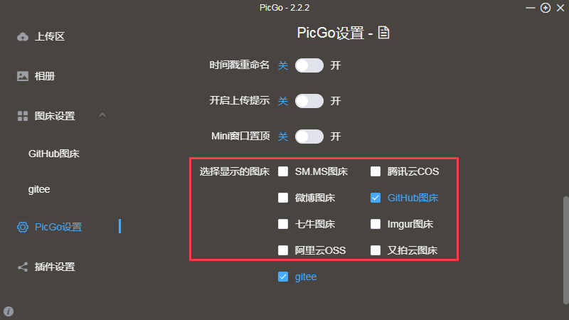
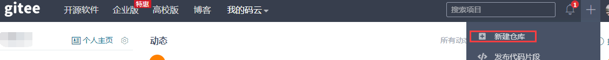
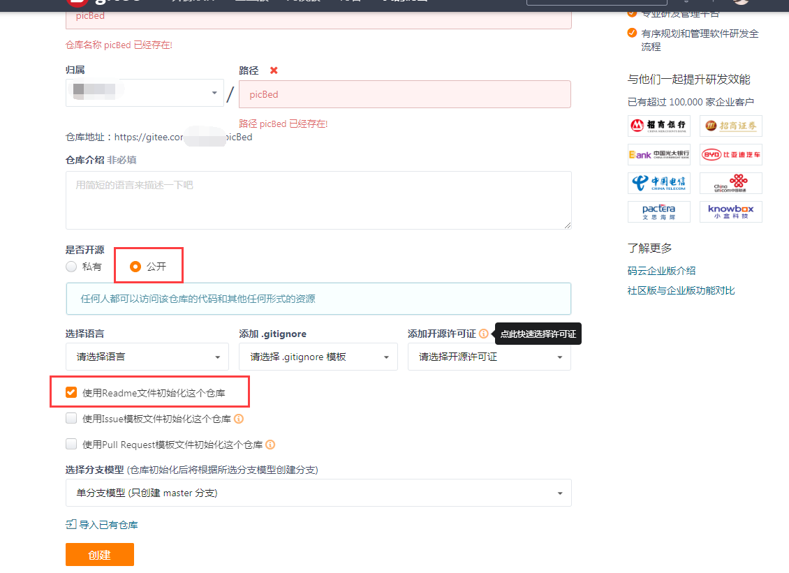
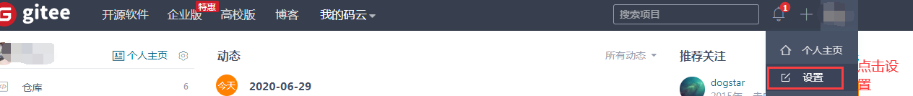
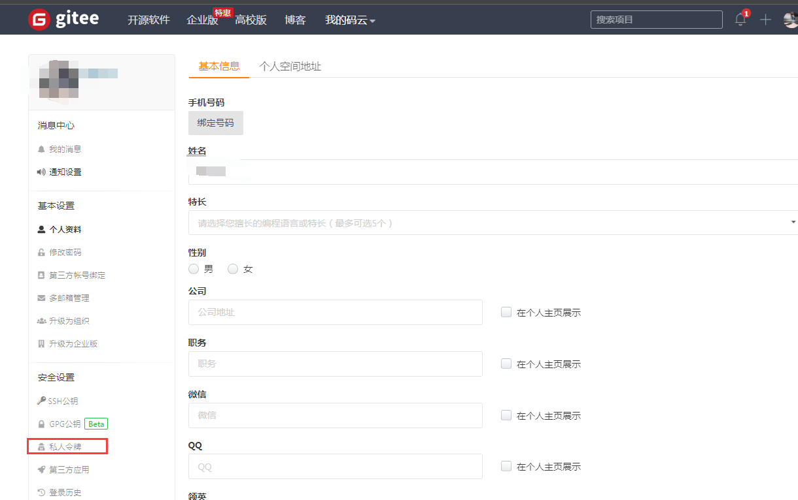
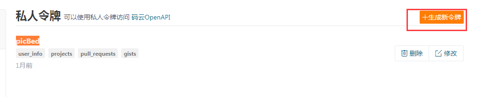
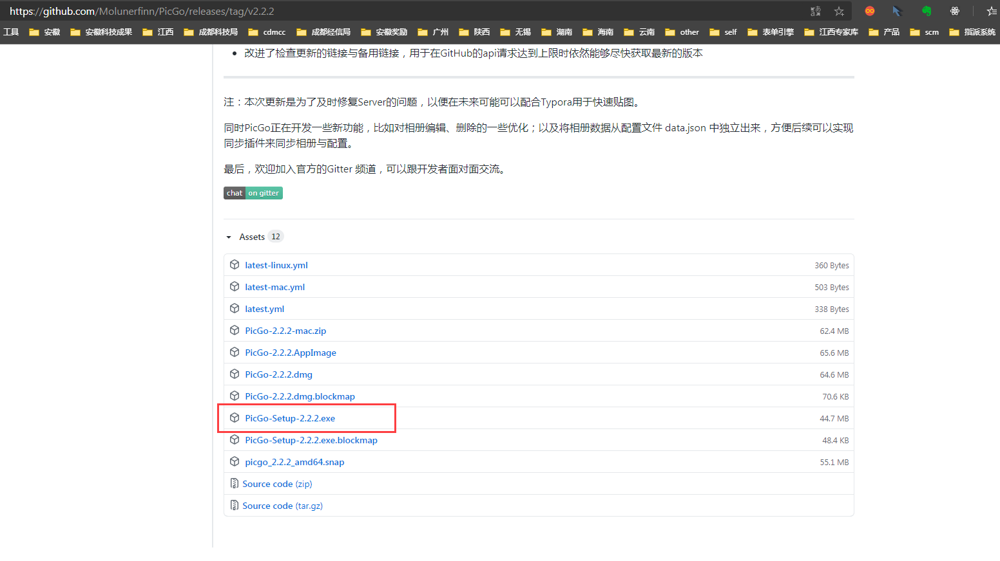
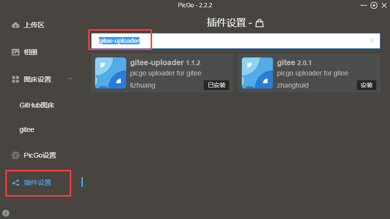
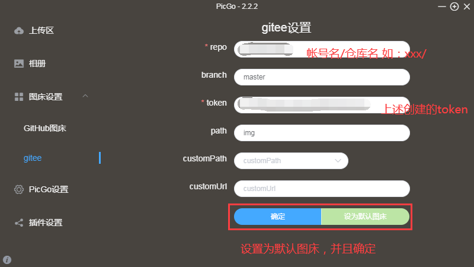
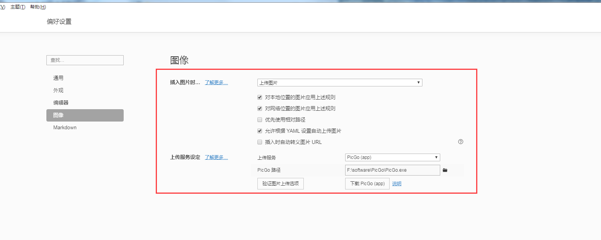

# Typora设置

## 图床配置

- 下载图床工具PicGo（国人开发），mac也可以选择iPic。
- 设置图床

标记内容为PicGo默认支持图床，可以自行选择。我配置的是GitHub和gitee，考虑到GitHub服务器在国外，存在网络访问速度问题，所以比较推荐gitee码云。

**本文以PicGo+码云为例进行图床配置。**

## 码云配置（废了）

[码云地址]: https://gitee.com/

1. 创建码云帐号

   2. 创建仓库picBed

      仓库必须设置为公开，并选择使用Readme文件进行初始化

      

      

3. 获取token

   > token用来判断是否有权限操作你的gitee仓库。比如PicGo在拥有了token之后才有权限将图片上传至你设置的仓库中

​	**点击个人设置**

​	**进入私人令牌**

​	**生成私人令牌**

可取名为picBed，并且根据需要设置权限。

提交之后会生成token，**<u>此token只显示一次，请做好记录！</u>**

## GitHub配置

创建仓库、生成token方式与gitee类似，不做赘述。

配合[jsdelivr](https://liubing.me/goto/https://www.jsdelivr.com)来加速访问图片。

## PicGo设置

[PicGo文档]: https://github.com/Molunerfinn/PicGo

::: tip
需要提前安装好node.js
:::
- 安装PicGo

  PicGo文档下方提供的下载地址 https://github.com/Molunerfinn/PicGo/releases

  从中选择正式版进行下载，当前正式版本为[2.2.2](https://github.com/Molunerfinn/PicGo/releases/tag/v2.2.2)

  [2.2.2版本下载地址]: https://github.com/Molunerfinn/PicGo/releases/download/v2.2.2/PicGo-Setup-2.2.2.exe

  

- 安装插件

  因为默认不支持gitee图床，需要安装插件**gitee-uploader**，直接搜索安装即可

    
- 配置图床

  

  

  配置完成之后进行上传测试。

## Typora图像设置

可按照下图进行设置

**相关配置结束，直接复制图片至ypora将弹出picGo的图片上传窗口点击确认，也可根据需要进行名称修改。**

## Markdown

### 代码块支持的语法

[代码块支持的语法](https://prismjs.com/#languages-list)