# 启动过程

> 基于版本 spring-boot:2.1.14.RELEAES，启动gateway项目进行观察

## 介绍

以下是常见的boot项目启动入口，比较核心的点就在于注解`@SpringBootApplication`和`SpringApplication.run`

~~~ java
@SpringBootApplication
public class SpringBoot2018 {

    public static void main(String[] args) {
        SpringApplication.run(SpringBoot2018.class, args);
    }
}
~~~

`SpringApplication.run(String... args)`结构

~~~ java

public ConfigurableApplicationContext run(String... args) {
		// 计时器
		StopWatch stopWatch = new StopWatch();
		// 计时开始
		stopWatch.start();
		ConfigurableApplicationContext context = null;
		Collection<SpringBootExceptionReporter> exceptionReporters = new ArrayList<>();
		// 设置java.awt.headless模式为true,Headless模式是在缺少显示屏、键盘或者鼠标时的系统配置。
		configureHeadlessProperty();
		// ## 获取运行监听器
		SpringApplicationRunListeners listeners = getRunListeners(args);
		
		// 发布ApplicationStartingEvent事件
		listeners.starting();
		try {
			// 处理参数
			ApplicationArguments applicationArguments = new DefaultApplicationArguments(args);
			
			// 准备环境
			ConfigurableEnvironment environment = prepareEnvironment(listeners, applicationArguments);
			
			// 配置忽略bean信息 spring.beaninfo.ignore为true
			configureIgnoreBeanInfo(environment);
			
			Banner printedBanner = printBanner(environment);
			
			// 创建应用上下文，默认org.springframework.context.annotation.AnnotationConfigApplicationContext
			context = createApplicationContext();
			
			// 获取异常报告器
			exceptionReporters = getSpringFactoriesInstances(SpringBootExceptionReporter.class,
					new Class[] { ConfigurableApplicationContext.class }, context);
					
			// 准备上下文，将相关信息和上下文绑定
			prepareContext(context, environment, listeners, applicationArguments, printedBanner);
			
			// 刷新上下文，这是重点，与spring初始化的核心过程类似
			refreshContext(context);
			
			// 刷新之后的动作,暂无实现
			afterRefresh(context, applicationArguments);
			
			// 计时结束
			stopWatch.stop();
			if (this.logStartupInfo) {
				new StartupInfoLogger(this.mainApplicationClass).logStarted(getApplicationLog(), stopWatch);
			}
			// 发布ApplicationStartedEvent事件，触发相关监听器
			listeners.started(context);
			
			// 调用运行器
			callRunners(context, applicationArguments);
		}
		catch (Throwable ex) {
			handleRunFailure(context, ex, exceptionReporters, listeners);
			throw new IllegalStateException(ex);
		}

		try {
			listeners.running(context);
		}
		catch (Throwable ex) {
			handleRunFailure(context, ex, exceptionReporters, null);
			throw new IllegalStateException(ex);
		}
		return context;
	}
~~~

::: tip
这里需要说明以下，次方法会被调用两次，一次是执行main方法时调用，另一次是在执行“准备环境”`prepareEnvironment`方法中会触发`BootstrapApplicationListener`，该方法又重新调用了run。

所以在执行`prepareEnvironment`时触发`BootstrapApplicationListener`时，会优先执行监听器触发的run方法调用，等执行完成之后，再继续执行之后的代码。所以`prepareEnvironment`之前的方法调用是main方法触发，`BootstrapApplicationListener`后触发，后面的方法则相反。

这里在分析run方法的过程中各个阶段时，并没有都针对两次运行进行分析，没特殊说明都默认为main方法调用

`BootstrapApplicationListener`会根据environment.getPropertySources().contains("bootstrap")判断是否执行过，不会存在递归触发的情况。
:::

## 运行监听器

### 获取运行监听器

~~~ java
private SpringApplicationRunListeners getRunListeners(String[] args) {
		Class<?>[] types = new Class<?>[] { SpringApplication.class, String[].class };
		return new SpringApplicationRunListeners(logger,
				getSpringFactoriesInstances(SpringApplicationRunListener.class, types, this, args));
	}

private <T> Collection<T> getSpringFactoriesInstances(Class<T> type, Class<?>[] parameterTypes, Object... args) {
		ClassLoader classLoader = getClassLoader();
		// Use names and ensure unique to protect against duplicates
		Set<String> names = new LinkedHashSet<>(SpringFactoriesLoader.loadFactoryNames(type, classLoader));
		List<T> instances = createSpringFactoriesInstances(type, parameterTypes, classLoader, args, names);
		AnnotationAwareOrderComparator.sort(instances);
		return instances;
	}
~~~

通过`SpringFactoriesLoader`去加载`org.springframework.boot.SpringApplicationRunListener`

~~~ java
public static List<String> loadFactoryNames(Class<?> factoryClass, @Nullable ClassLoader classLoader) {
		String factoryClassName = factoryClass.getName();
		return loadSpringFactories(classLoader).getOrDefault(factoryClassName, Collections.emptyList());
	}
	
private static Map<String, List<String>> loadSpringFactories(@Nullable ClassLoader classLoader) {
		MultiValueMap<String, String> result = cache.get(classLoader);
		if (result != null) {
			return result;
		}

		try {
			// 从META-INF/spring.factories中查询
			Enumeration<URL> urls = (classLoader != null ?
					classLoader.getResources(FACTORIES_RESOURCE_LOCATION) :
					ClassLoader.getSystemResources(FACTORIES_RESOURCE_LOCATION));
			result = new LinkedMultiValueMap<>();
			while (urls.hasMoreElements()) {
				URL url = urls.nextElement();
				UrlResource resource = new UrlResource(url);
				Properties properties = PropertiesLoaderUtils.loadProperties(resource);
				for (Map.Entry<?, ?> entry : properties.entrySet()) {
					String factoryClassName = ((String) entry.getKey()).trim();
					for (String factoryName : StringUtils.commaDelimitedListToStringArray((String) entry.getValue())) {
						result.add(factoryClassName, factoryName.trim());
					}
				}
			}
			cache.put(classLoader, result);
			return result;
		}
		catch (IOException ex) {
			throw new IllegalArgumentException("Unable to load factories from location [" +
					FACTORIES_RESOURCE_LOCATION + "]", ex);
		}
	}	
~~~

- 首先调用`loadSpringFactories(classLoader)`,通过classLoader从**META-INF/spring.factories**加载内容(如下图)。将其他中的内容存放到`LinkedMultiValueMap`对象中，等号左边的factoryClassName为key,等号右边的多值存放到LinkedList作为value。最后将结果存放到一个缓存对象`cache`中，key为当前的classloader，避免重复加载提升性能。

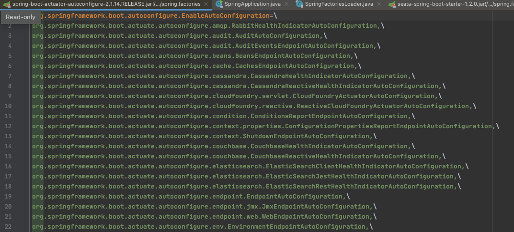

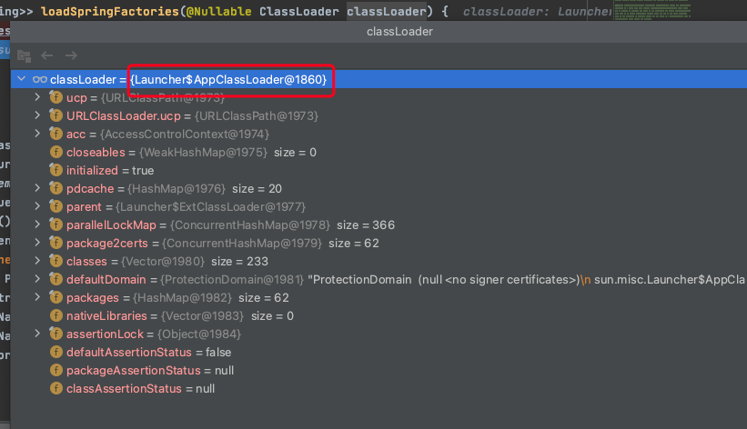

- 从上一点中计算出的结果中通过key`org.springframework.boot.SpringApplicationRunListener`获取所有的**Spring应用运行监听器**，然后排序存入SpringApplicationRunListeners中

### 开启监听器

通过`SpringApplicationRunListeners`的`starting()`方法批量触发监听器

当前拥有的监听器为`EventPublishingRunListener`

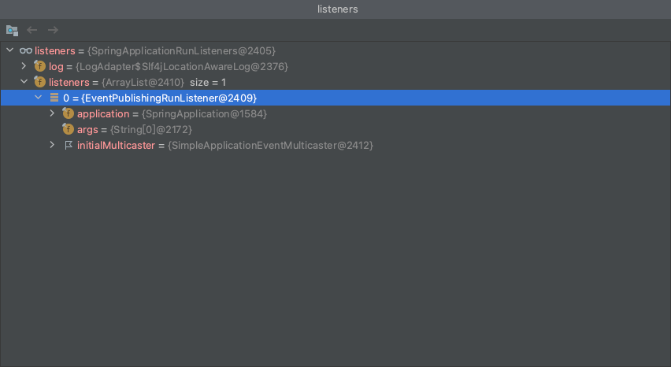

## 发布启动事件

ApplicationStartingEvent

发布`ApplicationStartingEvent`事件，触发相关监听器（调用onApplicationEvent方法）

通过`EventPublishingRunListener`来组播`org.springframework.boot.context.event.ApplicationStartingEvent`事件

~~~ java
// EventPublishingRunListener
@Override
	public void starting() {
		this.initialMulticaster.multicastEvent(new ApplicationStartingEvent(this.application, this.args));
	}
	
@Override
	public void multicastEvent(final ApplicationEvent event, @Nullable ResolvableType eventType) {
		ResolvableType type = (eventType != null ? eventType : resolveDefaultEventType(event));
		Executor executor = getTaskExecutor();
		// 先获取ApplicationStartingEvent监听器然后执行事件
		for (ApplicationListener<?> listener : getApplicationListeners(event, type)) {
			if (executor != null) {
				executor.execute(() -> invokeListener(listener, event));
			}
			else {
				invokeListener(listener, event);
			}
		}
	}	
	
// getApplicationListeners调用retrieveApplicationListeners
~~~

`retrieveApplicationListeners`方法获取所有监听`ApplicationStartingEvent`事件的监听器

1. 先通过`this.defaultRetriever.applicationListeners`获取默认的监听器listener

2. 筛选出支持`ApplicationStartingEvent`事件的监听器，加入监听器集合

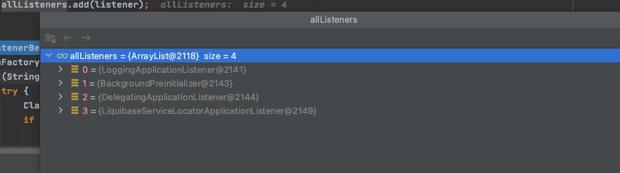

main与`BootstrapApplicationListener`执行时监听器是一致的。

3. 如果listenerBeans存在，则根据beanName创建监听器，加入监听器集合

this.defaultRetriever初始化？

## 准备环境

~~~ java
private ConfigurableEnvironment prepareEnvironment(SpringApplicationRunListeners listeners,
			ApplicationArguments applicationArguments) {
	// Create and configure the environment
	ConfigurableEnvironment environment = getOrCreateEnvironment();
	
	// 设置转化服务，设置命令行参数，设置激活profile
	configureEnvironment(environment, applicationArguments.getSourceArgs());
	
	// 这应该是让配置类可以获取环境信息
	ConfigurationPropertySources.attach(environment);
	
	// 触发监听器方法（一旦环境准备好，但在ApplicationContext创建之前调用）,发布`ApplicationEnvironmentPreparedEvent`事件
	listeners.environmentPrepared(environment);
	
	// 将环境信息绑定至SpringApplication
	bindToSpringApplication(environment);
	if (!this.isCustomEnvironment) {
		environment = new EnvironmentConverter(getClassLoader()).convertEnvironmentIfNecessary(environment,
				deduceEnvironmentClass());
	}
	ConfigurationPropertySources.attach(environment);
	return environment;
}
~~~

当前所有监听`ApplicationEnvironmentPreparedEvent`事件的监听器

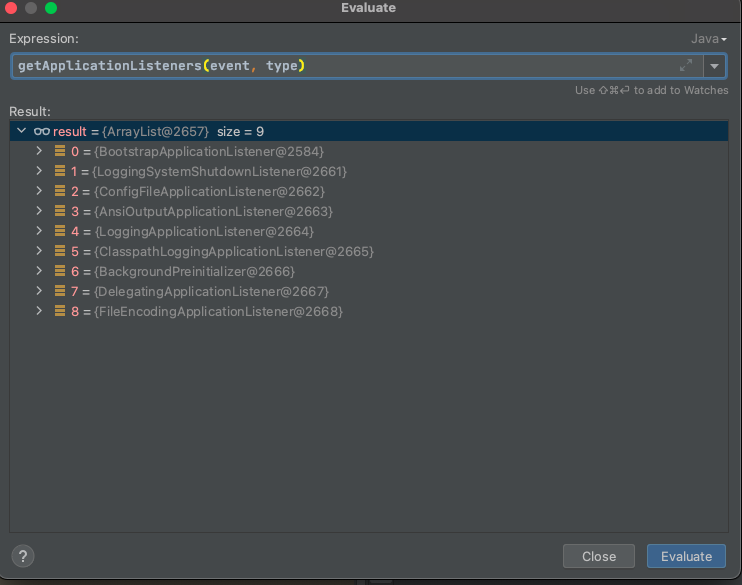

图中第一个监听器`BootstrapApplicationListener`需要在这里说明以下，该监听器被触发之后会再次执行`SpringApplication`的run方法，所以该监听器会优先于main方法进行调用创建上下文方法。

所以在`prepareEnvironment`之后的方法调用

## 创建应用上下文

`context = createApplicationContext();`

~~~java
protected ConfigurableApplicationContext createApplicationContext() {
		Class<?> contextClass = this.applicationContextClass;
		if (contextClass == null) {
			try {
				switch (this.webApplicationType) {
				case SERVLET:
					contextClass = Class.forName(DEFAULT_SERVLET_WEB_CONTEXT_CLASS);
					break;
				case REACTIVE:
					contextClass = Class.forName(DEFAULT_REACTIVE_WEB_CONTEXT_CLASS);
					break;
				default:
					contextClass = Class.forName(DEFAULT_CONTEXT_CLASS);
				}
			}
			catch (ClassNotFoundException ex) {
				throw new IllegalStateException(
						"Unable create a default ApplicationContext, " + "please specify an ApplicationContextClass",
						ex);
			}
		}
		return (ConfigurableApplicationContext) BeanUtils.instantiateClass(contextClass);
	}
~~~

::: tip
由于[环境准备](#准备环境)中会触发`SpringApplicationRunListeners`的`environmentPrepared`方法，内部会触发所有监听了ApplicationEnvironmentPreparedEvent事件的监听器的`onApplicationEvent`方法。

listeners中包含`BootstrapApplicationListener`，该监听器会再次触发`SpringApplication`的run方法，所以该监听器会优先于main方法进行调用创建上下文方法。

:::

此时如果没有特殊设置

`BootstrapApplicationListener`上下文默认创建为`org.springframework.context.annotation.AnnotationConfigApplicationContext`

main上下文默认创建为`org.springframework.boot.web.reactive.context.AnnotationConfigReactiveWebServerApplicationContext`

就启动过程而言，后续过程[准备上下文](#准备上下文)、[刷新上下文](#刷新上下文)、[刷新上下文后置动作](#刷新上下文后置动作)、[发布已启动事件](#发布已启动事件)、[调用运行器](#调用运行器)都需针对这两类上下文进行操作。

## 异常报告器

`BootstrapApplicationListener`触发

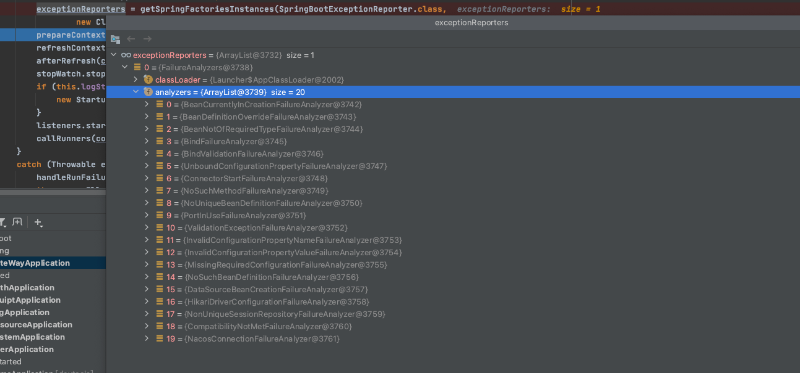

main方法触发

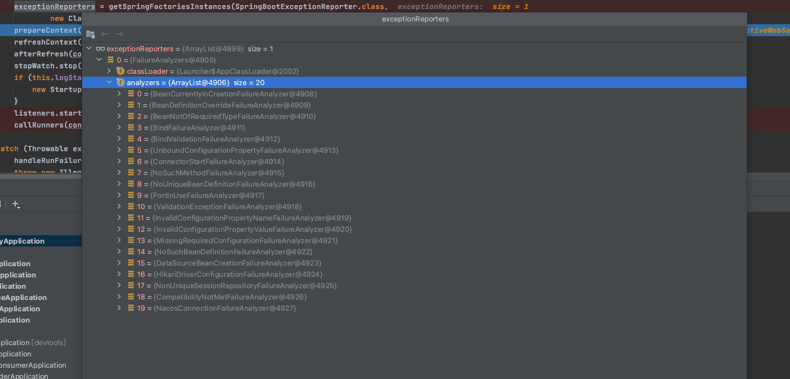

## 准备上下文

prepareContext,准备上下文，将相关信息和上下文绑定

~~~ java
private void prepareContext(ConfigurableApplicationContext context, ConfigurableEnvironment environment,
			SpringApplicationRunListeners listeners, ApplicationArguments applicationArguments, Banner printedBanner) {
	// 上下文绑定环境
	context.setEnvironment(environment);
	// 应用上下文后置处理
	postProcessApplicationContext(context);
	
	// 在初始化完成之前,将所有的初始化器应用于上下文
	applyInitializers(context);
	
	// 发布ApplicationContextInitializedEvent事件
	listeners.contextPrepared(context);
	if (this.logStartupInfo) {
		logStartupInfo(context.getParent() == null);
		logStartupProfileInfo(context);
	}
	
	// Add boot specific singleton beans
	ConfigurableListableBeanFactory beanFactory = context.getBeanFactory();
	beanFactory.registerSingleton("springApplicationArguments", applicationArguments);
	if (printedBanner != null) {
		beanFactory.registerSingleton("springBootBanner", printedBanner);
	}
	if (beanFactory instanceof DefaultListableBeanFactory) {
		((DefaultListableBeanFactory) beanFactory)
				.setAllowBeanDefinitionOverriding(this.allowBeanDefinitionOverriding);
	}
	
	// Load the sources 载入所有来源
	Set<Object> sources = getAllSources();
	Assert.notEmpty(sources, "Sources must not be empty");
	load(context, sources.toArray(new Object[0]));
	
	// 监听器载入上下文
	listeners.contextLoaded(context);
}
~~~

### 上下文后置处理

~~~ java

protected void postProcessApplicationContext(ConfigurableApplicationContext context) {
	if (this.beanNameGenerator != null) {
		// 注册单例的beanName生成器
		context.getBeanFactory().registerSingleton(AnnotationConfigUtils.CONFIGURATION_BEAN_NAME_GENERATOR,
				this.beanNameGenerator);
	}
	if (this.resourceLoader != null) {
		// 设置
		if (context instanceof GenericApplicationContext) {
			((GenericApplicationContext) context).setResourceLoader(this.resourceLoader);
		}
		if (context instanceof DefaultResourceLoader) {
			((DefaultResourceLoader) context).setClassLoader(this.resourceLoader.getClassLoader());
		}
	}
	if (this.addConversionService) {
		context.getBeanFactory().setConversionService(ApplicationConversionService.getSharedInstance());
	}
}
~~~

替`AnnotationConfigApplicationContext`设置转换服务

### 应用初始化器Initializers

完成注册bean工厂后置处理器的工作

从META-INF/spring.factories中寻找`ApplicationContextInitializer.class`

也由可能通过其他方式，如：

`BootstrapApplicationListener.AncestorInitializer`和`BootstrapApplicationListener.DelegatingEnvironmentDecryptApplicationInitializer`是由事件`BootstrapApplicationListener`直接传递增加

`PropertySourceBootstrapConfiguration`、`EnvironmentDecryptApplicationInitializer`是由事件`BootstrapApplicationListener`从上下文中根据类型`ApplicationContextInitializer.class`获取

`BootstrapApplicationListener`先通过`SpringApplicationBuilder`的run方法，创建SpringApplication并执行相关初始化操作，执行完之后在监听器后续代码还会添加Initializer,包括:`BootstrapApplicationListener.AncestorInitializer`、`PropertySourceBootstrapConfiguration`、`EnvironmentDecryptApplicationInitializer`、`BootstrapApplicationListener.DelegatingEnvironmentDecryptApplicationInitializer`

创建时机：

- SpringApplication创建时

- 事件

~~~ java
protected void applyInitializers(ConfigurableApplicationContext context) {
	for (ApplicationContextInitializer initializer : getInitializers()) {
		Class<?> requiredType = GenericTypeResolver.resolveTypeArgument(initializer.getClass(),
				ApplicationContextInitializer.class);
		Assert.isInstanceOf(requiredType, context, "Unable to call initializer.");
		initializer.initialize(context);
	}
}
~~~

BootStrap调用执行时

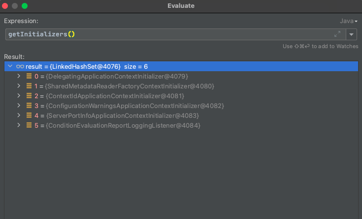

main调用执行时

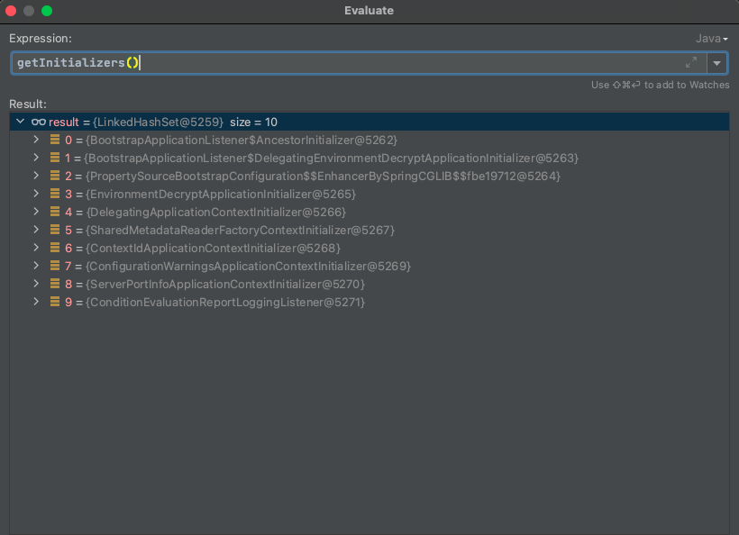

### 发布事件

发布ApplicationContextInitializedEvent事件

### 载入sources

获取所有sources
~~~ java
public Set<Object> getAllSources() {
	Set<Object> allSources = new LinkedHashSet<>();
	if (!CollectionUtils.isEmpty(this.primarySources)) {
		allSources.addAll(this.primarySources);
	}
	if (!CollectionUtils.isEmpty(this.sources)) {
		allSources.addAll(this.sources);
	}
	return Collections.unmodifiableSet(allSources);
}
~~~

当上下文为`AnnotationConfigApplicationContext`时，this.primarySources = `org.springframework.cloud.bootstrap.BootstrapImportSelectorConfiguration`

将sources载入上下文

根据sources和上下文获取bean定义加载器

载入的过程会调用AnnotatedBeanDefinitionReader的register方法，将sources的内容都注册进去

注册的过程后面再讨论 TODO

~~~ java
protected void load(ApplicationContext context, Object[] sources) {
	if (logger.isDebugEnabled()) {
		logger.debug("Loading source " + StringUtils.arrayToCommaDelimitedString(sources));
	}
	// 这里需要根据sources和上下文获取bean定义加载器
	BeanDefinitionLoader loader = createBeanDefinitionLoader(getBeanDefinitionRegistry(context), sources);
	if (this.beanNameGenerator != null) {
		loader.setBeanNameGenerator(this.beanNameGenerator);
	}
	if (this.resourceLoader != null) {
		loader.setResourceLoader(this.resourceLoader);
	}
	if (this.environment != null) {
		loader.setEnvironment(this.environment);
	}
	loader.load();
}
~~~

### 监听器载入上下文

~~~ java
public void contextLoaded(ConfigurableApplicationContext context) {
	for (ApplicationListener<?> listener : this.application.getListeners()) {
		// 如果实现了ApplicationContextAware接口，则设置上下文
		if (listener instanceof ApplicationContextAware) {
			((ApplicationContextAware) listener).setApplicationContext(context);
		}
		// 上下文注册监听器
		context.addApplicationListener(listener);
	}
	// 触发应用准备完成事件
	this.initialMulticaster.multicastEvent(new ApplicationPreparedEvent(this.application, this.args, context));
}

~~~

主要做三件事情  

1. 如果实现了`ApplicationContextAware`接口，则设置上下文

2. 上下文注册监听器该监听器

3. 触发应用准备完成事件`ApplicationPreparedEvent`

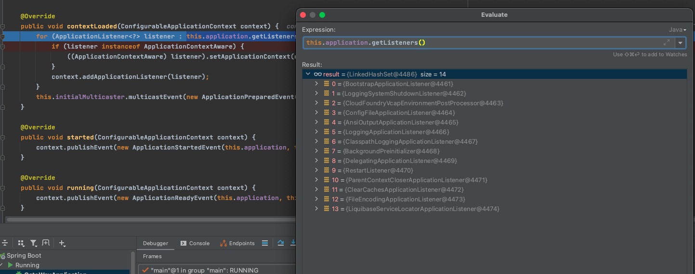

## 刷新上下文

初始化过程的核心,与spring初始化过程类似,调用上下文对象的refresh()方法

~~~ java
private void refreshContext(ConfigurableApplicationContext context) {
	// 调用上下文对象的refresh()方法，该方法实际上在抽象类AbstractApplicationContext中
	refresh(context);
	if (this.registerShutdownHook) {
		try {
			context.registerShutdownHook();
		}
		catch (AccessControlException ex) {
			// Not allowed in some environments.
		}
	}
}

// AbstractApplicationContext
@Override
public void refresh() throws BeansException, IllegalStateException {
	synchronized (this.startupShutdownMonitor) {
		// Prepare this context for refreshing. 为上下文刷新做准备
		prepareRefresh();

		// Tell the subclass to refresh the internal bean factory.告诉子类去刷新内部bean工厂,bean工厂为DefaultListableBeanFactory
		// 与Spring初始化不同，这里并没有做实质性的工作，而Spring在该步骤进行了BeanDefinition的加载
		ConfigurableListableBeanFactory beanFactory = obtainFreshBeanFactory(); 

		// Prepare the bean factory for use in this context. 为当前上下文准备好bean工厂
		prepareBeanFactory(beanFactory);

		try {
			// Allows post-processing of the bean factory in context subclasses. 
			// 运行上下文子类中bean工厂的后置处理,默认为空实现。AnnotationConfigApplicationContext未重写此类。
			postProcessBeanFactory(beanFactory);

			// Invoke factory processors registered as beans in the context.
			// 调用在上下文中注册为Bean的工厂处理器，执行工厂后置处理器
			// 比如BootstrapImportSelectorConfiguration,执行@Import({BootstrapImportSelector.class})
			invokeBeanFactoryPostProcessors(beanFactory);

			// Register bean processors that intercept bean creation.
			// 注册bean后置处理器
			registerBeanPostProcessors(beanFactory);

			// Initialize message source for this context.
			// 初始化MessageSource
			initMessageSource();

			// Initialize event multicaster for this context.
			// 初始化事件多播器
			initApplicationEventMulticaster();

			// Initialize other special beans in specific context subclasses.
			onRefresh();

			// Check for listener beans and register them.
			registerListeners();

			// Instantiate all remaining (non-lazy-init) singletons.
			finishBeanFactoryInitialization(beanFactory);

			// Last step: publish corresponding event.
			finishRefresh();
		}

		catch (BeansException ex) {
			if (logger.isWarnEnabled()) {
				logger.warn("Exception encountered during context initialization - " +
						"cancelling refresh attempt: " + ex);
			}

			// Destroy already created singletons to avoid dangling resources.
			destroyBeans();

			// Reset 'active' flag.
			cancelRefresh(ex);

			// Propagate exception to caller.
			throw ex;
		}

		finally {
			// Reset common introspection caches in Spring's core, since we
			// might not ever need metadata for singleton beans anymore...
			resetCommonCaches();
		}
	}
}
~~~

### 执行工厂后置处理器

`invokeBeanFactoryPostProcessors(beanFactory);`

上下文`AnnotationConfigApplicationContext`对应的后置处理器为

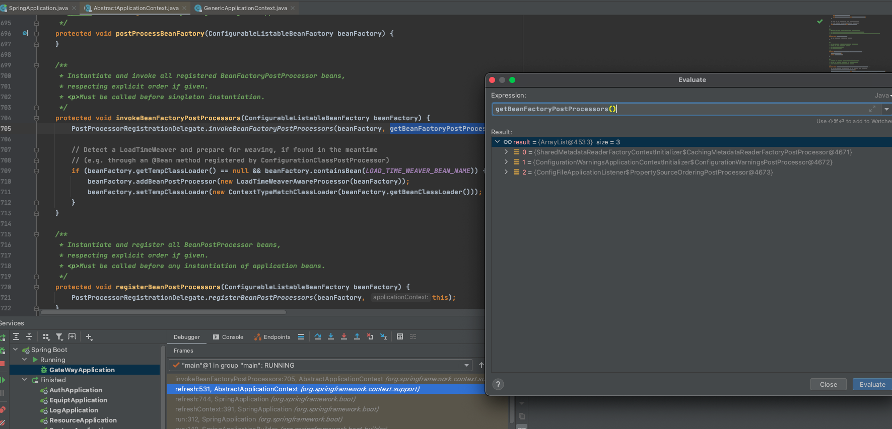

1. 首先分别对这几个bean工厂后置处理器进行一些操作

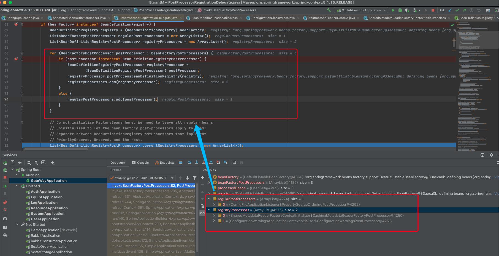

2. 因为需要先调用实现了`PriorityOrdered`接口的`BeanDefinitionRegistryPostProcessors`，找到对应的bean进行排序后执行，然后统计到处理器数组

`org.springframework.context.annotation.ConfigurationClassPostProcessor`

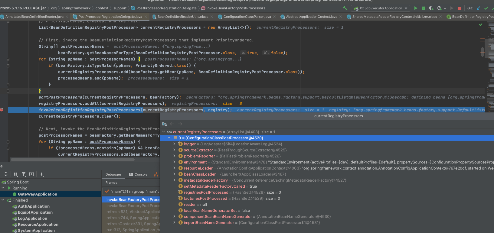

调用方法为`invokeBeanDefinitionRegistryPostProcessors(currentRegistryProcessors, registry);`

3. 与上一点类似，寻找对应的 实现了`Ordered`接口的`BeanDefinitionRegistryPostProcessors`

4. 最后执行其他的BeanDefinitionRegistryPostProcessors，直到没有发现新的位置

5. 通过`invokeBeanFactoryPostProcessors`执行所有后置处理器的回调，也就是调用他们的postProcessBeanFactory

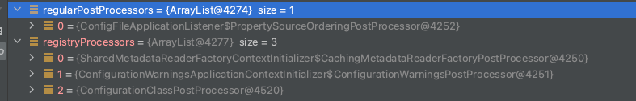

后置处理器是由初始化器Initializers来完成，也可能是通过其他方式，如监听器ConfigFileApplicationListener

## 刷新上下文后置动作 

暂无实现

## 发布已启动事件

发布`ApplicationStartedEvent`事件，触发相关监听器

相关监听器的获取也是通过`EventPublishingRunListener`，详情请参考[发布启动事件](#发布启动事件)

## 调用运行器

~~~ java
private void callRunners(ApplicationContext context, ApplicationArguments args) {
	List<Object> runners = new ArrayList<>();
	runners.addAll(context.getBeansOfType(ApplicationRunner.class).values());
	runners.addAll(context.getBeansOfType(CommandLineRunner.class).values());
	AnnotationAwareOrderComparator.sort(runners);
	for (Object runner : new LinkedHashSet<>(runners)) {
		if (runner instanceof ApplicationRunner) {
			callRunner((ApplicationRunner) runner, args);
		}
		if (runner instanceof CommandLineRunner) {
			callRunner((CommandLineRunner) runner, args);
		}
	}
}
~~~

获取所有的`ApplicationRunner`和`CommandLineRunner`，排序之后调用run方法。

`BootstrapApplicationListener`

注册bean

BootstrapImportSelectorConfiguration

运行已经注册的工厂处理器