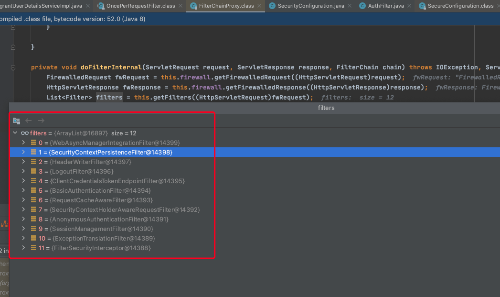

# 安全

> 基于spring-security-web-5.1.10

[SpringBoot Oauth2文档](https://docs.spring.io/spring-boot/docs/current/reference/html/spring-boot-features.html#boot-features-security-oauth2)

[官方整合gateway和oauth2的demo](https://github.com/spring-cloud-samples/sample-gateway-oauth2login/blob/master/gateway/src/main/java/sample/GatewayApplication.java)

[oauth2文档](https://projects.spring.io/spring-security-oauth/docs/Home.html)

[oauth2开发指南](https://projects.spring.io/spring-security-oauth/docs/oauth2.html)

[SpringCloudSecurity中文文档](https://www.springcloud.cc/spring-cloud-greenwich.html#_spring_cloud_security)

[SpringCloudSecurity官方文档](https://docs.spring.io/spring-cloud-security/docs/2.2.4.RELEASE/reference/html/)

### Token Relay

gateway作为Oauth2的Token Relay，使用`TokenRelayGatewayFilterFactory`实现

App.java

~~~ java
@Autowired
private TokenRelayGatewayFilterFactory filterFactory;

@Bean
public RouteLocator customRouteLocator(RouteLocatorBuilder builder) {
    return builder.routes()
            .route("resource", r -> r.path("/resource")
                    .filters(f -> f.filter(filterFactory.apply()))
                    .uri("http://localhost:9000"))
            .build();
}
~~~

或

application.yaml

~~~ java
spring:
  cloud:
    gateway:
      routes:
      - id: resource
        uri: http://localhost:9000
        predicates:
        - Path=/resource
        filters:
        - TokenRelay=
~~~

## 执行过程

`org.springframework.security.web.FilterChainProxy`包含以下过滤器

- WebAsyncManagerIntegrationFilter

通过使用SecurityContextCallableProcessingInterceptor.beforeConcurrentHandling（org.springframework.web.context.request.NativeWebRequest，Callable）将SecurityContext填充在Callable上，从而在SecurityContext和Spring Web的WebAsyncManager之间提供集成

`TokenEndpoint`

`AuthorizationEndpoint`