# 常用配置


## 访达

### 显示路径栏

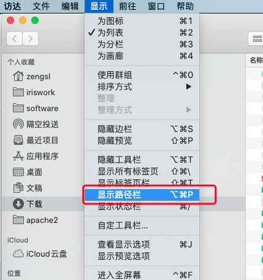

### 设置默认搜索范围为当前文件夹

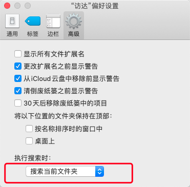


### 设置打开访达的快捷键

通过“自动操作”功能，点击新建文稿-》快速操作（选取）-〉

实用工具、选择开启应用程序拖拽至右侧

选择“没有输入”

下方选择打开的应用程序，因为访达不在应用程序里面，所以要选择新建变量，在路径`/System/Library/CoreServices/`下选择访达

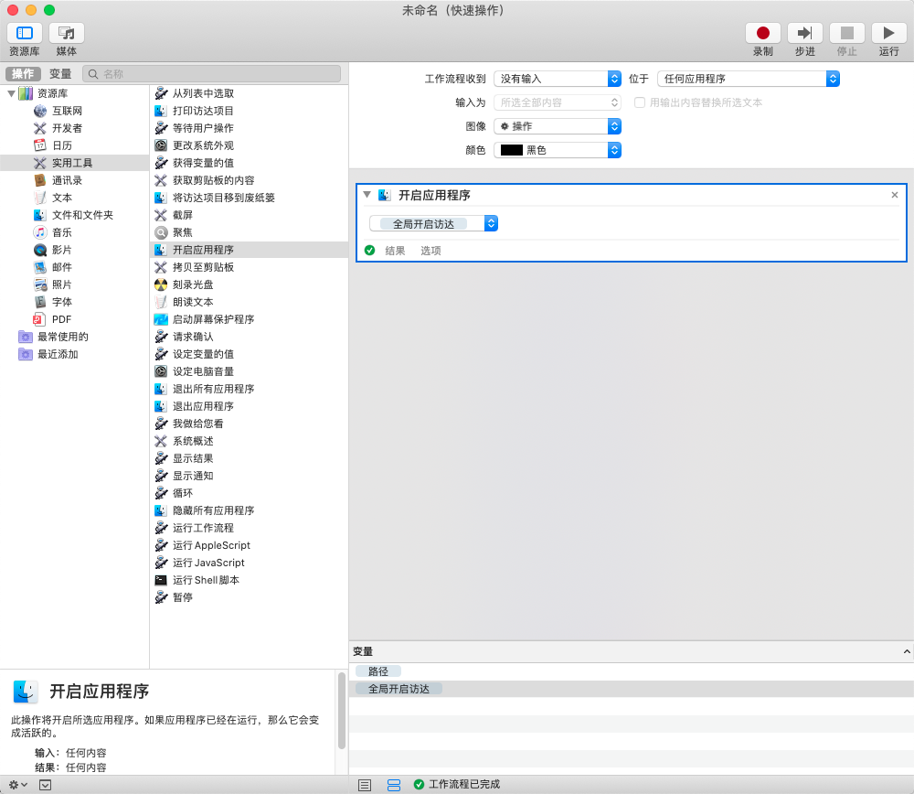

点击右上方运行进行测试

名称修改为“全局开启访达”，点击完成

快捷键command+s 进行存储，名称也叫“全局开启访达”

设置快捷键


进入键盘-》快捷键-〉点击服务-》找到“全局开启访达”进行设置-〉快捷键设置为option+command+空格

因为这个快捷键和默认的`显示‘访达’搜索窗口`冲突了，在键盘-》快捷键-〉聚焦中把`显示‘访达’搜索窗口`的快捷键取消

参考[mac云课堂](https://www.bilibili.com/video/BV1AE411c7Vy)


## 网络

设置固定IP


##  软件验证
> macOS无法验证此App不包含恶意软件

可选以下方式进行设置

- 需要进入“系统偏好设置”->"安全与隐私"->点击”仍要打开“
- 从根本上关闭，执行sudo spctl --master-disable


## 触发角
系统偏好设置->桌面与屏幕保护程序

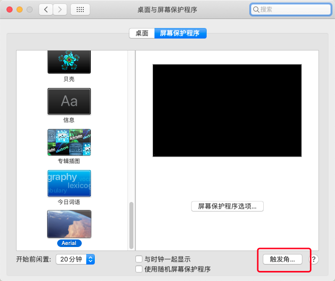

##  iterm2

[官网](https://www.iterm2.com/)

### 文件上传

- 方式一：使用rz、sz命令

解决在iterm2中sz、rz命令无效问题

~~~ SHELL
#参考资料https://codechina.csdn.net/mirrors/aikuyun/iterm2-zmodem?utm_source=csdn_github_accelerator
#1.安装sz rz
brew install lrzsz
# 进入目录添加权限
cd /usr/local/bin
# iterm2-send-zmodem.sh  iterm2-recv-zmodem.sh要先下载
chmod +x iterm2-send-zmodem.sh 
chmod +x iterm2-recv-zmodem.sh
# 设置iterm2的触发器（triggers）
# 执行如下以下步骤：command+“,” 组合键打开item2的“Preferences”面板->Profiles选项卡->Advanced->Triggers（点击Edit即可
# 
Regular expression: rz waiting to receive.\*\*B0100
Action: Run Silent Coprocess
Parameters: /usr/local/bin/iterm2-send-zmodem.sh

Regular expression: \*\*B00000000000000
Action: Run Silent Coprocess
Parameters: /usr/local/bin/iterm2-recv-zmodem.sh 

~~~

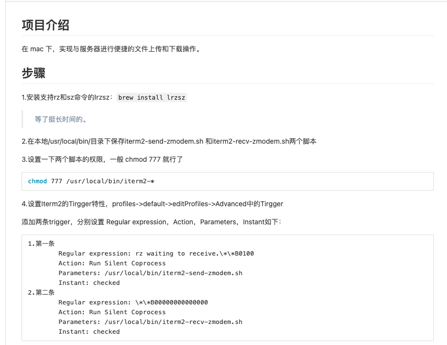

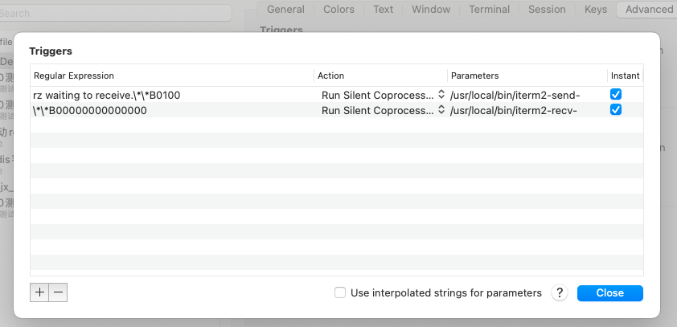

- 方式二：Shell Integration（好多限制，不推荐）

[Shell Integration](https://iterm2.com/documentation-shell-integration.html)

使用方式：

注意：

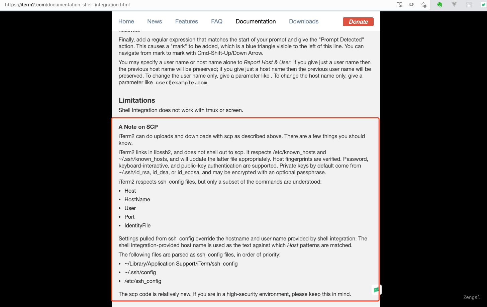


### 保存SSH密码

集成sshpass使得iterm2保存ssh密码

/usr/local/bin/sshpass -p 密码 ssh -p port username@ip

如果是默认端口则不需要指定 -p port

[配置案例](https://cloud.tencent.com/developer/article/1424423)


[iterm2技巧](https://www.cnblogs.com/liqiangchn/p/14280203.html)

## homebrew

从[码云](https://gitee.com/cunkai/HomebrewCN)中安装

~~~ shell
# 安装
/bin/zsh -c "$(curl -fsSL https://gitee.com/cunkai/HomebrewCN/raw/master/Homebrew.sh)"

# 安装应用历史版本
brew tap homebrew/cask-versions
~~~

[参考文档](https://sspai.com/post/56009#!)
[安装自动更新](https://github.com/buo/homebrew-cask-upgrade)
[m1安装](https://zhuanlan.zhihu.com/p/341831809)
[m1国内安装](https://blog.csdn.net/sinat_38184748/article/details/114115441)

## git

~~~ shell
brew install git
~~~

配置方式 [安装文档](/tools/git/1.installAndSetting.md)


## svn

安装客户端SnailSVN，可使用默认设置或进行相关路径配置

安装命令
~~~ shell
brew install svn
~~~


## oh my zsh
::: tip
需确保系统的默认shell为zsh，可以通过`echo $SHELL$`来进行查看

如果不是，可通过`chsh -s $(which zsh)`进行设置
:::


[安装文档](https://github.com/ohmyzsh/ohmyzsh)

这里选择的是检出仓库安装的方式

`git clone https://gitee.com/zengsl/ohmyzsh.git ~/.oh-my-zsh`

备份已有配置

~~~ shell
cp ~/.zshrc ~/.zshrc.orig
~~~

使用oh-my-zsh提供的默认配置
~~~ shell
cp ~/.oh-my-zsh/templates/zshrc.zsh-template ~/.zshrc
~~~

如果输入命令出现有关权限的警告，可以通过赋权来去除
~~~ shell
chmod g-w,o-w /usr/local/share/zsh
chmod g-w,o-w /usr/local/share/zsh/site-functions
~~~


修改~/.zshrc设置主题

可以参考[主题](https://github.com/ohmyzsh/ohmyzsh/wiki/Themes)

我这里设置的是`ZSH_THEME="agnoster"`

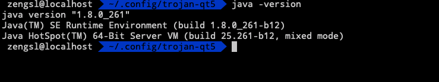


如果iterm2中出现乱码则需要安装[powerline](https://github.com/powerline/fonts)字体，并且在iterm2中进行设置

vs code的终端如果出现乱码，也需要设置终端为powerline字体

安装方法
~~~ shell
#clone
git clone https://github.com/powerline/fonts.git --depth=1

# install
cd fonts
./install.sh

# clean-up a bit
cd ..
rm -rf fonts
~~~


安装zsh-completions插件

~~~ shell
brew install zsh zsh-completions
~~~

安装zsh-syntax-highlighting插件
[参考文档](https://github.com/zsh-users/zsh-syntax-highlighting)
~~~ shell
brew install zsh-syntax-highlighting

# To activate the syntax highlighting, add the following at the end of your .zshrc:
source /usr/local/share/zsh-syntax-highlighting/zsh-syntax-highlighting.zsh

#If you receive "highlighters directory not found" error message,
#you may need to add the following to your .zshenv:
export ZSH_HIGHLIGHT_HIGHLIGHTERS_DIR=/usr/local/share/zsh-syntax-highlighting/highlighters
~~~

因为已经安装了oh-my-zsh，则可以使用插件的方式进行安装，参考官方文档
~~~ shell
Oh-my-zsh
Clone this repository in oh-my-zsh's plugins directory:

git clone https://github.com/zsh-users/zsh-syntax-highlighting.git ${ZSH_CUSTOM:-~/.oh-my-zsh/custom}/plugins/zsh-syntax-highlighting
Activate the plugin in ~/.zshrc:

plugins=( [plugins...] zsh-syntax-highlighting)
Restart zsh (such as by opening a new instance of your terminal emulator)或者source ~/.zshrc
~~~


安装zsh-autosuggestions
[参考文档](https://github.com/zsh-users/zsh-autosuggestions)
~~~shell
brew install zsh-autosuggestions

#To activate the autosuggestions, add the following at the end of your .zshrc:
source /usr/local/share/zsh-autosuggestions/zsh-autosuggestions.zsh

# will also need to force reload of your .zshrc:
source ~/.zshrc
~~~

安装Powerlevel10k主题

如果出现以下错误就升级zsh

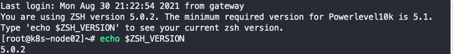

如果是centos是用yum升级，只能升级到5.0.2。需要手动升级

[手动升级](https://blog.csdn.net/qq_40938528/article/details/117338066)

实在不行，安装不了10就安装9

## tldr


## autojump 
~~~shell
brew install autojump

#把`eval $(thefuck --alias) `加到~/.zshrc中，然后执行` source ~/.zshrc`或者重新打开你的shell
~~~

## the fuck

~~~shell
brew install thefuck

#把`eval $(thefuck --alias) `加到~/.zshrc中，然后执行` source ~/.zshrc`或者重新打开你的shell
~~~

## 日志文件阅读器lnav

[lnav](http://lnav.org)

下载之后可以将lnav移动至/usr/local/bin中

## JDK

JDK6是苹果提供的，6以上才有oracle版本的，有两种安装方式。

1. 苹果官网安装https://support.apple.com/kb/DL1572?locale=zh_CN

2. 采用brew cask安装

   `brew cask install java6`

   安装目录在/Library/Java/JavaVirtualMachines/1.6.0.jdk

通过`brew search java`可以搜索到所有java的版本，同理可以安装其他版本JDK


## jenv

```bash
brew install jenv
```

将以下内容加入~/.zshrc
~~~ shell
export PATH="$HOME/.jenv/bin:$PATH"

eval "$(jenv init -)"
~~~


使用jenv add 将JDK加入jenv中

如：`jenv add /Library/Java/JavaVirtualMachines/1.6.0.jdk/Contents/Home`

其他命令

~~~ shell
# 查看当前版本
jenv versions

# 设置当前JDK
Jenv local 1.8
~~~

## 安装node

brew install node或者[官网](http://nodejs.cn/download/)

将npm的源改为阿里源

```
npm config set registry https://registry.npm.taobao.org
```

安装cnpm https://developer.aliyun.com/mirror/NPM?from=tnpm（**失败**）

```
npm install -g cnpm --registry=https://registry.npm.taobao.org
```

## 环境变量

https://www.iteye.com/blog/elf8848-1582137

设置~/.bash_profile

在~/.zshrc文件最后，增加一行： 
source ~/.bash_profile

## 在根路径下创建文件夹

### 早期版本

1. 重启电脑，按住 cmd+R进入恢复模式
    关闭SIP： csrutil disable，然后重启

2. 重新挂载根目录： sudo mount -uw /

3. 创建iriswork和Project,`sudo mkdir /iriswork` `sudo mkdir /Project`

4. 接下来划重点：现在已经可以在根目录创建文件夹，但是，你在根目录创建之后，一旦重启电脑，你创建的目录又是只读权限了。所以，正确的做法是把你需要的目录软链接到根目录, 例如： `sudo ln -s /Users/zengsl/iriswork / ` `sudo ln -s /Users/zengsl/Project /`

   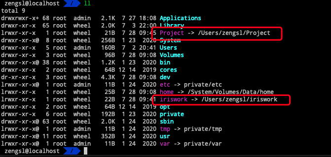

5. 重新进入恢复模式，重新打开SIP： csrutil enable

## Big sur后的版本

big sur请参考下面的方法：

通过/etc/synthetic.conf添加，用tab分割
Project	/Users/zengsl/Project
iriswork	/Users/zengsl/iriswork

配置此文件即可，无需重启和关闭SIP。M1版本已验证，intel版本如不生效则尝试重启和关闭SIP。

[参考资料](https://zhuanlan.zhihu.com/p/85784733)

## IDEA

服务器启动参数
~~~ shell
-Dspring.profiles.active=macdev
-Degrant.resource.menuflag=01
-Dwtp.validateCode=enable
-Dwtp.validateCodeCount=5
-Dfile.encoding=UTF-8
-Xms1024m
-Xmx1024m
-XX:PermSize=128M
-XX:MaxPermSize=256M
~~~
根据需要设置touch bar

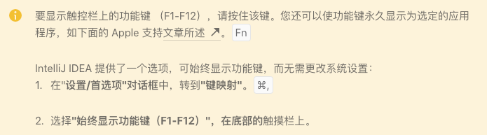

https://www.jetbrains.com/help/idea/touch-bar-support.html


如果你无法在idea中搜索plugin，可以尝试设置下仓库https://plugins.jetbrains.com/idea


### 配置svn

如果出现svn操作窗口显示的有问题或者文件没有关联上svn，检查一下这个文件里面的路径是不是有问题，修改好之后重启下IDEA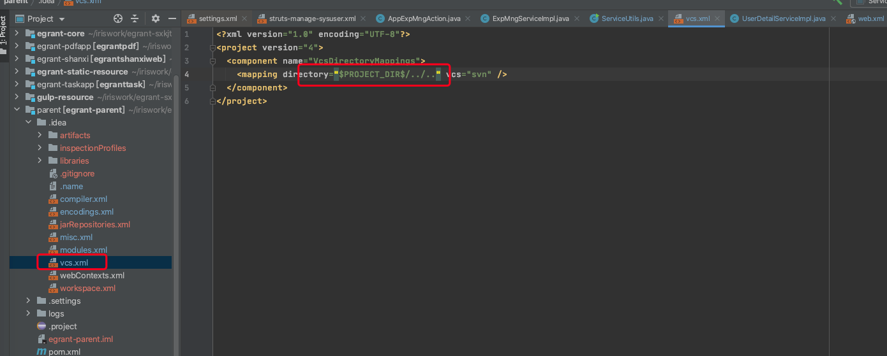


## redis

brew install redis

redis-server /usr/local/etc/redis.conf

## 其他软件

反编译工具brew install --cask jd-gui
[问题解决](https://github.com/java-decompiler/jd-gui/pull/336)

## 快捷键设置

Idea注释快捷键与mac自带快捷键冲突，去除mac冲突的键

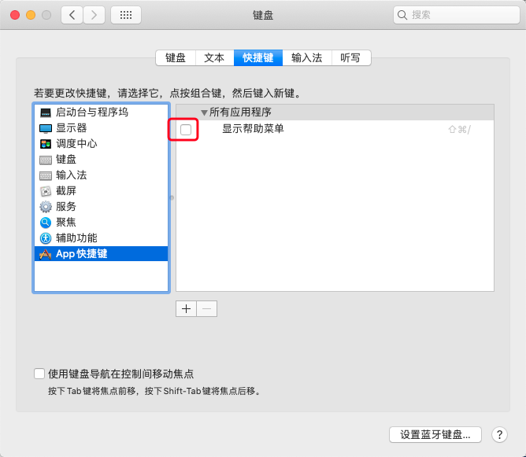


splashtop Personal