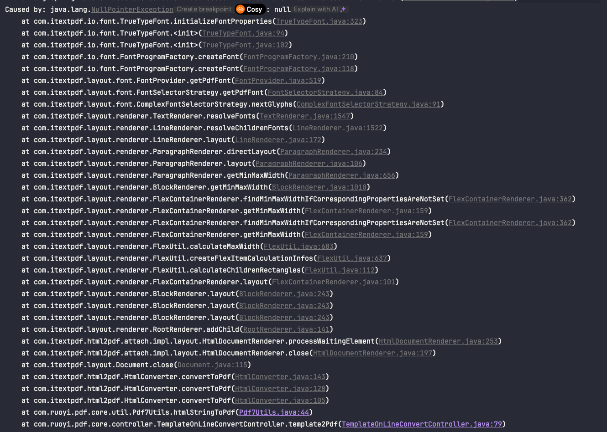
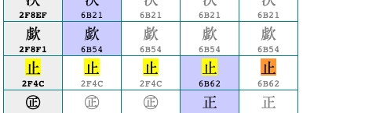
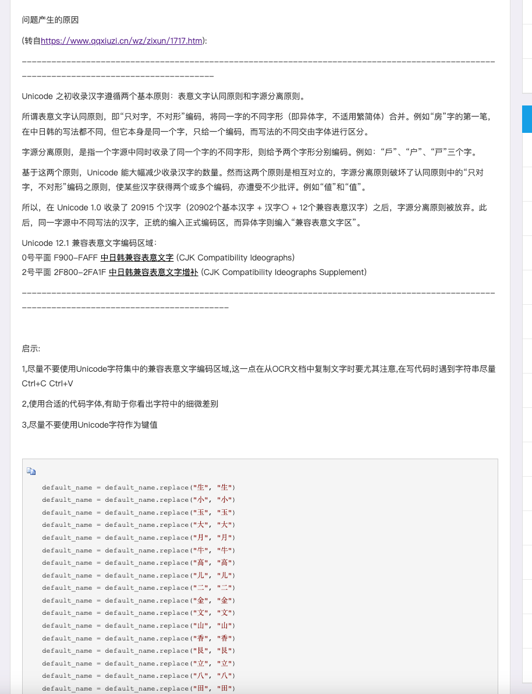
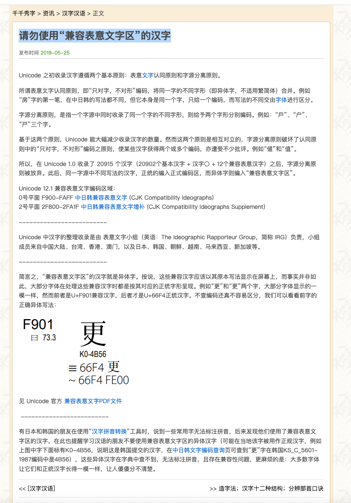
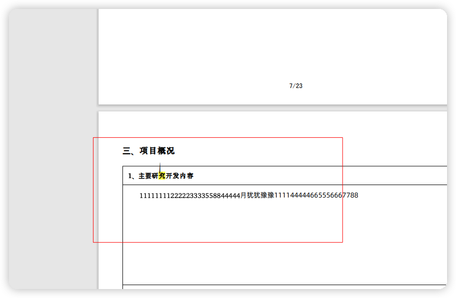
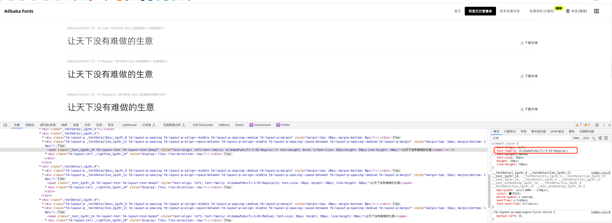
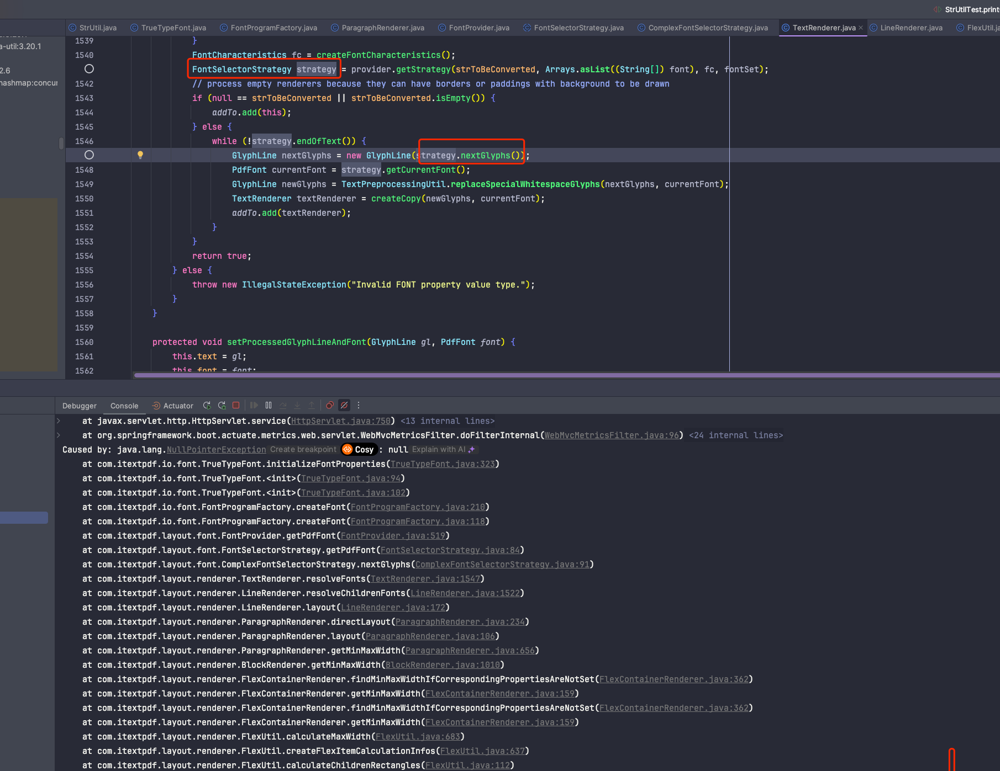

# PDF内容显示异常
[toc]
## 问题描述

> layout-7.2.2.jar

Html转化PDF空指针

## 问题分析

> 13.6 (22G120) 默认输入法

经过排查发现是因为包含特殊文字：“⽌”对应的unicode为\u2f4c

而我输入的“止”是\u6b62

我们使用的字体"SimSun"不支持前面这个“⽌”，所以iText从系统中搜索可用字体也没有发现可用字体，则导致报错。

通过[https://home.unicode.org/](https://home.unicode.org/)查询相关unicode的资料发现：

[https://unicode.org/charts/normalization/chart_Han.html](https://unicode.org/charts/normalization/chart_Han.html)

[unicode中的汉字](https://www.cnblogs.com/isakovsky/p/16287906.htm)

[请勿使用“兼容表意文字区”的汉字](https://www.qqxiuzi.cn/wz/zixun/1717.htm)

**所以导致问题的文字可能是通过Copy或者输入法导致。**

## 问题解决

系统安装包含更多的字体
Css 字体族设置更多字体，提高多系统、多文字兼容性

使用[阿里普惠字体3.0](https://fonts.alibabagroup.com/#/font)

- 安装多字体风格
  1. Alibaba PuHuiTi 3.0 - 55 Regular GB18030-2022 (实现级别1＋实现级别2)
  2. Alibaba PuHuiTi 3.0 - 85 Bold GB18030-2022 (实现级别1＋实现级别2) ：解决ITEXT后端模拟CSS解析环境导致加粗之后出现黑线条。在web端加粗可以通过font-weight来设置，但是在后端ITEXT应该是直接去找服务端的字体，没找到就做一个默认处理，而这个默认行为兼容性有限。从而导致问题
     
  3. Alibaba PuHuiTi 3.0 - 55 RegularL3 GB18030-2022 (实现级别3增补汉字）： 提高生僻字兼容

- 有OTF和TTF两种字体格式选择，没有太大区别。Web兼容性上也没问题。https://caniuse.com/?search=OTF
因为主要处理ITEXT转换PDF的问题，正好ITEXT中有一个TureTypeFont，那就选择TTF格式的进行安装。

使用字体 `font-family:AlibabaPuHuiTi-3-55-Regular;`

## 补充

Itext字体选择策略可以从系统中可用的字体中选取一个可以使用的字体。